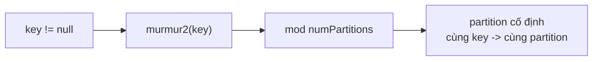
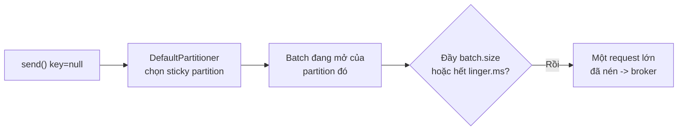

# Partitioner Mặc Định: Key Null Đi Về Đâu Và Vì Sao Sticky Nhanh Hơn Hẳn

Từ bài 064 tới giờ, Wikimedia producer gửi key `null` mà message vẫn dàn đều 3 partitions. Ai quyết định? Câu trả lời là `partitioner.class` — default `DefaultPartitioner`. Bài này mổ hai chế độ của nó (theo key và không key), và vì sao nâng client lên 2.4+ đã tự nhanh hơn mà không cần đổi dòng nào.

---

## 1. Vấn đề: Không Chỉ Key Thì Ai Chia Partition?

Mỗi `ProducerRecord` phải rơi vào đúng một partition. Có hai trường hợp:

- **Có key:** cần cùng key về cùng partition để giữ thứ tự (đơn hàng của một user, GPS của một xe). Giải pháp là hash key.
- **Key null (như Wikimedia):** không có gì để hash. Vẫn phải dàn đều để tận dụng song song, nhưng dàn theo cách nào thì ảnh hưởng trực tiếp tới batching — dàn dở thì batch nát vụn, throughput tụt.

Producer giải quyết bằng một class duy nhất với hai nhánh logic. Hiểu hai nhánh này là hiểu vì sao demo của chúng ta "tự nhiên" chạy tốt.

## 2. Cơ Chế: Hai Nhánh Của DefaultPartitioner

### 2.1. Nhánh có key: key hashing bằng murmur2



Công thức (minh họa):

```text
partition = murmur2(keyBytes) % numPartitions
```

Vì murmur2 là hàm hash tất định (cùng input ra cùng output), cùng key luôn về cùng partition — thứ tự trong key được đảm bảo. Nhưng công thức chứa `numPartitions` ở mẫu số: **thêm partition vào topic đang chạy sẽ đổi mapping của gần như mọi key**. Key cũ và key mới cùng giá trị có thể rơi vào hai partition khác nhau → thứ tự theo key bị gãy ngầm. Quy tắc thép: cần đổi số partition cho topic dùng key ordering thì tạo topic mới thay vì alter topic cũ.

Muốn logic khác hẳn (ví dụ partition theo region, theo giờ) thì set `partitioner.class` trỏ tới class tự viết. Hiếm khi cần — default đủ cho 95% workload.

### 2.2. Nhánh key null: từ round-robin tới sticky

Đây là nhánh của Wikimedia. Lịch sử có hai đời:

**Đời cũ — round-robin (client ≤ 2.3):** message 1 → partition 0, message 2 → partition 1... hết vòng quay lại. Dàn đều hoàn hảo, nhưng mỗi partition nhận 1 message/batch:

```text
Round-robin với 6 message, 3 partitions:
P0: [m1]  P1: [m2]  P2: [m3]  P0: [m4]  P1: [m5]  P2: [m6]
=> 6 batch, mỗi batch 1 message: request nhỏ, nén kém, latency cao.
```

**Đời mới — sticky partitioner (client ≥ 2.4, là default hiện tại):** dính vào một partition cho tới khi batch đầy hoặc hết `linger.ms`, gửi cả batch đi, rồi mới chuyển sang partition khác:

```text
Sticky với 6 message, batch chứa được 3, linger.ms=20:
P0: [m1 m2 m3] (gửi 1 request) -> P1: [m4 m5 m6] (gửi 1 request)
=> 2 batch đầy, nén tốt. Dàn đều vẫn đạt được theo thời gian.
```

Kết quả đo trong bài gốc: latency của sticky thấp hơn rõ rệt so với round-robin, càng nhiều partition chênh lệch càng lớn (ví dụ 3 producer × 10.000 msg/s × 125 partitions). Lý do sâu xa: batch to hơn → ít request hơn → nén tốt hơn → cả ba cùng thắng.

### 2.3. Vị trí trong pipeline



Sticky và `linger.ms`/`batch.size` (bài 073) là cộng hưởng: sticky dồn message vào cùng partition để batch có cơ hội đầy; linger cho thời gian để đầy; batch.size cho chỗ chứa. Thiếu sticky (đời cũ), linger và batch to cũng bị xé lẻ.

## 3. Config Chi Tiết

### 3.1. `partitioner.class`

- **Ý nghĩa:** class quyết định mapping record → partition. Default `org.apache.kafka.clients.producer.internals.DefaultPartitioner` (đã bao gồm sticky cho key null từ client 2.4+).
- **Giá trị mẫu:** giữ default. Trong log bài 074 bạn thấy đúng tên class này — và nếu mở source sẽ thấy `StickyPartitionCache` bên trong, bằng chứng sticky đang chạy.
- **Khi nào dùng:** chỉ set custom khi có logic phân phối đặc biệt (partition theo tenant, theo khung giờ, ưu tiên partition local...). Còn lại để default — custom partitioner sai là tự phá dàn đều và ordering.

### 3.2. Các config liên quan (không set trực tiếp nhưng phải biết)

- **`key.serializer`:** key null thì serializer không được gọi — nhưng vẫn phải khai báo như bài 064, vì record có key trong tương lai sẽ cần.
- **`linger.ms` + `batch.size`:** là "nhiên liệu" của sticky. Sticky mà `linger.ms=0` + batch nhỏ thì vẫn nhanh hơn round-robin, nhưng chưa phát huy hết.
- **`murmur2`:** thuật toán hash default cho key. Không có config đổi thuật toán trong default partitioner — muốn đổi thì viết partitioner riêng.

## 4. Code Ví Dụ

Không cần đổi code — Wikimedia đã dùng đúng mode tối ưu. Hai đoạn để kiểm chứng và để dùng khi cần key:

```java
// Hiện tại của Wikimedia: key null -> sticky partitioner tự dàn đều + batch to
kafkaProducer.send(new ProducerRecord<>(topic, messageEvent.getData()));

// Khi cần ordering theo key (ví dụ theo title bài viết): thêm key vào constructor
// Cùng title -> cùng partition -> đúng thứ tự (đi kèm enable.idempotence=true)
kafkaProducer.send(new ProducerRecord<>(topic, "key-định-danh", messageEvent.getData()));
```

Kiểm chứng sticky đang hoạt động (làm một lần trong IDE):

```java
// Mở class DefaultPartitioner (Ctrl+Click vào tên class trong log/config),
// tìm "StickyPartitionCache" - thấy nó nghĩa là client >= 2.4, sticky đang chạy.
```

```bash
# Đối chứng dàn đều: đếm record mỗi partition sau vài phút chạy
kafka-run-class.sh kafka.tools.GetOffsetShell --broker-list localhost:9092 --topic wikimedia.recentchange
# Ba partition tăng gần như ngang nhau theo thời gian (không cần bằng tuyệt đối từng giây)
```

## 5. Safe / High-Throughput Preset Liên Quan

Không thêm dòng nào. Bài này giải thích vì sao preset bài 074 chạy tốt:

```java
// Preset giữ nguyên từ bài 074 - sticky là chất xúc tác:
// compression.type=snappy + linger.ms=20 + batch.size=32KB
// + key null + DefaultPartitioner (sticky) = batch to, đều, nén tốt
```

Nâng cấp duy nhất đáng làm nếu còn client cũ: nâng `kafka-clients` lên ≥ 2.4 (thực tế hãy lên 3.x luôn theo bài 070) — round-robin thành sticky miễn phí, không sửa code.

## 6. Cạm Bẫy Thường Gặp

- **Thêm partition vào topic có key rồi tưởng ordering còn nguyên.** Mapping hash đổi, cùng key rẽ hai nơi. Cần scale topic keyed thì tạo topic mới (số partition chốt từ đầu) và migrate consumer.
- **Dùng key rỗng `""` tưởng như key null.** `""` bị hash về một partition cố định → dồn ứ, lệch tải, batch của các partition khác đói. Null và rỗng là hai vũ trụ khác nhau.
- **Key phân phối lệch (hot key).** Một user spam 90% traffic → partition của key đó quá tải dù hash đúng. Fix ở tầng thiết kế: key chi tiết hơn (user + ngày), hoặc tách topic, hoặc chấp nhận và scale partition đó.
- **Tự viết partitioner cho "đều hơn".** Default đã đều theo thời gian. Custom partitioner kém thường phá locality của batch và gây lệch khó debug. Chỉ custom khi có yêu cầu nghiệp vụ thật, và phải test phân phối trên data thật.
- **Giữ client ≤ 2.3 vì "chạy ổn định".** Đang trả thuế round-robin mỗi ngày: nhiều request nhỏ, nén kém. Nâng client là tuning throughput rẻ nhất — rẻ hơn mọi `linger.ms`.
- **Đo dàn đều trong 10 giây rồi kết luận lệch.** Sticky dính một partition mỗi batch nên ngắn hạn trông lệch là bình thường. Đo trên vài nghìn message hoặc vài phút mới phản ánh phân phối thật.

## Kết Luận

Tóm lại một câu: **có key thì murmur2 hash về partition cố định (đừng thêm partition giữa chừng), key null thì sticky partitioner dồn thành batch to rồi mới chuyển — và chỉ cần client ≥ 2.4 là Wikimedia đã hưởng lợi mà không cần đổi dòng nào.**

Bài tiếp theo, cũng là bài cuối section, chúng ta xử lý câu hỏi: khi broker chậm tới mức producer không gửi kịp nữa, hàng chục MB message ứ ở đâu, block bao lâu thì báo lỗi — qua `buffer.memory` và `max.block.ms`.
