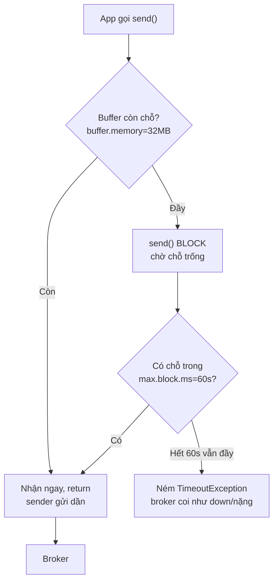

# Bộ Đệm Và Giới Hạn Chặn: Khi Broker Quá Tải, Producer Cầm Cự Được Bao Lâu?

Cả section tới giờ giả định broker nuốt kịp tốc độ gửi. Thực tế có lúc không: broker chết, network nghẽn, throughput Wikimedia bùng nổ. Message chưa gửi đi được ứ ở đâu? Producer chờ bao lâu trước khi báo lỗi? Bài cuối này trả lời bằng hai config nâng cao: `buffer.memory` và `max.block.ms`. Bạn có thể không bao giờ phải đổi chúng — nhưng ngày sự cố xảy ra, đây là bài bạn muốn đã từng đọc.

---

## 1. Vấn đề: `send()` Async Thì Không Block — Trừ Khi Bộ Đệm Đầy

Hãy nhớ lại bản chất ở bài 064: `producer.send()` là async — ném record vào bộ đệm RAM trong producer rồi return ngay, thread nền (sender) lo gửi dần sang broker. Miễn bộ đệm còn chỗ, `send()` không bao giờ block, dù broker đang chậm.

Nhưng RAM không vô hạn. Khi broker chậm hơn tốc độ `send()` (chết 1 broker, full disk, GC dài, network chập chờn), bộ đệm đầy dần. Tới lúc đầy 100%, `send()` lần tiếp theo không còn chỗ chứa — nó buộc phải block thread gọi, chờ broker bắt kịp để giải phóng chỗ. Và block thì phải có giới hạn, nếu không thread treo mãi mãi.

Hai config này chính là "bể chứa" và "đồng hồ block":



## 2. Cơ Chế: Bể 32MB Và Đồng Hồ 60 Giây

### 2.1. `buffer.memory`: bể chứa trước khi gửi

- Tổng RAM mà producer dùng để chứa record đang chờ gửi (bao gồm cả batch đang mở của mọi partition + request đang bay).
- Khi broker khỏe, bể gần như trống: record vào rồi ra ngay. Khi broker yếu, bể dâng lên — đây là vùng đệm thời gian để broker hồi phục mà app không cảm nhận gì.
- Bể đầy là tín hiệu sớm nhất của "producer nhanh hơn broker". Đừng vội tăng bể khi thấy đầy — hãy hỏi trước vì sao broker chậm (disk, network, quá ít partition, consumer lag kéo theo...). Tăng bể mà không fix gốc chỉ trì hoãn sự cố thêm vài phút.

### 2.2. `max.block.ms`: block bao lâu thì bỏ cuộc

- Khi bể đầy, `send()` block tối đa `max.block.ms`. Trong thời gian này sender vẫn cố gửi và giải phóng chỗ — nếu broker hồi phục kịp, `send()` lại chạy tiếp như chưa có gì.
- Hết `max.block.ms` mà bể vẫn đầy → `send()` ném exception (thường là `TimeoutException`). Đây là fail fast có chủ ý: thà báo lỗi rõ ràng để app xử lý (retry tầng nghiệp vụ, ghi DLQ, alert) còn hơn treo thread vô thời hạn.
- Liên quan mật thiết với `delivery.timeout.ms=120s` (bài 068): `max.block.ms` giới hạn *thời gian chờ có chỗ trong bể*, còn `delivery.timeout.ms` giới hạn *tổng thời gian từ send tới ack*. Một record có thể block 60s rồi vẫn còn 120s để retry sau đó.

### 2.3. Vị trí trong code Wikimedia

Chỗ duy nhất hai config này lộ diện là dòng quen thuộc trong handler:

```java
// WikimediaChangeHandler.onMessage - bình thường return ngay (async),
// nhưng khi buffer 32MB đầy, chính dòng này sẽ BLOCK tới 60s
kafkaProducer.send(new ProducerRecord<>(topic, messageEvent.getData()));
```

Không cần try/catch mới — exception khi hết `max.block.ms` sẽ nổi lên đúng dòng `send()` này (hoặc vào callback nếu dùng `send(record, callback)`). Production nên dùng bản có callback để đếm và xử lý fail tập trung.

## 3. Config Chi Tiết: Ý nghĩa + Giá trị + Khi nào dùng

### 3.1. `buffer.memory`

- **Ý nghĩa:** tổng byte tối đa của send buffer trong producer.
- **Giá trị mẫu:** `33554432` (32MB) — default hợp lý cho hầu hết workload.
- **Khi nào dùng:** giữ default. Tăng (64–128MB) chỉ khi đã đo chắc: burst ngắn vượt quá 32MB nhưng broker trung bình vẫn nuốt kịp (ví dụ job theo đợt, flash sale vài phút). Tăng bể cho producer chậm mãn tính là che bệnh — fix broker/partition trước.
- **Công thức kiểm tra:** `batch.size × số partition producer ghi tới + inflight × batch.size < buffer.memory`. Với lab Wikimedia (3 partitions × 32KB) thì 32MB dư rất nhiều — đúng, và cứ để dư.

### 3.2. `max.block.ms`

- **Ý nghĩa:** `send()` (và `partitionsFor`, metadata fetch...) được block tối đa bao lâu khi bể đầy hoặc metadata chưa sẵn sàng.
- **Giá trị mẫu:** `60000` (60 giây).
- **Khi nào dùng:** giữ 60s cho pipeline chuẩn — đủ dài để broker restart/mất vài chục giây mà app không fail, đủ ngắn để sự cố thật không treo thread hàng giờ. Giảm (5–10s) cho API đồng bộ cần fail fast về cho user; tăng chỉ khi đã chấp nhận thread producer block lâu và có monitor chặt.

### 3.3. Hai config không đổi nhưng phải đọc cùng

- **`delivery.timeout.ms=120000`:** deadline tổng sau khi record đã vào bể. Block 60s + retry 120s là hai chặng nối tiếp, đừng nhầm là một.
- **`batch.size` + `linger.ms`:** batch to hơn (bài 073–074) thì bể chứa được ít batch hơn về số lượng — nhưng vì mỗi batch mang nhiều message hơn nên số message chứa được tương đương. Không cần chỉnh bể khi đã tăng batch ở mức 32KB.

## 4. Code Ví Dụ: Giữ Default Và Xử Lý Fail Đúng Cách

Không cần set hai config này trong lab — default đã đúng. Việc cần làm là xử lý fail khi chúng kích hoạt:

```java
import org.apache.kafka.clients.producer.ProducerConfig;
import java.util.Properties;

Properties props = new Properties();
props.setProperty(ProducerConfig.BOOTSTRAP_SERVERS_CONFIG, "127.0.0.1:9092");
props.setProperty(ProducerConfig.KEY_SERIALIZER_CLASS_CONFIG,
        "org.apache.kafka.common.serialization.StringSerializer");
props.setProperty(ProducerConfig.VALUE_SERIALIZER_CLASS_CONFIG,
        "org.apache.kafka.common.serialization.StringSerializer");

// SAFE + THROUGHPUT giữ nguyên từ bài 074 (không đụng tới ở bài này)
// acks=all, enable.idempotence=true, retries=MAX,
// compression.type=snappy, linger.ms=20, batch.size=32KB

// buffer.memory=32MB và max.block.ms=60s: GIỮ DEFAULT, không set.
// Chỉ ghi chú để người sau biết đã cân nhắc:
// props default: buffer.memory=33554432, max.block.ms=60000
```

Và ở handler, production nên dùng callback để không fail trong im lặng:

```java
@Override
public void onMessage(String event, MessageEvent messageEvent) {
    // Bản lab: fire-and-forget, chấp nhận mất vài record cuối khi kill.
    // Bản production: thêm callback để đếm fail (hết max.block.ms / delivery.timeout.ms)
    kafkaProducer.send(new ProducerRecord<>(topic, messageEvent.getData()),
        (metadata, exception) -> {
            if (exception != null) {
                log.error("Send failed, route to DLQ/alert", exception);
            }
        });
}
```

Diễn tập sự cố trên local (làm một lần để tin): chạy producer, `docker compose stop kafka1` khoảng 30 giây rồi start lại. Quan sát: log `send()` chậm lại/block, bể dâng, broker lên lại thì flush ào ạt, không mất record (nhờ retries + idempotence). Stop broker quá 60s: bắt đầu thấy exception timeout — đúng thiết kế fail fast.

## 5. Safe / High-Throughput Preset Tóm Tắt (Toàn Section)

Bài cuối nên chốt toàn bộ preset Wikimedia để tra cứu một chỗ:

```java
// ===== WIKIMEDIA PRODUCER - FULL PRESET cuối section =====
// --- SAFE (070-071, giữ vĩnh viễn) ---
// acks=all, enable.idempotence=true, retries=Integer.MAX_VALUE,
// delivery.timeout.ms=120000, max.in.flight.requests.per.connection=5
// --- HIGH-THROUGHPUT (072-074, giữ vĩnh viễn) ---
// compression.type=snappy, linger.ms=20, batch.size=32768 (32KB)
// --- PARTITIONER (075, default tốt) ---
// partitioner.class=DefaultPartitioner (sticky cho key null)
// --- BUFFER (bài này, giữ default) ---
// buffer.memory=33554432 (32MB), max.block.ms=60000 (60s)
// --- BROKER ---
// local: replication.factor=1, min.insync.replicas=1
// prod:  replication.factor=3, min.insync.replicas=2
```

Từ đây, mọi producer stream JSON mới của bạn bắt đầu bằng cách copy nguyên khối trên rồi benchmark chỉnh tiếp — thay vì mò từng config từ số 0.

## 6. Cạm Bẫy Thường Gặp

- **Tăng `buffer.memory` để "fix" producer chậm.** Bể to hơn chỉ chứa được burst lâu hơn; broker yếu mãn tính thì bể nào cũng đầy, chỉ khác là sau 2 phút hay 10 phút. Fix broker (thêm partition, nhanh disk, giảm tải) trước khi đụng bể.
- **Hạ `max.block.ms` quá thấp vì sợ treo.** `send()` fail sau 5s trong khi broker chỉ cần 20s để failover — biến sự cố tự hồi phục thành mất dữ liệu YolO. 60s default là con số đã được trả giá nhiều năm, đừng hạ khi chưa đo.
- **Tăng `max.block.ms` lên hàng giờ để "không bao giờ fail".** Thread API block hàng giờ còn tệ hơn fail: hết thread pool, cascade sang service khác. Fail fast + DLQ + alert luôn tốt hơn treo vô hạn.
- **Nhầm `max.block.ms` với `delivery.timeout.ms`.** Hết block 60s là fail *ngay tại send()*; còn vào được bể thì có thêm 120s retry. Hai lớp bảo vệ nối tiếp, không phải một. Set cả hai về cùng số nhỏ là tự cắt cả hai lớp.
- **Không dùng callback nên fail trong im lặng.** `send()` không callback + bể đầy quá 60s → exception ném ra thread nền của handler, dễ trôi qua log hoặc kill luôn EventSource thread. Production luôn `send(record, callback)`.
- **Monitor sai chỗ.** Đừng chỉ monitor CPU/RAM máy producer. Ba metric báo trước sự cố buffer: `buffer-available-bytes` (còn bao nhiêu chỗ), `batch-size-avg` (batch có đầy không), `record-queue-time-avg` (record nằm chờ bao lâu). Bể dâng + queue time tăng = broker đang chậm lại, xử lý trước khi đầy.

## Kết Luận

Tóm lại một câu: **`buffer.memory=32MB` là bể chứa cho producer cầm cự khi broker chậm, `max.block.ms=60s` là giới hạn block trước khi fail fast báo lỗi — giữ default, đừng vặn khi chưa đo, và luôn xử lý fail bằng callback thay vì để nó trôi trong im lặng.**

Hết section này bạn đã có một Wikimedia producer hoàn chỉnh: đọc SSE real-time, safe (không mất, không trùng, đúng thứ tự), throughput cao (nén + batch + sticky), và hiểu rõ giới hạn chịu đựng của nó. Section tiếp theo chúng ta sang phía bên kia của pipeline: Consumer — đọc `wikimedia.recentchange` ra sao, offset commit thế nào, và consumer group phối hợp với partition ra làm sao.
