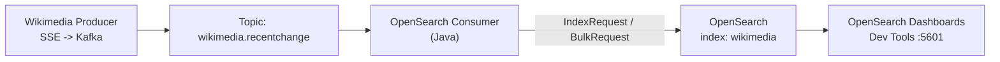

# Dự Án OpenSearch Consumer: Đưa Dữ Liệu Kafka Vào Database Tìm Kiếm

Kafka giữ dòng dữ liệu chảy mãi, nhưng chảy để làm gì nếu không ai tra cứu được? Bài này mở màn cho cả section: chúng ta sẽ xây một **Kafka Consumer** đọc topic `wikimedia.recentchange` và đổ vào **OpenSearch** — database tìm kiếm / phân tích — để dữ liệu stream trở thành dữ liệu tra cứu được.

---

## 1. Vấn đề: Log Kafka Không Phải Nơi Để Query

Đến giờ bạn đã có Producer Wikimedia bắn JSON liên tục vào Kafka, Consumer demo đọc và in ra console. Nhưng:

* Console log không lưu trữ, không search, không dashboard.
* Kafka retention mặc định 7 ngày là xóa — muốn giữ lâu, phân tích, tìm kiếm full-text thì phải đổ sang hệ thống khác.
* Thực tế production: Kafka là **lớp vận chuyển**, phía sau luôn có **sink**: database, search engine, S3, warehouse.

Lựa chọn của section này là **OpenSearch** — đại diện điển hình cho sink dạng search engine.

## 2. OpenSearch Là Gì? Vì Sao Không Phải Elasticsearch?

**OpenSearch** là fork open-source của Elasticsearch (sau khi Elastic đổi license). API tương thích gần như 1:1 với Elasticsearch 7.10.2 — nên code, REST API, Dev Tools bạn học ở đây áp dụng được cho cả hai.

Mô hình tư duy nhanh:

| Khái niệm OpenSearch | Hiểu nôm na | Tương đương Kafka/DB |
|---|---|---|
| Index (ví dụ `wikimedia`) | Nơi chứa documents | Như Table trong DB, như Topic trong Kafka |
| Document (JSON) | Một bản ghi JSON | Như một Kafka record value |
| `_id` | Định danh document | Quyết định idempotence — bài 086 sẽ đào sâu |
| REST API (`PUT/GET/DELETE`) | Cách CRUD | Consumer Java sẽ gọi qua client thay vì gọi tay |

Luồng tổng thể của dự án:



Điểm mấu chốt: Consumer không chỉ `poll()` rồi log — mà `poll()` → biến `record.value()` (chuỗi JSON) → `IndexRequest` → OpenSearch. Chính đoạn biến đổi này là nơi nảy sinh mọi vấn đề hay của Consumer: delivery semantics, idempotence, batching, commit offsets.

## 3. Hai Con Đường Dựng OpenSearch: Docker Hay Cloud?

Khóa học chuẩn bị cả hai để ai cũng làm được:

| Tiêu chí | Docker local | Bonsai managed (cloud) |
|---|---|---|
| Chi phí | Miễn phí, tốn RAM local | Free Sandbox Cluster giới hạn |
| Tốc độ setup | Cần biết Docker, `docker-compose up` | Chỉ cần email, chờ ~10 phút provision |
| Endpoints | `http://localhost:9200` + Dashboards `:5601` | URL dài có `username:password@host` |
| Phù hợp | Học sâu, reset thoải mái | Máy yếu, không cài Docker |
| Lưu ý code | Không auth, `plugins.security.disabled: true` | Phải parse auth từ connection string |

Bạn chỉ cần **một trong hai**. Bài 080 hướng dẫn Docker, bài 081 hướng dẫn Bonsai. Đừng dựng cả hai cho tốn tài nguyên.

## 4. Thư Viện Java Sẽ Dùng

Consumer viết bằng Java, Gradle, package `io.conduktor.demos.kafka.opensearch`:

* `kafka-clients` — Consumer API quen thuộc (đã dùng ở phần basics).
* `opensearch-rest-high-level-client:1.2.4` — client chính thức dòng 1.x để gọi OpenSearch. Giữ đúng dòng `1.x`, đừng lấy bản 2.x/3.x mới nhất nếu code mẫu dùng API cũ — sẽ vỡ compile.
* `gson` (Google) — parse JSON để trích `meta.id` làm `_id` cho idempotence (bài 086).

```gradle
dependencies {
    implementation 'org.apache.kafka:kafka-clients:3.3.2'
    implementation 'org.opensearch.client:opensearch-rest-high-level-client:1.2.4'
    implementation 'com.google.code.gson:gson:2.10.1'
}
```

Phiên bản Kafka Clients có thể mới hơn, nhưng OpenSearch client nên chốt `1.2.4` như code mẫu để tương thích với `override main response version: true` trong docker-compose.

## 5. Lộ Trình 6 Parts + 4 Bài Lý Thuyết Xen Kẽ

Chuỗi implementation được chia cố ý để mỗi part chỉ giải quyết **một nỗi đau**:

| Part | File bài học | Việc làm | Nỗi đau được giải quyết |
|---|---|---|---|
| Part 1 | 083 | Tạo `RestHighLevelClient`, tạo index `wikimedia` nếu chưa có | Kết nối được tới OpenSearch local lẫn cloud |
| Part 2 | 084 | Tạo `KafkaConsumer`, `poll()` + `IndexRequest` từng record | Dữ liệu chảy end-to-end lần đầu |
| Lý thuyết | 085 | Delivery semantics | Hiểu tại sao code Part 2 chưa an toàn |
| Part 3 | 086 | Gắn `_id` idempotent (tọa độ Kafka hoặc `meta.id`) | Hết duplicates khi đọc lại |
| Lý thuyết | 087 | Commit strategies | Hiểu `enable.auto.commit` vs manual |
| Part 4 | 088 | Tắt auto-commit, `commitSync()` sau batch | Đạt at-least-once có kiểm soát |
| Part 5 | 089 | `BulkRequest` gom batch | Từ vài docs/s lên hàng trăm docs/s |
| Lý thuyết | 090 | Offset reset behavior | Hiểu `earliest/latest/none` khi mất offset |
| Part 6 | 091 | Graceful shutdown + replay bằng reset offsets | Rewind an toàn nhờ idempotence |
| Nâng cao | 092, 093 | Internal threads, replica fetching | Tuning throughput và cross-AZ cost |

Nếu bạn nhảy cóc — ví dụ đọc Part 5 trước Part 3 — bạn sẽ không hiểu vì sao bulk + rewind lại không sinh rác. Hãy đi đúng thứ tự 078 → 093.

## Cạm Bẫy Thường Gặp

* **Coi OpenSearch như Kafka.** Kafka là append-only log, OpenSearch là database cho phép ghi đè theo `_id`. Chính khả năng ghi đè này mới cho phép idempotence — đừng mang tư duy "không sửa được" của Kafka sang đây.
* **Lấy nhầm Elasticsearch trên Bonsai.** Bonsai cho chọn cả Elasticsearch và OpenSearch. Bắt buộc chọn **OpenSearch 1.x**. Chọn sai là client báo version mismatch.
* **Nâng OpenSearch client lên 2.x cho "mới".** API đổi, code mẫu `RestHighLevelClient` dòng 1.x sẽ không compile. Chốt `1.2.4` cho section này.
* **Bỏ qua Dashboards.** Nhiều bạn chỉ chạy `:9200` rồi code luôn. Hãy mở Dashboards `:5601` → Dev Tools để `GET /`, `PUT /my-first-index`, kiểm tra document bằng mắt trước khi đổ Kafka vào — bài 082 sẽ luyện việc này.

## Kết Luận

Tóm một câu: **section này dùng một pipeline thật (Wikimedia → Kafka → OpenSearch) để dạy toàn bộ cấu hình Consumer nâng cao mà lý thuyết suông không dạy được.**

Bài tiếp theo (079) chúng ta sẽ dựng khung project Gradle, khai báo đúng 3 dependencies trên và tạo class rỗng `OpenSearchConsumer` chạy thử — nền móng để Part 1 bắt đầu viết code kết nối.
