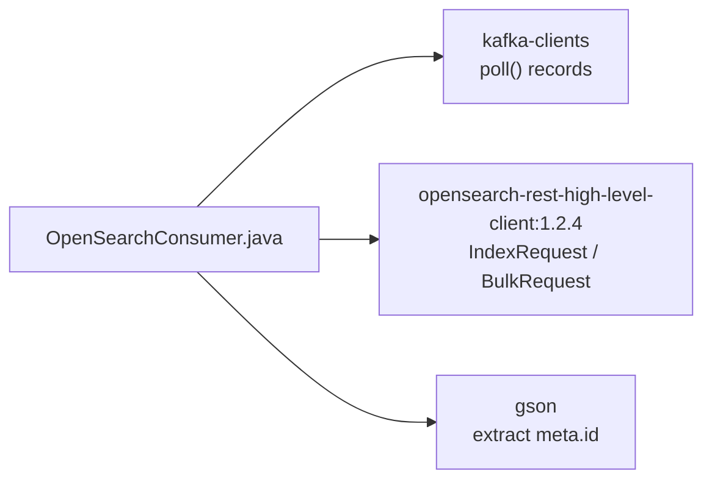

# Dựng Khung Project OpenSearch Consumer: Gradle, Dependencies Và Class Rỗng Chạy Được

Bài trước đã chốt bức tranh toàn section: Wikimedia → Kafka → OpenSearch. Bài này dựng móng: một module Gradle biên dịch được, đủ 3 dependencies, một class `OpenSearchConsumer` chạy thử — để từ Part 1 trở đi chỉ tập trung vào logic Consumer, không vật lộn với classpath nữa.

---

## 1. Vấn đề: Sai Một Dependency Là Mất Cả Buổi

Project Kafka basics trước đây chỉ cần `kafka-clients`. Project này cần thêm 2 thứ lạ:

* Client HTTP nói chuyện với OpenSearch (không phải Kafka protocol).
* Thư viện JSON để moi `id` từ payload Wikimedia.

Lỗi kinh điển của người mới:

* Lấy `opensearch-rest-high-level-client` bản 2.x/3.x mới nhất → API đổi, code mẫu không compile.
* Quên `gson` → đến Part 3 mới tá hỏa không parse được JSON.
* Copy `docker-compose.yml` sai chỗ → Part 1 chạy client báo `Connection refused` mà tưởng code sai.

Bài này khóa 3 rủi ro đó ngay từ đầu.

## 2. Cơ chế: Ba Khối Dependencies



* `kafka-clients` — giữ nguyên version bạn đã dùng ở phần Producer/Consumer basics (ví dụ `3.3.2`). Không cần đổi.
* `org.opensearch.client:opensearch-rest-high-level-client:1.2.4` — dòng 1.x tương thích với OpenSearch Docker `1.x` và flag `override main response version: true`. Đây là client đồng bộ, blocking, dễ học. Production hiện nay chuộng `opensearch-java` client mới, nhưng section này bám `RestHighLevelClient` vì explicit, dễ đọc từng `IndexRequest`.
* `com.google.code.gson:gson` — nhẹ, chỉ để `JsonParser.parseString(...).getAsJsonObject().getAsJsonObject("meta").get("id").getAsString()`. Không cần Jackson nặng.

Vì sao chốt `1.2.4` mà không lấy mới nhất? OpenSearch server trong `docker-compose.yml` của khóa học là `1.x`. Client 2.x nói chuyện với server 1.x sẽ gặp lỗi version check. Nguyên tắc: **client và server cùng major version**.

## 3. Code: Từng Bước Dựng Project

### 3.1. Tạo module mới

Trong IntelliJ: File → New → Module → Gradle + Java → tên `kafka-consumer-opensearch`. Package chuẩn của khóa học:

```
io.conduktor.demos.kafka.opensearch
```

### 3.2. Khai báo dependencies trong `build.gradle`

```gradle
dependencies {
    implementation 'org.apache.kafka:kafka-clients:3.3.2'
    implementation 'org.opensearch.client:opensearch-rest-high-level-client:1.2.4'
    implementation 'com.google.code.gson:gson:2.10.1'
}
```

Giải thích từng dòng:

* Dòng 1: Consumer API — `KafkaConsumer`, `ConsumerRecords`, `ConsumerConfig`.
* Dòng 2: `RestHighLevelClient`, `CreateIndexRequest`, `IndexRequest`, `BulkRequest`. Kéo theo `httpclient`, `httpcore` transitively — không cần khai thêm.
* Dòng 3: `gson` cho Part 3. Khai ngay từ đầu để khỏi sửa build giữa chừng.

Xong bấm **Load Gradle Changes** (icon Gradle nhỏ). Chờ download xong mới qua bước tiếp — lỗi `Cannot resolve symbol RestHighLevelClient` 90% là do chưa load.

> Link Maven tham khảo (dán comment trong `build.gradle` để sau này tra):
> * `https://mvnrepository.com/artifact/org.opensearch.client/opensearch-rest-high-level-client/1.2.4`
> * `https://mvnrepository.com/artifact/com.google.code.gson/gson`

### 3.3. Đặt `docker-compose.yml` cạnh project

Copy file `docker-compose.yml` từ GitHub của khóa học vào thư mục module (ngang `build.gradle`). File này dựng 2 containers: `opensearch` (`:9200`) và `opensearch-dashboards` (`:5601`). Chi tiết từng biến môi trường sẽ mổ ở bài 080 — ở đây chỉ cần biết **file phải nằm đúng chỗ để IntelliJ Docker plugin nhận ra**.

### 3.4. Tạo class rỗng chạy thử

```java
package io.conduktor.demos.kafka.opensearch;

public class OpenSearchConsumer {
    public static void main(String[] args) throws java.io.IOException {
        System.out.println("OpenSearchConsumer skeleton OK");
    }
}
```

Bấm Run. Thấy `OpenSearchConsumer skeleton OK` là móng đã chắc. Đừng viết thêm code vội — Part 1 (bài 083) sẽ thêm `createOpenSearchClient()` vào đúng class này.

## 4. So sánh: Hai cách lấy dependencies

| Cách | Thao tác | Khi nào dùng |
|---|---|---|
| Copy từ `kafka-basics/build.gradle` + thêm 2 dòng OpenSearch/gson | Nhanh, đúng version đã test | Khuyên dùng cho bài này |
| Search Maven Central tay, lấy bản mới nhất | Dễ vỡ API | Chỉ khi bạn đã hiểu ma trận tương thích client/server |

## 5. Pitfalls

* **Lấy OpenSearch client 2.x/3.x.** Lỗi compile `RestHighLevelClient` không tồn tại / constructor đổi. Chốt `1.2.4`.
* **Quên Load Gradle Changes.** IDE báo đỏ cả file dù `build.gradle` đúng. Luôn load sau khi sửa dependencies.
* **Tạo class sai package.** Các Part sau import `io.conduktor.demos.kafka.opensearch.OpenSearchConsumer` trong log (`LoggerFactory.getLogger(OpenSearchConsumer.class.getSimpleName())`). Sai package không chết nhưng gây rối khi đối chiếu code mẫu.
* **Chưa cài Docker plugin đã nhảy sang bài Docker.** Bài 080 cần plugin Docker của IntelliJ Community để bấm nút chạy compose. Nếu không dùng Docker thì bỏ qua, sang bài 081 (Bonsai).

## Kết Luận

Tóm một câu: **xong bài này bạn có module Gradle biên dịch được, đủ 3 dependencies đúng version, class rỗng chạy được và file compose nằm đúng chỗ.**

Bài tiếp theo (080) chúng ta sẽ mổ `docker-compose.yml` và dựng OpenSearch + Dashboards trên local — con đường được khuyên dùng nếu máy bạn chạy được Docker.
