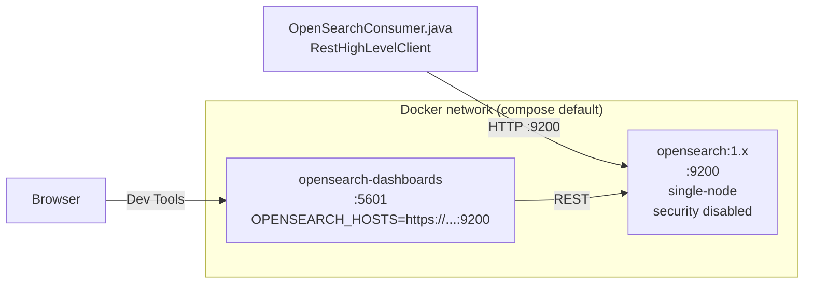

# Dựng OpenSearch Bằng Docker: Single-Node Chuẩn Dev Với 2 Lệnh

Bài trước đã có khung Gradle và class rỗng. Bài này dựng "database đích": OpenSearch + Dashboards chạy local bằng Docker Compose — con đường nhanh, rẻ và reset thoải mái nhất để học cả section.

---

## 1. Vấn đề: Vì Sao Cần Docker Mà Không Cài Tay?

OpenSearch là một search engine phân tán (Java + Lucene), cần JVM tuning, certificates, discovery config. Cài tay trên Windows rất cực: xung đột Java version, quyền file, security plugin bắt HTTPS + login.

Docker giải quyết gọn:

* Một file `docker-compose.yml` mô tả cả cluster: image nào, port nào, biến môi trường nào.
* Một lệnh `docker compose up -d` là có OpenSearch `:9200` + Dashboards `:5601`.
* Hỏng thì `docker compose down -v` là sạch, dựng lại 2 phút.

Nếu máy bạn không chạy được Docker (RAM yếu, policy công ty), bỏ qua bài này, sang bài 081 dùng Bonsai cloud. Đừng cố cả hai.

## 2. Cơ Chế: Hai Container Nói Chuyện Với Nhau Ra Sao?



* `opensearch` là database thật: nhận `IndexRequest`, `BulkRequest`, lưu vào index `wikimedia`.
* `opensearch-dashboards` chỉ là console web: giúp bạn gõ `GET /`, `PUT /my-first-index` bằng mắt thay vì `curl`.
* Java code **không bao giờ** nói chuyện với Dashboards — chỉ nói với `:9200`. Nhiều bạn mới nhầm, code trỏ vào `:5601` nên báo connection reset.

Chế độ `single-node` (`discovery.type=single-node`) tắt bầu cử cluster manager. Dev một node thì bật cho nhẹ; production multi-node thì tuyệt đối không dùng.

## 3. Code: Mổ File `docker-compose.yml` Từng Dòng

File chuẩn của khóa học (rút gọn, giữ đúng keys quan trọng):

```yaml
version: '3'
services:
  opensearch:
    image: opensearchproject/opensearch:1.2.4
    container_name: opensearch
    environment:
      - cluster.name=opensearch-cluster
      - node.name=opensearch
      - discovery.type=single-node
      - bootstrap.memory_lock=true
      - "OPENSEARCH_JAVA_OPTS=-Xms512m -Xmx512m"
      - plugins.security.disabled=true
      - override.main.response.version=true
    ulimits:
      memlock:
        soft: -1
        hard: -1
    volumes:
      - opensearch-data:/usr/share/opensearch/data
    ports:
      - "9200:9200"
    networks:
      - opensearch-net

  opensearch-dashboards:
    image: opensearchproject/opensearch-dashboards:1.2.4
    container_name: opensearch-dashboards
    ports:
      - "5601:5601"
    environment:
      OPENSEARCH_HOSTS: '["http://opensearch:9200"]'
    networks:
      - opensearch-net
    depends_on:
      - opensearch

volumes:
  opensearch-data:

networks:
  opensearch-net:
```

Giải thích từng khối:

### 3.1. `image: opensearchproject/opensearch:1.2.4`

* Chốt major `1.x` để khớp với `opensearch-rest-high-level-client:1.2.4` trong `build.gradle` (bài 079).
* Đừng lấy `latest` (hiện đã 2.x/3.x) — client 1.x gọi server 2.x sẽ lỗi version check.
* Dashboards cũng phải cùng `1.2.4`. Lệch version dashboards/server gây lỗi "incompatible version".

### 3.2. `discovery.type=single-node`

* Bảo OpenSearch "mày chỉ có một mình, đừng đi tìm node khác".
* Không có dòng này, node chờ cluster formation, log treo ở `master not discovered`, `:9200` không bao giờ lên.
* Production: thay bằng `cluster.initial_master_nodes` + danh sách seeds. Dev: cứ `single-node`.

### 3.3. `plugins.security.disabled=true`

* Tắt HTTPS + basic auth. Dev mode mới dám tắt.
* Khi tắt, Java code connect `http://localhost:9200` không cần username/password, không cần SSLContext phức tạp (Part 1 — bài 083 — sẽ có 2 nhánh code: no-auth vs có-auth, bạn sẽ dùng nhánh đơn giản).
* Production: **không bao giờ** tắt. Phải bật security, dùng HTTPS + internal users.

### 3.4. `override.main.response.version=true`

* Dòng "lạ" nhất file, nhưng bắt buộc nếu sau này bạn học Kafka Connect Elasticsearch sink.
* OpenSearch 1.x mặc định trả `version.number: 1.2.4` ở `GET /`. Một số connector cũ chỉ chấp nhận `7.10.2` (Elasticsearch OSS). Flag này bảo OpenSearch "giả vờ" trả `7.10.2` để tương thích.
* Với code Java thuần trong section này, có hay không cũng chạy. Nhưng cứ để nguyên để khỏi vỡ ở phần Connect sau.

### 3.5. `OPENSEARCH_JAVA_OPTS=-Xms512m -Xmx512m` + `memlock`

* Giới hạn heap 512MB cho máy dev. Mặc định OpenSearch đòi heap lớn, máy 8GB RAM sẽ ì.
* `bootstrap.memory_lock=true` + `ulimits.memlock` khóa RAM, tránh swap làm chậm search. Trên Docker Desktop Windows, nếu báo `memory locking requested but not supported`, vẫn chạy được — chỉ warning.

### 3.6. Ports và volumes

* `9200:9200` — REST API. Java + `curl` + browser đều đi cổng này.
* `5601:5601` — Dashboards web.
* `opensearch-data` volume giữ data khi restart container. Muốn reset sạch (xóa index `wikimedia` làm lại Part 5/6): `docker compose down -v` — flag `-v` xóa luôn volume.

## 4. Chạy Và Kiểm Chứng: 3 Cửa Sổ Phải Sáng

### 4.1. Start từ IntelliJ hoặc CLI

Cách 1 — IntelliJ Community + Docker plugin: mở `docker-compose.yml`, bấm nút play (hai mũi tên) cạnh `services`. Cách này trực quan, log hiện ngay trong IDE.

Cách 2 — CLI (khuyên dùng để hiểu DevOps thật):

```bash
# đứng đúng thư mục chứa docker-compose.yml
docker compose up -d

# xem trạng thái
docker compose ps

# xem log nếu không lên
docker compose logs -f opensearch
```

Chờ 30–60 giây cho OpenSearch bootstrap. Lần đầu pull image ~500MB nên lâu.

### 4.2. Kiểm tra `:9200` — database sống chưa?

Mở browser `http://localhost:9200` hoặc:

```bash
curl http://localhost:9200
```

Kết quả mong đợi (rút gọn):

```json
{
  "name" : "opensearch",
  "cluster_name" : "opensearch-cluster",
  "cluster_uuid" : "xxxx",
  "version" : {
    "number" : "7.10.2",
    "distribution" : "opensearch"
  },
  "tagline" : "The OpenSearch Project: https://opensearch.org/"
}
```

Thấy `tagline: The OpenSearch Project` là sống. Lưu ý `number: 7.10.2` chính là hiệu ứng của `override.main.response.version=true` — đừng hoảng "sao không phải 1.2.4".

Nếu browser xoay mãi / `connection refused`: 90% là container chưa ready hoặc port 9200 bị app khác chiếm. Chạy `docker compose logs opensearch | tail -50` xem có dòng `Node started` chưa.

### 4.3. Kiểm tra `:5601` — Dashboards vào được không?

Mở `http://localhost:5601`. Lần đầu load 20–30 giây (Dashboards chờ OpenSearch). Thấy màn hình Welcome → menu trái → **Dev Tools**. Gõ:

```
GET /
```

Bấm nút play (send request). Kết quả JSON tương tự `:9200` là đạt. Bookmark URL Dev Tools này — bài 082 sẽ dùng nó để luyện `PUT/GET/DELETE` index bằng tay trước khi code Java.

## 5. Bảng So Sánh: Khi Nào Dùng Docker, Khi Nào Bỏ?

| Tình huống | Docker local | Sang Bonsai (bài 081) |
|---|---|---|
| Máy 16GB RAM, có Docker Desktop | Dùng — nhanh, reset thoải mái | Không cần |
| Máy yếu / không cài được Docker | Bỏ | Dùng |
| Cần test reset offsets, rewind (Part 6) | Lý tưởng — `down -v` là sạch | Tốn quota, xóa index chậm |
| Mạng công ty chặn Docker Hub | Khó pull image | Dùng cloud |
| Production thật | Không — cần multi-node + security on | Không — cần VPC, monitoring riêng |

## 6. Pitfalls

* **Lấy image `latest` / `opensearch:2.x`.** Client 1.2.4 trong code mẫu sẽ lỗi. Chốt `1.2.4` cho cả server, dashboards, client.
* **Xóa dòng `plugins.security.disabled=true` vì "thấy không an toàn".** Dev mà bật security thì Java code phải thêm SSL + auth — Part 1 có nhánh đó nhưng phức tạp gấp 3 lần. Cứ tắt ở local, bật ở prod.
* **Trỏ Java code vào `:5601`.** Dashboards là web UI, không phải REST data plane. Java luôn đi `:9200`.
* **Quên `depends_on` / start dashboards trước opensearch.** Dashboards báo `OpenSearch Dashboards server is not ready yet`. Fix: `docker compose restart opensearch-dashboards` sau khi opensearch đã `green`.
* **Disk đầy vì volume phình.** Mỗi lần test Part 5 bulk hàng chục nghìn docs, volume `opensearch-data` phình nhanh. Định kỳ `docker compose down -v` khi muốn làm lại từ đầu.
* **Docker Desktop trên Windows ngốn RAM.** Vào Settings → Resources → giới hạn Memory 4GB, Swap 1GB nếu máy yếu. OpenSearch heap 512MB đã set ở trên là đủ học.

## Kết Luận

Tóm một câu: **xong bài này bạn có OpenSearch sống ở `:9200`, Dashboards ở `:5601`, hiểu từng biến môi trường trong compose và biết cách verify + reset.**

Bài tiếp theo (081) dành cho ai không dùng Docker: dựng OpenSearch managed trên Bonsai cloud trong 10 phút — nếu bạn đã chạy Docker thành công, có thể đọc lướt để biết rồi nhảy thẳng sang bài 082 luyện OpenSearch 101.
