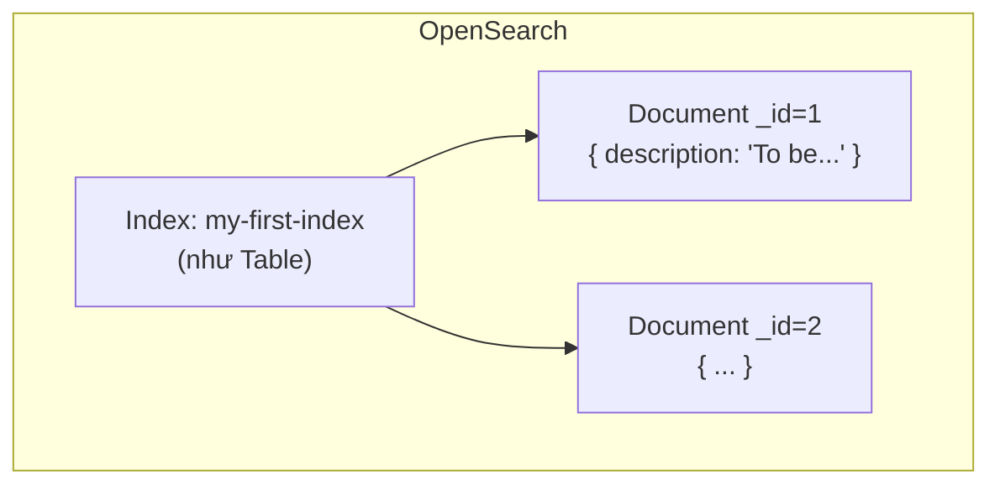

# OpenSearch 101: Học CRUD Bằng Tay Trước Khi Đổ Kafka Vào

Bài trước bạn đã có OpenSearch sống — hoặc ở `localhost:9200` (Docker) hoặc trên Bonsai cloud. Bài này khoan code Java vội. Chúng ta luyện CRUD bằng tay trên Dev Tools để khi Part 1 gọi `CreateIndexRequest`, Part 2 gọi `IndexRequest`, bạn biết chính xác nó tương đương lệnh REST nào.

---

## 1. Vấn đề: Vì Sao Phải Gõ Tay Trước Khi Code?

Nhiều bạn nhảy thẳng vào Java, thấy `RestHighLevelClient`, `CreateIndexRequest`, `RequestOptions.DEFAULT` là ngợp. Thực ra Java client chỉ là lớp bọc mỏng quanh REST API:

| Thao tác tay (Dev Tools) | Đối tượng Java tương đương | Dùng ở Part nào |
|---|---|---|
| `PUT /my-first-index` | `CreateIndexRequest("my-first-index")` | Part 1 (083) |
| `PUT /my-first-index/_doc/1 { ... }` | `new IndexRequest("wikimedia").id(id).source(json, XContentType.JSON)` | Part 2–3 (084, 086) |
| `GET /my-first-index/_doc/1` | Verify bằng mắt sau khi consumer chạy | Part 2 (084) |
| `DELETE /my-first-index/_doc/1` | Không dùng trong code, chỉ để dọn tay | Bài này |
| `DELETE /my-first-index` | Reset sạch khi test lại Part 5/6 | Bài này |
| `POST /_bulk` | `BulkRequest.add(indexRequest)` + `client.bulk(...)` | Part 5 (089) |

Học tay 15 phút bây giờ tiết kiệm 2 giờ debug "sao consumer chạy mà search không thấy" sau này.

## 2. Cơ Chế: Index, Document, `_id` Hiểu Trong 3 Phút



* **Index** là nơi chứa documents. Tên viết thường, không dấu, không space. Trong dự án thật chúng ta dùng index `wikimedia`.
* **Document** là một JSON bất kỳ. OpenSearch không bắt khai schema trước (dynamic mapping) — gửi gì nhận nấy, rất hợp với JSON Wikimedia thất thường.
* **`_id`** là chìa khóa của toàn section: nếu bạn `PUT` cùng `_id` hai lần, lần hai **ghi đè** lần một (update), không sinh duplicate. Đây chính là nền tảng của idempotence ở bài 086. Nếu không truyền `_id`, OpenSearch tự sinh random — mỗi lần ghi là một document mới, đọc lại là duplicate.

Hai endpoint phải phân biệt:

* `:9200` — REST API của OpenSearch (Java code + `curl` đi đường này).
* `:5601` — OpenSearch Dashboards, menu **Dev Tools** là console để gõ lệnh REST cho tiện. Bonsai thì Console web thay Dashboards, cú pháp y hệt.

## 3. Code: Chuỗi 5 Lệnh REST Phải Tự Tay Chạy Được

Mở Dev Tools (Dashboards `:5601` → Dev Tools) hoặc Bonsai Console. Gõ từng lệnh, bấm send, đọc kết quả.

### 3.1. Kiểm tra cluster sống: `GET /`

```
GET /
```

Kết quả mong đợi:

```json
{
  "name" : "opensearch",
  "cluster_name" : "opensearch-cluster",
  "version" : {
    "number" : "7.10.2",
    "distribution" : "opensearch"
  },
  "tagline" : "The OpenSearch Project: https://opensearch.org/"
}
```

Giải thích: `tagline: The OpenSearch Project` chứng tỏ bạn đang nói chuyện với OpenSearch thật, không phải Elasticsearch. `number: 7.10.2` là do flag `override.main.response.version=true` trong compose (bài 080) — đừng hoảng.

Trên Dashboards tương đương lệnh là `GET /` trong khung trái (trong video ghi `GET *` nhưng chuẩn REST là `GET /`).

### 3.2. Tạo index: `PUT /my-first-index`

```
PUT /my-first-index
```

Kết quả:

```json
{
  "acknowledged" : true,
  "index" : "my-first-index"
}
```

Giải thích: `acknowledged: true` nghĩa là cluster đã tạo index. Lệnh này chính là việc `CreateIndexRequest("wikimedia")` làm ở Part 1 — chỉ khác tên index. Nếu chạy lại lần nữa sẽ báo `resource_already_exists_exception` — đó là lý do Part 1 phải check `indices().exists()` trước khi create.

### 3.3. Thêm document: `PUT /my-first-index/_doc/1`

```
PUT /my-first-index/_doc/1
{
  "description": "To be or not to be, that is the question."
}
```

Kết quả:

```json
{
  "_index" : "my-first-index",
  "_id" : "1",
  "result" : "created",
  "_version" : 1
}
```

Giải thích từng trường:

* `_id: 1` là id bạn chỉ định. Trong Part 2 lúc đầu code **không** truyền id → OpenSearch tự sinh chuỗi random dài. Đến Part 3 chúng ta truyền `meta.id` của Wikimedia vào đây để idempotent.
* `result: created` — lần đầu tạo mới. Ghi đè cùng `_id` lần nữa sẽ trả `result: updated` và `_version` tăng lên 2, 3... Đây là bằng chứng ghi đè không sinh duplicate.
* Body JSON gửi kèm phải khai `Content-Type: JSON` — trong Java tương ứng `XContentType.JSON`.

Thử ghi đè ngay để khắc sâu: chạy lại lệnh trên với description khác, quan sát `result: updated`, `_version: 2`.

### 3.4. Đọc lại: `GET /my-first-index/_doc/1`

```
GET /my-first-index/_doc/1
```

Kết quả:

```json
{
  "_index" : "my-first-index",
  "_id" : "1",
  "found" : true,
  "_source" : {
    "description": "To be or not to be, that is the question."
  }
}
```

Giải thích: `_source` chính là JSON gốc bạn gửi. Khi Part 2 chạy xong, bạn sẽ lấy một `_id` random trong log Java, `GET /wikimedia/_doc/<id-đó>` và phải thấy `_source` là JSON Wikimedia đầy đủ `meta`, `user`, `title`... Nếu `found: false` nghĩa là consumer chưa ghi tới hoặc sai index name.

Lưu ý cú pháp chuẩn là `/_doc/1` (underscore doc). Trong transcript video đọc nhanh thành "core doc" hay "doc" — luôn gõ `/_doc/`.

### 3.5. Xóa document và xóa index

```
DELETE /my-first-index/_doc/1
```

```json
{ "result" : "deleted" }
```

```
DELETE /my-first-index
```

```json
{ "acknowledged" : true }
```

Giải thích: xóa document để test lẻ; xóa index để reset sạch trước khi chạy lại Part 5 (bulk) hoặc Part 6 (replay). Trên Docker còn có cách mạnh hơn: `docker compose down -v` xóa cả volume. Trên Bonsai free tier thì `DELETE /wikimedia` là cách duy nhất để dọn.

## 4. Bảng So Sánh: REST Tay vs Java Client

| Ý định | Gõ tay (bài này) | Java (các Part sau) |
|---|---|---|
| Tạo index nếu chưa có | `PUT /wikimedia` | `client.indices().create(new CreateIndexRequest("wikimedia"), DEFAULT)` |
| Check tồn tại | `GET /wikimedia` (200 vs 404) | `client.indices().exists(new GetIndexRequest("wikimedia"), DEFAULT)` |
| Ghi 1 doc có id | `PUT /wikimedia/_doc/<id> {json}` | `new IndexRequest("wikimedia").id(id).source(json, XContentType.JSON)` + `client.index(req, DEFAULT)` |
| Ghi 1 doc không id | `POST /wikimedia/_doc {json}` | `new IndexRequest("wikimedia").source(...)` (không `.id(...)`) |
| Ghi hàng loạt | `POST /_bulk {...}` | `BulkRequest.add(...)` + `client.bulk(bulk, DEFAULT)` |
| Đọc verify | `GET /wikimedia/_doc/<id>` | Không đọc trong consumer — verify bằng Dev Tools |

Ghi nhớ cột trái, cột phải tự khắc dễ.

## 5. Pitfalls

* **Nhầm `/_doc` thành `/doc`, `/_docs`, `/core doc`.** API chuẩn chỉ có `/_doc`. Sai một ký tự là `404 invalid path`.
* **Tạo index tên viết hoa / có dấu.** OpenSearch bắt tên thường, không ký tự đặc biệt. Cứ `my-first-index`, `wikimedia` là an toàn.
* **Quên body JSON khi `PUT _doc`.** Lệnh chạy nhưng báo `request body required`. Trong Java tương đương quên `.source(...)` — compile được nhưng runtime lỗi.
* **Verify sai index.** Consumer ghi vào `wikimedia` nhưng lại `GET /my-first-index/_doc/...` rồi kết luận "consumer lỗi". Luôn đối chiếu tên index trong code và lệnh GET.
* **Để data test `my-first-index` tồn tại mãi.** Không hại nhưng gây rối khi `GET /_cat/indices`. Học xong bài này thì `DELETE /my-first-index` cho sạch.
* **Trên Bonsai gõ `PUT` nhưng Console mặc định `GET`.** Phải đổi method trước khi send, nếu không báo `incorrect HTTP method`.

## Kết Luận

Tóm một câu: **bạn đã tự tay tạo index, ghi document có `_id`, đọc lại, ghi đè (thấy `updated`), xóa — tức là đã hiểu mọi thao tác mà Java client sẽ làm thay bạn từ Part 1 tới Part 5.**

Bài tiếp theo (083 — Part 1) chúng ta bắt đầu code thật: viết `createOpenSearchClient()` (2 nhánh local/cloud) và tạo index `wikimedia` bằng `CreateIndexRequest` — chính là phiên bản Java của `PUT /wikimedia` vừa học.
