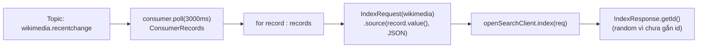

# OpenSearch Consumer Part 2: Poll Kafka Và Đẩy Từng Record Vào OpenSearch

Part 1 (083) đã xong nửa "đích": client kết nối được cả local lẫn Bonsai, index `wikimedia` tạo idempotent. Bài này làm nửa "nguồn": tạo `KafkaConsumer`, `poll()` từng batch và đẩy mỗi record thành một `IndexRequest`. Cuối bài dữ liệu chảy end-to-end lần đầu — dù còn thô, chậm và chưa an toàn, nhưng là mốc "nó chạy được rồi".

---

## 1. Vấn đề: Nối Hai Thế Giới Kafka Và OpenSearch Ra Sao?

Đến giờ code chỉ biết OpenSearch, chưa biết Kafka. Muốn nối, phải trả lời 3 câu hỏi:

* Consumer đọc topic nào, group nào, từ đâu (`earliest` hay `latest`)?
* Mỗi `ConsumerRecord` biến thành `IndexRequest` thế nào — value JSON đi đâu, type khai sao?
* Vòng lặp `poll()` đặt ở đâu trong try-with-resources đã có từ Part 1 để cả hai clients cùng được close?

Code Part 2 trả lời cả 3 bằng cách cố ý **làm đơn giản nhất có thể**: `while(true)`, không shutdown hook, không bulk, gửi từng record một. Mọi tối ưu (idempotence, manual commit, bulk) để dành Part 3–5. Đừng chê code "ngu" — đó là bệ phóng để các bài sau chỉ ra từng nỗi đau.



## 2. Cơ Chế: `poll()` Và `IndexRequest` Đơn Lẻ

Hai khái niệm mới duy nhất của Part này:

**`poll(Duration)`** — Consumer hỏi broker "có records mới cho group của tôi không, chờ tối đa 3 giây". Trả về một batch (có thể rỗng, có thể 500 records). Vòng `while(true)` gọi `poll()` liên tục chính là nhịp tim của consumer. Quên `subscribe()` trước `poll()` sẽ nhận `IllegalStateException: not subscribed` — lỗi kinh điển Part này.

**`IndexRequest` đơn lẻ** — bọc một JSON thành một lệnh ghi:

| REST tay (082) | Java Part 2 |
|---|---|
| `POST /wikimedia/_doc {json}` (không id → server tự sinh) | `new IndexRequest("wikimedia").source(record.value(), XContentType.JSON)` |
| Response `_id` random | `IndexResponse.getId()` log ra để verify |

Vì chưa `.id(...)`, mỗi record được sinh `_id` random — đọc lại cùng message sẽ thành document **mới**, tức duplicate. Đây chính là lý do Part 3 (086) phải làm idempotence. Ở Part 2 cứ chấp nhận để thấy vấn đề bằng mắt.

Về offsets: code Part 2 giữ `enable.auto.commit=true` (mặc định) nên offsets tự commit ngầm mỗi 5 giây khi gọi `poll()`. Bài 087 sẽ mổ cơ chế này; ở đây chỉ cần biết "lag tự giảm, không cần gọi commit tay".

## 3. Code: Từng Đoạn Thêm Vào `OpenSearchConsumer.java`

Giữ nguyên toàn bộ Part 1 (`createOpenSearchClient()`, check `exists()`, try-with-resources). Chỉ thêm 3 khối dưới đây.

### 3.1. `createKafkaConsumer()` — copy từ Consumer Demo, đổi 2 chỗ

```java
private static KafkaConsumer<String, String> createKafkaConsumer() {
    Properties props = new Properties();
    props.setProperty(ConsumerConfig.BOOTSTRAP_SERVERS_CONFIG, "127.0.0.1:9092");
    props.setProperty(ConsumerConfig.KEY_DESERIALIZER_CLASS_CONFIG, StringDeserializer.class.getName());
    props.setProperty(ConsumerConfig.VALUE_DESERIALIZER_CLASS_CONFIG, StringDeserializer.class.getName());
    props.setProperty(ConsumerConfig.GROUP_ID_CONFIG, "consumer-opensearch-demo");
    props.setProperty(ConsumerConfig.AUTO_OFFSET_RESET_CONFIG, "latest");
    return new KafkaConsumer<>(props);
}
```

Giải thích từng property:

* `BOOTSTRAP_SERVERS_CONFIG` — trỏ Kafka local như mọi demo trước. Không đổi.
* `GROUP_ID_CONFIG=consumer-opensearch-demo` — group riêng cho pipeline này. Đổi group là đọc lại từ đầu theo `auto.offset.reset`. Vào Conduktor → Consumer Groups thấy đúng tên này + lag là biết consumer sống.
* `AUTO_OFFSET_RESET_CONFIG=latest` — chỉ đọc data **mới** từ lúc consumer start, bỏ qua history cũ. Lý do: topic Wikimedia có thể tồn hàng chục nghìn messages cũ; để `earliest` lần chạy đầu sẽ bulk import lịch sử ồ ạt (Part 5 mới muốn thế, Part 2 thì không). Muốn replay lịch sử thì Part 6 (091) sẽ reset về `earliest` sau.
* `enable.auto.commit` không set → mặc định `true`, interval 5 giây. Giữ nguyên ở Part 2.

### 3.2. `main()` — subscribe, mở rộng try, vòng `poll()`

```java
KafkaConsumer<String, String> consumer = createKafkaConsumer();

try (RestHighLevelClient openSearchClient = createOpenSearchClient(connString);
     KafkaConsumer<String, String> c = consumer) { // cả hai cùng try-with-resources

    // ... (giữ nguyên đoạn exists/create index của Part 1) ...

    c.subscribe(Collections.singleton("wikimedia.recentchange"));

    while (true) {
        ConsumerRecords<String, String> records = c.poll(Duration.ofMillis(3000));
        int recordCount = records.count();
        log.info("Received " + recordCount + " record(s)");

        for (ConsumerRecord<String, String> record : records) {
            try {
                IndexRequest indexRequest = new IndexRequest("wikimedia")
                    .source(record.value(), XContentType.JSON);

                IndexResponse response = openSearchClient.index(indexRequest, RequestOptions.DEFAULT);
                log.info("Inserted document with id " + response.getId());
            } catch (Exception e) {
                log.error("Failed to index record, skipping", e);
                // Cố ý nuốt exception ở Part 2 để vòng lặp không crash vì 1 record xấu.
                // Part 4-5 sẽ xử lý tử tế hơn.
            }
        }
    }
}
```

Giải thích từng đoạn:

* `subscribe(singleton(...))` — **bắt buộc trước `poll()` đầu tiên**. Quên là `IllegalStateException`. Dùng `singleton` vì chỉ đọc một topic.
* Đưa `consumer` vào try-with-resources cùng `openSearchClient` — một best practice Java: dù crash ở đâu, cả hai clients đều close. Code cũ hay quên close consumer gây "zombie member" trong group (Part 6 sẽ nói kỹ khi thêm shutdown hook).
* `poll(Duration.ofMillis(3000))` — block tối đa 3 giây nếu chưa có data. Log `Received 0 record(s)` liên tục khi chưa chạy producer là **bình thường**, không phải lỗi.
* `record.value()` chính là chuỗi JSON Wikimedia (có `meta`, `user`, `title`...). `.source(value, XContentType.JSON)` bảo OpenSearch "đây là JSON, đừng parse thành text thường".
* `openSearchClient.index(...)` là call **đồng bộ, blocking, từng record một** — chậm (vài chục docs/s) nhưng dễ hiểu. Part 5 (089) thay bằng `BulkRequest` cho nhanh gấp chục lần.
* `try/catch` quanh từng record: Part 2 từng crash với `OpenSearchStatusException` khi gặp JSON lạ. Bọc try-catch để một record xấu không giết cả vòng lặp. Đây là băng dính tạm — Part sau xử lý căn cơ hơn.
* Chưa `commitSync()` tay — offsets tự commit ngầm. Đừng thêm ở Part này.

### 3.3. Chạy thử end-to-end và verify

1. Start Kafka + producer Wikimedia (`WikimediaChangeHandler` / producer demo) để topic có data.
2. Run `OpenSearchConsumer`. Log mong đợi:

```
Received 0 record(s)
Received 0 record(s)
Received 47 record(s)
Inserted document with id AbtX12... (random)
Inserted document with id QmzP99... (random)
```

3. Lag check: Conduktor → Consumer Groups → `consumer-opensearch-demo` → lag tăng khi producer chạy nhanh hơn consumer, giảm dần khi consumer đuổi kịp. Lag về 0 rồi `Received 0` là đã đuổi kịp đầu topic.
4. Verify document: copy một `_id` trong log → Dev Tools:

```
GET /wikimedia/_doc/<dán-id-vào-đây>
```

Phải thấy `_source` là JSON Wikimedia đầy đủ. Nếu `found: false` — kiểm tra lại có ghi nhầm index (`my-first-index` cũ) hay `connString` trỏ nhầm cluster (local vs Bonsai).

## 4. Bảng So Sánh: Code Part 2 Đã Đúng Gì, Còn Thiếu Gì?

| Khía cạnh | Part 2 (hiện tại) | Sẽ sửa ở Part nào |
|---|---|---|
| Ghi từng record (`index()`) | Đơn giản, dễ debug | Part 5 → `BulkRequest` cho nhanh |
| `_id` random (không `.id(...)`) | Đọc lại là duplicate | Part 3 → gắn `meta.id` idempotent |
| `enable.auto.commit=true` | Không cần nghĩ về commit | Part 4 → manual `commitSync()` sau batch |
| `while(true)` không shutdown hook | Stop bằng nút đỏ gây rebalance chậm | Part 6 → `WakeupException` + hook |
| `Thread.sleep` không có | Poll liên tục, dễ bị batch nhỏ lắt nhắt | Part 5 → sleep 1s để gom bulk lớn (tạm) |

Đọc bảng này là thấy lộ trình Part 3–6. Mỗi Part sau chỉ sửa **một hàng**.

## 5. Pitfalls

* **Quên `subscribe()` → `IllegalStateException: not subscribed to any topics`.** Luôn subscribe trước vòng `while`.
* **Để `auto.offset.reset=earliest` ngay lần đầu rồi hoảng vì hàng nghìn log.** Topic Wikimedia history dày. Part 2 nên `latest` cho nhẹ; muốn replay thì Part 6 làm chủ động.
* **Thấy `Received 0` là tưởng hỏng.** Không — consumer đuổi kịp producer thì 0 là đúng. Muốn có data thì chạy producer Wikimedia song song.
* **Nhầm group.id với consumer khác.** Hai consumer cùng group sẽ chia partitions, mỗi người thấy một nửa data. Pipeline này dùng group riêng `consumer-opensearch-demo`.
* **Bỏ try-catch quanh `index()` → một JSON xấu crash cả consumer.** Wikimedia JSON thỉnh thoảng có field lạ. Bọc như mẫu.
* **Verify sai cluster.** Code trỏ Bonsai nhưng lại `GET` trên `localhost:5601` (hoặc ngược lại) rồi kết luận "không có data". Luôn đối chiếu `connString` với Dev Tools đang mở.

## Kết Luận

Tóm một câu: **Part 2 đã nối Kafka với OpenSearch — `poll()` từng batch, `IndexRequest` từng record, `_id` random, auto-commit mặc định — dữ liệu chảy thật nhưng còn chậm, duplicate khi đọc lại và chưa kiểm soát commit.**

Bài tiếp theo (085) chúng ta dừng code một nhịp để học lý thuyết nền cho cả 3 Parts sau: **delivery semantics** — at-most-once, at-least-once và exactly-once khác nhau ở điểm commit offsets trước hay sau khi xử lý, và vì sao pipeline Kafka → OpenSearch chỉ nên nhắm at-least-once + idempotent.
