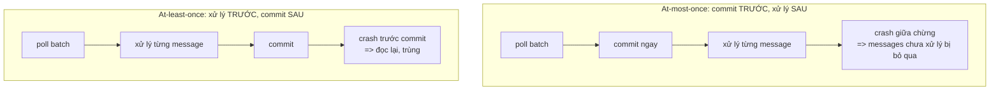

# Delivery Semantics: Vì Sao Đọc Lại Hay Mất Dữ Liệu Đều Do Điểm Commit Offsets

Part 2 (084) đã cho dữ liệu chảy: `poll()` → `IndexRequest` từng record → `_id` random. Nhưng code đó an toàn không? Crash giữa chừng thì mất hay trùng dữ liệu? Bài này dừng code một nhịp để trả lời câu hỏi nền cho cả Part 3, 4, 5: **delivery semantics** — và vì sao pipeline Kafka → OpenSearch chỉ nên nhắm at-least-once + idempotent.

---

## 1. Vấn đề: Commit Trước Hay Sau Khi Xử Lý Quyết Định Tất Cả

Consumer Kafka không tự biết "đã xử lý xong". Nó chỉ biết một con số: **committed offset** — vị trí lần cuối báo với broker "tôi đọc tới đây rồi". Khi consumer restart, nó đọc tiếp từ committed offset.

Vậy thứ tự giữa hai hành động — (A) xử lý dữ liệu (gửi email, ghi OpenSearch) và (B) commit offsets — sinh ra 3 số phận khác nhau:



Không có lựa chọn nào miễn phí. Chỉ có lựa chọn phù hợp với nghiệp vụ.

## 2. Cơ Chế: Ba Mức Đảm Bảo

### 2.1. At-most-once: mỗi message xử lý tối đa một lần (có thể mất)

Luồng: `poll(batch)` → `commit offsets` ngay → mới xử lý từng message (gửi email, ghi DB).

Kịch bản lỗi: xử lý được 3/5 messages thì consumer crash. Khi restart, broker bảo "offsets đã commit hết batch rồi, đọc batch mới đi". Hai messages chưa xử lý **mất vĩnh viễn**.

Đặc điểm:

* Không bao giờ trùng, nhưng có thể mất.
* Phù hợp: metrics, log giám sát, đếm view — nơi mất vài events chấp nhận được, còn trùng thì hại (trừ tiền 2 lần thì không).
* Cách tạo ra (vô tình): bật `enable.auto.commit=true` nhưng xử lý **bất đồng bộ** — gọi `poll()` tiếp khi batch cũ chưa xong, offsets tự commit đè lên.

### 2.2. At-least-once: mỗi message xử lý ít nhất một lần (có thể trùng)

Luồng: `poll(batch)` → xử lý hết batch → mới `commit offsets`.

Kịch bản lỗi: xử lý xong 5/5 nhưng crash **trước khi commit**. Restart đọc lại đúng batch đó, xử lý lại 5 messages. Trùng.

Đặc điểm:

* Không bao giờ mất, nhưng có thể trùng.
* Bắt buộc: xử lý phải **idempotent** (xử lý 2 lần cũng như 1 lần). Ghi đè cùng `_id` vào OpenSearch là idempotent; gửi email thì không.
* Đây là mode mặc định của code Part 2 khi xử lý **đồng bộ** + `enable.auto.commit=true`: vì `poll()` tiếp theo mới trigger commit ngầm, mà lúc đó batch cũ đã xử lý xong.

### 2.3. Exactly-once: mỗi message hiệu lực đúng một lần (giấc mơ có điều kiện)

Có hai loại, đừng lẫn:

* **Kafka → Kafka exactly-once**: khả thi và dễ, dùng Transactional API / Kafka Streams (producer transactions + `isolation.level=read_committed`). Broker phối hợp commit offsets và ghi topic đích trong một transaction.
* **Kafka → hệ ngoài (OpenSearch, DB, email) exactly-once**: không có transaction chung giữa Kafka và hệ ngoài. Muốn "đúng một lần thật" phải dùng chiêu **offsets lưu cùng data trong một transaction của DB đích** + `ConsumerRebalanceListener` + `seek()` tay — rất phức tạp, bài 087 sẽ nói vì sao không nên.

Thực tế ngành: pipeline Kafka → OpenSearch chuẩn là **at-least-once + idempotent consumer = effectively-once** (hiệu lực như đúng một lần). Người dùng search không thấy duplicate, dù bên dưới có đọc lại.

## 3. Code: Liên Hệ Trực Tiếp Với Part 2 Vừa Viết

Nhìn lại vòng lặp Part 2:

```java
while (true) {
    ConsumerRecords<String, String> records = consumer.poll(Duration.ofMillis(3000)); // (1)
    for (ConsumerRecord<String, String> record : records) {
        openSearchClient.index(new IndexRequest("wikimedia")  // (2) xử lý đồng bộ
            .source(record.value(), XContentType.JSON), RequestOptions.DEFAULT);
    }
    // (3) không commit tay — auto-commit ngầm khi poll() lần sau
}
```

* Vì (2) là đồng bộ (blocking, xong record này mới tới record khác) và (3) commit ngầm ở lần `poll()` sau, nên khi commit diễn ra thì batch cũ **đã xử lý xong** → đang ở at-least-once. Tốt.
* Nhưng `_id` đang random → xử lý lại là sinh document mới → **at-least-once mà không idempotent = duplicate thật**. Đây là lỗ hổng Part 3 (086) sẽ vá bằng `meta.id`.
* Nếu ai "tối ưu" bằng cách đẩy `index()` sang thread pool rồi `poll()` ngay (bất đồng bộ) mà vẫn auto-commit → rơi về at-most-once và mất dữ liệu khi crash. Bài 087 sẽ cấm pattern này.

## 4. Bảng So Sánh: Ba Semantics Trong Một Nhìn

| Tiêu chí | At-most-once | At-least-once (khuyên dùng) | Exactly-once (Kafka→Kafka) |
|---|---|---|---|
| Thứ tự | Commit → xử lý | Xử lý → commit | Transaction bao cả hai |
| Khi crash | Mất messages | Trùng messages | Không mất, không trùng |
| Cần idempotence? | Không | **Bắt buộc** | Broker lo |
| Cấu hình điển hình | Auto-commit + xử lý async (vô tình) | Auto-commit + xử lý sync, hoặc manual `commitSync()` sau batch | `enable.idempotence=true` + transactions + Streams |
| Dùng cho OpenSearch? | Không — mất log Wikimedia | **Có — kết hợp `_id` cố định** | Không áp dụng (đích không phải Kafka) |
| Độ phức tạp | Thấp | Trung bình | Cao |

Quy tắc ngón tay cái cho mọi pipeline bạn viết sau này:

> **Mặc định chọn at-least-once + idempotent. Chỉ chọn at-most-once khi nghiệp vụ chịu mất. Chỉ mơ exactly-once khi cả nguồn lẫn đích đều là Kafka.**

## 5. Pitfalls

* **Tưởng "commit rồi là xong".** Commit chỉ là báo vị trí đọc, không đảm bảo xử lý thành công. Commit sớm = mất, commit muộn = trùng. Phải chọn chủ động.
* **Tưởng at-least-once là đủ, quên idempotence.** At-least-once không idempotent thì chỉ là "trùng có đảm bảo". Pipeline Part 2 đang ở đúng trạng thái nguy hiểm này.
* **Tưởng exactly-once là bật một config.** Không có `delivery.semantics=exactly_once` cho Kafka → DB ngoài. Ai hứa thế là nhầm với Kafka Streams.
* **Trộn hai khái niệm idempotence.** `enable.idempotence=true` của **Producer** (chống trùng khi retry gửi) khác hoàn toàn idempotent **Consumer** (ghi đè cùng `_id` khi đọc lại). Section này cần cái thứ hai.
* **Test bằng cách kill -9 rồi kết luận "Kafka mất dữ liệu".** Kill giữa batch chưa commit thì đọc lại là đúng thiết kế at-least-once, không phải bug. Muốn không trùng thì vá consumer, đừng đổ cho broker.

## Kết Luận

Tóm một câu: **at-most-once commit trước xử lý sau nên mất; at-least-once xử lý trước commit sau nên trùng; pipeline Kafka → OpenSearch phải chọn at-least-once và tự làm idempotent để trùng mà như không.**

Bài tiếp theo (086 — Part 3) chúng ta vá đúng lỗ hổng đã chỉ ra: gắn `_id` cố định vào `IndexRequest` — trước bằng tọa độ Kafka `topic-partition-offset`, sau bằng `meta.id` trích từ JSON Wikimedia — để consumer thành idempotent và đạt effectively-once.
