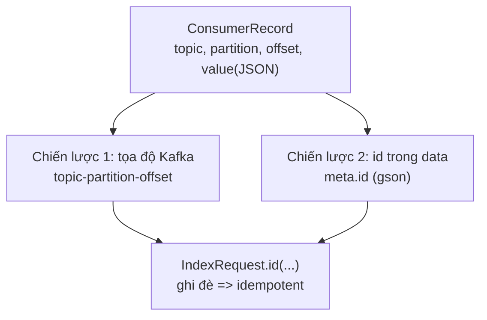

# OpenSearch Consumer Part 3: Làm Consumer Idempotent Với Document ID Cố Định

Bài trước (085) đã chỉ ra lỗ hổng chí mạng của Part 2: code đang at-least-once nhưng `_id` random nên đọc lại là duplicate thật. Bài này vá đúng chỗ đó — gắn `_id` cố định vào `IndexRequest` để ghi đè thay vì sinh mới. Đây là Part 3 trong chuỗi 6 parts: Part 1 nối client, Part 2 chảy data, Part 3 làm cho chảy lại cũng không bẩn.

---

## 1. Vấn đề: Vì Sao Đọc Lại Là Sinh Rác?

Nhắc lại code Part 2:

```java
IndexRequest indexRequest = new IndexRequest("wikimedia")
    .source(record.value(), XContentType.JSON); // không .id(...) => _id random
```

Mỗi lần `index()` là một `_id` random mới. Giờ tưởng tượng 2 kịch bản at-least-once rất thường gặp:

* Consumer crash sau khi ghi OpenSearch nhưng trước khi commit offsets → restart đọc lại batch → mỗi message thành **2 documents** giống hệt nhau, khác `_id`.
* Part 6 (091) cố ý reset offsets về quá khứ để replay → toàn bộ history thành duplicate.

Search `wikimedia` lúc đó trả về 2–3 bản copy của cùng một sự kiện sửa Wikipedia. Dashboard đếm sai, user thấy rác. Không thể chấp nhận.

Yêu cầu: cùng một Kafka message, dù ghi bao nhiêu lần, trong OpenSearch chỉ có **một document**. Đó chính là định nghĩa **idempotent consumer**.

## 2. Cơ Chế: Ghi Đè Theo `_id` — Vũ Khí Của Search Engine

Khác với Kafka append-only, OpenSearch cho phép ghi đè: `PUT /wikimedia/_doc/<id-cố-định>` lần 2 với cùng id sẽ **update tại chỗ** (`result: updated`, `_version` tăng), không sinh document mới. Bài 082 đã demo bằng tay.

Vậy toàn bộ bài toán idempotence rút gọn thành: **chọn `_id` nào để cùng một message luôn ra cùng một id?** Có 2 chiến lược:



| Chiến lược | Cách tạo id | Ưu | Nhược |
|---|---|---|---|
| 1. Tọa độ Kafka | `record.topic() + "-" + record.partition() + "-" + record.offset()` | Luôn có, mọi topic đều dùng được, không cần parse JSON | Id vô nghĩa với nghiệp vụ; đổi topic/repartition là id đổi; 2 pipeline khác nhau ghi cùng index dễ đụng |
| 2. Id trong data (`meta.id`) | `JsonParser.parseString(value).getAsJsonObject().getAsJsonObject("meta").get("id").getAsString()` | Id nghiệp vụ thật, stable kể cả replay cross-topic; search/debug dễ | Phải parse JSON mỗi record; phụ thuộc schema nguồn (mất field là vỡ); Wikimedia còn field `id` lẻ khác hay thiếu nên phải lấy đúng `meta.id` |

Khuyên dùng **chiến lược 2** cho pipeline này, giữ chiến lược 1 làm fallback khi data không có id. Code mẫu triển khai cả hai để bạn thấy tiến hóa, nhưng bản cuối chốt chiến lược 2.

## 3. Code: Từ Tọa Độ Kafka Đến `extractId()`

### 3.1. Chiến lược 1 — id từ tọa độ (hiểu trong 1 phút)

```java
String id = record.topic() + "-" + record.partition() + "-" + record.offset();

IndexRequest indexRequest = new IndexRequest("wikimedia")
    .source(record.value(), XContentType.JSON)
    .id(id); // <-- thêm đúng một dòng này
```

Giải thích: cặp `(topic, partition, offset)` là duy nhất toàn cluster — không bao giờ có 2 messages cùng tọa độ. Gắn nó làm `_id` thì đọc lại message nào cũng ra đúng `_id` đó → ghi đè. Chạy thử, log `response.getId()` giờ in ra dạng `wikimedia.recentchange-0-12345` thay vì random — nhìn là biết idempotent đã bật.

Nhược điểm để bạn cảm nhận: `_id` này không nói lên gì về sự kiện Wikipedia (ai sửa bài nào?). Replay từ topic khác / compact lại là id đổi. Nên chỉ dùng tạm.

### 3.2. Chiến lược 2 — id từ `meta.id` trong JSON (bản chốt)

Mở một document Wikimedia trong Dev Tools (`GET /wikimedia/_doc/<id-random-cũ>`), bạn sẽ thấy cấu trúc:

```json
{
  "meta": { "id": "a1b2c3-...", "dt": "2026-...", "domain": "en.wikipedia.org" },
  "id": 123456789,
  "type": "edit",
  "title": "Some Article",
  "user": "..."
}
```

Lưu ý bẫy: có **hai** trường tên na ná — `meta.id` (chuỗi UUID, luôn có) và `id` gốc (số, **không phải message nào cũng có**). Kinh nghiệm khóa học: luôn lấy `meta.id`. Lấy nhầm `id` gốc thì gặp message thiếu field là `NullPointerException`.

Hàm trích id bằng gson (đã khai dependency từ bài 079):

```java
private static String extractId(String json) {
    return JsonParser.parseString(json)
        .getAsJsonObject()
        .getAsJsonObject("meta")   // xuống 1 cấp: { "id": ..., "dt": ... }
        .get("id")                 // lấy field "id" trong "meta"
        .getAsString();            // vì nó là chuỗi
}
```

Nhớ import đúng `com.google.gson.JsonParser` (gson), không lẫn với Jackson hay `javax.json`.

Vòng lặp Part 2 giờ thành:

```java
for (ConsumerRecord<String, String> record : records) {
    try {
        String id = extractId(record.value()); // chiến lược 2, thay tọa độ

        IndexRequest indexRequest = new IndexRequest("wikimedia")
            .source(record.value(), XContentType.JSON)
            .id(id);

        IndexResponse response = openSearchClient.index(indexRequest, RequestOptions.DEFAULT);
        log.info("Inserted document with id " + response.getId());
    } catch (Exception e) {
        log.error("Failed to index record", e);
    }
}
```

Giải thích thay đổi duy nhất: thêm 2 dòng (trích id + `.id(id)`). Còn lại giữ nguyên — vẫn ghi đơn lẻ, vẫn auto-commit. Part 4, 5 mới đụng tới commit và bulk.

### 3.3. Kiểm chứng idempotence bằng mắt

1. Run consumer, ghi lại vài `_id` trong log (giờ là dạng UUID của `meta.id`, đẹp và có nghĩa).
2. Stop consumer khi offsets **chưa kịp commit** (hoặc chủ động reset về quá khứ như Part 6).
3. Run lại → log in ra **đúng các `_id` cũ**.
4. Dev Tools kiểm tra:

```
GET /wikimedia/_doc/<một-id-cũ>
```

Phải thấy `_version: 2` (hoặc cao hơn) với `result: updated` trong lần ghi sau — chứng tỏ ghi đè, không sinh mới. Đếm tổng docs (`GET /wikimedia/_count`) trước và sau khi đọc lại phải **không tăng**.

## 4. Bảng So Sánh: Trước Và Sau Part 3

| Tiêu chí | Part 2 (trước) | Part 3 (sau) |
|---|---|---|
| `_id` | Random mỗi lần ghi | Cố định theo `meta.id` |
| Đọc lại batch | Duplicate 100% | Ghi đè, không tăng docs |
| Replay Part 6 | Thảm họa | An toàn tuyệt đối |
| Semantics hiệu lực | At-least-once (trùng thật) | At-least-once + idempotent = **effectively-once** |
| Giá phải trả | Không | Parse JSON mỗi record (rẻ so với 1 HTTP call) |

Từ "effectively-once" cần hiểu đúng: bên dưới vẫn có thể đọc và ghi lại, nhưng người dùng search chỉ thấy **một** bản ghi đúng nhất. Với sink ngoài Kafka, đây là đích thực tế cao nhất — đừng mơ exactly-once kiểu transaction.

## 5. Pitfalls

* **Lấy nhầm `id` gốc thay vì `meta.id`.** Field `id` gốc thiếu ở một số message → NPE crash vòng lặp. Luôn `getAsJsonObject("meta").get("id")`.
* **Import sai `JsonParser`.** IDE gợi ý nhiều `JsonParser` (Jackson, Kafka...). Phải là `com.google.gson.JsonParser` — đúng cái đã khai trong `build.gradle`.
* **Tưởng gắn `.id()` là xong, bỏ try-catch.** Message JSON vỡ (Wikimedia thỉnh thoảng gửi payload lạ) làm `parseString` ném exception. Giữ try-catch quanh từng record như mẫu để một message xấu không giết cả batch.
* **Dùng tọa độ Kafka rồi replay cross-topic và ngạc nhiên vì duplicate.** Tọa độ gắn với topic-partition-offset cụ thể. Đổi topic là đổi id. Đó là lý do bản chốt dùng `meta.id` nghiệp vụ.
* **Đo hiệu năng rồi kết luận "parse JSON làm chậm".** Một lần parse gson ~microseconds, một lần `index()` HTTP ~milliseconds. Nút cổ chai là HTTP đơn lẻ — Part 5 (bulk) mới giải quyết, không phải bỏ id.

## Kết Luận

Tóm một câu: **Part 3 đã biến consumer thành idempotent bằng một dòng `.id(meta.id)` — đọc lại bao nhiêu lần cũng chỉ ghi đè, đạt effectively-once.**

Bài tiếp theo (087) chúng ta dừng code một nhịp để học **commit strategies**: `enable.auto.commit=true` + xử lý đồng bộ thì an toàn tới đâu, khi nào phải tắt auto-commit và gọi `commitSync()` tay — nền tảng để Part 4 (088) chuyển sang manual commit có kiểm soát.
