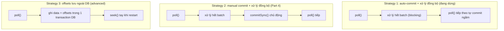

# Chiến Lược Commit Offsets: Auto Hay Manual Và Cái Giá Của Mỗi Lựa Chọn

Part 3 (086) đã làm consumer idempotent bằng `meta.id` — đọc lại cũng chỉ ghi đè. Nhưng ai quyết định "đọc lại từ đâu"? Chính là **offset commit**. Bài này dừng code một nhịp để mổ 2 chiến lược commit thực tế + 1 chiến lược nâng cao chỉ nên đọc cho biết — nền để Part 4 (088) chuyển sang manual commit có kiểm soát.

---

## 1. Vấn đề: Commit Sai Thời Điểm Là Mất Hoặc Trùng

Nhắc lại nguyên lý từ bài 085: committed offset là "vạch xuất phát" sau mỗi lần restart. Câu hỏi duy nhất là commit **khi nào** so với xử lý:

* Commit trước khi xử lý xong → crash là mất (at-most-once).
* Xử lý xong mới commit → crash là trùng (at-least-once, chấp nhận được vì đã idempotent).

Consumer API cho bạn 2 công tắc để điều khiển việc này: `enable.auto.commit` và `commitSync()/commitAsync()` tay. Kết hợp sai là ra bug khó phát hiện nhất trong pipeline — vì bug chỉ lộ khi crash, mà crash thì hiếm khi test.



## 2. Cơ Chế: Auto-Commit Thực Ra Chạy Thế Nào?

### 2.1. Strategy 1 — `enable.auto.commit=true` + xử lý đồng bộ (code Part 2-3)

Đây là cấu hình bạn đang chạy mà không hề set tường minh, vì mặc định Kafka đã là:

```java
props.setProperty(ConsumerConfig.ENABLE_AUTO_COMMIT_CONFIG, "true");
props.setProperty(ConsumerConfig.AUTO_COMMIT_INTERVAL_MS_CONFIG, "5000");
```

Cơ chế đằng sau `poll()`:

1. Lần `poll()` thứ N trả về batch, bạn xử lý blocking hết batch.
2. Đồng hồ 5 giây (`auto.commit.interval.ms`) chạy ngầm.
3. Lần `poll()` thứ N+1 được gọi: client kiểm tra "đã quá 5 giây từ lần commit cuối chưa?" — nếu rồi thì **bất đồng bộ** commit offsets của batch N (offsets của lần `poll()` trước).

Hệ quả quan trọng:

* Nếu xử lý batch N xong **trước** lần `poll()` tiếp theo → commit phản ánh đúng "đã xong" → at-least-once chuẩn.
* Nếu xử lý batch N **chưa xong** mà đã gọi `poll()` tiếp (xử lý bất đồng bộ, bắn sang thread pool rồi poll luôn) → offsets của messages chưa xử lý vẫn bị commit → at-most-once, mất dữ liệu khi crash.
* Commit là async ngầm — bạn không biết commit thành công hay thất bại, không log được, không retry được.

Vì sao Strategy 1 vẫn OK cho Part 2-3? Vì code mẫu xử lý **đồng bộ tuyệt đối**: `for record : records { index() blocking }`, xong hết mới `poll()` tiếp. Chừng nào giữ kỷ luật này, auto-commit là an toàn và đơn giản nhất.

Minh họa timeline với `auto.commit.interval.ms=5000`:

```
t=0s   poll() batch A (100 records) → xử lý 2s xong
t=2s   poll() batch B → chưa đủ 5s, chưa commit
t=4s   poll() batch C → đã 4s, chưa commit
t=7s   poll() batch D → đã quá 5s → commit ngầm offsets của batch C
```

Timer reset sau mỗi lần commit. Lag trên Conduktor vì thế tụt theo "bậc thang" 5 giây một — đúng hiện tượng Part 4 sẽ demo.

### 2.2. Strategy 2 — `enable.auto.commit=false` + `commitSync()` tay (Part 4 sẽ làm)

```java
props.setProperty(ConsumerConfig.ENABLE_AUTO_COMMIT_CONFIG, "false");
// ...
while (true) {
    ConsumerRecords<String, String> records = consumer.poll(Duration.ofMillis(3000));
    // xử lý hết batch: bulk vào OpenSearch
    if (!records.isEmpty()) {
        // ... bulkRequest ...
        consumer.commitSync(); // <-- chủ động, đồng bộ, biết chắc thành công
        log.info("Offsets have been committed!");
    }
}
```

Khác biệt căn bản với Strategy 1:

* **Bạn quyết định điểm commit**, không phải timer 5 giây. Logic chuẩn: commit **sau khi toàn bộ batch đã ghi OpenSearch thành công**.
* `commitSync()` là blocking: chờ broker xác nhận mới đi tiếp. Chậm hơn auto (async ngầm) nhưng chắc chắn — thất bại là ném exception để retry.
* Có biến thể `commitAsync()` không blocking, nhanh hơn nhưng không retry và callback phức tạp. Khóa học chốt `commitSync()` cho dễ học; production batch lớn có thể cân nhắc async + callback.
* Vẫn phải giữ xử lý đồng bộ. Manual commit không cứu được code async cẩu thả.

Khi nào bắt buộc chuyển sang Strategy 2? Khi batch của bạn có "điều kiện sẵn sàng" riêng: gom đủ 1000 records mới flush, hoặc buffer theo thời gian, hoặc chỉ commit khi `BulkResponse` không lỗi. Auto-commit theo timer mù không diễn tả được điều kiện đó — phải commit tay.

### 2.3. Strategy 3 — Lưu offsets ngoài, transaction chung với data (chỉ đọc cho biết)

Ý tưởng: không lưu offsets vào topic `__consumer_offsets` của Kafka nữa, mà lưu **cùng bảng với dữ liệu** trong DB đích, trong **một transaction**:

```
BEGIN;
  INSERT INTO events (...) VALUES (...);
  INSERT INTO kafka_offsets (group, partition, offset) VALUES (...) ON CONFLICT UPDATE;
COMMIT;
```

Khi restart, consumer `seek()` tay tới offsets đọc từ DB. Vì data và offsets commit nguyên tử, crash giữa chừng thì cả hai cùng rollback → đạt exactly-once thật sự với sink ngoài.

Vì sao bài này **không demo** và khuyên bạn đừng làm vội?

* Phải tự implement `ConsumerRebalanceListener` (xử lý khi partitions bị thu hồi/chia lại), tự `seek()`, tự quản schema bảng offsets.
* Chỉ DB có transaction mới làm được (Postgres, MySQL). OpenSearch không có transaction đa-document kiểu này.
* Code phức tạp gấp 5 lần, test rebalance cực khổ. Sai một dòng là mất hoặc kẹt consumer.

Ghi nhớ sự tồn tại của nó để đi phỏng vấn senior không bỡ ngỡ, nhưng pipeline OpenSearch cứ dừng ở Strategy 2 + idempotent là đủ — đó chính là best practice ngành.

## 3. Code: Đối Chiếu 3 Chiến Lược Trên Cùng Một Vòng Lặp

Để thấy khác biệt, đặt 3 phiên bản cạnh nhau (giả sử đã có `records` từ `poll()`):

```java
// Strategy 1: auto-commit + sync (Part 2-3 hiện tại — không thêm dòng nào)
while (true) {
    ConsumerRecords<String, String> records = consumer.poll(Duration.ofMillis(3000));
    for (ConsumerRecord<String, String> r : records) {
        openSearchClient.index(new IndexRequest("wikimedia")
            .source(r.value(), XContentType.JSON).id(extractId(r.value())),
            RequestOptions.DEFAULT);
    }
    // poll() lần sau tự commit ngầm
}
```

```java
// Strategy 2: manual commit + sync (Part 4 sắp làm)
props.setProperty(ConsumerConfig.ENABLE_AUTO_COMMIT_CONFIG, "false");
while (true) {
    ConsumerRecords<String, String> records = consumer.poll(Duration.ofMillis(3000));
    if (records.isEmpty()) continue;
    for (ConsumerRecord<String, String> r : records) {
        // ... index hoặc gom bulk ...
    }
    consumer.commitSync(); // commit sau khi batch xong
}
```

```java
// Strategy 3: offsets ngoài (minh họa ý tưởng, KHÔNG chạy với OpenSearch)
// while (true) {
//     records = consumer.poll(...);
//     db.begin();
//     db.insertEvents(records);
//     db.insertOffsets(records); // cùng transaction
//     db.commit();
// }
```

Ba phiên bản chỉ khác **vị trí và chủ thể của commit**, còn `poll()` + xử lý đồng bộ giữ nguyên. Đó là điểm mấu chốt: kỷ luật sync là nền, commit tay là mái.

## 4. Bảng So Sánh: Chọn Chiến Lược Nào Cho Pipeline Nào?

| Tiêu chí | Strategy 1: auto + sync | Strategy 2: manual + sync (khuyên dùng khi nghiêm túc) | Strategy 3: offsets ngoài |
|---|---|---|---|
| `enable.auto.commit` | `true` (mặc định) | `false` | `false` |
| Ai commit | Timer 5s + `poll()` | Bạn gọi `commitSync()` | Transaction DB |
| Biết commit lỗi không | Không | Có (exception) | Có (rollback) |
| Điều kiện commit tùy biến | Không | Có (đủ batch, bulk OK...) | Có |
| Semantics đạt được | At-least-once nếu sync | At-least-once kiểm soát chặt | Exactly-once (nếu DB có TX) |
| Độ phức tạp | Thấp nhất | Trung bình | Rất cao |
| Dùng cho OpenSearch? | Được khi học (Part 2-3) | **Nên — từ Part 4 trở đi** | Không (OpenSearch không có TX đa-doc) |
| Lỗi điển hình | Async hóa xử lý mà quên → mất | Commit trong vòng lặp rỗng / quên check `BulkResponse` lỗi | Quên `RebalanceListener` → kẹt offsets |

Quy tắc chọn nhanh:

* Học, prototype, consumer đơn giản → Strategy 1 + giữ sync tuyệt đối.
* Production Kafka → OpenSearch/DB, cần log commit, cần flush theo batch → Strategy 2.
* Ngân hàng, trừ tiền, đếm đúng 1 lần với DB relational → mới nghĩ tới Strategy 3.

## 5. Pitfalls

* **Bật auto-commit nhưng xử lý async.** Đây là cách phổ biến nhất để vô tình rơi vào at-most-once: bắn records sang ExecutorService rồi `poll()` ngay, timer commit đè lên messages chưa xong. Muốn async thật thì phải manual commit + tracking offsets tay từng partition — vượt scope section này.
* **Manual commit nhưng đặt sai chỗ.** `commitSync()` trong `for` từng record (chậm chết) hoặc ngoài `while` (không bao giờ chạy). Đúng: **sau khi cả batch xử lý thành công**, ngoài vòng `for` nhưng trong `while`.
* **Commit batch rỗng liên tục.** `commitSync()` khi `records.count()==0` không sai nhưng log "committed" spam và tốn RPC. Check `isEmpty()` trước như mẫu Part 4.
* **Nhầm `commitSync` với "đảm bảo OpenSearch đã ghi".** `commitSync` chỉ báo broker "tôi đọc tới đây". Nếu bulk OpenSearch thất bại mà vẫn commit là mất. Luôn check `BulkResponse.hasFailures()` trước khi commit (Part 5 nhắc lại).
* **Đổi `auto.commit.interval.ms` xuống 100ms tưởng "an toàn hơn".** Commit dày chỉ tăng tải `__consumer_offsets`, không tăng an toàn nếu xử lý vẫn async. An toàn đến từ thứ tự xử lý→commit, không phải tần suất.
* **Nghe "Strategy 3 exactly-once" rồi áp vào OpenSearch.** OpenSearch không có transaction bao cả data + offsets. Cố ép là tự lừa mình.

## Kết Luận

Tóm một câu: **giữ xử lý đồng bộ là nền, chọn auto-commit khi đơn giản, chuyển manual `commitSync()` sau batch khi cần kiểm soát — và để exactly-once ngoài-Kafka cho DB có transaction, không phải OpenSearch.**

Bài tiếp theo (088 — Part 4) chúng ta biến lý thuyết thành code: tắt `enable.auto.commit`, thêm `commitSync()` sau mỗi batch, quan sát lag tụt theo nhịp commit chủ động và xác nhận pipeline ở at-least-once có kiểm soát.
