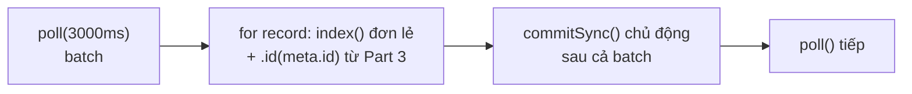

# OpenSearch Consumer Part 4: Tắt Auto-Commit, Tự Commit Bằng commitSync Để At-Least-Once Thật Sự

Part 3 (086) đã cho consumer khả năng ghi đè idempotent bằng `meta.id`. Bài lý thuyết 087 đã chỉ khi nào auto-commit đủ tốt và khi nào phải commit tay. Bài này — Part 4 trong chuỗi 6 parts — biến lý thuyết thành code: tắt `enable.auto.commit`, gọi `commitSync()` sau mỗi batch và nhìn lag tụt theo nhịp mình kiểm soát.

---

## 1. Vấn đề: Auto-Commit Chạy Ngầm Thì Biết Đường Nào Mà Lần?

 Nhắc lại code Part 2–3: không hề set `enable.auto.commit`, nghĩa là đang chạy mặc định `true` + `auto.commit.interval.ms=5000`. Quan sát trên Conduktor sẽ thấy lag tụt theo "bậc thang" 5 giây một:

```
chạy consumer... 1, 2, 3, 4, 5 → lag tụt một nấc
1, 2, 3, 4, 5 → lag tụt tiếp
```

Đó là timer ngầm + lần `poll()` tiếp theo trigger commit. Vấn đề:

* Bạn không quyết định điểm commit — timer quyết.
* Bạn không biết commit thành công hay thất bại — vì nó async ngầm, không exception, không log.
* Bạn không diễn tả được điều kiện "chỉ commit khi cả batch đã ghi OpenSearch xong" — timer mù không hiểu bulk có lỗi hay không.

Muốn pipeline nghiêm túc (log được "offsets committed", chỉ commit khi bulk OK), phải chuyển sang manual. Part 4 làm đúng việc đó, chưa đụng tới bulk — vẫn ghi đơn lẻ để bạn thấy rõ commit tách khỏi hiệu năng.



## 2. Cơ Chế: Hai Chế Độ Commit Đối Đầu Nhau

| Tiêu chí | Auto-commit (Part 2–3) | Manual commit (Part 4 này) |
|---|---|---|
| Config | `enable.auto.commit=true` (mặc định), `auto.commit.interval.ms=5000` | `enable.auto.commit=false`, gọi `consumer.commitSync()` tay |
| Ai trigger | Lần `poll()` tiếp theo, nếu đã quá 5s từ lần cuối | Dòng code của bạn, sau khi batch xong |
| Blocking? | Không (async ngầm) | Có — chờ broker ack mới đi tiếp |
| Biết lỗi? | Không | Có — ném exception để retry/log |
| Điều kiện tùy biến | Không | Có — `if (!records.isEmpty())`, check bulk OK... |

Thí nghiệm then chốt để khắc sâu (làm đúng theo thứ tự này):

1. Giữ auto-commit, chạy consumer → lag tụt bậc thang 5s.
2. Đổi `enable.auto.commit=false`, chạy lại, **không thêm `commitSync()`** → consumer vẫn `Received 500 records`, vẫn ghi OpenSearch, đã đuổi tới cuối topic (`Received 0`) nhưng refresh Conduktor thấy **lag đứng yên không giảm**. Vì sao? Vì không ai báo broker "tôi đọc tới đây rồi".
3. Stop + run lại → consumer **đọc lại toàn bộ từ đầu** (reprocessing). Đây là at-least-once thô bạo nhất — may mà Part 3 đã idempotent nên không sinh duplicate, chỉ tốn công.
4. Thêm `commitSync()` → lag về 0, restart không đọc lại.

Thí nghiệm số 2–3 là cách nhanh nhất để hiểu commit là gì: không commit thì broker mãi tưởng bạn chưa đọc.

## 3. Code: Ba Dòng Thay Đổi, Một Hành Vi Đổi Hẳn

Giữ nguyên toàn bộ Part 1–3 (`createOpenSearchClient()`, `createKafkaConsumer()`, `extractId()`). Chỉ sửa 3 chỗ.

### 3.1. Tắt auto-commit trong `createKafkaConsumer()`

```java
props.setProperty(ConsumerConfig.GROUP_ID_CONFIG, "consumer-opensearch-demo");
props.setProperty(ConsumerConfig.AUTO_OFFSET_RESET_CONFIG, "latest");
// THÊM / SỬA:
props.setProperty(ConsumerConfig.ENABLE_AUTO_COMMIT_CONFIG, "false");
// (Trước đây không set => mặc định "true". Giờ tắt显式.)
```

Giải thích: một dòng duy nhất nhưng đảo chủ quyền commit từ timer sang code của bạn. Từ đây mọi `poll()` không còn commit ngầm nữa. Quên dòng này mà vẫn gọi `commitSync()` thì code vẫn chạy (commit thừa, vô hại) nhưng bạn tưởng mình manual mà thực ra auto vẫn chạy nền — bug hiểu nhầm khó phát hiện. Luôn set tường minh `false`.

`auto.commit.interval.ms=5000` giờ vô nghĩa — có để cũng không ai đọc. Đừng xóa cũng được, nhưng hiểu là nó chỉ có tác dụng khi auto-commit bật.

### 3.2. `commitSync()` sau khi cả batch ghi xong

```java
while (true) {
    ConsumerRecords<String, String> records = consumer.poll(Duration.ofMillis(3000));
    log.info("Received " + records.count() + " record(s)");

    for (ConsumerRecord<String, String> record : records) {
        try {
            String id = extractId(record.value()); // từ Part 3
            IndexRequest indexRequest = new IndexRequest("wikimedia")
                .source(record.value(), XContentType.JSON)
                .id(id);
            IndexResponse response = openSearchClient.index(indexRequest, RequestOptions.DEFAULT);
            // Part 4: comment bớt log từng id cho đỡ spam, chỉ giữ khi debug
            // log.info("Inserted document with id " + response.getId());
        } catch (Exception e) {
            log.error("Failed to index record", e);
        }
    }

    // MỚI: commit sau khi toàn bộ batch đã xử lý
    if (!records.isEmpty()) {
        consumer.commitSync();
        log.info("Offsets have been committed!");
    }
}
```

Giải thích từng quyết định:

* **Vị trí: ngoài vòng `for`, trong vòng `while`.** Commit theo batch, không theo từng record (gọi trong `for` thì mỗi record một RPC commit — chậm chết) và không ngoài `while` (không bao giờ chạy).
* **`if (!records.isEmpty())`.** Batch rỗng thì không có gì để commit — gọi vẫn đúng nhưng spam log "committed!" và tốn một RPC vô ích mỗi 3 giây. Check này là hygiene cơ bản.
* **`commitSync()` chứ không phải `commitAsync()`.** Sync blocking, chờ broker ack, thất bại ném exception — dễ học, dễ debug. Async nhanh hơn nhưng phải xử lý callback + không retry — để production nâng cao.
* **Comment bớt `log.info(response.getId())`.** Khi batch 500 records mà log từng id thì console ngập, khó thấy dòng "committed!". Giữ log batch-level (`Received N`, `committed!`) khi chạy ổn định; mở log id-level khi cần debug một document cụ thể.
* **Thứ tự xử lý → commit là at-least-once có kiểm soát.** Crash sau khi ghi OpenSearch nhưng trước `commitSync()` → đọc lại → ghi đè idempotent (Part 3 cứu). Crash sau commit → không đọc lại. Không còn cửa nào mất dữ liệu như at-most-once.

### 3.3. Chạy thử và đọc tín hiệu đúng

1. Run consumer với code mới. Log mong đợi:

```
Received 500 record(s)
Offsets have been committed!
Received 500 record(s)
Offsets have been committed!
Received 0 record(s)
Received 0 record(s)
```

Nhịp `Received → committed` 1:1 là đạt. Nếu thấy `Received 0` mà vẫn "committed!" là bạn quên `isEmpty()` check.

2. Conduktor → Consumer Groups → `consumer-opensearch-demo` → Refresh. Lag về **0** và đứng yên khi `Received 0`. Đối chiếu với thí nghiệm tắt auto mà chưa commit (lag đứng ở số lớn) để cảm nhận khác biệt.
3. Stop + run lại → log ra `Received 0` ngay, không đọc lại hàng nghìn records như trước. Chứng tỏ offsets đã được ghi nhận.

## 4. Bảng So Sánh: Trước Và Sau Part 4

| Khía cạnh | Part 3 (auto-commit) | Part 4 (manual commitSync) |
|---|---|---|
| `enable.auto.commit` | `true` (ngầm) | `false` (tường minh) |
| Lag tụt theo | Timer 5s | Nhịp batch của bạn |
| Log commit | Không có | `Offsets have been committed!` sau mỗi batch non-empty |
| Biết commit lỗi? | Không | Có (exception) |
| Restart sau khi đuổi kịp | Có thể đọc lại nếu timer chưa kịp commit | Không đọc lại (đã sync) |
| Giá phải trả | Không | Mỗi batch thêm 1 RPC blocking (~vài ms) |
| Semantics | At-least-once (nhờ sync + idempotent) | At-least-once **kiểm soát chặt** (cùng điều kiện, thêm quan sát được) |

Đừng nhầm manual commit với "nhanh hơn" — nó chậm hơn một chút (blocking) để đổi lấy quan sát được và điều kiện hóa được. Hiệu năng thật sự đến từ Part 5 (bulk), không phải từ commit.

## 5. Pitfalls

* **Tắt auto mà quên thêm `commitSync()`.** Triệu chứng: consumer chạy ngon, ghi đủ data, nhưng lag mãi không giảm, restart đọc lại từ đầu. Gặp đúng triệu chứng này thì nghĩ tới commit đầu tiên, đừng nghi OpenSearch.
* **Gọi `commitSync()` trong vòng `for` từng record.** Chạy đúng nhưng throughput sập (500 records = 500 RPC commit + 500 RPC index). Commit là thao tác batch-level.
* **Commit batch rỗng.** Không sai nhưng spam log + tốn RPC. Luôn `if (!records.isEmpty())`.
* **Commit trước khi xử lý xong (đảo thứ tự).** `commitSync()` ngay sau `poll()` rồi mới `for` index → at-most-once tự tạo: crash giữa batch là mất. Thứ tự bắt buộc: poll → xử lý hết → commit.
* **Stop bằng nút đỏ rồi kết luận "manual commit vẫn đọc lại".** Nút đỏ kill giữa batch chưa commit thì đọc lại là đúng thiết kế at-least-once. Muốn shutdown sạch không đọc lại thừa thì cần hook ở Part 6 (091).
* **Tưởng `commitSync()` đảm bảo OpenSearch đã ghi.** Không — nó chỉ báo broker vị trí đọc. Nếu `BulkResponse` báo lỗi mà vẫn commit là mất. Part 5 sẽ thêm check `hasFailures()` trước commit.

## Kết Luận

Tóm một câu: **Part 4 đã giành quyền commit về tay mình — `enable.auto.commit=false` + `commitSync()` sau mỗi batch non-empty — để lag tụt theo nhịp code, restart không đọc lại thừa và pipeline ở at-least-once có kiểm soát.**

Bài tiếp theo (089 — Part 5) chúng ta giữ nguyên commit này nhưng thay "động cơ": gom cả batch thành một `BulkRequest` thay vì `index()` từng record — từ vài chục docs/s lên hàng trăm docs/s, và đó mới là bước nhảy hiệu năng thật sự.
