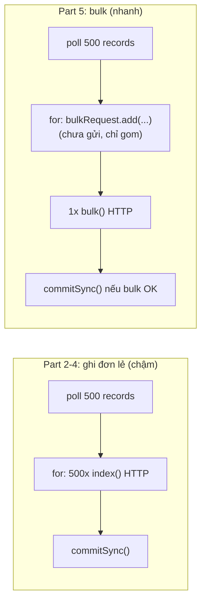

# OpenSearch Consumer Part 5: Gom Batch Với BulkRequest Để Nhanh Gấp Chục Lần

Part 4 (088) đã giành quyền commit về tay mình: `enable.auto.commit=false` + `commitSync()` sau batch. Nhưng mỗi batch 500 records vẫn là 500 HTTP calls `index()` đơn lẻ + 1 call commit. Bài này — Part 5 trong chuỗi 6 parts — thay "động cơ": gom cả batch thành **một `BulkRequest`**, từ vài chục docs/s lên hàng trăm docs/s mà không đổi semantics.

---

## 1. Vấn đề: Ghi Đơn Lẻ Là Nút Cổ Chai Lớn Nhất

Đoán nhanh bài toán: `poll()` trả 500 records, vòng `for` gọi `openSearchClient.index()` 500 lần. Mỗi lần là một HTTP round-trip (serialize JSON → gửi → chờ ack → parse response). Giả sử mỗi call 10ms thì một batch mất **5 giây chỉ cho HTTP**, chưa kể `commitSync()`. Producer Wikimedia bắn liên tục thì consumer mãi đuổi không kịp — lag trên Conduktor tăng dần đều.

Trong khi đó OpenSearch sinh ra `POST /_bulk` để giải đúng bài này: **một HTTP call mang nhiều actions**. 500 actions trong 1 call (~200–500ms) thay vì 500 calls (~5 giây). Nhanh gấp chục lần mà code chỉ thêm ~15 dòng.



Lưu ý: Part 5 **không đổi** commit strategy (vẫn manual sau batch) và **không đổi** idempotence (mỗi action vẫn `.id(meta.id)`). Chỉ đổi cách vận chuyển.

## 2. Cơ Chế: `BulkRequest` Gom Actions Rồi Flush Một Lần

Tư duy đúng về bulk:

* `BulkRequest` là một cái "giỏ": `bulkRequest.add(indexRequest)` chỉ bỏ action vào giỏ, **chưa gửi gì cả**.
* Hết vòng `for` mới `openSearchClient.bulk(bulkRequest, DEFAULT)` — một HTTP call duy nhất mang cả giỏ đi.
* Response là `BulkResponse`: chứa kết quả từng item. Phải check `hasFailures()` — một action lỗi (JSON xấu, mapping conflict) không làm cả bulk fail, các action khác vẫn ghi. Nếu bỏ qua check mà cứ `commitSync()` là mất những records lỗi đó.

Hai chi tiết API dễ sai:

* Chỉ gọi `bulk()` khi giỏ **non-empty** (`numberOfActions() > 0`). Gọi bulk rỗng ném exception.
* `Thread.sleep(1000)` trong code mẫu **không phải best practice production** — nó chỉ là mẹo demo: nghỉ 1 giây mỗi vòng để batch sau gom được nhiều records hơn (dễ thấy "500 records/batch" trong log) và để dashboard lag kịp cập nhật. Production tuning thật dùng `max.poll.records`, `fetch.min.bytes` (bài 092), không dùng sleep.

## 3. Code: Từ Vòng `index()` Sang Gom Bulk

Giữ nguyên Part 1–4 (`createOpenSearchClient()`, `createKafkaConsumer()` với `enable.auto.commit=false`, `extractId()`). Chỉ thay thân vòng `while`.

### 3.1. Thân vòng lặp mới — gom rồi flush

```java
while (true) {
    ConsumerRecords<String, String> records = consumer.poll(Duration.ofMillis(3000));

    int recordCount = records.count();
    log.info("Received " + recordCount + " record(s)");

    BulkRequest bulkRequest = new BulkRequest(); // giỏ rỗng mỗi vòng

    for (ConsumerRecord<String, String> record : records) {
        try {
            String id = extractId(record.value()); // idempotence từ Part 3, giữ nguyên

            IndexRequest indexRequest = new IndexRequest("wikimedia")
                .source(record.value(), XContentType.JSON)
                .id(id);

            bulkRequest.add(indexRequest); // CHỈ GOM, chưa gửi
        } catch (Exception e) {
            log.error("Skipping bad record", e); // record xấu bỏ qua, không giết batch
        }
    }

    if (bulkRequest.numberOfActions() > 0) {
        BulkResponse bulkResponse = openSearchClient.bulk(bulkRequest, RequestOptions.DEFAULT);
        log.info("Inserted " + bulkResponse.getItems().length + " record(s).");

        if (bulkResponse.hasFailures()) {
            // Production: log chi tiết / đưa vào dead-letter / retry.
            // Demo: ít nhất đừng commit mù khi có failures.
            log.error("Bulk had failures: " + bulkResponse.buildFailureMessage());
        } else {
            consumer.commitSync(); // chỉ commit khi bulk sạch
            log.info("Offsets have been committed!");
        }

        // Mẹo demo: nghỉ 1s để vòng sau gom batch dày hơn, dễ quan sát lag tụt.
        try { Thread.sleep(1000); } catch (InterruptedException e) { Thread.currentThread().interrupt(); break; }
    }
}
```

Giải thích từng đoạn:

* `new BulkRequest()` **trong** `while`, ngoài `for`. Mỗi vòng một giỏ mới. Đặt nhầm ngoài `while` thì giỏ phình vô hạn qua các vòng, lặp lại actions cũ.
* Trong `for` không còn `openSearchClient.index(...)` — thay bằng `bulkRequest.add(...)`. Vòng `for` giờ chạy thuần CPU (parse + gom), hết trong milliseconds.
* `numberOfActions() > 0` guard: batch rỗng (`poll()` trả 0 khi đuổi kịp) thì bỏ qua, không gọi `bulk()`, không commit, không sleep. Đây là phiên bản bulk của `if (!records.isEmpty())` ở Part 4.
* `bulkResponse.getItems().length` cho log "Inserted N record(s)" — con số này khớp `records.count()` khi không có record xấu. Lệch nhau là tín hiệu có message bị skip.
* `hasFailures()` check là điểm mới quan trọng nhất về correctness: code gốc demo đôi khi commit mù sau bulk. Bản chuẩn phải **chỉ commit khi không failures**. Production còn đi xa hơn: lặp `getItems()`, với item nào `isFailed()` thì ghi dead-letter topic để xử lý sau — nhưng vượt scope demo.
* `Thread.sleep(1000)` đặt sau commit, trong nhánh non-empty. Hiểu đúng vai trò demo như mục 2. Xóa sleep là consumer chạy nhanh hơn nữa — thử để cảm nhận.

### 3.2. Chạy thử và đo tốc độ

1. Reset offsets về `earliest` để có backlog đo (Conduktor → consumer group → Reset Offsets → Earliest, hoặc CLI `kafka-consumer-groups.sh`). Lag hiện vài nghìn.
2. Run consumer Part 5. Log mong đợi:

```
Received 500 record(s).
Inserted 500 record(s).
Offsets have been committed!
Received 500 record(s).
Inserted 500 record(s).
Offsets have been committed!
```

Nhịp `Received N → Inserted N → committed!` gọn 3 dòng/batch, thay vì 500 dòng `Inserted document with id...` như Part 4.

3. Refresh Conduktor: lag tụt **vài nghìn mỗi chục giây** (có sleep) — nhanh gấp nhiều lần Part 4. Xóa `sleep` chạy lại: lag tụt gần như tức thì, chứng tỏ sleep chỉ là phanh demo.
4. Verify idempotence còn nguyên: stop giữa chừng + run lại (hoặc reset về quá khứ) → `_count` của index `wikimedia` **không tăng** sau khi đọc lại, vì mỗi action vẫn `.id(meta.id)`.

## 4. Bảng So Sánh: Đơn Lẻ vs Bulk

| Tiêu chí | Part 4: `index()` đơn lẻ | Part 5: `BulkRequest` (bản này) |
|---|---|---|
| HTTP calls / batch 500 | 500 + 1 commit | 1 + 1 commit |
| Throughput điển hình local | Vài chục docs/s | Vài trăm docs/s (có sleep) / hơn nữa khi bỏ sleep |
| Log | 500 dòng id/batch (spam) | 3 dòng/batch |
| Xử lý record xấu | try-catch từng record, skip | try-catch khi gom, skip trước khi gửi |
| Check lỗi ghi | Exception từng call | `BulkResponse.hasFailures()` (1 action lỗi không giết cả batch) |
| Điều kiện commit | Sau `for` | Sau bulk **sạch** (`!hasFailures()`) |
| Idempotence | `.id(meta.id)` từng request | `.id(meta.id)` từng action — giữ nguyên |
| Semantics | At-least-once + idempotent | **Không đổi** — bulk chỉ đổi vận chuyển |

Ghi nhớ: bulk là tối ưu **throughput**, không phải tối ưu **semantics**. Ai bảo "dùng bulk là exactly-once" là nhầm tầng.

## 5. Pitfalls

* **Tạo `BulkRequest` ngoài vòng `while`.** Giỏ tích lũy qua các vòng, gửi lại actions cũ → ghi thừa (may idempotent nên không duplicate, nhưng tốn băng thông và log sai số).
* **Gọi `bulk()` với giỏ rỗng.** Ném exception. Luôn guard `numberOfActions() > 0`.
* **Commit mù khi `hasFailures()==true`.** Records lỗi chưa vào OpenSearch nhưng offsets đã tiến → mất. Luôn check failures trước commit; ít nhất log `buildFailureMessage()`.
* **Để `sleep()` trong code production.** Sleep 1s mỗi batch là phanh hãm throughput thật. Demo xong thì xóa. Tuning thật dùng consumer configs bài 092 (`max.poll.records`, `fetch.min.bytes`, `fetch.max.wait.ms`).
* **Quên `.id(...)` khi chuyển sang bulk.** Vội refactor mà rớt dòng `.id(id)` là mất idempotence ngay — replay Part 6 thành duplicate. Mọi action trong bulk đều phải có id.
* **Đo bulk trên Bonsai free rồi kết luận "bulk không nhanh".** Bottleneck lúc đó là HTTPS cross-region + IOPS free tier, không phải code. So sánh công bằng thì đo local Docker Part 4 vs Part 5.
* **Bulk quá lớn (vài nghìn actions / payload > 5–15MB).** Request timeout, broker/OpenSearch OOM. Batch `poll()` mặc định 500 records JSON Wikimedia là vừa; muốn to hơn thì chia nhỏ bulk theo size, không gom vô hạn.

## Kết Luận

Tóm một câu: **Part 5 giữ nguyên idempotence và manual commit, nhưng gom batch thành một `BulkRequest` — một HTTP call thay 500, throughput tăng gấp chục lần, commit chỉ khi bulk sạch.**

Bài tiếp theo (090) chúng ta dừng code một nhịp để học **offset reset behavior**: `earliest/latest/none` kích hoạt khi nào (consumer down quá retention, mất offsets...), và `offset.retention.minutes` là gì — nền để Part 6 (091) replay dữ liệu bằng cách reset offsets mà không sợ bẩn nhờ idempotence + bulk đã có.
