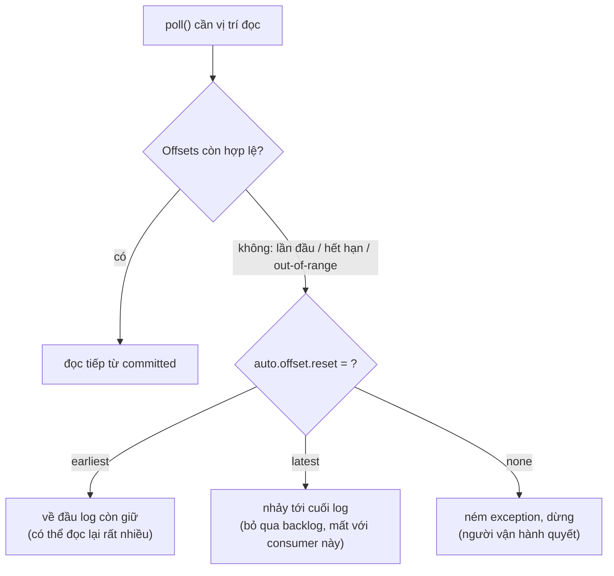

# Consumer Offset Reset: Khi Nào earliest, latest Hay none Cứu Bạn Khỏi Mất Dữ Liệu

Part 5 (089) đã cho consumer "động cơ" bulk: nhanh gấp chục lần mà vẫn idempotent + manual commit. Nhưng có một câu hỏi chưa ai trả lời: nếu offsets đang đọc bỗng **không còn hợp lệ** (consumer down quá lâu, offsets bị xóa), consumer sẽ làm gì? Bài này trả lời — với 3 giá trị `auto.offset.reset` và 2 retention phải thuộc lòng. Đây là nền bắt buộc trước khi Part 6 (091) dám reset offsets để replay.

---

## 1. Vấn đề: Offsets Không Tồn Tại Mãi Mãi

Nhiều bạn tưởng committed offset là vĩnh viễn: "đọc tới đâu, Kafka nhớ tới đó". Sai ở 2 chỗ:

* **Data hết hạn.** Kafka mặc định giữ data 7 ngày (`log.retention.hours=168`). Consumer down 10 ngày mới dậy, offsets nó cần đã bị segment xóa — đọc từ đó là đọc vào khoảng trống.
* **Offsets hết hạn.** Bản thân committed offsets cũng bị xóa nếu group idle quá lâu: Kafka < 2.0 là 1 ngày, Kafka ≥ 2.0 là **7 ngày** (`offsets.retention.minutes=10080`). Group `consumer-opensearch-demo` nghỉ 2 tuần không poll, quay lại broker bảo "tôi không biết group này".

Cả hai trường hợp đều đẩy consumer vào tình huống **"không có offset hợp lệ để đọc tiếp"**. Lúc đó `auto.offset.reset` quyết định số phận: đọc từ đầu, nhảy tới cuối, hay crash luôn để người vận hành can thiệp. Chọn sai là mất dữ liệu âm thầm hoặc replay hàng tỷ messages không mong muốn.



## 2. Cơ Chế: Ba Giá Trị Và Hai Retention

### 2.1. `auto.offset.reset=latest` — chỉ đọc đồ mới (mặc định của pipeline này)

Consumer không có offset hợp lệ thì nhảy tới **cuối log**, chỉ đọc messages từ giờ trở đi.

* Dùng khi: consumer realtime (dashboard, alerting), backlog cũ không còn giá trị. Part 2 chọn `latest` chính vì lý do này — chạy lần đầu không muốn import hàng chục nghìn events Wikimedia cũ.
* Giá phải trả: **bỏ qua toàn bộ backlog** với consumer này. Nếu backlog đó là giao dịch chưa xử lý thì là mất (với consumer này — data vẫn trong Kafka cho tới hết retention, group khác vẫn đọc được).
* Hiểu lầm phổ biến: "`latest` là đọc message mới nhất". Không — là **đứng ở cuối và chờ messages tương lai**.

### 2.2. `auto.offset.reset=earliest` — đọc từ đầu những gì còn giữ

Nhảy về **offset nhỏ nhất còn tồn tại** (đầu log sau retention, không phải offset 0 nguyên thủy nếu segment cũ đã xóa).

* Dùng khi: cần replay, backfill, consumer phân tích cần toàn history (Part 6 reset về earliest để demo bulk nhanh).
* Giá phải trả: có thể đọc lại **rất nhiều** — hàng triệu messages, tốn giờ, tốn tiền sink. May mà pipeline này idempotent nên đọc lại không bẩn, chỉ tốn công.
* Hiểu lầm phổ biến: "`earliest` là đọc từ offset 0". Không — là từ **đầu những gì còn giữ**. Data quá 7 ngày đã xóa thì không đọc lại được nữa.

### 2.3. `auto.offset.reset=none` — thà crash còn hơn đoán sai

Không tự quyết: ném exception (`NoOffsetForPartitionException`) để operator can thiệp — kiểm tra vì sao mất offsets, chọn reset tay bằng `kafka-consumer-groups.sh`, rồi restart.

* Dùng khi: dữ liệu nhạy cảm (thanh toán, y tế) — đọc sai một hướng là hậu quả lớn. Thà dừng pipeline để người quyết còn hơn tự `latest` làm mất giao dịch.
* Giá phải trả: cần on-call / runbook. Pipeline dừng cho tới khi có người xử lý.

### 2.4. Hai retention phải thuộc lòng

| Setting | Mặc định | Ý nghĩa | Khi consumer down quá ngưỡng thì |
|---|---|---|---|
| `log.retention.hours` (broker) | 168 (7 ngày) | Data giữ bao lâu | Offsets cần đọc đã bị xóa → out-of-range → kích hoạt `auto.offset.reset` |
| `offsets.retention.minutes` (broker) | 10080 (7 ngày, Kafka ≥ 2.0; bản cũ 1440 = 1 ngày) | Committed offsets giữ bao lâu cho group idle | Group bị quên hẳn → lần sau như group mới → kích hoạt `auto.offset.reset` |

Best practice vận hành:

* Nếu nghiệp vụ cho phép consumer down 2 tuần mà vẫn đọc tiếp được: tăng cả hai (ví dụ data retention 30 ngày, offsets retention 1 tháng). Tốn disk, nhưng rẻ hơn mất dữ liệu.
* Luôn set `auto.offset.reset` **tường minh** trong code (đừng trông chờ default `latest` của Kafka). Đọc code là biết ý đồ: realtime thì `latest`, cần history thì `earliest`, nhạy cảm thì `none`.
* Giám sát lag + alert khi consumer down. Phát hiện sớm trong 7 ngày thì chẳng bao giờ phải đối mặt với reset.

### 2.5. Replay chủ động khác reset bị động thế nào?

Bài này nói **reset bị động** (Kafka tự kích hoạt khi offsets invalid). Part 6 (091) làm **replay chủ động**: offsets vẫn hợp lệ nhưng ta cố ý lùi về quá khứ bằng `kafka-consumer-groups --reset-offsets` (cần stop hết consumers trong group trước, rồi restart). Hai việc khác nhau nhưng cùng một bài học: **chỉ dám lùi khi consumer idempotent** — mà pipeline này đã đạt từ Part 3.

## 3. Code: `auto.offset.reset` Nằm Ở Đâu Trong Project Này?

Không có code mới — chỉ có một dòng trong `createKafkaConsumer()` đã viết từ Part 2 và giữ suốt tới Part 5:

```java
// Realtime, bỏ history (Part 2 -> Part 5 mặc định):
props.setProperty(ConsumerConfig.AUTO_OFFSET_RESET_CONFIG, "latest");

// Muốn backfill/replay toàn history còn giữ:
// props.setProperty(ConsumerConfig.AUTO_OFFSET_RESET_CONFIG, "earliest");

// Dữ liệu nhạy cảm, thà dừng còn hơn đoán:
// props.setProperty(ConsumerConfig.AUTO_OFFSET_RESET_CONFIG, "none");
```

Giải thích:

* Dòng này **chỉ có tác dụng khi không có offset hợp lệ**: chạy lần đầu với group mới, hoặc offsets đã hết hạn, hoặc offsets trỏ vào segment đã xóa. Khi offsets còn hợp lệ, consumer đọc tiếp từ committed, config này bị bỏ qua — nên đổi `latest`↔`earliest` giữa chừng với group cũ đang chạy ngon sẽ **không thấy gì khác**, đừng hoảng.
* Muốn ép đọc lại dù offsets còn hợp lệ thì phải reset chủ động (Part 6), không phải đổi config này.
* Kiểm chứng nhanh: tạo group mới (`GROUP_ID_CONFIG` khác), set `earliest`, run → thấy `Received 500` lịch sử cũ ngay. Cùng code đó đổi group mới khác, set `latest` → chỉ thấy `Received 0` chờ đồ mới. Một thí nghiệm 5 phút khắc sâu hơn đọc 10 trang docs.

Lệnh reset offsets dùng ở Part 6 (xem trước để biết mặt chữ):

```bash
# xem vị trí hiện tại
kafka-consumer-groups.sh --bootstrap-server 127.0.0.1:9092 \
  --group consumer-opensearch-demo --describe

# lùi toàn topic về đầu (PHẢI stop hết consumers trong group trước)
kafka-consumer-groups.sh --bootstrap-server 127.0.0.1:9092 \
  --group consumer-opensearch-demo --reset-offsets --to-earliest \
  --topic wikimedia.recentchange --execute
```

Part 6 sẽ demo bằng Conduktor UI (click) thay vì CLI, nhưng lệnh trên là bản chất — và là thứ bạn dùng trong production không có UI.

## 4. Bảng So Sánh: Chọn Giá Trị Nào Cho Pipeline Nào?

| Tình huống | `earliest` | `latest` | `none` |
|---|---|---|---|
| Consumer realtime, backlog cũ vô giá trị | Tốn công đọc rác | **Chọn** | Dừng không cần thiết |
| Backfill / analytics cần history | **Chọn** | Mất history | Dừng để người quyết |
| Thanh toán / dữ liệu nhạy cảm, offsets mất bất thường | Nguy hiểm (replay tiền?) | Nguy hiểm (bỏ giao dịch?) | **Chọn — dừng để điều tra** |
| Demo Part 6 muốn thấy bulk nhanh | **Chọn** (reset về earliest) | Không thấy gì | Crash, không demo được |
| Group mới chạy lần đầu, topic đã có data | Đọc hết backlog | Chỉ chờ đồ mới | Crash ngay |
| Giá của sai lầm | Tốn thời gian/tiền (đọc thừa) | Mất backlog với consumer này | Dừng pipeline (cần on-call) |

Nguyên tắc chọn trong 10 giây: **hỏi "đọc thừa hay bỏ qua, cái nào nguy hiểm hơn?"** — thừa thì tốn tiền, thiếu thì mất tiền. Nhạy cảm thì `none`.

## 5. Pitfalls

* **Trông chờ default mà không set tường minh.** Default Kafka là `latest`. Prototype thì không sao, production mà "quên set" rồi mất backlog khi offsets hết hạn thì không ai cứu được. Luôn set显式.
* **Đổi `latest`↔`earliest` với group cũ rồi kết luận "config không ăn".** Config chỉ ăn khi không có offset hợp lệ. Muốn ép thì reset offsets chủ động (Part 6) hoặc đổi group mới.
* **Set `earliest` cho topic lưu lượng lớn mà không chuẩn bị sink.** Replay hàng chục triệu messages về OpenSearch free tier / DB yếu là sập sink. Replay phải đi kèm bulk (đã có Part 5) + giám sát + giờ thấp điểm.
* **Để offsets retention mặc định 7 ngày cho consumer chạy theo mùa.** Consumer báo cáo tháng, nghỉ 3 tuần không poll → group bị quên → tháng sau chạy như group mới. Tăng `offsets.retention.minutes` lên 1–3 tháng cho các group thưa.
* **Nhầm data retention với offsets retention.** Tăng data lên 30 ngày nhưng quên offsets thì group idle 10 ngày vẫn mất vạch xuất phát (dù data còn). Hai con số phải đi cùng nhau.
* **Replay khi consumer chưa idempotent.** Đây là điều cấm kỵ lớn nhất — và là lý do section này ép Part 3 (idempotence) đứng trước Part 6 (replay). Đọc lại mà `_id` random thì mỗi lần replay nhân đôi rác.

## Kết Luận

Tóm một câu: **offsets và data đều hết hạn — khi không còn vị trí hợp lệ, `latest` bỏ backlog để đi tiếp, `earliest` đọc lại từ đầu những gì còn giữ, `none` thà dừng để người quyết.**

Bài tiếp theo (091 — Part 6, part cuối chuỗi implementation) chúng ta dùng chính kiến thức này để replay chủ động: thêm graceful shutdown bằng `WakeupException`, stop consumer, reset offsets về `earliest` / lùi N messages, restart và chứng kiến bulk + idempotence biến replay thành thao tác an toàn hằng ngày.
