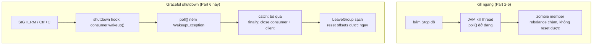

# OpenSearch Consumer Part 6: Shutdown Sạch Và Replay Dữ Liệu Không Sợ Bẩn

Part 5 (089) đã cho consumer "động cơ" bulk nhanh gấp chục lần, bài 090 đã học khi nào `earliest/latest/none` kích hoạt. Bài này — Part 6, part cuối chuỗi implementation — lắp mảnh ghép còn thiếu: **graceful shutdown** để dừng sạch, rồi dùng chính sự tự tin đó để **replay dữ liệu** bằng reset offsets. Đây là lúc toàn bộ 5 parts trước hội tụ: bulk để replay nhanh, idempotence để replay sạch, manual commit để replay đúng.

---

## 1. Vấn đề: Nút Stop Đỏ Là Con Dao Hai Lưỡi

Từ Part 2 tới Part 5, vòng lặp của chúng ta là `while(true)` không lối thoát:

```java
while (true) {
    ConsumerRecords<String, String> records = consumer.poll(Duration.ofMillis(3000));
    // ... bulk ...
}
```

Muốn dừng là bấm nút đỏ (Stop) trong IDE. Điều gì xảy ra?

* `poll()` đang block thì bị kill ngang — offsets batch cuối có thể chưa `commitSync()`.
* Consumer không kịp gửi `LeaveGroup` tới Group Coordinator — group tưởng member vẫn sống cho tới khi `session.timeout.ms` hết, rebalance treo vài chục giây.
* Muốn reset offsets để replay thì **bắt buộc** group phải không còn member sống — mà zombie member vì kill ngang khiến Conduktor báo group chưa empty, nút reset bị chặn.

Production không ai bấm nút đỏ. Cần cơ chế: bấm dừng → consumer thức dậy khỏi `poll()`, commit nốt, close clients, rời group đàng hoàng. Đó là graceful shutdown bằng `WakeupException`.



## 2. Cơ Chế: `wakeup()` + `WakeupException` — Chuông Báo Thức Của Consumer

`KafkaConsumer` không thread-safe, nhưng có đúng một phương thức được gọi từ thread khác: `wakeup()`. Nó đánh thức thread đang block trong `poll()` bằng cách ném `WakeupException` — exception duy nhất trong API sinh ra để điều khiển luồng, không phải báo lỗi.

Mẫu chuẩn (copy từ `ConsumerDemoWithShutdown` ở phần basics, đã test):

1. Giữ reference thread chính: `Thread mainThread = Thread.currentThread();`
2. Đăng shutdown hook: `Runtime.getRuntime().addShutdownHook(new Thread(() -> { consumer.wakeup(); try { mainThread.join(); } catch ... }))`.
3. Vòng `while` bọc trong `try`, thêm `catch (WakeupException e) { log.info("Consumer is starting to shut down"); }` — **không log error**, vì đây là đường dừng dự kiến.
4. Thêm `catch (Exception e)` chung để bắt lỗi thật (bulk lỗi, JSON vỡ lọt lưới...).
5. Khối `finally` close cả hai: `consumer.close()` (tự commit nốt nếu còn? không — manual thì chỉ close, offsets đã commit ở vòng trước) và `openSearchClient.close()`.

Vì sao phải `mainThread.join()` trong hook? Để JVM không thoát trước khi thread chính chạy xong `finally`. Không join thì hook kích hoạt, JVM giết luôn, close không kịp — khác gì nút đỏ.

Kết quả: bấm Stop / `Ctrl+C` / `kill SIGTERM` đều đi qua đường này. Log hiện:

```
Received 0 record(s).
Consumer is starting to shut down
Closing consumer...
```

Và trên Conduktor, group `consumer-opensearch-demo` chuyển **Empty** gần như ngay — đủ điều kiện reset offsets.

## 3. Code: Lắp Shutdown Hook Vào `OpenSearchConsumer.java`

Giữ nguyên Part 1–5 (`createOpenSearchClient()`, `createKafkaConsumer()` với `enable.auto.commit=false`, `extractId()`, bulk + `commitSync()`). Chỉ sửa khung `main()`.

### 3.1. Đăng hook ngay sau khi tạo consumer

```java
KafkaConsumer<String, String> consumer = createKafkaConsumer();

final Thread mainThread = Thread.currentThread();

Runtime.getRuntime().addShutdownHook(new Thread(() -> {
    log.info("Detected a shutdown, let's exit by calling consumer.wakeup()...");
    consumer.wakeup(); // đánh thức poll() đang block

    try {
        mainThread.join(); // chờ thread chính close xong mới cho JVM thoát
    } catch (InterruptedException e) {
        e.printStackTrace();
    }
}));
```

Giải thích:

* `consumer` phải là biến effectively-final để dùng trong lambda — khai như trên là đạt.
* Hook chạy khi JVM nhận SIGTERM/SIGINT (Ctrl+C, nút Stop của IDE hiện đại, `docker stop`, K8s pod terminate). `kill -9` thì hook không chạy — đó là lý do production tránh `kill -9` với consumer.
* `wakeup()` an toàn gọi nhiều lần. Gọi khi không `poll()` thì lần `poll()` kế tiếp ném exception ngay — vẫn đúng.

### 3.2. Bọc vòng lặp bằng try/catch/finally

```java
try (RestHighLevelClient openSearchClient = createOpenSearchClient(connString)) {
    // ... exists/create index như Part 1 ...

    consumer.subscribe(Collections.singleton("wikimedia.recentchange"));

    try {
        while (true) {
            ConsumerRecords<String, String> records = consumer.poll(Duration.ofMillis(3000));
            // ... toàn bộ logic bulk Part 5: gom BulkRequest, bulk(), check
            // hasFailures(), commitSync(), sleep demo ...
        }
    } catch (WakeupException e) {
        log.info("Consumer is starting to shut down"); // đường dừng dự kiến, không phải lỗi
    } catch (Exception e) {
        log.error("Unexpected exception in the consumer", e);
    } finally {
        consumer.close();          // rời group sạch, giải phóng partitions
        openSearchClient.close();  // đóng pool HTTP (nếu không dùng try-with-resources cho nó)
        log.info("The consumer is now gracefully shut down");
    }
}
```

Giải thích:

* `WakeupException` catch riêng và đứng trước `Exception` chung — vì nó là subclass của `KafkaException` (runtime), để chung là mất ý nghĩa.
* `finally` close cả hai clients. Nếu `openSearchClient` đã nằm trong try-with-resources ngoài cùng như Part 1 thì `close()` tay là thừa nhưng vô hại — quan trọng là `consumer.close()` phải có.
* Từ đây bấm Stop là log shutdown sạch, không còn stacktrace đỏ, không còn "consumer timeout rồi mới vào được" khi restart ngay.

### 3.3. Replay: reset offsets rồi restart — thao tác an toàn hằng ngày

Điều kiện tiên quyết: **stop hết consumers trong group**. Nhờ shutdown sạch ở trên, Conduktor hiện group Empty ngay sau khi dừng. Giờ có 5 kiểu reset (demo bằng Conduktor UI cho trực quan, CLI tương đương):

| Kiểu reset | Ý nghĩa | Lệnh CLI tương đương | Khi nào dùng |
|---|---|---|---|
| To Earliest | Về đầu log còn giữ — đọc lại toàn bộ | `--reset-offsets --to-earliest --execute` | Backfill, demo bulk nhanh, dựng lại index mới |
| To Latest | Nhảy tới cuối — bỏ backlog | `--reset-offsets --to-latest --execute` | Bỏ data cũ hỏng, chỉ cần đồ mới |
| Specific Offset (ví dụ 500) | Tới offset tuyệt đối từng partition | `--reset-offsets --to-offset 500 --execute` | Biết chính xác vị trí cần đọc lại |
| Shift-By (ví dụ -500) | Lùi/tiến N messages từ vị trí hiện tại | `--reset-offsets --shift-by -500 --execute` | "Cho tôi đọc lại 500 messages vừa rồi" — kiểu dùng nhiều nhất khi debug |
| By DateTime | Tới offset theo timestamp | `--reset-offsets --to-datetime 2026-09-01T00:00:00Z --execute` | "Đọc lại từ đầu tháng" |

Demo chuẩn trong video: đuổi kịp tới lag 0 → shutdown sạch → **Shift-By -500** → lag hiện ~1500 (3 partitions × 500) → restart consumer → log:

```
Received 500 record(s).
Inserted 500 record(s).
Offsets have been committed!
Received 500 record(s).
...
```

rồi lag về 0. Verify `GET /wikimedia/_count` **không tăng** sau replay — bằng chứng idempotence (Part 3) hoạt động: ghi lại nhưng ghi đè cùng `_id`.

```bash
# CLI đầy đủ cho ai không có Conduktor (nhớ stop consumer trước):
# 1. Xem vị trí hiện tại
kafka-consumer-groups.sh --bootstrap-server 127.0.0.1:9092 \
  --group consumer-opensearch-demo --describe

# 2. Lùi 500 messages
kafka-consumer-groups.sh --bootstrap-server 127.0.0.1:9092 \
  --group consumer-opensearch-demo --reset-offsets --shift-by -500 \
  --topic wikimedia.recentchange --execute

# 3. Restart consumer
```

## 4. Bảng So Sánh: Chuỗi 6 Parts Nhìn Lại Một Lần

| Part | Bài | Thêm gì | Nỗi đau được giải quyết | Nếu bỏ qua thì sao |
|---|---|---|---|---|
| 1 | 083 | `RestHighLevelClient` + `CreateIndexRequest` | Nói được với OpenSearch local/cloud | Không có đích để ghi |
| 2 | 084 | `KafkaConsumer` + `poll()` + `index()` đơn | Data chảy end-to-end | Không có nguồn |
| 3 | 086 | `.id(meta.id)` idempotent | Đọc lại không duplicate | Replay = nhân rác |
| 4 | 088 | `enable.auto.commit=false` + `commitSync()` | Commit theo nhịp mình | Lag ma, restart đọc thừa |
| 5 | 089 | `BulkRequest` + `hasFailures()` check | Nhanh gấp chục lần | Replay 1 triệu docs mất cả ngày |
| 6 | Bài này (091) | Shutdown hook + reset offsets | Dừng sạch, replay an toàn | Zombie member, không reset được |

Đọc bảng từ dưới lên cũng là checklist production-readiness cho mọi sink consumer bạn viết sau này: client → poll → id → commit → bulk → shutdown/replay.

## 5. Pitfalls

* **Reset offsets khi consumer còn sống.** CLI báo `group is not empty` / Conduktor chặn. Luôn shutdown sạch trước — đây là lý do hook phải làm trước replay.
* **Dùng `kill -9` rồi thắc mắc hook không chạy.** SIGKILL không cho JVM chạy hook. Dùng `kill` thường (SIGTERM), Ctrl+C, nút Stop.
* **Để `WakeupException` rơi vào catch chung rồi log error đỏ.** Không sai chức năng nhưng gây hoảng và che lỗi thật. Luôn catch riêng, log info.
* **Quên `mainThread.join()` trong hook.** JVM thoát trước khi `finally` chạy xong — close dở dang, group vẫn zombie vài chục giây.
* **Replay khi chưa idempotent.** Cấm kỵ lớn nhất, nhắc lần thứ ba trong section: Part 6 chỉ an toàn vì Part 3 đã gắn `meta.id`. Viết pipeline mới mà chưa có id thì đừng đụng tới reset.
* **Shift-By nhầm dấu.** `-500` là lùi (đọc lại), `+500` là tiến (bỏ qua). Nhầm `+500` với data chưa xử lý là mất 500 messages với group này. Kiểm tra `--describe` trước và sau.
* **Reset về earliest với topic lớn mà không chuẩn bị sink.** Hàng triệu docs đổ về OpenSearch free tier / DB yếu là sập. Replay lớn làm giờ thấp điểm, theo dõi lag, đã có bulk Part 5 đỡ nhưng vẫn phải coi chừng.
* **Close consumer 2 lần (vừa try-with-resources vừa `finally`).** `close()` idempotent nên không crash, nhưng log warning. Chọn một nơi close cho gọn.

## Kết Luận

Tóm một câu: **Part 6 khép chuỗi implementation — shutdown bằng `wakeup()` để rời group sạch, rồi reset offsets (earliest/latest/shift-by/specific/datetime) để replay; replay chỉ an toàn vì đã có idempotence (Part 3) + bulk (Part 5) + manual commit (Part 4).**

Từ đây bạn có một pipeline Kafka → OpenSearch production-shape thu nhỏ. Hai bài tiếp theo rời code để lên tầm vận hành: bài 092 mổ **internal threads** (heartbeat, `max.poll.interval.ms`, tuning fetch) và bài 093 mổ **replica fetching** (đọc từ replica gần nhất để giảm cost cross-AZ).
