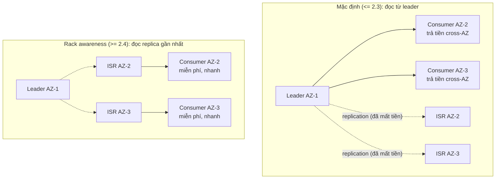

# Consumer Replica Fetching: Đọc Từ Replica Gần Nhất Để Giảm Tiền Cross-AZ

Bài trước (092) đã mổ hai luồng ngầm trong consumer và cách tuning fetch khi consumer đơn datacenter. Bài này — bài cuối section — sang bài toán đa-datacenter: mặc định consumer luôn đọc từ **leader**, dù leader ở xa; từ Kafka 2.4 có thể đọc từ **replica gần nhất** (rack awareness) để giảm latency và tiền mạng cross-AZ.

---

## 1. Vấn đề: Mặc Định Đọc Từ Leader Xa Rất Tốn Kém

Ôn lại replication: mỗi partition có 1 leader + N-1 followers (ISR). Producer ghi vào leader, followers kéo về. Và consumer — từ thuở sơ khai tới Kafka 2.3 — **chỉ đọc từ leader**.

Ổn khi tất cả cùng datacenter. Nhưng production cloud (AWS/GCP/Azure) thì khác:

* Trong cùng AZ (Availability Zone): mạng miễn phí, latency ~1ms.
* Khác AZ (dù cùng region): **tính tiền mỗi GB** + latency tăng 2–5ms.

Kịch bản: 3 brokers ở 3 AZ, partition leader ở AZ-1, consumer chạy ở AZ-2. Mỗi byte consumer đọc đều vượt AZ → trả tiền 2 lần (1 lần replication leader→ISR vốn đã mất, 1 lần consumer fetch từ leader xa). Lưu lượng Wikimedia hàng chục GB/ngày là hóa đơn phình trông thấy.



Tiền replication leader→ISR không tránh được (bản chất consensus). Nhưng tiền consumer fetch thì tránh được — bằng cách đọc ngay ISR cùng AZ.

## 2. Cơ Chế: Rack Awareness Cho Consumer (Kafka ≥ 2.4)

Ý tưởng mượn từ HDFS/YARN: gán mỗi broker và mỗi consumer một **rack id** (thực tế cloud = AZ id, ví dụ `usw2-az1`). Khi consumer fetch, broker dùng `ReplicaSelector` chọn replica cùng rack để phục vụ thay vì leader.

Ba mảnh cấu hình — thiếu một là không chạy:

### 2.1. Broker: khai rack + bật replica selector

```properties
# server.properties mỗi broker (ví dụ broker ở AZ-1):
broker.rack=usw2-az1
replica.selector.class=org.apache.kafka.common.replica.RackAwareReplicaSelector
# Yêu cầu: brokers >= 2.4. Consumer cũ (< 2.4) không gửi rack nên vẫn đọc leader — tương thích ngược.
```

Giải thích:

* `broker.rack` là danh tính vị trí của broker. Trên AWS điền AZ ID (`usw2-az1`), on-premise điền tên rack vật lý / phòng máy.
* `RackAwareReplicaSelector` là logic "chọn replica cùng rack với consumer". Đây là class có sẵn của Kafka — không cần viết code. Muốn logic riêng (theo region, theo giá mạng) thì implement `ReplicaSelector` custom, nhưng 99% dùng sẵn là đủ.
* Phải set trên **mọi broker**, rồi rolling restart. Set sót một broker là replica ở đó không tham gia chọn.

### 2.2. Consumer: khai mình đang ở đâu

```java
props.setProperty(ConsumerConfig.CLIENT_RACK_CONFIG, "usw2-az2"); // AZ của consumer này
// Cách khác trong properties file:
// client.rack=usw2-az2
```

Giải thích: consumer gửi `client.rack` trong fetch request. Broker so với `broker.rack` của các replicas, ưu tiên replica cùng rack còn trong ISR. Nếu replica cùng rack tụt ISR (lag quá xa) thì fallback về leader — **đúng hơn chậm còn hơn sai**: thà trả tiền cross-AZ một lúc còn hơn đọc data cũ.

### 2.3. Luồng chọn replica khi fetch

```
1. Consumer AZ-2 gửi FetchRequest + client.rack=usw2-az2.
2. Broker (leader partition) nhìn danh sách ISR + rack của từng replica.
3. Có ISR ở usw2-az2 và kịp thời (không out-of-sync)? -> redirect fetch sang replica đó.
4. Không có? -> phục vụ từ leader như cũ (trả tiền nhưng đúng).
```

Không có code Java OpenSearch nào đổi ở đây — `BulkRequest`, `commitSync()`, `extractId()` giữ nguyên. Đây là cấu hình hạ tầng, consumer code không biết mình đang đọc từ ai.

## 3. Code: Minh Họa Cấu Hình Đầy Đủ Cho 3 AZ

Không có code demo chạy được ở local (cần 3 AZ thật), nên "code" ở đây là bộ config mẫu để bạn mang sang production:

```properties
# ---- Broker AZ-1 ----
broker.id=101
broker.rack=usw2-az1
replica.selector.class=org.apache.kafka.common.replica.RackAwareReplicaSelector

# ---- Broker AZ-2 ----
broker.id=102
broker.rack=usw2-az2
replica.selector.class=org.apache.kafka.common.replica.RackAwareReplicaSelector

# ---- Broker AZ-3 ----
broker.id=103
broker.rack=usw2-az3
replica.selector.class=org.apache.kafka.common.replica.RackAwareReplicaSelector
```

```java
// ---- Consumer chạy ở AZ-2 (cùng máy / cùng subnet với broker 102) ----
Properties props = new Properties();
// ... bootstrap, group, deserializers, enable.auto.commit=false ... (như Part 4-6)
props.setProperty(ConsumerConfig.CLIENT_RACK_CONFIG, "usw2-az2");
```

```java
// ---- Consumer chạy ở AZ-3 ----
props.setProperty(ConsumerConfig.CLIENT_RACK_CONFIG, "usw2-az3");
```

Verify đã ăn (production):

* Metric `fetch-from-follower` / JMX `FollowerFetch` tăng — chứng tỏ fetch đi vào replica.
* Hóa đơn cross-AZ AZ-1→AZ-2 giảm tương ứng lưu lượng consumer.
* Latency fetch p99 giảm (đọc local AZ thay vì cross-AZ).
* Test fallback: kill broker 102 → consumer AZ-2 tự về đọc leader AZ-1 (lag tăng nhẹ + tốn tiền tạm thời, nhưng không dừng).

## 4. Bảng So Sánh: Đọc Từ Leader vs Replica Gần Nhất

| Tiêu chí | Mặc định: leader only (≤ 2.3) | Rack awareness (≥ 2.4) |
|---|---|---|
| Ai phục vụ fetch | Leader partition | Replica cùng rack còn trong ISR, fallback leader |
| Latency cross-AZ | Cao (luôn vượt AZ nếu leader xa) | Thấp (đọc local AZ) |
| Tiền mạng cloud | Replication + fetch đều cross-AZ | Chỉ replication cross-AZ, fetch miễn phí |
| Tính nhất quán | Mạnh nhất (leader luôn mới nhất) | Vẫn an toàn — chỉ đọc ISR kịp thời, tụt ISR thì fallback |
| Cấu hình | Không cần gì | `broker.rack` + `replica.selector.class` + `client.rack`, brokers ≥ 2.4 |
| Khi nào tắt đi | Cluster đơn AZ / on-premise mạng free | Replica cùng AZ tụt ISR liên tục (đọc fallback mãi thì cấu hình vô ích) |
| Liên quan section này | Mọi Parts 1–6 chạy mặc định này trên local | Không demo local được — mang sang production multi-AZ |

Khi nào **không** cần: dev local, CI, cluster đơn AZ, hoặc lưu lượng consumer nhỏ (tiền cross-AZ không đáng công cấu hình + rolling restart). Đây là tối ưu "đòn bẩy lớn khi scale" — đúng tinh thần bài nâng cao cuối section.

## 5. Pitfalls

* **Set `client.rack` nhưng quên `replica.selector.class` ở broker.** Consumer gửi rack mà broker không có selector thì bị bỏ qua, vẫn đọc leader — tưởng đã tiết kiệm mà hóa đơn không giảm. Check cả hai phía.
* **Điền rack id không khớp quy ước.** Broker `usw2-az1` mà consumer ghi `us-west-2a` (tên AZ vs ID AZ trên AWS là hai chuỗi khác nhau) thì match thất bại, fallback leader âm thầm. Chuẩn hóa một quy ước duy nhất.
* **Tưởng đọc replica là đọc data cũ.** Chỉ replica trong ISR mới được chọn — ISR định nghĩa là "kịp leader trong `replica.lag.time.max.ms`". Tụt ISR là loại ngay. Đừng nhầm với out-of-sync replica.
* **Áp vào Kafka < 2.4 rồi kết luận "config không ăn".** `client.rack` bị broker cũ bỏ qua lặng lẽ, không báo lỗi. Check version trước: `kafka-broker-api-versions.sh`.
* **Quên fallback cost khidesign capacity.** Ngày đẹp trời replica AZ-2 bảo trì → toàn bộ consumers AZ-2 về đọc leader AZ-1 → tiền cross-AZ + tải leader tăng đột biến. Tính capacity leader chịu được 100% fetch khi cần.
* **Trộn với `session.timeout.ms` tuning bài 092.** Cross-AZ heartbeat/fetch trễ hơn local vài ms — hạ timeout quá thấp (1–2s) trên multi-AZ là tự tạo rebalance oan. Nới margin khi qua AZ.

## Kết Luận (Khép Lại Section)

Tóm một câu cho bài này: **đa-datacenter thì cho consumer đọc replica cùng rack (`broker.rack` + `RackAwareReplicaSelector` + `client.rack`) — latency thấp hơn, tiền cross-AZ nhẹ hơn, tụt ISR thì fallback leader.**

Và tóm một câu cho cả section 078–093: **pipeline Wikimedia → Kafka → OpenSearch đã dạy toàn bộ nghề consumer — nối client (P1), poll (P2), idempotent bằng `meta.id` (P3), manual commit (P4), bulk (P5), shutdown sạch + replay (P6) — đặt trên nền semantics (085), commit strategies (087), offset reset (090) và vận hành threads + rack (092–093).** Viết sink consumer mới nào (Postgres, S3, Elasticsearch) cũng chỉ là thay `BulkRequest` bằng client khác, còn 6 bước thì giữ nguyên.

Bài tiếp theo (ngoài section) chúng ta sang kiến thức nền khác của Kafka — mang theo checklist 6 bước này, bạn sẽ thấy consumer nào cũng chỉ là biến thể của pipeline đã xây.
