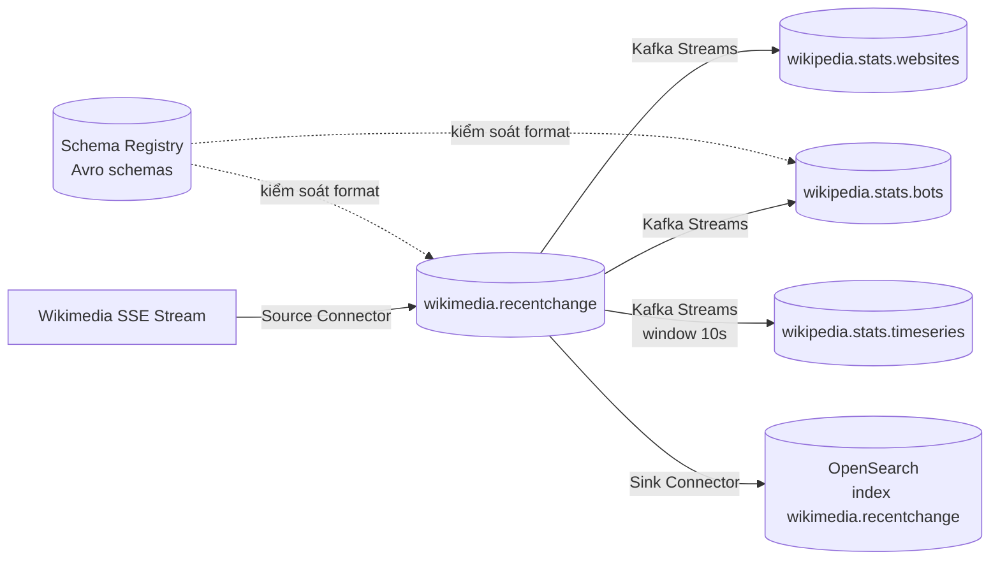

# Vượt Ra Khỏi Producer/Consumer: Bản Đồ Hệ Sinh Thái Mở Rộng Của Kafka

Bạn đã nắm Producer và Consumer — hai API nền tảng để ghi và đọc từng message. Nhưng trong dự án thực tế, bạn hiếm khi chỉ cần "gửi từng message". Bạn cần đưa dữ liệu từ database, API, file log vào Kafka mà không viết lại code kết nối. Bạn cần biến đổi stream này thành stream khác mà không dựng lại cả pipeline Consumer-Producer thủ công. Bạn cần đảm bảo dữ liệu không bị hỏng format giữa chừng.

Đó là lý do Kafka sinh ra các **Extended APIs**: **Kafka Connect**, **Kafka Streams** và **Schema Registry**. Bài này cho bạn bản đồ tổng thể: khi nào dùng cái gì, chúng ghép với nhau ra sao.

---

## 1. Vì Sao Producer/Consumer Là Chưa Đủ?

Producer/Consumer là **low-level API**: bạn kiểm soát từng record, từng offset, từng lần commit.

Điểm mạnh là linh hoạt. Điểm yếu là tốn công cho các bài toán lặp đi lặp lại:

| Bài toán lặp lại | Nếu chỉ dùng Producer/Consumer |
|---|---|
| Đưa dữ liệu từ PostgreSQL, MySQL, S3, Wikimedia, Twitter vào Kafka | Mỗi nguồn phải tự viết producer, tự lo retry, fault-tolerance, ordering |
| Đổ dữ liệu từ Kafka ra Elasticsearch, S3, HDFS, JDBC | Mỗi sink phải tự viết consumer, tự lo offset, idempotence, scale |
| Biến đổi topic A thành topic B (đếm, lọc, join, aggregate theo thời gian) | Phải tự nối Consumer + logic + Producer, tự quản lý state, thứ tự, exactly-once |
| Đảm bảo dữ liệu đúng schema theo thời gian | Phải tự kiểm tra tay ở cả hai đầu, dễ vỡ khi thêm/xóa field |

Extended APIs sinh ra để giải đúng ba chỗ đau này bằng code tái sử dụng được.

## 2. Ba Mảnh Ghép Của Hệ Sinh Thái Mở Rộng

### 2.1. Kafka Connect: đường ống vào/ra chuẩn hóa

**Kafka Connect** giải bài toán **Kafka <-> thế giới bên ngoài**.

* **Source Connector**: lấy dữ liệu từ nguồn ngoài (database qua JDBC/Debezium, Wikimedia SSE, Twitter, S3, MongoDB) và đưa vào Kafka topic.
* **Sink Connector**: đọc từ Kafka topic và đẩy ra hệ lưu trữ ngoài (Elasticsearch/OpenSearch, S3, HDFS, JDBC, Redis).

Bạn không viết code kết nối, chỉ triển khai connector có sẵn và cấu hình. Trên Confluent Hub có hơn 200 connectors.

### 2.2. Kafka Streams: xử lý stream ngay trong Kafka

**Kafka Streams** giải bài toán **Kafka -> Kafka transformation**.

Đó là một thư viện Java (không cần cluster riêng) để viết ứng dụng đọc một hoặc nhiều topic, thực hiện filter, map, đếm, aggregate theo cửa sổ thời gian (window), join, rồi ghi ra topic mới.

Ví dụ điển hình: đếm số edit của bot vs human, đếm theo từng wiki domain, thống kê số events mỗi 10 giây.

### 2.3. Schema Registry: người gác cổng dữ liệu

**Schema Registry** giải bài toán **dữ liệu đúng format theo thời gian**.

Kafka broker chỉ thấy bytes, không kiểm tra nội dung. Nếu producer đổi tên field hay đổi kiểu dữ liệu, consumer sẽ crash lúc runtime. Schema Registry lưu schema (Avro, Protobuf, JSON Schema), bắt producer tuân thủ trước khi ghi, cho consumer lấy schema để giải mã, và kiểm tra **compatibility** khi schema tiến hóa (backward/forward/full).

## 3. Kiến Trúc Tổng Thể: Ví Dụ Wikimedia End-to-End

Xuyên suốt section này chúng ta dùng chung một pipeline để thấy cả ba API phối hợp:

Luồng đọc từ trái sang phải:

1. **Kafka Connect Source** (Wikimedia SSE Source Connector) hút stream thay đổi của Wikimedia và append vào topic `wikimedia.recentchange`.
2. **Kafka Streams** đọc topic đó, chạy 3 topology thống kê và ghi ra 3 topic kết quả.
3. **Kafka Connect Sink** (Elasticsearch Sink Connector) đổ topic gốc vào OpenSearch để tìm kiếm.
4. **Schema Registry** đứng bên cạnh, đảm bảo mọi record ghi vào các topic đều đúng schema đã đăng ký.

Đây chính là mô hình ETL streaming hiện đại: Extract (Connect Source) -> Transform (Streams) -> Load (Connect Sink), kèm governance (Schema Registry).

## 4. So Sánh Nhanh: Khi Nào Dùng API Nào?

| Nếu điểm xuất phát của bạn là... | Dùng API... |
|---|---|
| Dữ liệu đã nằm ở hệ ngoài, muốn đưa vào Kafka | **Kafka Connect Source** |
| Dữ liệu do chính ứng dụng của bạn sinh ra (xe tải, app mobile, video player) | **Kafka Producer** |
| Muốn biến đổi topic này thành topic khác | **Kafka Streams** (hoặc ksqlDB nếu thích SQL) |
| Muốn đổ dữ liệu Kafka ra kho lưu trữ để phân tích sau | **Kafka Connect Sink** |
| Muốn gửi thông báo một lần rồi quên (email, SMS, push) | **Kafka Consumer** |
| Muốn đảm bảo format không vỡ theo thời gian | **Schema Registry** đi kèm mọi pipeline trên |

Bài 103 cuối section sẽ biến bảng này thành cây quyết định chi tiết.

## Cạm Bẫy Thường Gặp

* **Cái gì cũng viết Producer/Consumer tay.** Sai lầm phổ biến nhất. Kết quả là reinvent lại connector đã có sẵn, kém bền (thiếu fault-tolerance, idempotence, distribution) và tốn thời gian bảo trì.
* **Coi Kafka Streams như framework batch (Spark/Flink).** Streams xử lý **từng record một (one record at a time)**, không batch. Mang tư duy batch vào sẽ thiết kế window và state sai.
* **Bỏ qua Schema Registry ở giai đoạn đầu "cho nhanh".** Đến khi có 5 teams cùng ghi vào một topic, chỉ một lần đổi tên field là sập cả downstream. Gắn governance càng sớm càng rẻ.
* **Nhầm Connect là ETL có transform mạnh.** Connect làm tốt Extract/Load, transform chỉ ở mức đơn giản (Single Message Transforms). Transform phức tạp hãy đẩy sang Streams.

## Kết Luận

Hãy nhớ một câu: **Producer/Consumer đưa bạn vào được Kafka, Extended APIs giúp bạn vận hành Kafka ở quy mô công ty.** Connect lo vào/ra, Streams lo biến đổi, Schema Registry lo tính đúng đắn.

Bài tiếp theo chúng ta đi sâu vào mảnh đầu tiên: **Kafka Connect** — kiến trúc workers, tasks, Source/Sink hoạt động ra sao và vì sao bạn không nên tự viết connector của riêng mình.
