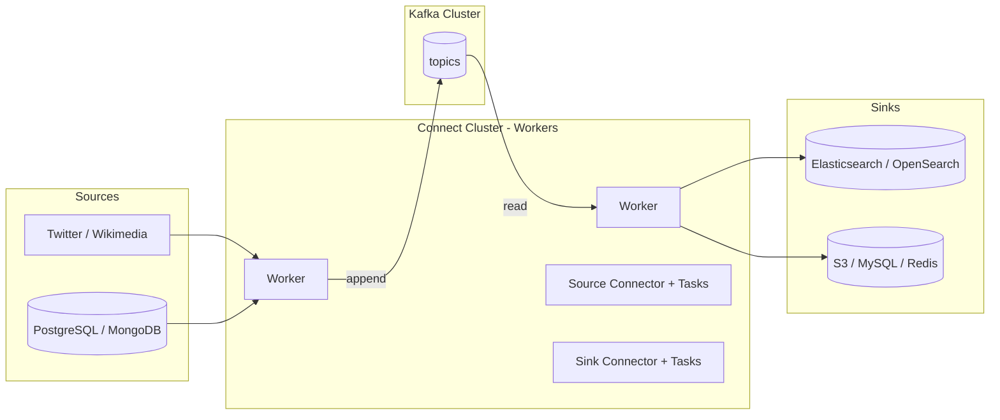

# Kafka Connect: Đừng Tự Viết Producer Cho Việc Người Khác Đã Làm Tốt Hơn

Bạn cần đưa dữ liệu từ PostgreSQL vào Kafka. Hoặc đổ dữ liệu từ Kafka ra Elasticsearch, S3. Cách "ngây thơ" là tự viết một Producer đọc database rồi ghi vào topic, tự viết một Consumer đọc topic rồi ghi ra Elasticsearch. Chạy thử thì được, nhưng lên production bạn sẽ phải tự lo retry khi database sập, offset khi consumer crash, scale khi throughput tăng gấp 10, đảm bảo không mất và không trùng dữ liệu.

**Kafka Connect** sinh ra để bạn khỏi viết lại những thứ đó. Người khác đã viết sẵn, test kỹ, tối ưu rồi — việc của bạn chỉ là chọn connector đúng và cấu hình.

---

## 1. Khi Nào Dùng Kafka Connect?

Dùng Connect khi **một đầu của pipeline đã có sẵn ở hệ ngoài**:

* **Source Connector — ngoài vào Kafka:** database (JDBC, Debezium CDC cho PostgreSQL/MySQL/Oracle/SQL Server/MongoDB), Wikimedia SSE, Twitter, S3, Couchbase, GoldenGate, Salesforce, Zendesk...
* **Sink Connector — Kafka ra ngoài:** S3, Elasticsearch/OpenSearch, HDFS, JDBC, Redis, Splunk...

Ngược lại, **đừng dùng Connect** khi dữ liệu do chính ứng dụng của bạn sinh ra (app mobile, video player, thiết bị GPS xe tải). Trường hợp đó dữ liệu chưa ở đâu cả — bạn là nguồn sự thật (source of truth), hãy dùng **Kafka Producer** trực tiếp.

Quy tắc một câu: **dữ liệu đã nằm ở đâu đó rồi thì Connect vào/đổ ra, dữ liệu mới sinh ra từ code của bạn thì Producer.**

## 2. Kiến Trúc: Cluster, Workers, Connectors, Tasks



Các khái niệm cốt lõi:

1. **Connect Cluster gồm Workers.** Worker là tiến trình JVM chạy connectors. Muốn tăng throughput toàn pipeline thì thêm worker vào cluster, không cần sửa code.
2. **Connector định nghĩa *làm gì*, Task thực hiện *làm như thế nào*.** Một connector (ví dụ Elasticsearch Sink) có thể sinh ra nhiều tasks chạy song song, mỗi task copy một phần partitions.
3. **Source Task ghi vào Kafka, Sink Task đọc từ Kafka.** Cả hai đều tận dụng offset, retry, fault-tolerance của Kafka. Worker chết thì task tự rebalance sang worker còn sống.
4. **Nằm trong pipeline ETL.** Connect đảm nhận Extract (Source) và Load (Sink). Transform phức tạp để dành cho Kafka Streams.

Nhờ tách Connector/Task như vậy, pipeline nhỏ (một worker, một task) hay pipeline cấp công ty (chục workers, trăm tasks) đều cùng một mô hình cấu hình.

## 3. Vì Sao Nên Tái Sử Dụng Connector Có Sẵn?

Trên **Confluent Hub** có hơn 200 connectors (thời điểm ghi bài). Mỗi connector tốt mang sẵn 4 tính chất bạn sẽ rất vất vả nếu tự viết:

| Tính chất | Ý nghĩa thực tế |
|---|---|
| **Fault-tolerance** | Nguồn/sink sập, worker crash — task tự retry và tiếp tục từ offset cũ |
| **Idempotence** | Ghi lại sau lỗi không tạo trùng bản ghi rác |
| **Distribution** | Chia tasks ra nhiều workers để scale ngang |
| **Ordering** | Giữ thứ tự trong phạm vi cam kết (thường theo partition) |

Tự viết Producer/Consumer thay thế thường thiếu ít nhất một trong bốn thứ trên, và bạn chỉ phát hiện ra lúc 2 giờ sáng khi pipeline sập.

## 4. Lối Vào Thực Hành: Tìm Connector Ở Đâu?

Luồng chuẩn khi bắt đầu một pipeline Connect:

1. Lên Confluent Hub, lọc theo **Source/Sink type** (ví dụ gõ `Elasticsearch Sink`, `JDBC Source`, `S3 Sink`).
2. Mở trang connector, đọc mục support, version tương thích với Kafka của bạn.
3. Download file zip (Sink/Source của Confluent) hoặc jar (connector cộng đồng như `kafka-connect-wikimedia`).
4. Giải nén vào thư mục `plugins.path` của Connect worker — bài hands-on 098 sẽ làm từng bước với Wikimedia Source và Elasticsearch Sink.

```bash
# Ý tưởng chung, chi tiết đầy đủ ở bài 098
mkdir -p connectors/kafka-connect-wikimedia
mkdir -p connectors/kafka-connect-elasticsearch
# copy jar Wikimedia vào thư mục đầu, unzip gói Elasticsearch vào thư mục sau
# rồi trỏ plugin.path trong connect-standalone.properties về thư mục connectors/
```

## Cạm Bẫy Thường Gặp

* **Cái gì cũng tự viết producer đọc database bằng `SELECT *` polling.** Vừa chậm, vừa miss deletes/updates, vừa đè nặng database. Với database hãy dùng **CDC Source Connector** (Debezium) đọc transaction log thay vì polling tay.
* **Nối thẳng app mobile vào Kafka.** Không bao giờ nối client trực tiếp. Luôn qua một service proxy (làm Producer) để validate, auth, rate-limit trước khi ghi vào topic.
* **Nhầm Connect là công cụ transform mạnh.** Connect chỉ có Single Message Transforms (đổi tên field, filter đơn giản). Logic join, aggregate theo thời gian phải sang Kafka Streams.
* **Chạy một worker duy nhất ở production rồi gọi là "xong".** Một worker là single point of failure. Production cần cluster nhiều workers để tasks rebalance khi có sự cố.

## Kết Luận

**Kafka Connect = code tái sử dụng cho bài toán đưa dữ liệu vào/ra Kafka.** Source Connector hút dữ liệu từ hệ ngoài vào topic, Sink Connector đổ từ topic ra hệ ngoài, tất cả chạy trên Connect Cluster có thể scale bằng cách thêm workers và tasks.

Bài tiếp theo chúng ta cỡi bỏ lý thuyết và chạy thật: **Wikimedia Source Connector đưa stream Wikipedia vào Kafka, Elasticsearch Sink Connector đổ ra OpenSearch**, với đầy đủ lệnh `connect-standalone`, file `.properties` và cách kiểm chứng.
