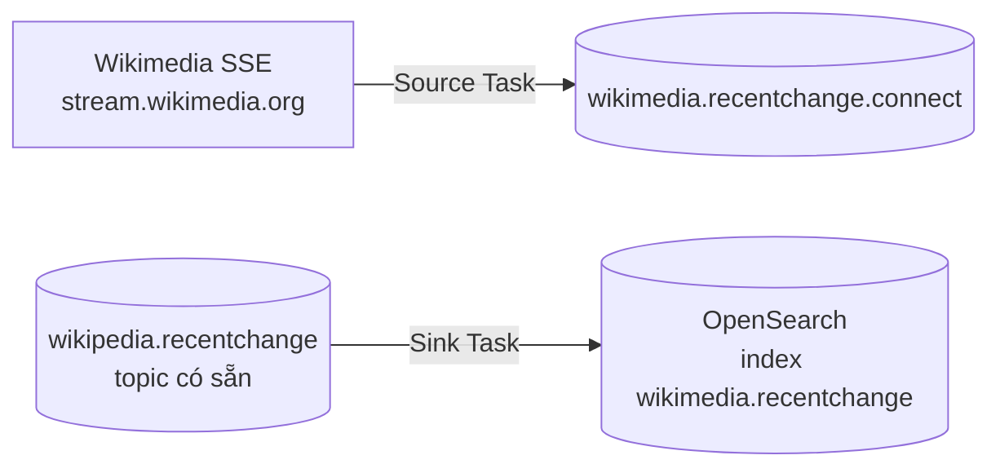

# Hút Stream Wikipedia Vào Kafka, Đổ Ra OpenSearch: Hands-On Kafka Connect End-to-End

Bài trước bạn đã biết Kafka Connect là "code tái sử dụng" cho pipeline vào/ra. Bài này chúng ta chạy thật một pipeline hoàn chỉnh: **Wikimedia SSE -> Kafka (Source Connector) -> OpenSearch (Sink Connector)**. Xong bài này bạn sẽ tự tin cài bất kỳ connector nào trên Confluent Hub.

---

## 1. Khi Nào Dùng Pipeline Này?

Đây là mẫu **Extract -> Load thuần túy, không transform**:

* Nguồn đã có sẵn bên ngoài (Wikimedia RecentChange SSE stream) — bạn không sở hữu nguồn, chỉ hút về.
* Đích đã có sẵn bên ngoài (OpenSearch/Elasticsearch) — bạn cần đổ dữ liệu vào để tìm kiếm, không cần xử lý gì thêm.
* Không có logic nghiệp vụ ở giữa. Nếu cần đếm, join, aggregate thì phải thêm Kafka Streams (bài 099-100).

Nói cách khác: khi yêu cầu là "đưa nguyên xi dữ liệu từ A sang Kafka rồi sang B", Connect là đáp án nhanh nhất.

## 2. Kiến Trúc Pipeline Demo



Hai nhánh độc lập trong demo:

1. **Nhánh Source:** `kafka-connect-wikimedia` (jar cộng đồng của Conduktor) đọc SSE stream và append vào topic mới `wikimedia.recentchange.connect`.
2. **Nhánh Sink:** `Elasticsearch Sink Connector` (Confluent) đọc topic `wikipedia.recentchange` đã có từ bài Producer Wikimedia trước đó và đổ vào OpenSearch.

Ở production bạn sẽ thay `connect-standalone` (chạy 1 worker trên laptop) bằng `connect-distributed` (cluster nhiều workers), còn file `.properties` giữ nguyên cấu trúc.

## 3. Hands-On: Chuẩn Bị Connector

### 3.1. Tìm và tải connector trên Confluent Hub

1. Lên Confluent Hub, lọc **Sink**, gõ `Elasticsearch Sink Connector` (Confluent Inc).
2. Bấm Download, bạn nhận file zip ví dụ `confluent-kafka-connect-elasticsearch-11.1.x.zip`.
3. Với Wikimedia Source: vào repo `conduktor/kafka-connect-wikimedia`, tải file jar và file `wikimedia.properties` mẫu (Raw -> Ctrl+S).

### 3.2. Đặt connector vào `plugin.path`

```bash
# trong thư mục cài Kafka
mkdir -p connectors/kafka-connect-wikimedia
mkdir -p connectors/kafka-connect-elasticsearch

# copy jar Wikimedia đã tải vào thư mục đầu
cp ~/Downloads/kafka-connect-wikimedia-*.jar connectors/kafka-connect-wikimedia/

# giải nén gói Elasticsearch vào thư mục sau
unzip ~/Downloads/confluent-kafka-connect-elasticsearch-*.zip -d /tmp/es-tmp
mv /tmp/es-tmp/confluent-kafka-connect-elasticsearch-*/lib connectors/kafka-connect-elasticsearch/lib
# thực tế bạn sẽ thấy: connectors/kafka-connect-elasticsearch/lib/*.jar
```

Giải thích: Connect worker chỉ load connector nằm dưới `plugin.path`. Mỗi connector một thư mục con riêng để không lẫn dependency.

### 3.3. Cấu hình worker `connect-standalone.properties`

```properties
bootstrap.servers=localhost:9092
key.converter=org.apache.kafka.connect.json.JsonConverter
value.converter=org.apache.kafka.connect.json.JsonConverter
key.converter.schemas.enable=false
value.converter.schemas.enable=false
offset.storage.file.filename=/tmp/connect.offsets
offset.flush.interval.ms=10000
plugin.path=/absolute/path/to/connectors
```

Giải thích từng dòng quan trọng:

* `bootstrap.servers`: worker cần biết Kafka ở đâu, demo local là `localhost:9092`.
* `key/value.converter`: cách serialize dữ liệu trong Connect. Demo dùng JSON cho đơn giản, production với Schema Registry sẽ dùng `AvroConverter`.
* `offset.storage.file.filename`: chế độ standalone lưu offset ra file local. Chế độ distributed sẽ lưu offset vào topic Kafka riêng.
* `plugin.path`: **dòng duy nhất bạn bắt buộc phải sửa** — trỏ tới thư mục `connectors/` vừa tạo (`pwd` để lấy absolute path rồi paste vào).

## 4. Hands-On: Chạy Source Connector (Wikimedia -> Kafka)

File `wikimedia.properties`:

```properties
name=wikimedia-source
connector.class=io.conduktor.demo.WikimediaSourceConnector
tasks.max=1
topic=wikimedia.recentchange.connect
```

Chạy worker:

```bash
bin/connect-standalone.sh config/connect-standalone.properties config/wikimedia.properties
```

Kiểm chứng:

1. Mở Conduktor / UI, refresh danh sách topics — thấy topic mới `wikimedia.recentchange.connect`.
2. Mở một record, bạn sẽ thấy envelope của Connect:

```json
{
  "schema": { "type": "string", "optional": true },
  "payload": "{\"title\": \"...\", \"user\": \"...\", \"wiki\": \"enwiki\", ...}"
}
```

Giải thích: `payload` là chuỗi JSON nguyên xi từ Wikimedia, `schema` là metadata Connect tự bọc thêm. Cấu trúc hơi lạ vì demo chưa dùng Avro + Schema Registry. Khi gắn Schema Registry (bài 101-102), envelope này sẽ gọn và chặt chẽ hơn nhiều.

Nếu gặp `FileNotFoundException`, kiểm tra lại đường dẫn hai file `.properties` truyền vào lệnh — lỗi phổ biến nhất của người mới là gõ sai path tương đối.

## 5. Hands-On: Chạy Sink Connector (Kafka -> OpenSearch)

File `elasticsearch.properties`:

```properties
name=elasticsearch-sink
connector.class=io.confluent.connect.elasticsearch.ElasticsearchSinkConnector
tasks.max=1
topics=wikipedia.recentchange
key.ignore=true
connection.url=http://localhost:9200
type.name=kafka-connect
behavior.on.malformed.documents=warn
```

Giải thích:

* `topics`: topic nguồn để đọc (topic đã có dữ liệu từ bài Producer Wikimedia trước).
* `key.ignore=true`: bỏ qua key, chỉ index value. Phù hợp khi key không mang ý nghĩa nghiệp vụ.
* `connection.url`: OpenSearch chạy local qua Docker (`localhost:9200`). Bản demo cấu hình cho OpenSearch local, chưa chắc chạy với Bonsai/cloud — cần chỉnh auth riêng.
* `type.name=kafka-connect`: tương thích với mapping của OpenSearch/ES 7.x.

Chạy worker (dừng worker Source trước nếu cùng máy, hoặc mở terminal mới):

```bash
bin/connect-standalone.sh config/connect-standalone.properties config/elasticsearch.properties
```

Kiểm chứng 3 chỗ:

1. **Consumer groups:** tìm group `connect-elasticsearch-sink`, lag về `0` nghĩa là đã đuổi kịp topic.
2. **OpenSearch Dashboards** (`http://localhost:5601`) -> Dev Tools:

```
GET wikimedia.recentchange/_search
```

3. Kết quả trả về hits chứa document từ Wikimedia — chứng tỏ dữ liệu đã chảy Kafka -> OpenSearch mà bạn không viết một dòng code consumer nào.

## 6. So Sánh: Tự Viết Consumer vs Dùng Sink Connector

| Tiêu chí | Tự viết Consumer đổ vào OpenSearch | Elasticsearch Sink Connector |
|---|---|---|
| Code phải viết | Consumer + bulk index + retry + offset commit | Chỉ file `.properties` vài dòng |
| Bulk/batch tối ưu | Tự tuning, dễ sai | Connector đã tối ưu bulk, retry backoff |
| Fault-tolerance | Tự lo rebalance, dead-letter | Task tự restart, hỗ trợ DLQ config |
| Nâng cấp OpenSearch | Sửa code, rebuild | Đổi version connector, restart worker |

Kết luận: trừ khi logic ghi ra sink quá đặc thù, luôn ưu tiên tìm connector có sẵn trước.

## Cạm Bẫy Thường Gặp

* **Sai `plugin.path` tương đối.** Dùng absolute path. Worker báo `No connector found` 90% là do path sai hoặc thiếu thư mục `lib/`.
* **Chạy hai `connect-standalone` cùng `offset.storage.file`.** Hai worker local sẽ giẫm offset file của nhau. Demo thì chạy lần lượt hoặc dùng file offset khác nhau.
* **Hoảng vì envelope `schema/payload`.** Đó là hành vi chuẩn của `JsonConverter` khi `schemas.enable=false`. Muốn record sạch thì dùng `AvroConverter` + Schema Registry hoặc `StringConverter` nếu value đã là chuỗi JSON thuần.
* **Mang cấu hình standalone lên production.** Standalone chỉ cho học và test. Production dùng `connect-distributed.sh` để có nhiều workers, lưu offset/config/status vào topic Kafka.

## Kết Luận

Bạn vừa chạy pipeline Connect hai đầu mà không viết code xử lý dữ liệu: Source hút Wikimedia vào topic, Sink đổ topic ra OpenSearch, kiểm chứng bằng consumer lag và query `_search`.

Bài tiếp theo chúng ta sang mảnh ghép thứ hai: **Kafka Streams** — khi nào "đổ nguyên xi" là chưa đủ và bạn cần biến đổi topic này thành topic khác ngay trong Kafka.
