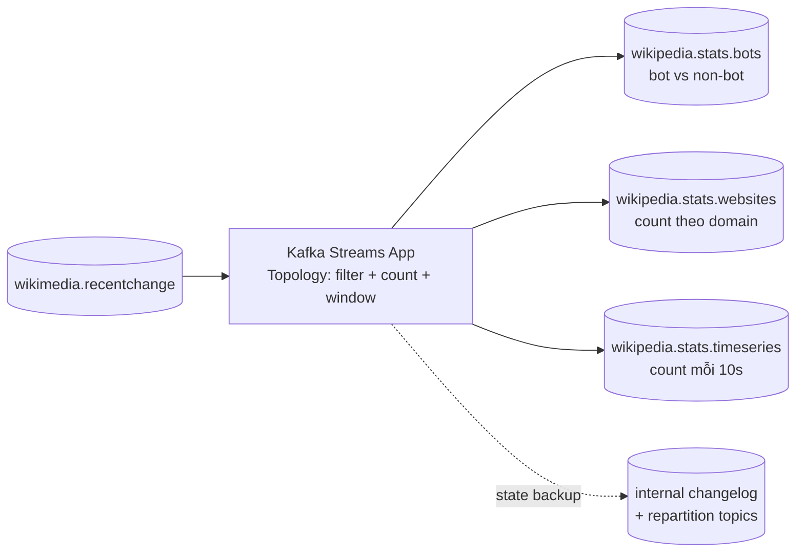

# Kafka Streams: Biến Topic Này Thành Topic Khác Mà Không Cần Cluster Riêng

Bạn đã có topic `wikimedia.recentchange` chảy liên tục. Bây giờ sếp hỏi: "Mỗi 10 giây có bao nhiêu edits? Bot chiếm bao nhiêu phần trăm? Wiki tiếng Việt, tiếng Anh, tiếng Nga mỗi thứ bao nhiêu?" Bạn có thể viết một Consumer đọc topic, đếm bằng HashMap trong RAM, rồi dùng Producer ghi kết quả ra topic mới. Chạy thử thì được, nhưng crash một cái là mất hết số đếm, scale lên 2 instances thì đếm trùng, muốn exactly-once thì tự lo transaction.

**Kafka Streams** sinh ra để bạn khỏi vật lộn với những thứ đó. Nó là thư viện biến đổi Kafka-to-Kafka: đọc một hoặc nhiều topic, tính toán, ghi ra topic mới — với state, fault-tolerance và exactly-once được lo sẵn.

---

## 1. Khi Nào Dùng Kafka Streams?

Dùng Streams khi **cả đầu vào và đầu ra đều là Kafka**, và bạn cần tính toán ở giữa:

* Đếm, lọc, map, enrich dữ liệu (ví dụ: phân loại bot vs human).
* Aggregate theo cửa sổ thời gian — windowing (ví dụ: số events mỗi 10 giây).
* Join hai streams (ví dụ: join `user_position` với `taxi_position` để tính surge pricing).
* Phát hiện gian lận, monitoring, alerting real-time.

Đừng dùng Streams khi:

* Đầu vào ở ngoài Kafka (database, API) — đó là việc của **Kafka Connect Source**.
* Đầu ra cần đổ ra hệ ngoài (S3, Elasticsearch) — đó là việc của **Kafka Connect Sink**.
* Dữ liệu do chính app bạn sinh ra lần đầu — đó là việc của **Kafka Producer**.
* Chỉ cần gửi thông báo một lần rồi quên — **Kafka Consumer** là đủ, không cần Streams.

Quy tắc một câu: **ngoài vào Kafka thì Connect Source, Kafka ra ngoài thì Connect Sink, Kafka thành Kafka có tính toán thì Streams.**

## 2. Kafka Streams Là Gì? Vì Sao Nó Khác Spark/Flink?

Định nghĩa ngắn gọn: **Kafka Streams là thư viện xử lý stream (stream processing library) chạy ngay trong ứng dụng Java của bạn.**

Khác biệt cốt lõi với Spark Streaming hay Flink:

| Tiêu chí | Kafka Streams | Spark / Flink |
|---|---|---|
| Mô hình triển khai | Thư viện nhúng trong app Java, không cần cluster riêng | Framework cần cluster riêng để chạy job |
| Đơn vị xử lý | **Từng record một (one record at a time)**, không batch | Micro-batch hoặc batch |
| State | Lưu trong Kafka (changelog topics + RocksDB local) | Lưu trong hệ state riêng của framework |
| Exactly-once | Có, cho pipeline Kafka-to-Kafka qua Transactional API | Phải cấu hình phức tạp hơn, phụ thuộc connector |
| Độ khó vận hành | Thấp: deploy như app Java bình thường | Cao: phải nuôi thêm cluster |

Nói cách khác: nếu hệ thống của bạn đã "Kafka ở giữa", Streams là con đường ít vận hành nhất để có tính toán real-time.

### 2.1. Ba tính chất phải nhớ

1. **Highly scalable, elastic, fault-tolerant.** Chạy 1 instance hay 10 instances đều được, Streams tự chia partitions cho các instances. Instance chết thì task rebalance, state khôi phục từ changelog topic trong Kafka.
2. **Exactly-once cho Kafka-to-Kafka.** Vì cả đọc và ghi đều trên Kafka, Streams tận dụng Transactional API để đảm bảo mỗi record input chỉ tạo ra đúng một lần output, kể cả khi crash giữa chừng.
3. **Không batching.** Mỗi event đến là xử lý ngay. Độ trễ tính bằng mili-giây, phù hợp alerting, fraud detection, dashboard real-time.

## 3. Kiến Trúc: Topology Đọc Topic Này, Ghi Topic Khác



Giải thích sơ đồ:

* **Input:** một topic `wikimedia.recentchange`.
* **Topology:** đồ thị các bước xử lý bạn định nghĩa bằng DSL hoặc Processor API. Ví dụ: nhánh 1 filter field `bot==true` rồi count, nhánh 2 group by `wiki` rồi count, nhánh 3 window 10 giây rồi count.
* **Output:** ba topic kết quả, mỗi topic phục vụ một dashboard khác nhau.
* **Internal topics:** Streams tự tạo các topic hậu tố `-changelog`, `-repartition` để lưu state và shuffle dữ liệu. Bạn không cần động vào, chỉ cần biết chúng tồn tại để đừng xóa nhầm.

### 3.1. Topology trong code trông như thế nào?

Về mặt khái niệm, code Streams luôn có 3 phần (chi tiết chạy thật ở bài 100):

```java
// 1. Cấu hình: app id, bootstrap servers, serde mặc định
Properties props = new Properties();
props.put(StreamsConfig.APPLICATION_ID_CONFIG, "wikimedia-stats-app");
props.put(StreamsConfig.BOOTSTRAP_SERVERS_CONFIG, "localhost:9092");
props.put(StreamsConfig.DEFAULT_KEY_SERDE_CLASS_CONFIG, Serdes.String().getClass());
props.put(StreamsConfig.DEFAULT_VALUE_SERDE_CLASS_CONFIG, Serdes.String().getClass());

// 2. Định nghĩa topology: đọc topic, tính toán, ghi topic mới
StreamsBuilder builder = new StreamsBuilder();
KStream<String, String> input = builder.stream("wikimedia.recentchange");
// ... filter / groupBy / windowedBy / count / to ...
// input.filter(...).groupBy(...).windowedBy(...).count().toStream().to("wikipedia.stats.timeseries");

// 3. Start và shutdown hook
KafkaStreams streams = new KafkaStreams(builder.build(), props);
streams.start();
Runtime.getRuntime().addShutdownHook(new Thread(streams::close));
```

Giải thích:

* `APPLICATION_ID_CONFIG` vừa là tên app, vừa là `consumer group.id` và tiền tố internal topics — đổi id là mất state cũ, coi như app mới.
* `Serdes` (serializer/deserializer) phải khớp format dữ liệu trong topic, sai serde là lỗi phổ biến nhất khi app không chạy.
* `Topology` là bất biến sau khi `start()`. Muốn đổi logic thì restart app với version mới.

## 4. Ba Bài Toán Demo Trên Dữ Liệu Wikimedia

| Bài toán | Input | Phép tính Streams | Output topic |
|---|---|---|---|
| Bot vs human | `wikimedia.recentchange` | Filter theo field `bot`, count cộng dồn | `wikipedia.stats.bots` (ví dụ: bots 9000, non-bots 20000) |
| Thống kê theo website | cùng input | Group by field `wiki` (`en.wikipedia.org`, `vi.wikipedia.org`...), count | `wikipedia.stats.websites` (ví dụ: `commons 75, en 27, eo 1`) |
| Time-series 10 giây | cùng input | Window tumbling 10s, count events mỗi window kèm `window_start/window_end` | `wikipedia.stats.timeseries` (ví dụ: `38 events trong 10s`) |

Ví dụ record output time-series (minh họa):

```json
{
  "window_start": "2026-09-16T07:00:00Z",
  "window_end": "2026-09-16T07:00:10Z",
  "event_count": 38
}
```

Điểm đáng chú ý: cả ba kết quả đều **cập nhật liên tục theo thời gian thực**. Refresh topic output vài giây là thấy số nhảy — đó là bản chất streaming, khác hẳn batch job chạy theo giờ.

## 5. So Sánh: Consumer + Producer Thủ Công vs Kafka Streams

| Tiêu chí | Consumer + Producer tự nối | Kafka Streams |
|---|---|---|
| Code | Tự viết vòng poll, HashMap đếm, producer ghi ra | DSL `filter/groupBy/count/windowedBy` có sẵn |
| State khi crash | Mất hết nếu chỉ lưu RAM, tự lo persist nếu muốn bền | State lưu RocksDB local + backup vào changelog topic, crash khôi phục tự động |
| Scale | Tự chia partition, tự lo rebalance | Thêm instance là tự rebalance tasks |
| Exactly-once | Tự lo transaction producer + offset commit, rất dễ sai | Bật config, Streams lo qua Transactional API |
| Windowing, join | Tự cài đặt cửa sổ thời gian, join nhiều topic | Có sẵn tumbling/hopping/session windows, KStream-KTable join |

Kết luận: bài toán đếm đơn giản thì tự viết cũng chạy, nhưng càng cần state, window, join, exactly-once thì Streams càng thắng áp đảo.

## 6. Cạm Bẫy Thường Gặp (Pitfalls)

* **Coi Streams như batch: chờ đủ N records mới xử lý.** Streams xử lý từng record ngay khi đến. Muốn "gom 10 giây rồi tính" phải dùng **window**, không phải `Thread.sleep` hay buffer tay.
* **Đổi `application.id` bừa bãi.** Mỗi id là một app logic riêng với state riêng. Đổi id là mất state, internal topics cũ thành rác. Đặt id có ý nghĩa (`wikimedia-stats-v1`) và giữ ổn định.
* **Quên rằng output cũng là topic Kafka bình thường.** Output topics vẫn cần chọn partitions, replication factor, retention như mọi topic khác. Topic time-series low-volume không cần nhiều partitions như topic input high-volume.
* **Xóa nhầm internal topics (`-changelog`, `-repartition`).** Đó là bộ nhớ của app. Xóa là mất state, app phải tính lại từ đầu (hoặc sai kết quả nếu dùng window).
* **Kỳ vọng học Streams trong một bài.** Một bài chỉ đủ để chạy demo. Aggregation nâng cao, joins, Interactive Queries, testing topology cần cả một khóa riêng — hãy coi bài 100 là điểm khởi đầu, không phải đích đến.

## 7. Best Practices

1. **Đặt `application.id` ổn định, có version.** Ví dụ `fraud-detector-v1`. Khi đổi logic không tương thích, lên `v2` và reset state có chủ đích thay vì ghi đè lặng lẽ.
2. **Chọn key đúng từ đầu vào.** Bài toán đếm theo website thì key nên là `wiki`, đếm theo user thì key là `user_id`. Key sai thì `groupBy` phải repartition, tốn thêm internal topic và độ trễ.
3. **Giám sát consumer lag của app id.** Streams bản chất vẫn là consumer group. Lag tăng nghĩa là topology chậm hơn tốc độ input — cần scale instances hoặc tối ưu logic.
4. **Cấu hình `num.stream.threads` trước khi thêm instances.** Một instance có thể chạy nhiều stream threads tận dụng multi-core, rẻ hơn là spin thêm container.
5. **Luôn có shutdown hook (`streams.close()`).** Đóng sạch để commit offset và flush state, tránh rebalance bẩn khi deploy.

## Kết Luận

Hãy nhớ một câu: **Kafka Streams biến bài toán "đọc topic, tính toán, ghi topic" từ project nhiều tuần thành ứng dụng Java vài chục dòng, kèm sẵn scale, state bền và exactly-once.**

Bài tiếp theo chúng ta chạy thật: **khởi động Wikimedia Streams app có sẵn, vừa chạy Producer song song để có dữ liệu real-time, vừa kiểm chứng ba topic output `bots`, `websites`, `timeseries` trong Conduktor.**
