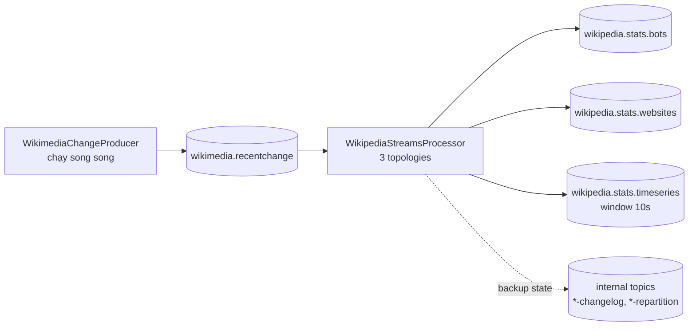

# Chạy Ứng Dụng Kafka Streams Đầu Tiên: Thống Kê Wikimedia Real-Time

Bài trước bạn đã hiểu Kafka Streams là thư viện biến topic này thành topic khác. Bài này chúng ta chạy thật một ứng dụng có sẵn: đọc `wikimedia.recentchange`, tính 3 loại thống kê, ghi ra 3 topic mới. Mục tiêu không phải hiểu từng dòng code Topology (cần cả khóa riêng), mà là nắm **quy trình vận hành**: build, chạy song song với Producer, kiểm chứng output, dọn dẹp internal topics.

---

## 1. Khi Nào Dùng Hands-On Này?

Dùng khi bạn cần kiểm chứng mẫu **Kafka-to-Kafka có tính toán**:

* Input đã có: topic `wikimedia.recentchange` (từ Producer Wikimedia ở phần trước hoặc từ Source Connector bài 098).
* Muốn 3 outputs phục vụ 3 dashboard khác nhau mà không viết Consumer-Producer thủ công.
* Muốn thấy tận mắt windowing (10 giây), group-by (theo website), filter (bot vs human) chạy real-time.

Nếu chỉ cần đổ nguyên xi sang hệ ngoài mà không tính toán, quay lại Kafka Connect Sink (bài 098). Đừng dùng Streams cho việc không có logic.

## 2. Kiến Trúc Chạy Demo



Điểm mấu chốt: **Producer và Streams app chạy song song**. Producer bơm dữ liệu real-time vào, Streams xử lý ngay khi record đến (one record at a time). Nếu chỉ chạy Streams mà không chạy Producer, app vẫn xử lý dữ liệu lịch sử cũ trong topic nhưng bạn không thấy số nhảy real-time.

## 3. Hands-On: Chuẩn Bị Code

### 3.1. Kiểm tra dependency `build.gradle`

```groovy
dependencies {
    implementation 'org.apache.kafka:kafka-streams:3.1.0'
    // ... jackson, slf4j, kafka-clients đi kèm project mẫu
}
```

Giải thích: chỉ cần đúng một dependency `kafka-streams` là đủ viết app. Version phải tương thích với Kafka cluster bạn chạy (demo dùng 3.1.0). Lệch major version là lỗi tương thích phổ biến nhất.

### 3.2. Cấu trúc code: config + topology + start

Bạn không cần hiểu chi tiết từng Processor, chỉ cần nhận ra 3 khối chuẩn mọi app Streams đều có:

```java
// 1. Config — giống Producer/Consumer quen thuộc
Properties props = new Properties();
props.put(StreamsConfig.APPLICATION_ID_CONFIG, "wikipedia-streams-app");
props.put(StreamsConfig.BOOTSTRAP_SERVERS_CONFIG, "localhost:9092");
props.put(StreamsConfig.DEFAULT_KEY_SERDE_CLASS_CONFIG, Serdes.String().getClass());
props.put(StreamsConfig.DEFAULT_VALUE_SERDE_CLASS_CONFIG, Serdes.String().getClass());

// 2. Topology — 3 nhánh tính toán
StreamsBuilder builder = new StreamsBuilder();
KStream<String, String> input = builder.stream("wikimedia.recentchange");
// nhánh bot: filter(bot) -> count -> to(wikipedia.stats.bots)
// nhánh website: groupBy(wiki) -> count -> to(wikipedia.stats.websites)
// nhánh timeseries: windowedBy(10s) -> count -> to(wikipedia.stats.timeseries)

// 3. Start
KafkaStreams streams = new KafkaStreams(builder.build(), props);
streams.start();
```

Giải thích:

* `APPLICATION_ID_CONFIG` là danh tính của app: vừa là consumer `group.id`, vừa là tiền tố internal topics. Đổi id là thành app mới mất state.
* `Serdes` phải khớp format topic. Demo dùng String cho đơn giản, production với Avro sẽ dùng Avro Serde gắn Schema Registry.
* Mỗi nhánh topology là một pipeline độc lập đọc chung input — đây là sức mạnh của Streams: một input, nhiều outputs.

## 4. Hands-On: Chạy Và Kiểm Chứng

### Bước 1 — Chạy Streams app trước

Chạy class `WikipediaStreamsProcessor` (Run trong IDE hoặc `./gradlew run`). Log sẽ hiện dày đặc vì app đang replay dữ liệu lịch sử trong topic. Đó là hành vi bình thường: Streams xử lý từ offset chưa commit.

### Bước 2 — Chạy Producer song song

Chạy class `WikimediaChangeProducer` ở terminal/IDE thứ hai. Từ lúc này dữ liệu mới chảy vào real-time và Streams xử lý ngay lập tức.

### Bước 3 — Kiểm chứng 3 topic output trong Conduktor

Refresh danh sách topics, bạn sẽ thấy thêm (tổng khoảng 13 topics gồm cả internal):

**a) `wikipedia.stats.bots` — bot vs human:**

```json
{ "bots": 9000, "non_bots": 20000 }
```

Refresh vài giây thấy số tăng — chứng tỏ count cộng dồn đang chạy.

**b) `wikipedia.stats.timeseries` — events mỗi 10 giây:**

```json
{ "window_start": "2026-09-16T07:00:00Z", "window_end": "2026-09-16T07:00:10Z", "count": 38 }
```

Mỗi record là một window 10 giây. Số count mỗi window khác nhau (38, 235...) phản ánh lưu lượng edit thật của Wikipedia.

**c) `wikipedia.stats.websites` — count theo domain:**

```json
{ "commons.wikimedia.org": 75, "en.wikipedia.org": 27, "eo.wikipedia.org": 1 }
```

Cho biết edits phân bố ra sao giữa các phiên bản ngôn ngữ — ví dụ tiếng Việt `vi.wikipedia.org` cũng sẽ xuất hiện khi có edit.

### Bước 4 — Nhận diện internal topics, đừng động vào

Bạn sẽ thấy các topic lạ như `wikipedia-streams-app-*-changelog`, `*-repartition`. Đó là **internal topics** Streams tự tạo để lưu state và shuffle dữ liệu khi `groupBy`. Tuyệt đối không xóa, không produce tay vào đó.

### Bước 5 — Dọn dẹp

```bash
# dừng Producer trước (Ctrl+C), rồi dừng Streams app (Ctrl+C)
# shutdown hook streams.close() sẽ commit offset và flush state sạch sẽ
```

Thứ tự dừng không bắt buộc, nhưng dừng Producer trước giúp bạn quan sát Streams "đuổi kịp" lag rồi về 0 trước khi tắt — cách kiểm tra app khỏe mạnh.

## 5. So Sánh: Ba Outputs Nói Lên Điều Gì?

| Output | Loại tính toán Streams | Phục vụ ai? |
|---|---|---|
| `stats.bots` | Filter + global count | Đội chống spam/vandalism: bot có đang vượt human bất thường? |
| `stats.websites` | Group-by key (`wiki`) + count | Đội vận hành: wiki nào đang nóng, cần scale cache? |
| `stats.timeseries` | Tumbling window 10s + count | Dashboard real-time: lưu lượng edits theo thời gian |

Ba mẫu này bao phủ 80% nhu cầu Streams thực tế: lọc, gom theo key, gom theo thời gian. Nắm 3 mẫu là đủ đọc mọi topology phức tạp hơn.

## Cạm Bẫy Thường Gặp

* **Chỉ chạy Streams mà không chạy Producer, rồi kết luận "app không chạy".** App vẫn chạy nhưng chỉ replay lịch sử rồi đứng yên. Muốn thấy real-time phải có nguồn bơm liên tục.
* **Hoảng vì log quá nhiều.** Replay lịch sử + internal topics + rebalance log là bình thường lần chạy đầu. Lần sau (đã có state) log sẽ êm hơn nhiều.
* **Đổi `application.id` mỗi lần chạy thử.** Mỗi id mới là state mới, internal topics mới, replay từ đầu. Giữ id ổn định trong suốt quá trình dev một tính năng.
* **Tự xóa internal topics "cho gọn".** Xóa là mất state, count cộng dồn tính lại từ 0 hoặc sai window. Coi chúng như database nội bộ của app.
* **Kỳ vọng hiểu hết Topology sau một demo.** Code Processor, custom Serde, join KStream-KTable, Interactive Queries cần khóa Streams riêng. Bài này chỉ cần trả lời được: input là gì, output là gì, mỗi output dùng phép tính nào.

## Kết Luận

Bạn vừa vận hành pipeline Kafka-to-Kafka hoàn chỉnh: Producer bơm Wikimedia real-time, Streams app tính 3 thống kê song song, 3 topic output cập nhật liên tục để dashboard đọc.

Bài tiếp theo chúng ta sang mảnh ghép thứ ba: **Schema Registry** — vì sao broker Kafka không thể tự kiểm tra dữ liệu, và ai sẽ đứng ra làm "người gác cổng" format cho mọi pipeline trên.
