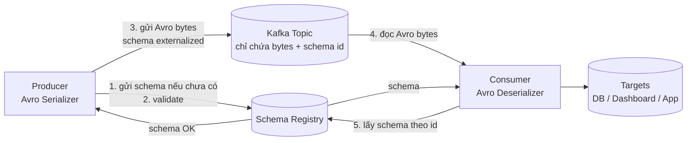

# Schema Registry: Người Gác Cổng Giữ Cho Dữ Liệu Kafka Không Vỡ Theo Thời Gian

Bạn có topic `orders` với 5 teams cùng ghi vào. Một ngày đẹp trời, team Thanh Toán đổi field `amount` từ string sang integer cho "gọn", team khác đổi `user_id` thành `userId` cho "hợp convention". Không ai báo ai. Sáng hôm sau 3 consumers crash hàng loạt vì deserializer fail, dashboard sai số, job Streams dừng. Kafka có ngăn được không? Không — vì broker chỉ thấy bytes.

**Schema Registry** sinh ra để ngăn thảm họa đó từ trước khi dữ liệu kịp vào Kafka.

---

## 1. Khi Nào Bạn Bắt Buộc Cần Schema Registry?

Cần ngay khi **nhiều hơn một team (hoặc nhiều hơn một version code) cùng đọc/ghi một topic**, hoặc khi schema có khả năng tiến hóa:

* Producer thêm/xóa/đổi tên field, đổi kiểu dữ liệu theo thời gian.
* Consumer nhiều version khác nhau cùng đọc một topic (mobile v1, v2, backend mới/cũ).
* Pipeline dài: Connect -> Kafka -> Streams -> Connect -> warehouse. Một mắt xích đổi format là sập cả chuỗi.

Ngược lại, nếu bạn làm demo một mình, một producer một consumer, schema cố định JSON tự do — chưa cần Registry cũng chạy được. Nhưng hãy coi đó là nợ kỹ thuật: càng để lâu, chi phí gắn governance càng đắt.

Quy tắc một câu: **topic càng nhiều người dùng, dữ liệu càng cần sống lâu, thì càng cần Schema Registry sớm.**

## 2. Vì Sao Broker Kafka Không Thể Tự Kiểm Tra Dữ Liệu?

Đây là điểm nhiều người thắc mắc: "Sao Kafka không validate luôn cho tiện?"

Câu trả lời nằm ở triết lý hiệu năng của Kafka:

1. **Broker chỉ thấy bytes, không parse.** Producer serialize object thành mảng bytes (`zeros and ones`), broker nhận và phân phối bytes đó mà không đọc hiểu, thậm chí không load vào memory (cơ chế **zero-copy**). Nhờ vậy Kafka đạt throughput hàng GB/giây.
2. **Nếu broker phải parse + validate từng message**, nó sẽ tốn CPU, tăng latency, mất đi lợi thế tốc độ — Kafka sẽ biến thành database kiểm tra ràng buộc, không còn là log streaming nhanh nữa.
3. Vì vậy **validation phải tách ra component riêng**: Schema Registry. Producer/Consumer nói chuyện với Registry để lấy schema và kiểm tra, broker vẫn giữ vai trò "người đưa thư mù" siêu nhanh.

Hiểu đúng: **Kafka nhanh chính vì nó không hiểu dữ liệu của bạn. Schema Registry tồn tại để bù lại phần "hiểu" đó mà không làm Kafka chậm đi.**

## 3. Kiến Trúc: Producer, Consumer Và Registry Phối Hợp Ra Sao?

Luồng chi tiết:

**Phía Producer (ghi):**

1. Trước khi gửi, Producer kiểm tra schema của record với Registry (qua `AvroSerializer`). Nếu schema chưa đăng ký, nó đăng ký mới.
2. Registry kiểm tra **compatibility** với các version cũ của cùng subject (ví dụ `demo-schemaregistry-value`). Không tương thích thì **reject ngay, dữ liệu không bao giờ tới Kafka**.
3. Nếu đạt, Producer chỉ gửi **Avro bytes gọn nhẹ + schema id (vài bytes)** vào Kafka, không gửi cả schema cồng kềnh theo từng message. Đây là lý do payload Avro qua Registry nhỏ hơn JSON thuần rất nhiều.

**Phía Consumer (đọc):**

4. Consumer đọc bytes từ Kafka, thấy schema id đi kèm.
5. Deserializer hỏi Registry lấy schema tương ứng id đó, rồi giải mã thành object. Consumer nhiều version khác nhau vẫn đọc được nhờ quy tắc compatibility.

### 3.1. Ba định dạng schema được hỗ trợ

| Format | Đặc điểm | Khi nào chọn? |
|---|---|---|
| **Avro** | Chuẩn mặc định, gọn, hỗ trợ evolution tốt, cộng đồng Kafka dùng nhiều nhất | Mặc định khi chưa có lý do đặc biệt |
| **Protobuf** | Gọn, mạnh về cross-language (gRPC stack), evolution tốt | Hệ microservices đa ngôn ngữ, đã dùng gRPC |
| **JSON Schema** | Dễ đọc, dễ debug, tương thích với JSON hiện có | Team mới chuyển từ JSON thuần, cần gắn governance dần dần |

Cả ba đều hỗ trợ kiểm tra **backward / forward / full compatibility** — bài 102 sẽ thấy tận tay thế nào là "compatible".

### 3.2. Có pipeline và không có pipeline Registry khác nhau thế nào?

| Không có Registry | Có Registry |
|---|---|
| Producer gửi gì Kafka nhận nấy, sai format phát hiện lúc consumer crash | Sai format bị chặn ở Producer, consumer không bao giờ thấy dữ liệu bẩn |
| Đổi tên field = sập downstream không báo trước | Đổi field phải qua kiểm tra compatibility, vỡ thì báo lỗi ngay lúc đăng ký schema |
| Mỗi message mang full JSON keys lặp lại, tốn dung lượng | Mỗi message chỉ mang values + schema id, schema lưu một lần ở Registry |

## 4. Cảnh Báo Vận Hành Không Thể Bỏ Qua

Schema Registry một khi đưa vào là thành **critical component**:

* **Phải high-availability.** Registry sập thì Producer mới không đăng ký schema được, Consumer mới không giải mã được. Coi nó quan trọng như chính Kafka cluster.
* **Producer/Consumer đều phải sửa code** (đổi sang Avro/Protobuf Serializer/Deserializer + config `schema.registry.url`). Đổi xong code thực tế dễ dùng hơn, nhưng phải lên kế hoạch migrate, không thể "bật một cái là xong".
* **Có learning curve.** Avro schema (record, fields, types, defaults) hay Protobuf IDL đều cần học. Đừng đánh giá thấp thời gian team làm quen.
* **Bản quyền cần lưu ý:** Schema Registry của Confluent là **source-available, không phải open-source thuần**. Có các alternative open-source khác trong hệ sinh thái, nhưng Confluent là chuẩn phổ biến nhất trong khóa này.

## Cạm Bẫy Thường Gặp

* **Nghĩ "dữ liệu nhỏ, team nhỏ nên khỏi cần".** Vấn đề schema không tỉ lệ với dung lượng mà tỉ lệ với số người chạm vào topic và tuổi thọ dữ liệu. Topic sống 2 năm với 3 teams thì kiểu gì cũng tiến hóa.
* **Tự viết validator tay trong mỗi consumer ("if field missing thì bỏ qua").** Kết quả là mỗi consumer một kiểu "tha thứ" khác nhau, dữ liệu bẩn lan khắp hệ thống. Tập trung validation ở một chỗ duy nhất là Registry.
* **Đổi schema mà không hiểu compatibility levels.** Thêm field bắt buộc không default sẽ phá backward compatibility — consumer cũ crash. Quy tắc vàng: field mới phải có default hoặc optional (chi tiết thực hành ở bài 102).
* **Để Registry single-node ở production.** Node đó chết là toàn bộ pipeline ghi mới đứng hình. Chạy cluster + backup metadata.

## Kết Luận

Hãy nhớ một câu: **Kafka giữ cho dữ liệu chảy nhanh, Schema Registry giữ cho dữ liệu chảy đúng.** Broker không validate để giữ tốc độ zero-copy, Registry đứng bên cạnh làm người gác cổng: lưu schema, chặn dữ liệu bẩn trước khi vào Kafka, và cho phép schema tiến hóa mà không sập downstream.

Bài tiếp theo chúng ta làm thật: **tạo topic `demo-schemaregistry`, đăng ký Avro schema v1, produce thử dữ liệu đúng/sai để thấy Registry reject ra sao, rồi evolve lên v2 tương thích.**
