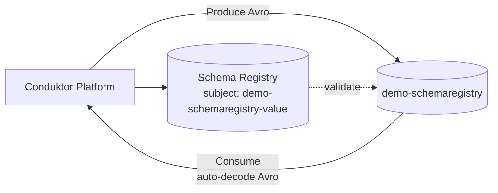

# Hands-On Schema Registry: Đăng Ký Schema, Chặn Dữ Liệu Bẩn, Evolve An Toàn

Bài trước bạn đã hiểu vì sao cần Schema Registry. Bài này chúng ta làm thật trên Conduktor + Docker: tạo topic, đăng ký Avro schema, produce thử đúng/sai để thấy Registry reject, rồi evolve schema lên v2 mà không sập consumer.

---

## 1. Khi Nào Dùng Quy Trình Này?

Đây là quy trình chuẩn mỗi khi bạn đưa một topic mới vào production có governance:

1. Tạo topic.
2. Đăng ký schema v1 cho value (và key nếu cần).
3. Producer chỉ được ghi dữ liệu đúng schema.
4. Khi nghiệp vụ đổi, evolve schema có kiểm tra compatibility rồi mới deploy producer mới.

Làm một lần cho quen, sau này mọi topic quan trọng (orders, payments, user_settings) đều lặp lại đúng 4 bước này.

## 2. Kiến Trúc Demo



Thành phần:

* Docker Compose có sẵn: ZooKeeper + Kafka + Schema Registry + Conduktor. Bấm start services là đủ, không cần cài tay.
* Topic demo: `demo-schemaregistry`, strategy `TopicNameStrategy` — subject của schema value sẽ là `demo-schemaregistry-value`.
* Format: **Avro**. Producer/Consumer trong demo là Conduktor UI với chế độ `Avro Schema Registry` (thay cho code Java, nhưng nguyên lý validate giống hệt).

## 3. Hands-On: Đăng Ký Schema v1

### 3.1. Tạo topic và mở Schema Registry

1. Trong Conduktor, tạo topic `demo-schemaregistry`.
2. Mở tab Schema của topic — đang trống, chưa có schema nào.
3. Sang mục Schema Registry bên trái, bấm tạo schema mới: type **Avro**, strategy **Topic Name**, topic name `demo-schemaregistry`, áp dụng cho **value**.

### 3.2. Nội dung `schema-v1.json`

```json
{
  "type": "record",
  "name": "myrecord",
  "fields": [
    { "name": "f1", "type": "string" }
  ]
}
```

Giải thích: record tên `myrecord` có đúng một field `f1` kiểu string. Mọi record ghi vào topic từ giờ phải có `f1` là string, không hơn không kém (ở v1).

Tạo xong, refresh tab Schema của topic — schema đã gắn vào topic.

## 4. Hands-On: Produce Đúng Thì Qua, Sai Thì Bị Chặn

Chuyển sang tab Produce của topic, chọn value type **Avro Schema Registry**.

**Thử 1 — đúng schema (`producer-v1.json`):**

```json
{ "f1": "value1" }
```

Bấm Produce: thành công. Registry chuyển JSON thành Avro bytes, consumer đọc lên vẫn thấy JSON nhờ Conduktor auto-decode.

**Thử 2 — sai tên field:**

```json
{ "f2": "value1" }
```

Bấm Produce: **lỗi server, bị từ chối**. Thông báo nói rõ schema yêu cầu `f1`. Dữ liệu không bao giờ tới Kafka.

**Thử 3 — sai kiểu dữ liệu:**

```json
{ "f1": 123 }
```

Bấm Produce: **lỗi tiếp**, vì `f1` phải là string nhưng nhận integer.

Ba thử nghiệm này chính là giá trị của Registry: **phát hiện lỗi ở cửa ghi, thay vì để consumer crash lúc nửa đêm.** Gửi thêm `{"f1": "value2"}` để có dữ liệu sạch, rồi sang tab Consume kiểm tra — các message hiện ra bình thường dưới dạng JSON.

## 5. Hands-On: Evolve Lên Schema v2 Tương Thích

Nghiệp vụ đổi: cần thêm field `f2` kiểu int. Không thể cứ thêm bừa — phải kiểm tra compatibility để consumer cũ vẫn đọc được.

### 5.1. Nội dung `schema-v2.json`

```json
{
  "type": "record",
  "name": "myrecord",
  "fields": [
    { "name": "f1", "type": "string" },
    { "name": "f2", "type": "int", "default": 0 }
  ]
}
```

Điểm mấu chốt là `"default": 0`. Nhờ default này, record cũ (chỉ có `f1`) khi đọc bằng schema v2 sẽ tự nhận `f2 = 0` — đó chính là **backward compatibility**.

### 5.2. Kiểm tra rồi mới update

1. Trong Schema Registry, mở version 1, paste schema v2 vào, bấm **Check compatibility**.
2. Kết quả `Success: Your schema is compatible` — lúc này mới bấm Update lên version 2.
3. Xem tab Structure: giờ có 2 fields `f1 (string)` và `f2 (int, default 0)`.

### 5.3. Produce với schema v2

| Payload | Kết quả | Vì sao? |
|---|---|---|
| `{"f1": "value1", "f2": 123}` | Thành công | Đủ 2 fields đúng kiểu |
| `{"f1": "value1"}` (thiếu f2) | Thành công, consumer thấy `f2 = 0` | Registry tự điền default |
| `{"f1": "value1", "f2": "abcd"}` | Bị từ chối | `f2` phải là int |

Sang tab Consume xác nhận: record đủ 2 fields hiện `f2 = 123`, record thiếu `f2` hiện `f2 = 0` tự động.

## 6. Quy Tắc Evolve An Toàn (Nhớ Nằm Lòng)

| Thao tác | An toàn? | Điều kiện |
|---|---|---|
| Thêm field mới | Có, nếu có `default` hoặc union với `null` | Consumer cũ dùng default, không crash |
| Xóa field | Nguy hiểm, chỉ khi chắc không ai dùng | Phải kiểm tra forward compatibility |
| Đổi tên field (`f1` -> `f2`) | Không — Registry coi như xóa + thêm | Muốn đổi tên phải giữ alias hoặc migrate có kế hoạch |
| Đổi kiểu (`string` -> `int`) | Không, trừ khi kiểu mới đọc được dữ liệu cũ | Luôn bị reject ở ví dụ thử 3 |

Có khóa học riêng chỉ nói về compatibility levels (BACKWARD, FORWARD, FULL, NONE), nhưng chỉ cần nhớ: **field mới luôn phải có default, không đổi tên/kiểu bừa bãi.**

## Cạm Bẫy Thường Gặp

* **Bỏ qua nút Check compatibility, cứ Update thẳng.** Đến lúc consumer cũ crash mới biết schema vỡ. Luôn check trước, update sau.
* **Thêm field bắt buộc không default "cho sạch".** Sạch với producer mới, nhưng consumer cũ đọc record mới sẽ thiếu field và crash. Default không phải option trang trí — nó là cầu nối giữa 2 versions.
* **Dùng một subject cho nhiều topic khác nhau.** Strategy `TopicNameStrategy` (`<topic>-value`) là mặc định an toàn. Dùng chung subject (RecordNameStrategy) khi chưa hiểu rõ sẽ gây xung đột compatibility giữa các topic.
* **Tưởng Avro JSON trong UI là dữ liệu thật trong Kafka.** Trong Kafka là Avro bytes + schema id, rất gọn. JSON bạn thấy là Conduktor decode giúp. Đừng đo dung lượng topic bằng mắt nhìn UI.

## Kết Luận

Bạn vừa đi hết vòng đời governance của một topic: đăng ký v1, chặn dữ liệu sai tên/kiểu ngay ở cửa ghi, evolve v2 thêm field có default, kiểm tra compatibility trước khi update, xác nhận consumer đọc được cả record cũ và mới.

Bài tiếp theo khép lại section: **bảng quyết định chọn API** — Source hay Producer, Streams hay Consumer, Sink khi nào, và Schema Registry đứng ở đâu trong mọi pipeline.
