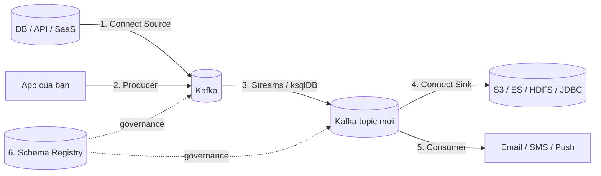

# Chọn Đúng API Kafka: Bảng Quyết Định Từ Đầu Vào Đến Đầu Ra

Bạn đã học 5 API: Producer, Consumer, Kafka Connect (Source/Sink), Kafka Streams (+ ksqlDB), Schema Registry. Câu hỏi phỏng vấn và câu hỏi thực tế giống hệt nhau: *"Dữ liệu ở đây, muốn ra kia — dùng cái gì?"* Bài này cho bạn cây quyết định để không bao giờ chọn sai.

---

## 1. Nguyên Tắc Vàng: Hỏi "Dữ Liệu Đang Ở Đâu, Muốn Đi Về Đâu?"

Mọi pipeline Kafka đều trả lời 2 câu hỏi:

1. **Điểm xuất phát là gì?** Dữ liệu đã nằm ở hệ ngoài, hay do chính app bạn sinh ra?
2. **Điểm đến là gì?** Kafka, hệ ngoài, hay topic Kafka khác?

Trả lời xong 2 câu này, bảng dưới cho bạn đáp án ngay.

## 2. Bảng Quyết Định Chi Tiết

| # | Điểm xuất phát | Điểm đến | API đúng | Ví dụ thực tế |
|---|---|---|---|---|
| 1 | Dữ liệu đã ở hệ ngoài (DB, API, file, SaaS) | Kafka topic | **Kafka Connect Source** | Debezium CDC hút transactions từ PostgreSQL; Wikimedia SSE Source hút stream Wikipedia |
| 2 | Chính app của bạn sinh ra (mobile, web, IoT, xe tải) | Kafka topic (source of truth) | **Kafka Producer** | App tài xế gửi GPS; video player gửi vị trí xem; app ngân hàng gửi ngưỡng cảnh báo |
| 3 | Kafka topic | Kafka topic khác (có tính toán) | **Kafka Streams** (hoặc ksqlDB nếu thích SQL) | Đếm bot/human, window 10s, join user_position + taxi_position ra surge_pricing |
| 4 | Kafka topic | Hệ lưu trữ ngoài (để phân tích/lưu dài hạn) | **Kafka Connect Sink** | Elasticsearch Sink đổ vào OpenSearch; S3 Sink đổ vào data lake; JDBC Sink đổ vào warehouse |
| 5 | Kafka topic | Hành động một lần rồi quên (gửi mail, SMS, push) | **Kafka Consumer** | Notification service đọc `user_alerts` rồi bắn push; service gửi email xác nhận |
| 6 | Bất kỳ pipeline nào trên, khi có >1 team hoặc schema tiến hóa | Giữ format đúng theo thời gian | **Schema Registry** (đi kèm, không thay thế) | Avro schema cho `orders-value`, check backward compatibility trước khi thêm field |

Ghi nhớ nhanh bằng một dòng chảy chuẩn:

Đọc sơ đồ từ trái sang phải chính là vòng đời dữ liệu điển hình: **vào Kafka (1-2) -> biến đổi trong Kafka (3) -> ra ngoài hoặc kích hoạt hành động (4-5), tất cả dưới sự giám sát format (6).**

## 3. Ba Cặp Dễ Nhầm Nhất

### 3.1. Connect Source vs Producer

| | Connect Source | Producer |
|---|---|---|
| Dữ liệu đã tồn tại ở đâu đó chưa? | Rồi (DB, API, file) | Chưa — app bạn là nơi sinh ra đầu tiên |
| Ai viết code kết nối? | Dùng connector có sẵn, chỉ cấu hình | Bạn viết code producer |
| Ví dụ | CDC đọc transaction log PostgreSQL | App mobile gửi vị trí qua service proxy rồi produce |

Sai lầm điển hình: viết Producer `SELECT * FROM orders` polling database mỗi 5 giây. Vừa chậm, vừa miss deletes, vừa đè DB. Dùng Debezium CDC Source thay thế.

### 3.2. Kafka Streams vs ksqlDB

Cả hai đều làm Kafka-to-Kafka, khác nhau ở giao diện:

| | Kafka Streams | ksqlDB |
|---|---|---|
| Viết bằng | Java code (DSL / Processor API) | SQL (`CREATE STREAM ... SELECT ... EMIT CHANGES`) |
| Triển khai | Thư viện nhúng trong app, deploy như app thường | Database/cluster riêng chạy queries |
| Khi nào chọn? | Logic phức tạp, cần test unit, team mạnh Java | Truy vấn nhanh, prototype, team mạnh SQL |

Bản chất ksqlDB chạy trên nền Streams — chọn cái nào là chọn giao diện, không phải chọn engine khác.

### 3.3. Connect Sink vs Consumer

| | Connect Sink | Consumer |
|---|---|---|
| Mục đích | Đổ dữ liệu vào **hệ lưu trữ** để phân tích sau (S3, ES, HDFS, JDBC) | Kích hoạt **hành động** một lần (gửi mail, push, trừ kho) |
| Dữ liệu sau khi đọc | Còn cần nguyên vẹn lâu dài | Xử lý xong có thể quên |
| Ví dụ | Đổ `wikimedia.recentchange` vào OpenSearch để search | Đọc `user_alerts` để bắn SMS cảnh báo gian lận |

Nếu đích đến là nơi "nằm lại" (store) thì Sink. Nếu đích đến là việc "làm một lần" (action) thì Consumer.

## 4. Schema Registry Đứng Ở Đâu?

Registry không nằm trong dòng chảy chính mà đứng **bên cạnh mọi mũi tên**:

* Producer/Connect Source serialize qua Registry trước khi ghi.
* Streams app deserialize/serialize qua Registry ở cả đầu đọc và đầu ghi.
* Connect Sink/Consumer deserialize qua Registry khi đọc.

Nhờ vậy một lần đổi schema được kiểm tra compatibility một chỗ, thay vì mỗi team tự kiểm tra một kiểu.

## Cạm Bẫy Thường Gặp

* **Mặc định cái gì cũng Producer/Consumer.** Đây là low-level API. Có connector sẵn mà không dùng là tự mua việc: mất fault-tolerance, idempotence, distribution người khác đã làm sẵn.
* **Dùng Streams để copy nguyên xi topic sang hệ ngoài.** Streams chỉ ra topic Kafka khác. Muốn ra S3/ES thì phải nối tiếp Sink Connector — đừng viết Streams ghi thẳng vào Elasticsearch.
* **Dùng Connect cho transform phức tạp.** Connect chỉ có Single Message Transforms đơn giản. Join, window, aggregate theo thời gian là việc của Streams.
* **Quên Registry ở pipeline "tạm thời".** Pipeline tạm sống 3 tháng rồi thành vĩnh viễn với 4 teams cùng dùng. Gắn Registry từ đầu rẻ hơn migrate sau gấp nhiều lần.
* **Nối app mobile/trình duyệt trực tiếp vào Kafka.** Luôn qua service proxy (Producer) để validate, auth, rate-limit. Không có ngoại lệ.

## Kết Luận

Tóm lại một đoạn: **ngoài vào Kafka thì Connect Source, app sinh ra thì Producer, Kafka thành Kafka thì Streams (hay ksqlDB nếu thích SQL), Kafka ra kho thì Connect Sink, Kafka ra hành động thì Consumer, và Schema Registry đứng cạnh tất cả để giữ format.**

Nắm vững bảng quyết định này là bạn đã hiểu Kafka ở tầm kiến trúc — đúng như mục tiêu của cả section.

Bài tiếp theo chúng ta rời khỏi APIs và bước vào thế giới thực: **chọn partition count và replication factor sao cho đúng ngay từ đầu**, vì chọn sai hai con số này thì API hay đến mấy cũng không cứu được.
