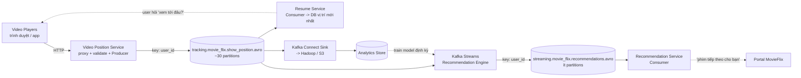

# MovieFlix: Resume Phim, Gợi Ý Real-Time Và Kho Phân Tích Trên Một Luồng Kafka

MovieFlix cho xem phim theo yêu cầu (kiểu Netflix). Business đặt 4 yêu cầu: user tắt phim hôm nay, hai ngày sau mở lại phải resume đúng chỗ; hệ thống dựng hồ sơ xem real-time; gợi ý phim tiếp theo ngay khi user thoát trình phát; mọi dữ liệu phải vào kho phân tích. Làm sao với Kafka?

Trước khi đọc tiếp, hãy thử tự phác thảo producers, topics, consumers, chỗ nào dùng Connect, chỗ nào dùng Streams. So đáp án của bạn với thiết kế dưới đây.

---

## 1. Bối Cảnh Business Và Yêu Cầu Kỹ Thuật

| Yêu cầu business | Yêu cầu kỹ thuật suy ra |
|---|---|
| Resume đúng vị trí đã xem | Mỗi lần xem sinh events vị trí; service cần biết **vị trí mới nhất** của từng (user, show) — throughput cao, cần ordering theo user |
| Hồ sơ xem real-time | Biết user xem hết season (thích) hay bỏ sau 5 phút (ghét) — dữ liệu vị trí chính là nguyên liệu |
| Gợi ý phim tiếp theo real-time | Stream vị trí -> thuật toán gợi ý -> topic recommendations, service đọc để hiển thị |
| Lưu mọi thứ vào analytics store | Đổ stream sang Hadoop/S3 để data science train model, báo cáo |

Đặc điểm tải: events vị trí gửi mỗi 20-30 giây từ mọi thiết bị đang phát — volume lớn, producers phân tán toàn cầu. Recommendations thì ngược lại: volume thấp (không thể mỗi 30 giây lại có gợi ý mới).

## 2. Thiết Kế Đề Xuất



Đọc luồng:

1. **Video player không bao giờ nói chuyện trực tiếp với Kafka.** Nó gửi vị trí về `Video Position Service` (proxy), service validate rồi produce vào `show_position`. Đây là quy tắc sắt: client -> service -> Kafka.
2. **Resume Service** consume `show_position`, chỉ giữ **vị trí mới nhất** mỗi (user, show) trong database. Khi user mở lại phim sau 2 ngày, player hỏi service này "lần trước tới đâu?".
3. **Recommendation Engine (Kafka Streams)** đọc `show_position`, chạy thuật toán (xem hết = thích, bỏ sớm = ghét), ghi gợi ý ra `recommendations`. `Recommendation Service` consume topic này để hiển thị trên portal.
4. **Kafka Connect Sink** đổ `show_position` sang analytics store. Kho này vừa phục vụ báo cáo, vừa train lại model gợi ý định kỳ.

Ví dụ event vị trí (minh họa, Avro serialize khi vào Kafka thật):

```json
{ "user_id": "user_123", "show_id": "squid_game_s01", "position_sec": 1840, "total_sec": 3600, "event_ts": "2026-09-16T07:00:20Z" }
```

## 3. Thiết Kế Topic/Partition/Replication

| Topic | Partitions | Key | Replication | Retention / lưu ý |
|---|---|---|---|---|
| `show_position` | Cao (~30, đo rồi chỉnh) | `user_id` | 3 | Volume lớn, events mỗi 20-30s từ toàn cầu; ordering cần theo user chứ không cần cross-user; multiple producers |
| `recommendations` | Ít (vài partitions) | `user_id` | 3 | Low-volume; Streams có thể enrich thêm từ analytics store (historical training) |

Vì sao key là `user_id` cho cả hai?

* `show_position`: mọi events của một user về cùng partition — Resume Service và Streams thấy đúng thứ tự xem của user đó. Thứ tự giữa 2 users khác nhau không quan trọng.
* `recommendations`: mỗi user đọc gợi ý của mình theo thứ tự, không bị gợi ý cũ đè gợi ý mới do khác partition.

Cluster brokers: tối thiểu 3 để đáp ứng replication factor 3.

## 4. Bài Học Rút Ra

1. **Một luồng, nhiều consumers độc lập.** `show_position` nuôi cùng lúc resume, recommendation real-time và analytics batch — đúng triết lý log tập trung của Kafka. Thêm consumer mới không ảnh hưởng consumers cũ.
2. **Phân biệt high-volume vs low-volume topics ngay khi thiết kế.** Topic vị trí 30 partitions, topic gợi ý vài partitions. Đảo ngược hai con số này là lãng phí (gợi ý) hoặc nghẽn (vị trí).
3. **Key là quyết định nghiệp vụ, không phải kỹ thuật thuần túy.** Chọn `user_id` vì nghiệp vụ quan tâm "hành trình của một user". Nếu sau này cần ordering theo (user, show) thì vẫn ổn vì cùng user đã cùng partition; chỉ cần logic consumer lọc thêm show.
4. **Streams không sống một mình.** Recommendation Engine muốn thông minh phải đọc thêm analytics store (lịch sử dài hạn) bên cạnh stream real-time. Thiết kế mũi tên hai chiều Streams <-> warehouse ngay từ đầu.
5. **Ví dụ VN-friendly:** thay MovieFlix bằng nền tảng học online (user xem tới bài nào, gợi ý khóa tiếp theo) hay nghe nhạc (nghe hết bài hay skip sau 10 giây) — cùng một kiến trúc, chỉ đổi tên fields.

## Cạm Bẫy Thường Gặp

* **Nối video player trực tiếp vào Kafka.** Không auth, không validate, không rate-limit — một bản app lỗi là flood topic. Luôn qua service proxy.
* **Lưu mọi position point vào DB resume.** DB phình nhanh vô ích. Resume chỉ cần latest offset mỗi (user, show) — có thể dùng log compaction hoặc upsert.
* **Để recommendations cùng partition count với show_position.** Topic low-volume mà 30 partitions thì phí tài nguyên, rebalance chậm, consumer ít mà partitions thừa.
* **Quên đổ sang analytics store, giữ hết trong Kafka.** Kafka retention mặc định 7 ngày — quá 7 ngày là mất lịch sử train model. Dữ liệu cần sống lâu phải ra warehouse qua Connect Sink.

## Kết Luận

MovieFlix chứng minh mẫu kinh điển: **một topic sự kiện high-volume (`show_position`, key `user_id`) nuôi ba đầu ra — resume (DB lookup), gợi ý real-time (Streams), phân tích dài hạn (Connect Sink).** Nắm mẫu này là nắm xương sống của mọi hệ streaming consumer-facing.

Bài tiếp theo tăng độ khó: **GetTaxi** — không còn một input mà hai luồng vị trí (user + tài xế) đổ vào một Streams job tính surge pricing, kèm yêu cầu lưu hành trình để tính cước chính xác.
