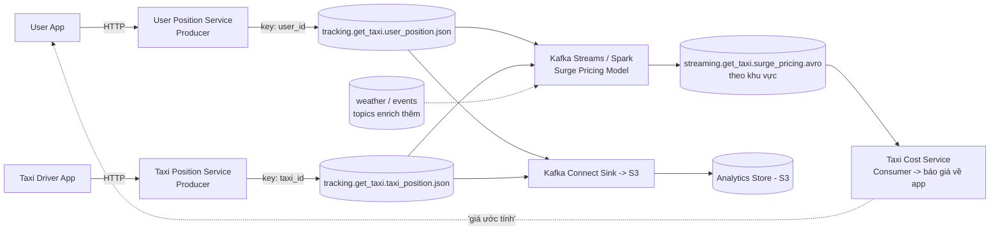

# GetTaxi: Ghép Tài Xế Gần Nhất, Surge Pricing Real-Time Từ Hai Luồng Vị Trí

GetTaxi (kiểu Grab/Uber) cần 3 khả năng: ghép user với tài xế gần đó, giá surge khi tài xế ít mà user đông, và lưu toàn bộ hành trình trước + trong chuyến đi vào analytics store để tính cước chính xác và làm data science. Thử phác thảo trước khi đọc đáp án — bài này khó hơn MovieFlix vì có **hai inputs** đổ vào một job tính toán.

---

## 1. Bối Cảnh Business Và Yêu Cầu Kỹ Thuật

| Yêu cầu business | Yêu cầu kỹ thuật suy ra |
|---|---|
| Ghép user với tài xế gần đó | Biết vị trí real-time của cả hai phía — cần **hai topics** riêng (user, taxi), mỗi bên ordering theo id của mình |
| Surge pricing khi cung < cầu | Job đọc **đồng thời** 2 luồng vị trí, tính cung/cầu theo khu vực, output ra topic giá — mẫu multi-input Streams kinh điển |
| Lưu hành trình để tính cước + data science | Đổ cả hai luồng sang S3/analytics store qua Connect Sink; dữ liệu ephemeral trong Kafka, kho mới là nơi sống lâu |
| Chịu được peak (lễ, Tết, giờ tan tầm) | Topics vị trí phải highly distributed, retention ngắn cho đỡ tốn disk |

Điểm khác MovieFlix: MovieFlix một input (`show_position`), GetTaxi hai inputs (`user_position`, `taxi_position`) — và job surge pricing có thể enrich thêm thời tiết, sự kiện, lịch nghỉ lễ.

## 2. Thiết Kế Đề Xuất



Đọc luồng:

1. Hai apps (user, tài xế) gửi vị trí về hai service proxy riêng, mỗi service produce vào topic riêng. **Không bao giờ nối mobile trực tiếp vào Kafka.**
2. Hai topics vị trí có bản chất khác nhau (user mở app thỉnh thoảng, taxi gửi liên tục) nên tách làm hai — mỗi bên scale, retention, key độc lập.
3. **Surge Pricing job (Streams hoặc Spark)** đọc cả hai topics, tính mật độ cung/cầu theo khu vực, ghi ra `surge_pricing`. Có thể join thêm topics thời tiết/sự kiện để tăng độ chính xác.
4. `Taxi Cost Service` consume `surge_pricing` để báo giá ước tính về app user.
5. **Connect Sink** đổ cả hai luồng vị trí sang S3 cho data science và đối soát cước.

Ví dụ event (minh họa):

```json
{ "user_id": "u_8891", "lat": 10.7769, "lon": 106.7009, "zone": "Q1", "event_ts": "2026-09-16T07:00:20Z" }
{ "taxi_id": "t_4520", "lat": 10.7750, "lon": 106.7020, "zone": "Q1", "status": "empty", "event_ts": "2026-09-16T07:00:22Z" }
```

## 3. Thiết Kế Topic/Partition/Replication

| Topic | Partitions | Key | Replication | Retention / lưu ý |
|---|---|---|---|---|
| `user_position` | Cao (high-volume, đo tải peak lễ/Tết) | `user_id` | 3 | Multiple producers toàn cầu; ordering theo user; dữ liệu ephemeral — retention ngắn cho đỡ tốn disk |
| `taxi_position` | Cao hơn user (taxi gửi dày hơn) | `taxi_id` | 3 | Lý do tương tự; tách topic để scale độc lập với user |
| `surge_pricing` | Trung bình, có thể theo khu vực | `zone_id` (hoặc region) | 3 | Output của Streams; volume phụ thuộc số zones cập nhật; consumer là cost service + app |

Vì sao không gộp user + taxi vào một topic? Vì chúng là **hai thực thể khác nhau**: tần suất gửi khác, key khác (`user_id` vs `taxi_id`), vòng đời khác. Gộp vào thì key lộn xộn, ordering vô nghĩa, scale một bên kéo theo bên kia. Tách ra thì mỗi topic một key sạch.

## 4. Bài Học Rút Ra

1. **Streams đọc nhiều inputs là bình thường.** Một job Streams có thể subscribe nhiều topics — đây là khác biệt lớn so với Consumer thường và là lý do surge pricing (cần cả cung lẫn cầu) bắt buộc dùng Streams/Spark chứ không thể một consumer đơn.
2. **Thiết kế cho peak, không phải trung bình.** GetTaxi ngày thường êm nhưng đêm giao thừa bùng nổ. Partition count phải tính cho peak + dự phòng 1-2 năm, vì tăng partitions sau sẽ vỡ ordering key.
3. **Ephemeral trong Kafka, vĩnh viễn trong warehouse.** Vị trí xe 5 phút trước ít giá trị real-time, nhưng 6 tháng hành trình là vàng cho data science. Retention Kafka ngắn + Connect Sink sang S3 là combo chuẩn.
4. **Luôn chừa cửa enrich.** Thiết kế surge job nhận thêm inputs (thời tiết, concert, mưa lớn ở TP.HCM) ngay từ đầu. Thêm input vào Streams topology dễ hơn nhiều so với đập đi xây lại.
5. **Ví dụ VN-friendly:** giờ tan tầm ở Nguyễn Huệ, mưa lớn là surge ngay; đêm countdown phố đi bộ Bùi Viện cầu vượt cung. Zone ở Việt Nam nên chia theo quận/phường thay vì ô vuông máy móc — khớp với cách điều hành đội xe thật.

## Cạm Bẫy Thường Gặp

* **Gộp 2 luồng vào 1 topic "cho đỡ tốn".** Tiết kiệm được vài partitions nhưng mất ordering có nghĩa, consumer phải filter lẫn nhau, scale rối. Tách topic theo thực thể.
* **Retention dài cho dữ liệu vị trí "phòng khi cần".** Vị trí cũ trong Kafka vừa tốn disk vừa không ai đọc real-time. Cần lịch sử thì query S3, đừng giữ trong Kafka.
* **Quên key (`null key`) cho topics vị trí.** Không key thì events của cùng một xe rải ngẫu nhiên khắp partitions — mất ordering hành trình, Streams join sai, tính cước lệch.
* **Nối app trực tiếp vào Kafka.** Lặp lại lần nữa vì quan trọng: mobile -> service proxy -> Kafka, không ngoại lệ (auth, validate, rate-limit, ẩn bootstrap servers).

## Kết Luận

GetTaxi dạy mẫu **hai inputs — một job — một output giá**: `user_position` + `taxi_position` (mỗi topic một key) đổ vào Streams tính surge theo zone, kết quả phục vụ báo giá real-time, toàn bộ hành trình đổ S3 cho đối soát. Nắm mẫu multi-input này là xử được mọi bài toán cung/cầu.

Bài tiếp theo đổi khẩu vị sang kiến trúc: **MySocialMedia với CQRS** — tách đường ghi (posts/likes/comments) khỏi đường đọc (aggregates/trending) để chịu tải like/comment bão hòa mà web vẫn mượt.
