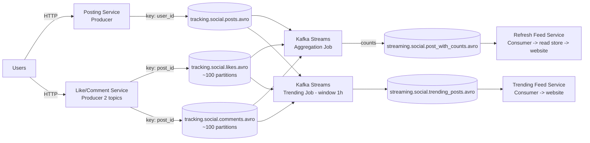

# MySocialMedia: Chịu Bão Like/Comment Bằng CQRS Trên Kafka

MySocialMedia (kiểu Facebook/Instagram thu nhỏ) cho đăng ảnh, like, comment. Business yêu cầu: user đăng/like/comment được; thấy tổng likes/comments mỗi post **real-time**; thấy trending posts; ngày đầu ra mắt đã phải chịu tải cực cao. Thử phác thảo trước khi đọc — bài này là ví dụ đẹp nhất về **CQRS** (Command Query Responsibility Segregation) trên Kafka.

---

## 1. Bối Cảnh Business Và Yêu Cầu Kỹ Thuật

| Yêu cầu business | Yêu cầu kỹ thuật suy ra |
|---|---|
| Đăng, like, comment | Ba loại commands khác nhau — tách 3 topics vì payload và volume khác nhau |
| Tổng likes/comments real-time mỗi post | Không thể `UPDATE posts SET likes = likes + 1` trên database truyền thống dưới bão concurrent (race conditions, DB sập) — phải decouple ghi và aggregate |
| Trending posts (giờ qua post nào hot?) | Query aggregate theo cửa sổ thời gian trên streams likes/comments |
| Throughput "khủng" từ ngày 1 | Mọi topics ghi phải highly distributed (likes/comments có thể ~100 partitions ở quy mô lớn) |

Ý tưởng CQRS một câu: **đường ghi (commands: post/like/comment) và đường đọc (queries: post_with_counts, trending) tách rời, nối nhau bằng Kafka Streams.** Ghi có bão thì hàng đợi Kafka hấp thụ, đọc vẫn mượt vì chỉ đọc kết quả aggregate sẵn.

## 2. Thiết Kế Đề Xuất (CQRS)



Đọc luồng theo CQRS:

* **Trái — Commands (ghi):** `Posting Service` validate rồi produce vào `posts`. `Like/Comment Service` (một producer, hai topics) produce vào `likes` và `comments`. Tách likes/comments làm hai vì payload khác nhau (like nhẹ, comment có text dài), dù cùng key `post_id`.
* **Giữa — Aggregate (Streams):** Job 1 join 3 topics, đếm likes/comments theo post, ghi ra `post_with_counts`. Job 2 tính trending trong window 1 giờ (post nào nhiều like+comment nhất), ghi ra `trending_posts`.
* **Phải — Queries (đọc):** `Refresh Feed Service` và `Trending Feed Service` consume kết quả, đổ vào read store/website. Website **không bao giờ query trực tiếp topics ghi** — chỉ đọc kết quả đã aggregate. Dù bão like, read store vẫn phẳng lặng.

Ví dụ events (minh họa):

```json
{ "event": "user_123 created post_456", "post_id": "post_456", "caption": "Hoàng hôn ở Đà Lạt", "event_ts": "2026-09-16T14:00:00Z" }
{ "event": "user_789 liked post_456", "post_id": "post_456", "event_ts": "2026-09-16T14:00:05Z" }
{ "event": "user_101 commented post_456", "post_id": "post_456", "text": "Đẹp quá!", "event_ts": "2026-09-16T14:00:09Z" }
```

Định dạng event (ai làm gì, vào cái gì, lúc nào) giúp Streams aggregate mà không cần join thêm database.

## 3. Thiết Kế Topic/Partition/Replication

| Topic | Partitions | Key | Replication | Retention / lưu ý |
|---|---|---|---|---|
| `posts` | Cao | `user_id` | 3 | Multiple producers; giữ posts của một user theo thứ tự; retention dài hơn likes/comments (post là tài sản lâu dài) |
| `likes` | Rất cao (~100 ở quy mô lớn) | `post_id` | 3 | Volume vượt xa posts; key `post_id` để mọi likes của một post về cùng partition — Streams aggregate không cần repartition |
| `comments` | Rất cao (~100) | `post_id` | 3 | Tương tự likes |
| `post_with_counts` | Trung bình | `post_id` | 3 | Output aggregate, volume ~ số posts active |
| `trending_posts` | Ít | `post_id` hoặc `window` | 3 | Output window 1h, low-volume |

Điểm thiết kế đắt giá nhất: **likes/comments key theo `post_id` chứ không phải `user_id`.** Vì câu hỏi nghiệp vụ là "post này có bao nhiêu likes?" chứ không phải "user này đã like những gì?". Key theo post gom mọi likes của post về một partition — Streams đếm chính xác, không shuffle. Posts thì ngược lại, key `user_id` vì quan tâm thứ tự đăng của mỗi user.

## 4. Bài Học Rút Ra

1. **CQRS = ghi và đọc scale độc lập.** Bão like chỉ làm topics ghi sâu thêm (Kafka hấp thụ), đường đọc vẫn serve từ kết quả aggregate sẵn. Database truyền thống gộp chung đọc/ghi vào một bảng `posts` sẽ sập đầu tiên.
2. **Key phục vụ câu hỏi aggregate, không phục vụ thói quen.** Hỏi theo post thì key `post_id`, hỏi theo user thì key `user_id`. Chọn key sai thì Streams phải repartition (thêm internal topics, thêm trễ).
3. **Producer một mình có thể ghi nhiều topics.** `Like/Comment Service` là ví dụ: một service, hai `send()` vào hai topics. Không cần 2 services chỉ vì có 2 topics.
4. **Events phải tự mô tả (self-describing).** `user_123 liked post_456 at 2PM` — đủ chủ ngữ, động từ, tân ngữ, thời gian. Event nghèo nàn (`{count: 5}`) bắt Streams phải join thêm DB, mất hết lợi thế streaming.
5. **Ví dụ VN-friendly:** livestream bán hàng (bão tim/comment), bình chọn cuộc thi (mỗi vote là một like, cần trending real-time), báo điện tử (comment mỗi bài viết). Cùng một kiến trúc CQRS, chỉ đổi tên topics.

## Cạm Bẫy Thường Gặp

* **Để website đọc trực tiếp topics ghi.** Vừa chậm (phải tự aggregate), vừa sập khi bão. Website chỉ đọc `post_with_counts`/`trending_posts` hoặc read store derived từ chúng.
* **Key likes theo `user_id` "cho đồng bộ với posts".** Đồng bộ mà sai: likes của một post rải khắp partitions, Streams phải shuffle toàn bộ trước khi đếm — tốn internal topics và trễ.
* **Dùng chung một topic cho likes + comments "cho đỡ tốn".** Payload khác nhau (like vài bytes, comment có text + media), tốc độ khác nhau, retention có thể khác nhau. Gộp vào thì consumer nào cũng phải filter thứ mình không cần.
* **Quên window cho trending.** Trending không window (cộng dồn từ ngày 1) thì post cũ mãi hot. Trending phải gắn window (1h/24h) — bài toán windowing kinh điển của Streams.
* **Bỏ qua read store, bắt browser subscribe Kafka.** Browser/mobile không bao giờ nối trực tiếp Kafka — qua feed services và read store (DB/cache) như sơ đồ.

## Kết Luận

MySocialMedia chứng minh vì sao CQRS + Kafka là combo chịu tải: **3 topics commands key đúng (`user_id` cho posts, `post_id` cho likes/comments) -> Streams aggregate -> 2 topics queries phục vụ web.** Ghi có bão đến mấy, đọc vẫn mượt vì đã tách rời.

Bài tiếp theo sang lĩnh vực đòi hỏi đúng đắn tuyệt đối: **MyBank** — dữ liệu đã nằm sẵn trong SQL, làm sao đưa vào Kafka bằng CDC thay vì polling, rồi cảnh báo gian lận real-time bằng Streams join transactions với ngưỡng user.
