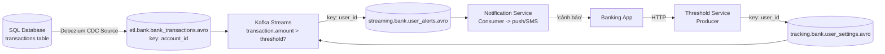

# MyBank: Cảnh Báo Gian Lận Real-Time Bằng CDC + Kafka Streams

MyBank là ngân hàng số. Dữ liệu giao dịch đã nằm sẵn trong SQL database. Business muốn tính năng mới: khi có giao dịch vượt ngưỡng user tự đặt (đổi được bất cứ lúc nào qua app), hệ thống báo ngay lập tức — chậm vài phút là user mất tiền. Thử phác thảo trước khi đọc — bài này dạy hai thứ đắt giá: **CDC Source Connector** (đừng polling database) và **Streams join hai luồng** (transactions + settings).

---

## 1. Bối Cảnh Business Và Yêu Cầu Kỹ Thuật

| Yêu cầu business | Yêu cầu kỹ thuật suy ra |
|---|---|
| Giao dịch đã có trong SQL | Đưa vào Kafka **mà không viết producer polling** — dùng Kafka Connect CDC (Debezium) đọc transaction log |
| Ngưỡng do user đặt, đổi bất cứ lúc nào, hiệu lực ngay | Topic `user_settings` riêng; Streams join mỗi transaction mới với ngưỡng mới nhất — chỉ xét từ hiện tại trở đi, không hồi tố quá khứ |
| Cảnh báo real-time, chậm là mất tiền | Streams one-record-at-a-time + Consumer notification bắn push/SMS; độ trễ mili-giây, không batch theo giờ |
| Không được miss giao dịch khả nghi | ordering theo tài khoản/user; `acks=all`, replication 3; cân nhắc exactly-once cho pipeline Kafka-to-Kafka |

Điểm khác các case trước: đây là lần đầu **đầu vào đã nằm trong database** — và là ví dụ chuẩn cho "đừng viết producer khi đã có connector".

## 2. Thiết Kế Đề Xuất



Đọc luồng:

1. **Debezium CDC Source Connector** đọc transaction log của SQL (PostgreSQL/MySQL/Oracle/SQL Server/MongoDB đều có connector) và append mỗi row change vào `bank_transactions` real-time, đúng format đẹp. Không `SELECT *` polling, không miss deletes/updates, không đè nặng DB.
2. **Threshold Service** (proxy producer) nhận ngưỡng user đặt trên app, produce event vào `user_settings`.
3. **Streams app** join hai luồng: mỗi transaction mới so với ngưỡng hiện hành của user đó. Vượt thì ghi vào `user_alerts`.
4. **Notification Service** (consumer thuần — "làm một lần rồi quên") đọc `user_alerts`, bắn push/SMS về app.

Ví dụ events (minh họa):

```json
{ "account_id": "acc_777", "user_id": "u_123", "amount": 50000000, "currency": "VND", "event_ts": "2026-09-16T07:00:20Z" }
{ "event": "user u_123 set threshold 10000000", "user_id": "u_123", "threshold": 10000000, "set_at": "2026-07-12T12:00:00Z" }
```

Giao dịch 50 triệu > ngưỡng 10 triệu -> sinh alert.

## 3. Thiết Kế Topic/Partition/Replication

| Topic | Partitions | Key | Replication | Retention / lưu ý |
|---|---|---|---|---|
| `bank_transactions` | Trung bình-cao (theo TPS ngân hàng, đo rồi chốt) | `account_id` (hoặc `user_id`) | 3 | Dữ liệu từ CDC, format Avro đẹp sẵn; ordering theo tài khoản để phát hiện chuỗi giao dịch bất thường |
| `user_settings` | Ít-trung bình | `user_id` | 3 | Volume thấp (user đổi ngưỡng thỉnh thoảng); nhưng là input join nên cần bền |
| `user_alerts` | Ít | `user_id` | 3 | Low-volume (chỉ giao dịch khả nghi); consumer là notification service |

Lưu ý join: Streams join theo key — `bank_transactions` key `account_id` và `user_settings` key `user_id` phải map được về cùng khóa join (thường là `user_id`). Thiết kế key từ đầu để hai topics join được mà không repartition nặng.

## 4. Bài Học Rút Ra

1. **Có dữ liệu trong DB thì CDC, không polling.** Debezium đọc transaction log: real-time, đủ insert/update/delete, nhẹ DB. Producer `SELECT ... WHERE updated_at > ?` polling: trễ, miss deletes, đè DB, trùng/lọt rows. Đây là khác biệt giữa junior và senior khi tích hợp legacy DB.
2. **Sự kiện ngưỡng phải giàu thông tin (event, không phải state).** Ghi `user_123 enabled threshold $1000 at 12:00 July 12` thay vì `user_123 threshold $1000`. Event mang thời gian giúp audit ("vì sao alert này sinh ra?"), replay ("nếu ngưỡng cũ khác thì sao?"), debug. State khô cằn thì mất hết ngữ cảnh.
3. **Đổi ngưỡng chỉ hiệu lực từ hiện tại trở đi.** Streams đọc từ new transactions onwards — không hồi tố alerts cho giao dịch cũ. Đây là ngữ nghĩa streaming đúng (khác batch quét lại toàn bộ lịch sử). Phải thống nhất với business từ đầu để khỏi tranh cãi "sao đổi ngưỡng mà giao dịch hôm qua không báo?".
4. **Consumer cuối là "fire-and-forget".** Notification service đọc alert rồi bắn push — đúng vai trò Kafka Consumer (hành động một lần), không phải Sink (lưu trữ). Phân biệt Store vs Action như bài 103.
5. **Ví dụ VN-friendly:** cảnh báo giao dịch > 10 triệu VND, OTP lạ lúc 2h sáng, rút tiền ở tỉnh khác nơi user sống, chuyển khoản đến STK trong blacklist. Ngưỡng theo user (mỗi người một mức) chính là lý do phải join settings thay vì hard-code.

## Cạm Bẫy Thường Gặp

* **Viết producer polling DB thay vì CDC.** Lỗi số 1. Polling là nợ kỹ thuật ngày đầu, thảm họa ngày 100 (DB lớn dần, polling chậm dần, alerts trễ dần).
* **Ghi settings dạng state khô (`{user: 123, threshold: 1000}`).** Mất thời gian, mất lý do đổi, không audit được. Luôn ghi events giàu ngữ cảnh.
* **Kỳ vọng đổi ngưỡng là báo lại quá khứ.** Streaming không hồi tố. Muốn quét lại lịch sử thì làm batch job riêng trên warehouse, đừng bắt Streams đọc lại từ offset 0 mỗi lần user đổi ngưỡng.
* **Key hai topics join không khớp.** `account_id` vs `user_id` lệch nhau thì Streams phải repartition/cogroup phức tạp. Quy ước key join từ khâu thiết kế.
* **Để notification service vừa bắn push vừa lưu DB vừa train model.** Một consumer một trách nhiệm. Lưu trữ dài hạn thì thêm Connect Sink riêng, train model thì đọc warehouse — đừng nhồi vào service real-time.

## Kết Luận

MyBank gói hai bài học senior trong một case: **đầu vào từ DB thì dùng CDC Source Connector (Debezium) thay vì tự viết producer, đầu ra cảnh báo thì Streams join transactions với settings events rồi Consumer bắn thông báo.** Kèm nguyên tắc vàng: settings ghi dạng events giàu ngữ cảnh, hiệu lực từ hiện tại trở đi.

Bài tiếp theo zoom ra toàn cảnh Big Data: **Kafka làm speed layer + ingestion buffer trước Hadoop/S3/Elasticsearch** — mẫu khởi nguồn của chính Kafka.
