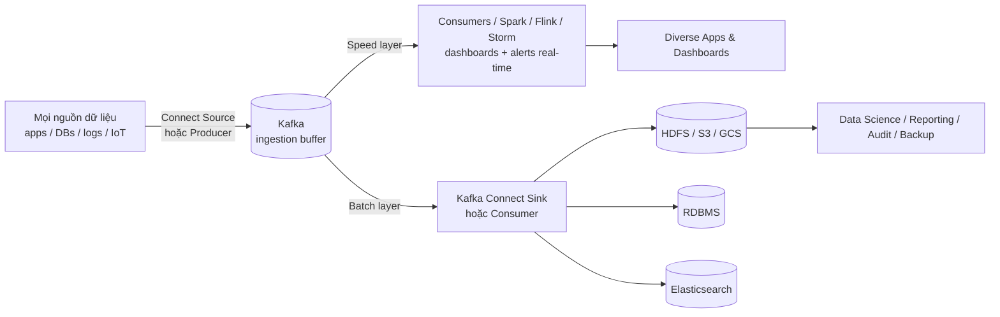

# Big Data Ingestion: Kafka Làm Speed Layer Trước Hadoop, S3, Elasticsearch

Kafka ra đời để làm gì? Câu trả lời gốc: **Big Data ingestion** — hứng mọi dữ liệu công ty vào một chỗ, rồi vừa phục vụ real-time vừa đổ sang kho batch. Bài này là mẫu kiến trúc khởi nguồn của Kafka, và đến nay vẫn là xương sống của mọi data platform (Lambda architecture).

---

## 1. Bối Cảnh Business Và Yêu Cầu Kỹ Thuật

| Yêu cầu business | Yêu cầu kỹ thuật suy ra |
|---|---|
| Mọi dữ liệu công ty (logs, orders, clicks, IoT) phải vào được một cửa | Connectors generic (Source) hút từ mọi nguồn vào Kafka — Kafka là "cửa trước" duy nhất |
| Dashboard/alerts real-time | **Speed layer**: Consumer trực tiếp hoặc Spark/Storm/Flink đọc Kafka, ra dashboard ngay mili-giây |
| Phân tích batch, data science, báo cáo, audit, backup | **Batch/slow layer**: Connect Sink hoặc Consumer đổ sang HDFS/S3/RDBMS/Elasticsearch, phân tích sau theo giờ/ngày |
| Kho batch sập hoặc chậm không được làm mất dữ liệu real-time | Kafka làm **ingestion buffer**: đệm giữa producers và stores, decoupling hoàn toàn |

Hai chữ khóa: **speed** (nhanh, real-time, trên Kafka) và **batch** (chậm, sâu, trên warehouse). Kafka đứng giữa nuôi cả hai.

## 2. Thiết Kế Đề Xuất (Lambda Đơn Giản)

Đọc luồng:

1. **Mọi producers đổ vào Kafka trước**, không ghi thẳng vào HDFS/S3. Kafka là cửa duy nhất — thêm nguồn mới không ảnh hưởng kho, đổi kho không ảnh hưởng nguồn.
2. **Speed layer** đọc Kafka trực tiếp: consumer thường cho apps, Spark/Flink/Storm cho analytics real-time (đếm, alert, dashboard sống).
3. **Batch layer** (Connect Sink hoặc consumer riêng) đổ cùng dữ liệu đó sang HDFS/S3/RDBMS/Elasticsearch. Trên kho này mới chạy data science, báo cáo tháng, audit, backup dài hạn.
4. Khi kho batch bảo trì hoặc chậm, dữ liệu vẫn nằm trong Kafka (retention) chờ đổ sau — **không mất, không chặn speed layer.**

## 3. Thiết Kế Topic/Partition/Replication (Khung Chung)

| Nhóm topic | Partitions | Key | Replication | Retention / lưu ý |
|---|---|---|---|---|
| Topics ingestion thô (mọi nguồn) | Theo throughput từng nguồn (đo riêng, xem bài 105) | Key nghiệp vụ của nguồn (user_id, order_id...) | 3 | Retention vừa đủ làm buffer (ngày/tuần); kho dài hạn là HDFS/S3, không phải Kafka |
| Topics phục vụ speed layer | Theo số consumers song song cần thiết | Giữ key để Streams/Flink xử lý đúng | 3 | Có thể ngắn hơn vì dashboard chỉ cần gần đây |

Nguyên tắc: **Kafka giữ "đủ lâu để buffer + real-time", không giữ "mãi mãi để lưu trữ".** Lưu mãi mãi là việc của S3/HDFS (rẻ hơn hàng chục lần). Topic nào cũng retention vô hạn trong Kafka là đốt tiền disk.

## 4. Bài Học Rút Ra

1. **Decoupling hai chiều.** Nguồn không biết kho (chỉ biết Kafka), kho không biết nguồn (chỉ đọc Kafka). Đổi HDFS sang S3, thêm Elasticsearch — producers không sửa một dòng.
2. **Một dữ liệu, hai tốc độ.** Cùng một event vừa lên dashboard mili-giây (speed) vừa vào báo cáo tháng (batch). Không cần 2 pipelines riêng từ nguồn — Kafka fan-out một lần.
3. **Buffer cứu cả hệ thống.** Kho batch chậm/bảo trì/sập — Kafka giữ hộ. Nguồn burst traffic (flash sale, World Cup) — Kafka hấp thụ rồi xả dần sang kho. Không có buffer, mọi spike đều thành incident.
4. **Connect là cầu hai đầu.** Source generic đưa vào, Sink generic đổ ra — đúng vai trò Extract/Load. Transform nặng để cho Streams/Flink ở giữa.
5. **Ví dụ VN-friendly:** sàn thương mại điện tử (orders vào Kafka -> dashboard real-time + đổ S3 train gợi ý), chuỗi cửa hàng (POS mỗi chi nhánh produce sales -> dashboard doanh thu real-time + đổ warehouse báo cáo cuối ngày), nhà mạng (CDR vào Kafka -> chống gian lận cước real-time + lưu HDFS đối soát).

## Cạm Bẫy Thường Gặp

* **Ghi thẳng từ nguồn vào HDFS/S3, bỏ qua Kafka.** Mất speed layer, mất buffer. Kho chậm là nguồn nghẽn theo. Thêm dashboard real-time sau này phải đục lại mọi nguồn.
* **Biến Kafka thành data warehouse (retention vô hạn).** Disk đắt, brokers nặng, elections chậm, chạm trần partitions. Kafka là log có hạn, warehouse mới là nơi lưu vĩnh viễn.
* **Dùng batch job quét DB thay vì stream vào Kafka rồi đổ kho.** Trễ giờ/ngày, miss deletes, đè DB — quay lại bài học CDC của MyBank.
* **Một topic cho mọi loại dữ liệu "cho tiện ingestion".** Tiện 1 ngày, khổ 1 năm: key lộn xộn, format lộn xộn, consumer nào cũng phải filter. Mỗi loại dữ liệu một topic, đặt tên theo convention bài 106.

## Kết Luận

Mẫu Big Data ingestion gói trong một câu: **Kafka là cửa trước (ingestion buffer) — speed layer đọc thẳng để real-time, batch layer đổ sang HDFS/S3/ES để phân tích sâu.** Hiểu mẫu này là hiểu vì sao Kafka ra đời và vì sao mọi data platform hiện đại đều có nó ở giữa.

Bài cuối cùng của section thu hẹp về một usecase khởi nguồn khác của Kafka: **gom logs và metrics từ hàng nghìn máy về một chỗ** — khi nào được phép `acks=0`, replication thấp, và đổ ra Splunk/ELK ra sao.
