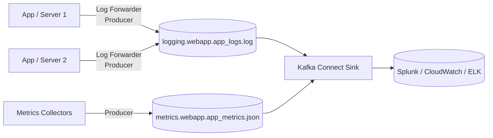

# Gom Logs Và Metrics: Usecase Khai Sinh Kafka Và Cách Tuning Đánh Đổi

Một trong những usecase đầu tiên khai sinh ra Kafka: hàng nghìn servers, mỗi server đẻ logs và metrics liên tục — làm sao gom về một chỗ để tìm lỗi và vẽ dashboard? Bài này là mẫu đơn giản nhất section, nhưng dạy bài học tuning quan trọng nhất: **không phải dữ liệu nào cũng cần durability tối đa.**

---

## 1. Bối Cảnh Business Và Yêu Cầu Kỹ Thuật

| Yêu cầu business | Yêu cầu kỹ thuật suy ra |
|---|---|
| Mọi app/server đẩy logs về chỗ tập trung | Topics `app_logs`, tách riêng `app_metrics` — producers là log forwarders trên từng máy |
| Metrics để vẽ dashboard, alerting | Producer metrics riêng (collectors), throughput rất cao, message nhỏ đều |
| Tra cứu trên Splunk/CloudWatch/ELK | **Connect Sink** đổ từ Kafka sang hệ logging — Kafka là buffer, Splunk/ELK mới là nơi search |
| Mất vài dòng log chấp nhận được, nhưng phải nhanh và rẻ | **Nới durability để lấy throughput**: `acks=0` hoặc `1`, replication factor thấp hơn chuẩn — ngược hẳn với MyBank |

Dòng cuối là linh hồn bài này: logs/metrics là dữ liệu **tái tạo được** (mất thì server vẫn chạy, log mới lại đẻ) và **volume khổng lồ**. Áp chuẩn ngân hàng (`acks=all`, replication 3) vào đây là đốt tiền và bóp throughput vô ích.

## 2. Thiết Kế Đề Xuất

Đọc luồng:

1. Mỗi app/server chạy **log forwarder** (producer nhẹ) đẩy logs vào topic `app_logs`. Đây là high-throughput producer: nhiều máy, gửi liên tục.
2. **Metrics collectors** (Telegraf/Prometheus exporters hoặc agent tự viết) đẩy số liệu vào topic `app_metrics` riêng. Tách khỏi logs vì format khác (JSON metrics vs text log), consumer khác (dashboard vs search), retention có thể khác.
3. **Connect Sink** (Splunk Sink, Elasticsearch Sink...) đọc cả hai topics, đổ sang Splunk/CloudWatch/ELK. Từ đó mới search log, vẽ metrics.
4. Kafka ở giữa làm buffer: Splunk bảo trì thì logs vẫn nằm trong Kafka chờ — không mất, không chặn apps.

## 3. Thiết Kế Topic/Partition/Replication Và Tuning

| Topic | Partitions | Key | Replication | Retention / tuning |
|---|---|---|---|---|
| `app_logs` | Cao (theo số servers x logs/s mỗi server) | Thường `null` hoặc hostname — ít cần ordering cross-line | 2 (thay vì 3) | Retention ngắn (ngày); producer `acks=0` hoặc `1` để tối đa throughput; chấp nhận mất ít khi broker sập |
| `app_metrics` | Cao | Thường `null` hoặc metric name | 2 | Tương tự logs; metrics cũ nhanh mất giá trị real-time, kho dài hạn là hệ monitoring |

Giải thích tuning (quan trọng nhất bài):

* **`acks=0`**: producer gửi xong không chờ broker xác nhận — nhanh nhất, nhưng mất dữ liệu nếu broker chết đúng lúc. Chỉ dùng khi mất vài points chấp nhận được (metrics, debug logs).
* **`acks=1`**: chờ leader ghi xong, không chờ replicas — cân bằng trung bình. Lựa chọn phổ biến cho logs production.
* **`acks=all`**: chờ đủ in-sync replicas — an toàn nhất, chậm nhất. Dành cho MyBank (tiền), **không dành cho logs**.
* **Replication 2 thay vì 3**: ít bản sao hơn, ít network/disk hơn, vẫn chịu được 1 broker chết. Với dữ liệu tái tạo được, đánh đổi này hợp lý.

| Mức durability | Cấu hình | Dùng cho |
|---|---|---|
| Thấp (nhanh, rẻ, mất ít được) | `acks=0`, RF thấp | Metrics, debug logs |
| Trung bình | `acks=1`, RF 2 | App logs production thông thường |
| Cao (chậm hơn, đắt hơn, không được mất) | `acks=all`, RF 3, `min.insync.replicas=2` | Bank transactions, orders, payments |

## 4. Bài Học Rút Ra

1. **Durability là núm vặn, không phải hằng số.** Cùng một cluster Kafka có thể vừa chạy topics ngân hàng (`acks=all`, RF 3) vừa chạy topics logs (`acks=0/1`, RF 2). Tuning theo giá trị dữ liệu, không theo thói quen.
2. **Tách logs và metrics làm hai topics.** Format khác, vòng đời khác, consumers khác (search vs dashboard). Gộp vào thì cả hai bên đều phải filter rác của bên kia.
3. **Kafka là buffer, không phải nơi search.** Đừng `console-consumer` mò log production hay đòi query trên Kafka. Search là việc của Splunk/ELK, Kafka chỉ đảm bảo dữ liệu tới đó đầy đủ và đúng thứ tự.
4. **Log forwarder cũng là producer cần chăm.** Forwarder crash là mù logs đúng lúc cần nhất (khi sự cố). Giám sát lag/throughput của producers này như giám sát mọi producer quan trọng khác.
5. **Ví dụ VN-friendly:** hệ microservices thương mại điện tử (mỗi service đẩy logs về ELK để trace đơn hàng), game mobile (metrics CCU, latency theo từng server để alert), ngân hàng số (logs audit vẫn phải durability cao — ngoại lệ xác nhận quy tắc: logs nào liên quan tiền thì quay về `acks=all`).

## Cạm Bẫy Thường Gặp

* **Áp `acks=all` + RF 3 cho mọi topic "cho chắc".** Chắc thì chắc, nhưng throughput logs tụt, disk phình, latency tăng — trả giá cao cho dữ liệu mất cũng không sao. Chắc phải đúng chỗ.
* **Ngược lại: để `acks=0` cho topic tiền vì copy config logs.** Thảm họa. Config producer/Connect phải theo topic, không copy-paste giữa domains khác nhau. Review `acks` + RF trong checklist tạo topic (bài 105).
* **Gộp logs + metrics + business events vào một topic.** Ba loại ba số phận: logs search, metrics dashboard, events xử lý nghiệp vụ. Gộp thì tuning durability kiểu gì cũng sai cho ít nhất một bên.
* **Giữ logs trong Kafka quá lâu "để khi cần thì mò".** Retention dài cho high-volume topics là disk nổ. Cần tra cứu cũ thì query Splunk/ELK/S3 — đó là lý do tồn tại của Connect Sink.
* **Quên giám sát chính pipeline logging.** Pipeline logs sập mà không ai biết thì lúc sự cố production mới phát hiện ra mình mù. Lag của consumer group Sink và throughput topics logs phải có alert.

## Kết Luận

Logs/metrics dạy nguyên tắc tuning cuối cùng của section: **hỏi "mất cái này thì sao?" trước khi hỏi "cấu hình gì?".** Mất vài dòng log thì `acks=0`, RF 2 cho nhanh rẻ; mất một giao dịch thì `acks=all`, RF 3 không thỏa hiệp. Senior không phải người nhớ nhiều config nhất, mà là người vặn đúng núm cho đúng dữ liệu.

Hết section Real-World Insights: từ chọn partitions/replication (105), đặt tên topics (106), qua 6 case studies MovieFlix/GetTaxi/SocialMedia/MyBank/BigData/Logging (107-112) — bạn đã có bộ khung thiết kế mọi hệ Kafka thực tế: bối cảnh -> yêu cầu -> topics/partitions/keys -> bài học. Section tiếp theo sẽ đi sâu vào vận hành và tối ưu Kafka ở production.
