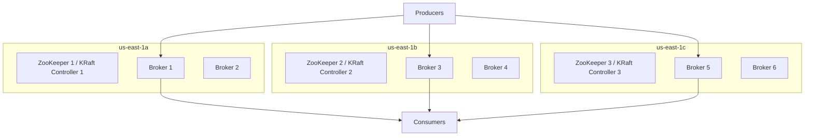

# Dựng Kafka Cluster Chuẩn Enterprise: Đừng Để 1 Data Center Đánh Sập Cả Hệ Thống

Bạn đã chạy được Kafka trên laptop với 1 broker. Nhưng mang đúng cụm đó lên production thì chỉ cần mất điện 1 Availability Zone là toàn bộ pipeline đứng yên. Vậy enterprise dựng Kafka thế nào để vừa chịu tải, vừa sống sót khi 1 trung tâm gặp sự cố?

Bài này cho bạn bức tranh tổng thể của Kafka admin: kiến trúc multi-rack, vai trò ZooKeeper/KRaft, sizing broker, và những thành phần xung quanh mà khóa học local không hề có.

---

## 1. Vấn Đề Vận Hành: Setup Khó Hơn Dùng Rất Nhiều

Dùng Kafka thì dễ: chỉ cần `bootstrap.servers` là produce/consume được. Nhưng **dựng và nuôi** cluster thì là câu chuyện khác hẳn:

- Đồng bộ cấu hình hàng chục broker, DNS, chứng chỉ bảo mật.
- Tính toán dung lượng disk, throughput, replication.
- Backup, failure drill, rolling upgrade không downtime.
- Monitoring, alerting, on-call khi partition under-replicated lúc 2h sáng.

Vì vậy mỗi mảng trên đều xứng đáng một khóa học riêng. Bài này chỉ chốt tư duy kiến trúc chuẩn để bạn không thiết kế sai từ đầu.

## 2. Kiến Trúc Chuẩn: Brokers Trải Đều Qua Nhiều Rack/AZ

Nguyên tắc sắt: **không bao giờ dồn mọi failure point vào một chỗ**.

Mô hình kinh điển trên AWS trong transcript:

- 3 Availability Zones: `us-east-1a, 1b, 1c`.
- Mỗi AZ: 1 ZooKeeper (ngày nay là KRaft controller) + 2 Kafka brokers. Tổng **3 controllers + 6 brokers**.
- Mỗi broker nằm trên **server vật lý riêng** với controller. Không nhét chung ZooKeeper và broker vào cùng máy — nếu máy đó chết bạn mất cả 2 lớp cùng lúc.

Tại sao thêm broker phải thêm **3 một lần**? Để mỗi AZ vẫn cân bằng số lượng, replica phân bổ đều, khi mất 1 AZ thì 2 AZ còn lại vẫn đủ quorum và đủ ISR.

> Ngày nay ZooKeeper đã dần bị thay bằng **KRaft**, nhưng nguyên lý quorum lẻ (tối thiểu 3 controllers) không đổi.

## 3. Cần Bao Nhiêu Broker? Công Thức Sizing

Không có con số thần thánh. Bạn phải tính 3 biến rồi test tải thực tế:

| Biến đầu vào | Câu hỏi thiết kế |
|---|---|
| Throughput | Mỗi giây bao nhiêu MB vào/ra? Peak gấp mấy lần trung bình? |
| Retention | Giữ dữ liệu bao lâu (7 ngày? 30 ngày?) × replication.factor = tổng disk |
| Replication factor | Production thường `3`, `min.insync.replicas=2` để chịu mất 1 broker mà không mất data |

Tin vui: Kafka **scale ngang rất dễ** — thêm broker mới vào cluster đang chạy được. Nhưng thêm xong phải **rebalance partitions** thì tải mới dàn đều, nếu không broker mới vẫn rỗng.

## 4. Cluster Không Chỉ Có Broker

Một enterprise cluster đầy đủ còn có:

- **Kafka Connect cluster**: chạy riêng để bơm dữ liệu ra S3/Elasticsearch/DB mà không tranh CPU với broker.
- **Schema Registry**: chạy ít nhất **2 nodes** cho high availability, nếu không producer dùng Avro/Protobuf sẽ tắc.
- **UI và automation**: Conduktor, Confluent Control Center, hoặc tool nội bộ để xem topic, consumer lag, ACL mà không phải SSH từng broker.
- **Infrastructure as Code**: mọi cấu hình broker, topic, ACL đều version hóa (Terraform/Ansible). Không SSH sửa tay rồi quên.

## Pitfalls / Best Practice Production

- **Pitfall: dựng 1 broker, 1 AZ rồi gọi là production.** Mất 1 máy là mất ISR, topic unavailable. Production tối thiểu 3 brokers trải 3 racks.
- **Pitfall: nhồi nhiều dịch vụ vào cùng host với broker.** Broker rất nhạy với disk latency và page cache. Share host với ZooKeeper/Connect là tự tạo noisy neighbor.
- **Best practice:** nếu team chưa có admin cứng, hãy bắt đầu bằng **Kafka as a Service** (MSK, Confluent Cloud, Aiven, Upstash...). Họ lo setup, patching, monitoring; bạn chỉ lo dùng. Khi đủ lớn và cần tối ưu chi phí mới tự vận hành.
- **Best practice:** tự động hóa từ ngày đầu: provisioning, rolling restart, backup `server.properties`, đo URP (sẽ học ở bài monitoring sau).

## Kết Luận

Tóm lại một câu: **enterprise Kafka = brokers dàn đều multi-rack + quorum controller lẻ + sizing theo throughput/retention/replication + Connect/Schema Registry/UI/automation đi kèm.**

Khi cụm đã dựng xong, việc tiếp theo không phải là ăn mừng mà là **giám sát nó và thành thạo operations** — đó chính là bài tiếp theo về monitoring và rolling restart.
