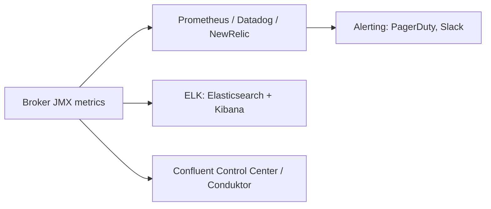

# Kafka Đang Chết Dần Mà Không Ai Biết: Monitoring Và Operations Cứu Cluster Thế Nào

Cluster Kafka không bao giờ "chết ngay" — nó chết dần: replica tụt lại, request xếp hàng dài, disk đầy dần. Không có monitoring, bạn chỉ phát hiện khi consumer lag hàng triệu message và sếp gọi lúc nửa đêm. Vậy phải nhìn vào đâu, và admin cần làm chủ những thao tác nào?

---

## 1. Vấn Đề Vận Hành: Kafka Im Lặng Trước Khi Sập

Kafka broker quá tải không báo lỗi ầm ĩ. Nó chỉ chậm lại vài chục ms mỗi request, ISR rụng dần, rồi mới unavailable. Vì vậy monitoring không phải optional — nó là **hệ thần kinh** của cluster.

## 2. Kiến Trúc Monitoring: JMX Là Gốc Của Mọi Thứ

Mọi metric Kafka đều lộ ra qua **JMX** (Java Management Extensions). Bạn cắm các backend phổ biến vào đó:

Ba nhóm metric tối thiểu phải có dashboard + alert:

| Metric | Ý nghĩa | Ngưỡng nguy hiểm |
|---|---|---|
| **Under-Replicated Partitions (URP)** | Số partition mà ISR thiếu replica. URP > 0 nghĩa là có replica không theo kịp leader | URP > 0 kéo dài quá vài phút = broker quá tải, network hoặc disk có vấn đề |
| **Request Handler Utilization** | Mức dùng thread IO/network của broker. Cho biết broker có đang "đuối" không | Tiệm cận 100% = cần broker khỏe hơn hoặc thêm broker |
| **Request Timing (latency)** | Thời gian trả lời produce/fetch request. Latency càng thấp càng tốt | Tăng đột biến = GC, disk chậm, hoặc quá nhiều partitions trên 1 broker |

Đây chỉ là mẫu. Kafka có hàng trăm metric JMX, tài liệu chính thức liệt kê đầy đủ cách cắm Prometheus/JMX Exporter — hãy đọc trước khi production.

## 3. Cấu Hình / Thao Tác: 7 Operations Admin Phải Làm Nhắm Mắt Cũng Được

Monitoring cho bạn biết *khi nào* phải hành động. Còn đây là *những việc* phải biết làm:

1. **Rolling restart brokers**: restart từng broker một, đợi ISR hồi phục rồi mới restart broker tiếp theo. Không bao giờ restart cả cụm cùng lúc.
2. **Update config topic/broker**: đổi retention, segment, ACL mà không downtime (dùng `kafka-configs.sh`, học ở section 17).
3. **Rebalance partitions**: sau khi thêm broker, phân bổ lại partitions/leaders cho đều.
4. **Tăng/giảm replication factor**: tăng để an toàn hơn, giảm khi cần tiết kiệm disk — đều phải reassignment.
5. **Thêm broker**: scale ngang khi throughput/disk tăng.
6. **Thay thế / gỡ broker**: thay disk hỏng, decommission máy cũ mà không mất ISR.
7. **Upgrade Kafka zero-downtime**: upgrade từng broker theo đúng thứ tự version tương thích, rolling như restart.

Mỗi thao tác trên đều có khóa 4-5 giờ riêng. Đừng thử lần đầu trên production — hãy dựng staging y hệt prod để diễn tập.

## Pitfalls / Best Practice Production

- **Pitfall: chỉ monitor CPU/RAM của máy mà bỏ qua URP và request latency.** Broker có thể CPU 40% nhưng URP tăng vọt vì disk IOPS nghẽn — nhìn CPU bạn tưởng mọi thứ ổn.
- **Pitfall: không diễn tập rolling restart/upgrade.** Đến lúc CVE bắt buộc patch là cuống, restart sai thứ tự gây unavailable.
- **Best practice:** alert theo symptom (URP > 0 quá N phút, request latency p99 vượt ngưỡng, disk > 70%), không alert theo nguyên nhân đoán mò.

## Kết Luận

Tóm lại: **JMX + URP/Handler/Latency để phát hiện sớm, cộng 7 kỹ năng operations (restart, config, rebalance, replication, add/replace/remove broker, upgrade) để xử lý.**

Giám sát giúp cluster sống sót, nhưng kẻ tấn công thì monitoring không chặn được. Bài tiếp theo sẽ nói về lớp còn thiếu: **security — encryption, authentication, authorization**.
