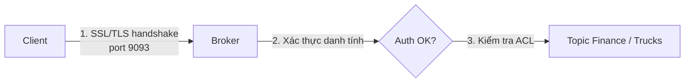

# Kafka Mặc Định Mở Toang: 3 Lớp Security Enterprise Nào Cũng Phải Bật

Kafka bạn chạy local đang ở chế độ nguy hiểm nhất: bất kỳ client nào cũng kết nối được, đọc/ghi topic nào cũng được, và dữ liệu chạy plain-text trên cổng 9092. Mang nguyên cấu hình đó lên production nghĩa là ai cũng có thể đánh cắp dữ liệu, bơm message bẩn, thậm chí xóa topic. Bài này hệ thống hóa 3 trụ cột bảo mật Kafka.

---

## 1. Vấn Đề Vận Hành: 3 Lỗ Hổng Chí Mạng Của Cluster Mặc Định

| Trạng thái mặc định | Rủi ro thực tế |
|---|---|
| **No authentication** — ai cũng kết nối được | Kẻ lạ join cluster, giả mạo producer/consumer |
| **No authorization** — client nào cũng đọc/ghi mọi topic | Đọc trộm topic `finance`, ghi đè dữ liệu, xóa topic |
| **No encryption** — plain-text trên network | Bị sniff password, số thẻ tín dụng ngay trên đường truyền |

Vì vậy production bắt buộc phải có mô hình security đầy đủ, không phải "bật sau cũng được".

## 2. Kiến Trúc: Encryption → Authentication → Authorization

Ba lớp này xếp chồng, thiếu một là thủng:

### Lớp 1: Encryption (SSL/TLS)

Mã hóa đường truyền client ↔ broker, giống HTTPS. Bật SSL và mở cổng riêng (ví dụ `9093` cho SSL thay vì `9092` plain-text), client và broker thống nhất cipher rồi mới trao đổi dữ liệu.

- Chi phí performance có, nhưng từ **Java 11 trở đi SSL nhanh hơn nhiều**, gần như không đáng kể. Đừng lấy lý do performance để bỏ encryption.
- Encryption là nền bắt buộc cho lớp 2, vì credential xác thực phải đi trong kênh mã hóa.

### Lớp 2: Authentication — Broker Biết Client Là Ai

| Cơ chế | Cách hoạt động | Khi nào dùng |
|---|---|---|
| **SSL** (mTLS) | Client đưa certificate, broker verify | Mạnh, chuẩn enterprise có PKI sẵn |
| **SASL/PLAIN** | Username + password plain | Dễ setup nhất nhưng yếu, bắt buộc kèm SSL. Đổi password phải **reboot broker** → chỉ dùng dev |
| **SASL/SCRAM** | Username + password + salt challenge | Mạnh hơn nhiều, user lưu trong ZooKeeper/KRaft, **thêm/xóa user không cần restart** → khuyên dùng cho hầu hết team |
| **SASL/GSSAPI (Kerberos)** | Tích hợp Active Directory | Rất mạnh nhưng cực khó setup. Chỉ đáng nếu công ty đã có Kerberos sẵn |
| **SASL/OAUTHBEARER** | OAuth2 token | Hợp với hệ sinh thái cloud/microservices, xem thêm docs Kafka |

### Lớp 3: Authorization — Biết Là Ai Rồi, Được Làm Gì?

**ACL (Access Control List)** do admin duy trì để onboard từng user/app. Ví dụ một cluster có 2 topics:

- `finance` (nhạy cảm), `trucks` (thường).
- Alice có ACL cho phép đọc/ghi `finance`. Bob bị deny trên `trucks`.

Nhờ đó topic nhạy cảm không còn "ai cũng đọc được".

## 3. Cấu Hình / Thao Tác: Thứ Tự Triển Khai Chuẩn

1. Bật **SSL encryption** trước (cấp cert, mở listener `SSL://:9093`).
2. Chọn **1 cơ chế SASL** (khuyên SCRAM cho team mới) và tạo user.
3. Viết **ACL** theo nguyên tắc least-privilege: mỗi service account chỉ đọc/ghi đúng topics nó cần.
4. Test bằng client Java trước — **Java client hỗ trợ security đầy đủ nhất**, các ngôn ngữ khác ngày nay đã tốt hơn nhiều nhưng vẫn nên verify.

Nếu dùng Kafka as a Service (MSK, Confluent Cloud...), 3 lớp này đã dựng sẵn, bạn chỉ cần làm theo hướng dẫn lấy cert/credential và khai ACL.

## Pitfalls / Best Practice Production

- **Pitfall: bật SASL/PLAIN không kèm SSL.** Password chạy plain-text, sniff một phát là mất cả cluster.
- **Pitfall: một super-user dùng chung cho mọi service.** Mất 1 key là mất hết, và không bao giờ audit được ai đã xóa topic.
- **Best practice:** mỗi microservice một service account + ACL riêng; xoay credential định kỳ; log mọi thay đổi ACL như code.

## Kết Luận

Tóm lại: **encryption giấu dữ liệu trên đường đi, authentication định danh client, authorization (ACL) phân quyền từng topic.** Thiếu một lớp là cluster vẫn mở toang.

Có cluster an toàn rồi, câu hỏi tiếp theo của enterprise toàn cầu là: một region một cluster thì đồng bộ dữ liệu xuyên lục địa thế nào? Bài sau về **multi-cluster và MirrorMaker 2** sẽ trả lời.
