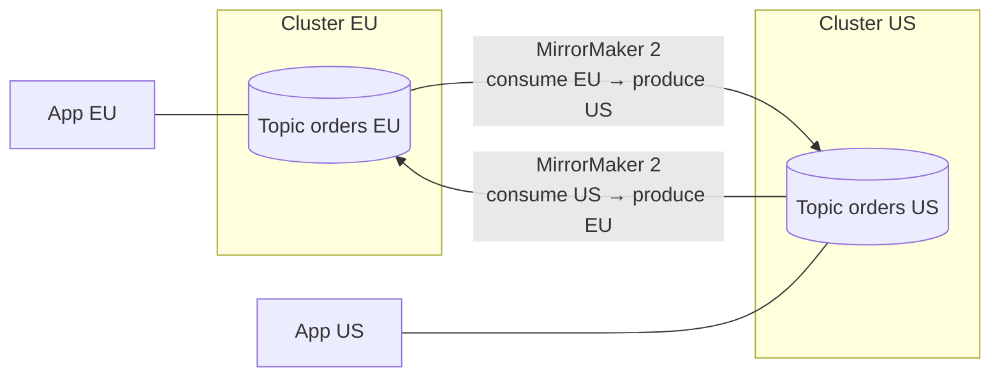

# Một Cluster Không Cân Được Cả Thế Giới: Multi-Cluster Và MirrorMaker 2

Kafka replication chỉ mạnh **trong một region**. Enterprise có user ở Mỹ, EU, châu Á mà dồn hết về một cluster ở Virginia thì latency cao, đứt cáp là sập toàn cầu. Vậy làm sao có cluster mỗi châu lục mà dữ liệu vẫn đồng bộ? Bài này giải thích 2 mô hình replication liên cluster và công cụ chuẩn MirrorMaker 2.

---

## 1. Vấn Đề Vận Hành: Single Cluster Không Vượt Được Ranh Giới Region

Một Kafka cluster đặt ở một region là tối ưu cho throughput nội bộ, nhưng:

- App ở xa phải produce/consume xuyên đại dương → latency cao, tốn network cost.
- Region đó sự cố → toàn bộ thế giới đứng yên.
- Migrate lên cloud mà chỉ có on-prem cluster thì không có đường chuyển dần.

Giải pháp: dựng **mỗi region một cluster**, app nói chuyện với cluster gần nhất, rồi đồng bộ dữ liệu giữa các cluster với nhau.

## 2. Kiến Trúc: Replication Bản Chất Chỉ Là Consumer + Producer

Bộ replicate ở giữa về bản chất chỉ là một consumer đọc cluster nguồn + một producer ghi sang cluster đích. Các công cụ phổ biến:

| Công cụ | Nguồn gốc | Ghi chú |
|---|---|---|
| **MirrorMaker 2 (MM2)** | Ship sẵn với Apache Kafka, chạy trên Kafka Connect | Lựa chọn mặc định, thử trước |
| uReplicator | Uber open-source | Khắc phục vấn đề performance của MM1 cũ |
| Flink job tự viết | Netflix dùng kiểu này | Linh hoạt nhưng tự nuôi |
| Confluent Replicator | Trả phí theo license Confluent | Có support enterprise |
| MM1 | Bản cũ | Đã lỗi thời, đừng dùng mới |

Lưu ý quan trọng: **replication thường chỉ giữ data, không giữ offset**. Offset 100 ở EU và offset 100 ở US có thể là 2 message khác nhau. Consumer failover qua cluster khác phải reset offset, không thể tiếp tục đúng vị trí cũ — trừ vài setting đặc biệt.

### Mô hình 1: Active/Active (hai chiều)

Cả hai cluster đều nhận write, replicate qua lại cho nhau.

- **Ưu điểm:** user được phục vụ từ data center gần nhất (latency thấp), produce ở đâu cũng được, một data center chết thì data center kia vẫn ghi được (dù latency cao hơn).
- **Nhược điểm:** phải tự xử **conflict và read-after-write bất đồng bộ**. Hai bên cùng ghi một key rồi sync thì bên nào thắng? App phải thiết kế idempotent và chịu eventual consistency.

### Mô hình 2: Active/Passive (một chiều)

Producers chỉ ghi vào cluster active, replicate một chiều sang cluster passive (chỉ đọc).

- **Ưu điểm:** đơn giản, không conflict, rất hợp để **migrate lên cloud** (replicate nguyên cluster on-prem lên cloud) và để consumer đọc local cho rẻ/hanh.
- **Nhược điểm:** lãng phí một cluster chỉ để đọc, và khi active sập thì failover sang passive dễ **mất data hoặc trùng data** nếu replication lag.

## 3. Cấu Hình / Thao Tác: Bắt Đầu Từ Đâu

1. Thử **MirrorMaker 2** trước vì có sẵn, cộng đồng lớn, đủ cho đa số case.
2. Không được mới thử uReplicator / Confluent Replicator.
3. Tự viết Flink/consumer-producer chỉ là đường cùng vì đúng-once, thứ tự, offset translation rất khó làm đúng.
4. Đọc tài liệu replication trong resource của khóa học trước khi thiết kế topology active/active — sai ở đây sửa rất đắt.

## Pitfalls / Best Practice Production

- **Pitfall: tưởng failover multi-cluster là trong suốt như ISR failover.** Không phải. Offset không khớp, consumer phải replay/seek lại, app phải chịu duplicate.
- **Pitfall: active/active nhưng không thiết kế key và idempotence.** Hai chiều cùng ghi sẽ sinh conflict, dữ liệu mỗi bên một kiểu.
- **Best practice:** đặt tên topic và prefix replication rõ ràng (MM2 tự prefix `source-cluster.topic`), monitor replication lag như monitor consumer lag, và diễn tập failover trước khi cần thật.

## Kết Luận

Tóm lại: **mỗi region một cluster, app nói chuyện local, MM2 đồng bộ nền; active/active cho latency và resilience nhưng khó, active/passive đơn giản nhưng failover rủi ro.**

Replication giải bài toán xuyên region, nhưng ngay trong một cluster, lỗi kinh điển nhất khiến client "broker reachable mà vẫn không connect được" lại nằm ở một setting khác: **advertised.listeners** — bài tiếp theo sẽ mổ xẻ.
