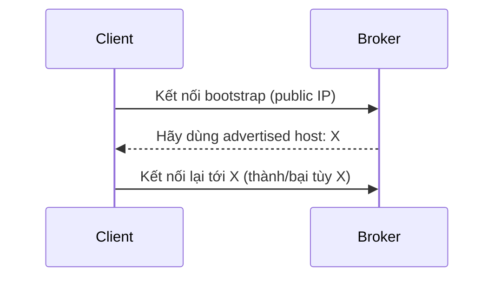

# Broker Reachable Mà Client Vẫn Timeout: Hiểu Đúng advertised.listeners

Triệu chứng kinh điển: `telnet public-ip 9092` thông, security group mở đúng, nhưng Kafka client cứ báo timeout hoặc `Connection to node -1 could not be established`. Bạn restart broker, đổi port, vẫn không được. Thủ phạm trong 90% trường hợp chỉ là một setting: **advertised.listeners**.

---

## 1. Vấn Đề Vận Hành: Client Kết Nối Lần Đầu Được, Lần Sau Lại Lạc

Nhiều người tưởng client Kafka giữ nguyên địa chỉ mình vừa kết nối để nói chuyện tiếp. Không phải. Kafka dùng giao thức 2 bước:

1. Client kết nối tới địa chỉ bootstrap bạn khai báo (`bootstrap.servers`).
2. Broker trả lời: "muốn nói chuyện tiếp thì hãy dùng địa chỉ **advertised** này của tôi", rồi client **bỏ địa chỉ cũ, quay sang địa chỉ advertised**.

Nếu địa chỉ advertised đó client không route tới được, connection chết ngay dù bước 1 thành công. Đây là lý do `telnet` thông mà produce vẫn fail.

## 2. Kiến Trúc: Ba Kịch Bản Sai Kinh Điển



Giả sử broker có cả public IP và private IP `172.31.9.1`:

| advertised host = X | Chuyện gì xảy ra | Khi nào dùng |
|---|---|---|
| Private IP `172.31.9.1` | Client ngoài internet nhận X nhưng không route được → timeout. Client cùng VPC thì OK | Chỉ khi mọi client đều ở **cùng private network** với broker |
| `localhost` | Client ở máy khác resolve `localhost` thành chính nó → tự nói chuyện với chính mình → fail. Chỉ máy chạy chung broker mới OK | Chỉ demo local |
| Public IP (đúng IP hiện tại) | Client dùng đúng IP vừa kết nối → **thành công** | Khi client ở **public network**. Nhưng nếu restart máy mà public IP đổi (từ `.90` thành `.12`) mà quên sửa config, broker vẫn quảng cáo IP cũ → client lại lạc |

Bài học: advertised address phải là địa chỉ **mà client thực sự resolve và route tới được**, không phải địa chỉ của broker tự nhìn thấy mình.

## 3. Cấu Hình / Thao Tác: Chọn Đúng Cho Từng Đối Tượng Client

Trong `server.properties` (Kafka mới dùng `advertised.listeners`, bản cũ gọi `advertised.host.name`):

```properties
# Client nội bộ cùng VPC
advertised.listeners=PLAINTEXT://kafka-1.internal:9092

# Client public (kèm SSL ở production)
advertised.listeners=SSL://kafka-1.example.com:9093
```

Quy tắc chọn:

- Client ở private network → advertise **private IP hoặc private DNS** của broker. Client public sẽ không vào được — đó là chủ ý, đừng cố mở.
- Client ở public network → advertise **public IP ổn định hoặc public DNS trỏ tới nó**. Nên dùng DNS thay vì IP trần để khi IP đổi chỉ cần update DNS, không sửa từng broker.
- Môi trường cloud IP động → bắt buộc dùng DNS + automation update, không hardcode IP.
- Luôn đảm bảo client **resolve được hostname** bạn advertise (check `nslookup`/`dig` từ máy client trước khi đổ lỗi cho Kafka).

## Pitfalls / Best Practice Production

- **Pitfall: broker public nhưng advertise private IP.** Lỗi phổ biến số 1. Ping/telnet tới public IP vẫn thông nên cứ tưởng network sai.
- **Pitfall: để `localhost` rồi mang lên server.** Local chạy ngon, deploy lên EC2 là sập vì client resolve về chính nó.
- **Pitfall: public IP đổi sau reboot mà quên sửa config.** Dùng Elastic IP hoặc DNS ngay từ đầu.
- **Best practice:** tách listeners nội/ngoại (`INTERNAL://`, `EXTERNAL://`) khi có cả 2 loại client, kết hợp với SSL + ACL ở bài security trước để cluster public không thành mồi ngon.

## Kết Luận

Tóm lại một câu: **client Kafka không nói chuyện với địa chỉ bạn khai báo, mà nói chuyện với địa chỉ broker quảng cáo — hãy advertise đúng địa chỉ client tới được.**

Hết section admin, chúng ta sang vùng đất của tuning: **section 17 — Advanced Topics Configurations**, mở đầu bằng cách đổi config topic đúng cách với `kafka-configs.sh` và `min.insync.replicas`.
