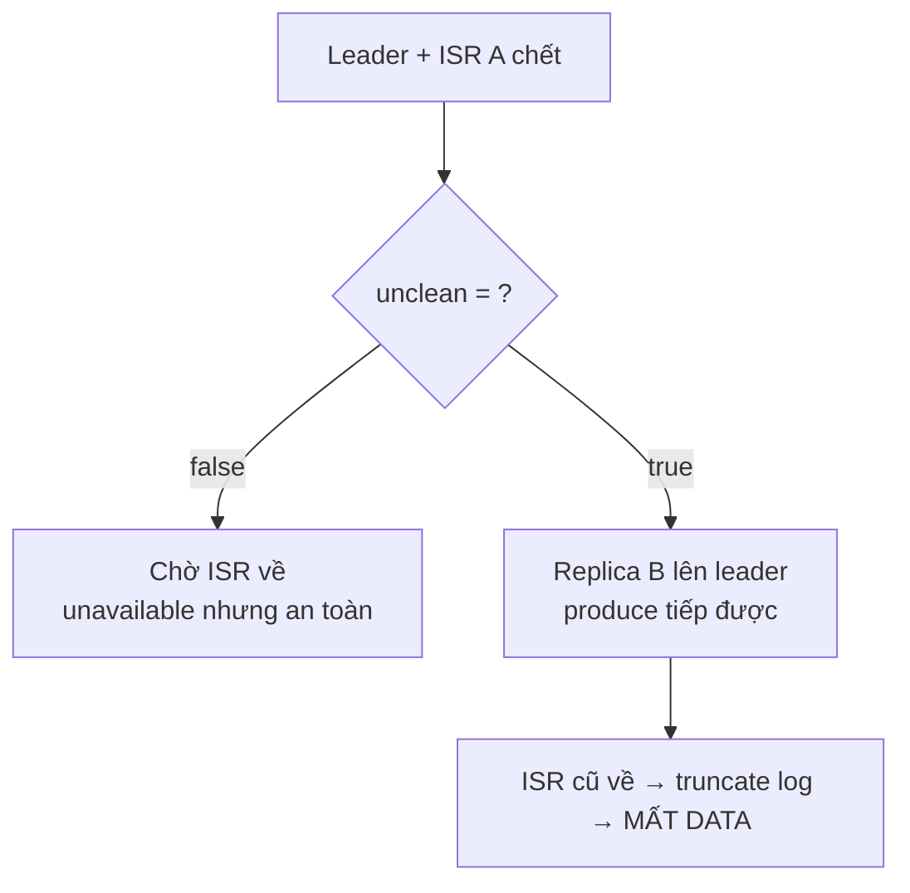

# Unclean Leader Election: Đánh Đổi Dữ Liệu Lấy Availability — Setting Nguy Hiểm Nhất Kafka

Chuyện gì xảy ra khi **toàn bộ ISR (in-sync replicas) của một partition đều chết**, chỉ còn vài replica tụt hậu (out-of-sync) sống sót? Mặc định Kafka chọn đứng yên chờ ISR quay lại — topic unavailable. Bật `unclean.leader.election.enable=true` thì cluster sống lại ngay, nhưng cái giá có thể là **mất dữ liệu vĩnh viễn**. Bài rất ngắn này quyết định bạn có敢 đụng vào setting này không.

---

## 1. Cơ Chế: Ai Được Lên Làm Leader Khi ISR Chết Hết?

```
Trước sự cố:  Leader (ISR) + Replica A (ISR) + Replica B (out-of-sync, thiếu 1000 msg)
Sự cố:        Leader chết, Replica A chết. Chỉ còn B.
```

Hai lựa chọn:

| Lựa chọn | Hành vi broker | Kết quả |
|---|---|---|
| `unclean.leader.election.enable=false` (**default**) | Chờ một ISR quay lại mới bầu leader | Topic **unavailable** cho tới lúc đó, nhưng **không mất data đã commit** |
| `=true` | Cho replica out-of-sync B lên làm leader ngay | Produce tiếp được (**availability**), nhưng 1000 message B chưa có sẽ **bị vứt bỏ** khi ISR cũ quay lại và sync theo leader mới |

Vì sao mất data? Khi ISR cũ (có đủ log) quay lại, nó phát hiện log mình "dài hơn" leader mới, buộc phải **truncate về đúng log của leader mới** — tức xóa hết message mà leader mới chưa từng thấy. Xóa là vĩnh viễn.



## 2. Config Và Lệnh Demo

```properties
# server.properties (broker-level) hoặc override per-topic
unclean.leader.election.enable=false
```

```bash
# Kiểm tra giá trị hiện tại của topic
kafka-configs.sh --bootstrap-server localhost:9092 \
  --entity-type topics --entity-name my-topic --describe

# Bật unclean election cho topic (chỉ khi đã hiểu rủi ro)
kafka-configs.sh --bootstrap-server localhost:9092 \
  --entity-type topics --entity-name my-topic \
  --alter --add-config unclean.leader.election.enable=true
```

## 3. Trade-offs: Availability Hay Durability — Chỉ Được Chọn Một

| Ưu tiên | Chọn gì | Ví dụ use case |
|---|---|---|
| **Durability** (không mất 1 message đã commit) | Giữ `false`, chịu unavailable | Thanh toán, đơn hàng, ledger ngân hàng |
| **Availability** (luôn ghi được, mất ít data cũng được) | Bật `true` | Metrics, log thu thập, tracking click — mất vài giây data không chết ai |

Xu hướng hiện tại: setting này **ngày càng ít được dùng**. Với `replication.factor=3` + `min.insync.replicas=2` + monitor ISR chuẩn, xác suất cả 2 ISR cùng chết rất thấp — không đáng đánh đổi.

## Pitfalls / Best Practice Production

- **Pitfall: bật `true` toàn cluster "cho chắc ăn".** Một lần out-of-sync replica lên ngôi là mất data âm thầm, không báo lỗi — phát hiện khi đã muộn.
- **Pitfall: tưởng unclean election chỉ ảnh hưởng lúc sự cố.** Sai — nó thay đổi **cam kết durability** của cả hệ thống (`acks=all` + unclean=true thì `all` chỉ còn nghĩa với replica sống sót).
- **Best practice:** giữ default `false`. Nếu có topic metrics/log thật sự cần availability, bật **riêng topic đó**, ghi chú rõ "topic này chấp nhận mất data", và alert ngay khi unclean election xảy ra để điều tra.

## Kết Luận

Tóm lại một câu: **`unclean.leader.election.enable=true` mua availability bằng dữ liệu đã commit — chỉ bật khi mất data rẻ hơn downtime.**

Từ trade-off sống còn này, bài tiếp theo sang trade-off hiệu năng quen thuộc không kém: **message lớn trong Kafka — khi nào tách ra S3/HDFS, khi nào tăng `max.message.bytes`**.
