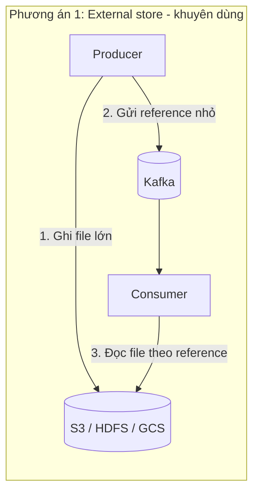

# Message Quá 1MB: Tách Ra S3 Hay Tăng max.message.bytes? Công Thức 4 Setting Đồng Bộ

Kafka mặc định giới hạn **1MB mỗi message** — và đó là default rất khôn ngoan. Message lớn (video, file nén, ảnh raw) làm broker tốn RAM, replication chậm, consumer crash. Nhưng nếu thật sự phải gửi message tới 10MB thì làm sao? Bài này cho 2 đường đi chính thống và công thức chỉnh 4 setting phải đồng bộ.

---

## 1. Cơ Chế: Vì Sao Message Lớn Là Anti-Pattern?

Một message 50MB đi qua Kafka phải: producer buffer → network → broker page cache → replicate sang 2 broker khác → consumer fetch. Mỗi chặng đều giữ nguyên khối 50MB trong RAM và retry nguyên khối khi lỗi. Chỉ cần vài producer như vậy là broker GC liên tục, latency của **mọi topic khác** cũng tăng theo.

## 2. Kiến Trúc: Hai Phương Án



**Phương án 1 — external store + reference (khuyên dùng):** producer ghi file lớn vào S3/HDFS/GCS, chỉ gửi vào Kafka một message nhỏ chứa đường dẫn + metadata. Consumer đọc reference rồi tải file từ store. Muốn gửi file gigabytes cũng được, Kafka vẫn nhẹ. Giá phải trả: tự viết code 2 đầu (upload/download) và xử lý lifecycle file (xóa file khi reference hết hạn).

**Phương án 2 — tăng giới hạn Kafka (ví dụ lên 10MB):** giữ nguyên code produce/consume, chỉ chỉnh config. Đơn giản nhưng broker nặng hơn, và vẫn không vượt được vài chục MB một cách an toàn.

## 3. Cấu Hình: Bộ 4 Setting Phải Tăng Cùng Nhau (Ví Dụ 10MB)

Muốn gửi 10MB thì producer, topic/broker, replication, consumer phải cùng mở cửa — một chỗ quên là crash hoặc `RecordTooLargeException`. Chú ý tên rất dễ nhầm (không phải typo):

| Tầng | Config | Giá trị ví dụ | Nằm ở đâu |
|---|---|---|---|
| Topic/broker | `max.message.bytes` (topic) / `message.max.bytes` (broker) | `10485760` | Topic-level override hoặc `server.properties`. Hai tên đảo ngược nhau nhưng cùng ý nghĩa |
| Replication | `replica.fetch.max.bytes` | `10485760` | `server.properties` — follower phải fetch được message lớn từ leader |
| Producer | `max.request.size` | `10485760` | Producer config — request produce được phép to tới mức nào |
| Consumer | `max.partition.fetch.bytes` | `10485760` | Consumer config — không tăng thì consumer **crash** khi fetch message lớn |

```bash
# Topic-level: cho phép message 10MB
kafka-configs.sh --bootstrap-server localhost:9092 \
  --entity-type topics --entity-name large-topic \
  --alter --add-config max.message.bytes=10485760
```

```properties
# server.properties (cần restart broker)
message.max.bytes=10485760
replica.fetch.max.bytes=10485760
```

```properties
# producer.properties
max.request.size=10485760
# consumer.properties
max.partition.fetch.bytes=10485760
```

## Pitfalls / Best Practice Production

- **Pitfall: chỉ tăng producer mà quên consumer.** Producer gửi lọt, consumer fetch tới message lớn là crash loop — topic tắc cho tất cả.
- **Pitfall: nhầm `max.message.bytes` với `message.max.bytes`.** Một cái topic-level, một cái broker-level. Set sai chỗ là không có tác dụng.
- **Pitfall: tăng lên 50-100MB "cho thoải mái".** Replication 3 bản × 100MB × nhiều partitions = broker OOM và full disk trong nháy mắt.
- **Best practice:** dưới 1MB cứ để default. 1-10MB cân nhắc tăng config theo công thức trên. Trên 10MB hoặc file nhị phân (video, zip) → **luôn dùng external store**.

## Kết Luận

Tóm lại: **message lớn thì tách file ra S3/HDFS + gửi reference; nếu vẫn muốn gửi trực tiếp thì tăng đồng bộ 4 setting `max.message.bytes`/`message.max.bytes`, `replica.fetch.max.bytes`, `max.request.size`, `max.partition.fetch.bytes`.**

Hết section advanced configs, chúng ta sang chặng cuối của cả khóa học: **section 18 — What's Next và lời cảm ơn**, tóm tắt lộ trình developer/admin và chứng chỉ Confluent.
