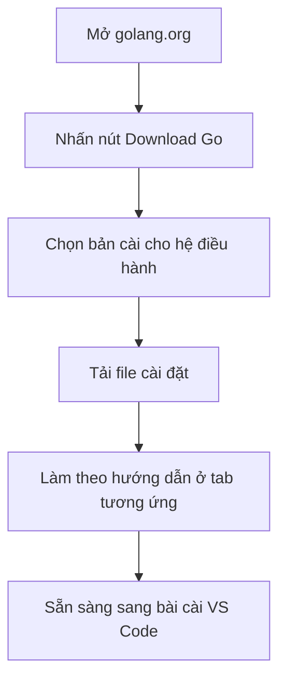

# 🐹 Cài đặt Go — Bước khởi động nhẹ nhàng trước khi viết code

> Nguồn: `002-Installing-Go.txt` · [Udemy](https://ua.udemy.com/course/go-programming-language-crash-course/learn/lecture/26161700)

Trước khi viết được dòng code Go đầu tiên, các bạn cần cài Go lên máy mình đã. Bài này rất ngắn thôi — mình sẽ chỉ từng bước để tải và cài Go, kể cả khi các bạn chưa từng cài môi trường lập trình bao giờ.

*Cứ thong thả làm theo, chưa quen cũng không sao. Cài xong rồi chúng ta mới bắt đầu code.*

---

### 🌐 Mở golang.org và tìm nút tải Go

Việc đầu tiên, các bạn mở trình duyệt và truy cập địa chỉ **https://golang.org**. Ngay khi vào trang, các bạn sẽ thấy một nút rất to với dòng chữ **Download Go** — cứ bấm vào đó.

Đó là cửa ngõ chính thức để tải Go về máy. Từ đây, mọi thứ chỉ còn là chọn đúng phiên bản phù hợp với chiếc máy các bạn đang dùng.

---

### 🧭 Chọn bản cài đúng hệ điều hành

Sau khi bấm **Download Go**, các bạn sẽ thấy danh sách các bản cài (**installer**). Việc của các bạn là chọn đúng bản dành cho hệ điều hành của mình:

* Nếu dùng **Windows**, các bạn chọn bản dành cho Windows.
* Nếu dùng **macOS**, các bạn chọn bản dành cho Mac.

Mình đang dùng máy Mac và đã cài Go sẵn rồi, nhưng mình vẫn bấm thử để các bạn thấy nó hoạt động thế nào. Trình duyệt sẽ hỏi lưu file cài đặt về máy — các bạn bấm **OK**. Vì máy mình đã có Go nên mình không chạy tiếp, nhưng các bạn cứ tải về và cài bình thường nhé.

| Hệ điều hành | Việc các bạn cần làm |
|---|---|
| Windows | Chọn bản cài Windows, tải về và chạy installer |
| macOS | Chọn bản cài Mac, lưu file về máy rồi cài |
| Linux | Chọn bản cài Linux và làm theo hướng dẫn ở tab tương ứng |

---

### 📖 Làm theo hướng dẫn cài đặt ngay trên trang

Một điều tiện lợi: ngay bên dưới phần tải, trang web đã để sẵn **hướng dẫn cài đặt chi tiết**. Ở đó có **ba tab** tương ứng với **Linux**, **macOS** và **Windows**.

Các bạn chỉ cần chọn đúng tab hệ điều hành của mình rồi làm theo từng bước. Với máy Mac, mình thấy hướng dẫn hiện ra ngay; còn nếu các bạn dùng Windows thì cũng có hướng dẫn riêng ở tab Windows.

Nói ngắn gọn: **tải Go về và cài đặt**. Không có gì phức tạp cả.

---

### ✅ Cài xong thì mình đi tiếp đâu?

Sau khi Go đã nằm gọn trên máy, bước tiếp theo là lấy **bộ công cụ để viết chương trình Go**. Trong bài sau, mình sẽ hướng dẫn các bạn cài **Visual Studio Code** — trình soạn thảo miễn phí mà mình dùng xuyên suốt khóa học.

Các bạn đã đi được bước đầu tiên rồi đấy. Hẹn gặp lại ở bài tiếp theo! 🚀

## Nguồn tham khảo

- [Trang tải Go chính thức](https://go.dev/dl/)
- [Hướng dẫn cài đặt Go](https://go.dev/doc/install)
