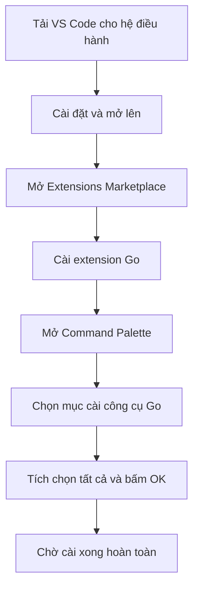

# 🛠️ Cài Visual Studio Code — Dựng "xưởng làm việc" cho Go

> Nguồn: `003-Installing-Visual-Studio-Code.txt` · [Udemy](https://ua.udemy.com/course/go-programming-language-crash-course/learn/lecture/26161702)

Go đã có trên máy, giờ là lúc trang bị công cụ để viết phần mềm. Mình khuyên các bạn dùng **Visual Studio Code** — miễn phí, nhẹ và chạy được trên cả Windows, Linux lẫn macOS. Bài này mình sẽ chỉ cách cài đặt và "khớp" nó với Go để mọi thứ trơn tru.

*Đừng lo nếu các bạn chưa từng dùng trình soạn thảo code nào. Mình sẽ đi từng bước một.*

---

### 💻 Tải và cài Visual Studio Code

Công cụ mình khuyên dùng là **Visual Studio Code**, hoàn toàn **miễn phí** và tải được từ trang chính thức của nó. Điểm hay là VS Code có mặt trên **cả Windows, Linux và macOS**, nên các bạn cứ tải đúng phiên bản cho hệ điều hành của mình.

Nếu đang dùng Windows chẳng hạn, các bạn bấm vào nút Windows, phần mềm sẽ tải về tự động, sau đó chạy installer và làm theo hướng dẫn. Việc duy nhất cần làm là **cài cho xong**. Cài xong thì mở nó lên.

Mình đã cài sẵn VS Code rồi, nên giờ mình sẽ chỉ các bạn những bước cấu hình để nó chạy mượt với Go — những bước này sẽ khiến cuộc sống của các bạn dễ chịu hơn rất nhiều.

---

### 🧩 Cài extension Go từ Extensions Marketplace

Sau khi mở VS Code, các bạn sẽ thấy màn hình **Welcome**. Từ đây, mình khuyên các bạn vào **Extensions Marketplace**:

1. Vào menu **Preferences** rồi chọn **Extensions** (VS Code cũng hiển thị sẵn phím tắt nếu các bạn thích dùng bàn phím).
2. Trong ô tìm kiếm, gõ **Go**.
3. Kết quả **đầu tiên** chính là extension Go — bấm nút **Install** và chờ nó cài xong.

Mình không cài lại vì máy đã có sẵn, nên mình chỉ đóng cửa sổ đó lại. Các bạn cứ để nó cài đặt bình thường.

---

### ⚙️ Dùng Command Palette để cài trọn bộ công cụ Go

Bước tiếp theo là mở **Command Palette**:

* Trên **macOS**: `Cmd + Shift + P`.
* Trên **Windows**: `Ctrl + Shift + P`.

Trong ô tìm kiếm, các bạn gõ **chính xác** cụm sau:

`Go: Install/Update Tools`

Chọn mục đó, rồi tích vào ô vuông nhỏ ở **trên cùng** — nó sẽ chọn tất cả các công cụ, sau đó bấm **OK**. Cách này sẽ cài đặt **mọi thứ** các bạn cần cho khóa học này.

| Thao tác | macOS | Windows |
|---|---|---|
| Mở Command Palette | `Cmd + Shift + P` | `Ctrl + Shift + P` |

---

### ⚠️ Nhớ chờ cài xong rồi hãy tắt VS Code

Một lời nhắc nhỏ nhưng quan trọng: **hãy đợi quá trình cài đặt kết thúc hẳn** trước khi tắt Visual Studio Code. Nếu các bạn thoát giữa chừng, mọi bước sẽ phải làm lại từ đầu — mất thời gian mà lại bực mình.

*Cứ pha một ly trà, đợi vài phút, rồi quay lại khi mọi thứ xong xuôi.*

Khi mọi công cụ đã yên vị, chúng ta sẽ chuyển sang bài tiếp theo để viết chương trình Go đầu tiên. Hẹn gặp lại các bạn! 🚀

## Nguồn tham khảo

- [Visual Studio Code — trang chủ](https://code.visualstudio.com/)
- [Go in Visual Studio Code](https://code.visualstudio.com/docs/languages/go)
