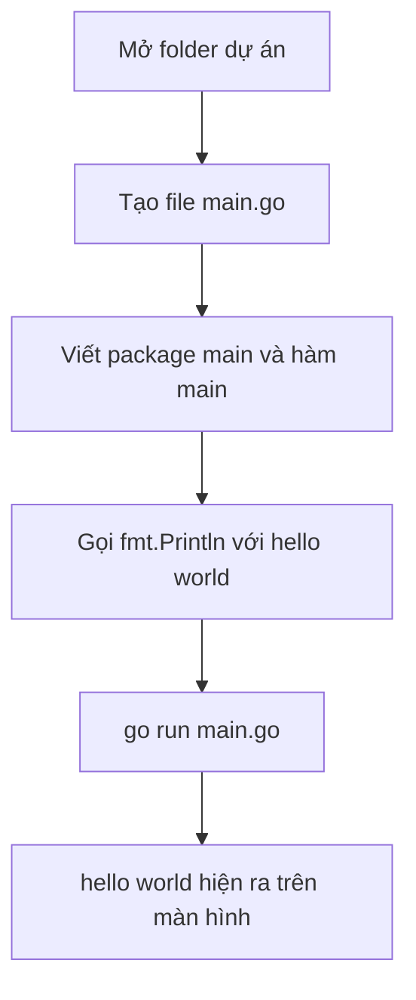

# 🐣 Hello, World! — Chương trình Go đầu tiên của các bạn

> Nguồn: `004-Hello-World.txt` · [Udemy](https://ua.udemy.com/course/go-programming-language-crash-course/learn/lecture/26161704)

Đã có Go, đã có Visual Studio Code — giờ là lúc viết chương trình đầu tiên. Mình sẽ cùng các bạn mở folder dự án, tạo file `main.go`, in ra dòng chữ **hello world** và chạy nó. Ngắn thôi, nhưng đây là khoảnh khắc đáng nhớ đấy.

*Các bạn cứ gõ theo mình, chưa hiểu hết syntax cũng không sao — mình sẽ giải thích kỹ cấu trúc chương trình Go ở bài sau.*

---

### 📂 Mở folder dự án trong VS Code

Mở VS Code lên nào. Ở góc trên bên trái có một biểu tượng nhỏ — đó là **Explorer**, và chúng ta sẽ dùng nó rất nhiều. Nó hoạt động như một nút bật/tắt: bấm một lần để mở, bấm lần nữa để đóng.

Việc đầu tiên là **mở một folder**, để VS Code biết chúng ta muốn lưu file ở đâu. Mình chọn thư mục **visual studio projects** của mình, rồi tạo một folder mới tên là **hello world Go**. Các bạn có thể đặt ở đâu cũng được, miễn là nhớ chỗ mình để.

Sau đó bấm **Open**, và đóng màn hình **Welcome** lại cho gọn.

---

### 📝 Tạo file main.go

Trong Explorer, các bạn rê chuột lên folder **hello world Go** và bấm vào biểu tượng tạo file mới. Mình đặt tên file là **`main.go`**.

Có hai điều nên nhớ:

1. Đặt tên file chính là `main` là **quy ước** trong Go (dù các bạn muốn tên gì cũng được).
2. File bắt buộc phải kết thúc bằng **`.go`**, nếu không chương trình sẽ không chạy.

Bấm Enter, và VS Code sẽ mở file `main.go` ở khung bên phải.

---

### 🐹 Viết chương trình Hello World

Khi học một ngôn ngữ lập trình mới, truyền thống là viết một chương trình chỉ in dòng chữ **hello world** ra màn hình. Đây là code hoàn chỉnh:

```go
package main

import "fmt"

func main() {
	fmt.Println("hello world")
}
```

Giải thích nhanh từng phần:

* Dòng đầu tiên của **mọi file Go** phải là khai báo package, bắt đầu bằng từ khóa `package`. Phần chính của chương trình theo quy ước được đặt tên là `main`.
* Mọi package `main` đều phải có một hàm tên `main`. Hàm được khai báo bằng từ khóa `func`, tên `main`, kèm cặp ngoặc tròn và cặp ngoặc nhọn.
* Để in ra màn hình, mình dùng `fmt` — viết tắt của **format**. Đây là package có sẵn trong **standard library** (thư viện chuẩn) của Go.
* Sau khi gõ `fmt.`, VS Code sẽ gợi ý (autocomplete); mình chọn `Println` — chữ **P phải viết hoa**, điều này rất quan trọng.
* VS Code tự thêm dòng `import "fmt"` giúp chúng ta, để chương trình biết mình đang dùng package `fmt` từ thư viện chuẩn.

Và thế là xong — một chương trình Go hoàn chỉnh, không có gì sai cả.

---

### ▶️ Chạy chương trình với go run

Mở menu **Terminal** trên thanh công cụ và chọn **New Terminal**. Một cửa sổ terminal nhỏ sẽ hiện ở dưới cùng của VS Code. *Nếu các bạn chưa từng dùng terminal, đừng ngại — thời gian tới chúng ta sẽ dùng nó rất nhiều.*

Mặc định terminal mở ngay trong folder dự án. Các bạn gõ `go run main.go` rồi bấm Enter, và **hello world** hiện ra trên màn hình.

Thử nghịch một chút: mình sửa chữ `hello world` thành `bonjour tout le monde` (tiếng Pháp của mình có thể sai chính tả, các bạn thông cảm), rồi dùng **Ctrl+L** để xóa màn hình terminal và chạy lại `go run main.go`. Chương trình in ra dòng chữ mới ngay.

Điều đáng chú ý: lệnh `go run` sẽ **biên dịch chương trình rồi chạy luôn**, và lần nào chạy cũng biên dịch lại.



---

### 🎹 Chương trình đầu tiên luôn "hoàn hảo"

Đây là điều mình thích nhất khi học một ngôn ngữ lập trình mới. Nếu các bạn học **piano**, buổi biểu diễn đầu tiên trước công chúng chắc chắn không hay — đầy lỗi, và các bạn chẳng thấy tự hào lắm. Nếu các bạn học **vẽ**, bức chân dung đầu tay sẽ không đẹp và chắc các bạn chẳng muốn cho ai xem.

Nhưng chương trình đầu tiên ở gần như mọi ngôn ngữ lập trình thì **hoàn hảo tuyệt đối**.

Okay, chương trình Go đầu tiên đã chạy. Bài tiếp theo, chúng ta sẽ nhìn kỹ hơn vào **cấu trúc của một chương trình Go** — package, import, hàm và những dấu ngoặc. Hẹn gặp lại các bạn! 🚀

## Nguồn tham khảo

- [Tutorial: Get started with Go](https://go.dev/doc/tutorial/getting-started)
- [Go in Visual Studio Code](https://code.visualstudio.com/docs/languages/go)
