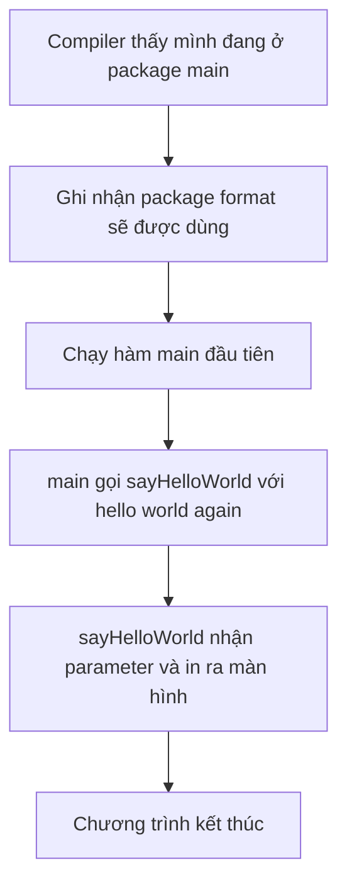

# 🧩 Cấu trúc một chương trình Go — Package, Import, Hàm và những dấu ngoặc

> Nguồn: `005-Structure-of-a-Go-Program.txt` · [Udemy](https://ua.udemy.com/course/go-programming-language-crash-course/learn/lecture/26161706)

Bài trước chúng ta mới chỉ in mỗi dòng hello world. Lần này, mình muốn đi chậm qua **cấu trúc của một chương trình Go** — thứ áp dụng cho gần như mọi chương trình Go các bạn sẽ gặp. Hiểu chắc phần này thì những bài sau sẽ nhẹ nhàng hơn rất nhiều.

*Đừng lo nếu có chỗ chưa thấm ngay. Cứ đọc hết một lượt, rồi quay lại khi cần.*

---

### 📦 Package declaration — dòng đầu tiên bắt buộc

Mọi chương trình Go, **mọi file** tạo nên chương trình Go — các bạn hoàn toàn có thể có nhiều file, và chắc chắn sẽ có trước khi khóa học kết thúc — đều phải bắt đầu bằng một **package declaration** (khai báo package).

Chương trình của chúng ta hiện chỉ có một package tên là `main`, nên mình đặt tên nó là `main`. Các bạn có thể đặt tên khác cũng được, nhưng theo **quy ước** thì package chính trong chương trình Go luôn được gọi là `main`.

---

### 📥 Import — khai báo những package sẽ dùng

Sau package declaration là phần **imports**. Phần này cho chương trình biết nó sẽ dùng những package nào. Các loại chức năng khác nhau được lưu trong những package khác nhau của Go.

Ở đây chúng ta chỉ dùng package `fmt` (viết tắt của **format**), gọi ở dòng 6. Package này chứa nhiều thứ gọi là **method** — thực ra là những hàm có một thành phần đặc biệt tên là **receiver**, nhưng chuyện đó để sau, giờ các bạn chưa cần bận tâm.

Thử tạo thêm hai dòng và gọi hai hàm khác nhau của `fmt`:

```go
fmt.Println("this is some text")
fmt.Print("this is some more text")
```

Chạy `go run main.go` và để ý kết quả: `Println` in xong thì **xuống dòng**, còn `Print` in mọi thứ **trên cùng một dòng**, không có ký tự xuống dòng nào ở giữa.

| Hàm | Kết quả |
|---|---|
| `fmt.Println` | In nội dung rồi xuống dòng |
| `fmt.Print` | In liền, không xuống dòng |

Đó cũng là cách các bạn gọi hàm từ một package khác: tên package, dấu chấm, rồi tên hàm.

---

### 🧮 Ngoặc tròn, ngoặc nhọn và block of code

Có một chi tiết các bạn có thể để ý: trong chương trình xuất hiện nhiều loại ngoặc.

Trên dòng 5 là cặp **ngoặc tròn** với không có gì ở giữa — vì một hàm thì phải có ngoặc tròn sau tên. Sau này chúng ta sẽ đặt thứ gì đó vào trong đó, nhưng **không bao giờ** có ngoặc mở mà thiếu ngoặc đóng.

Tương tự với **ngoặc nhọn**: khi các bạn bấm chuột cạnh một dấu ngoặc, VS Code sẽ tô sáng dấu ngoặc khớp với nó. Có ngoặc mở thì phải có ngoặc đóng, và ngược lại. Mọi thứ nằm giữa hai ngoặc nhọn là **block of code** (khối code) của hàm `main`.

---

### 🛠️ Tự viết hàm đầu tiên với tham số

Bây giờ mình sẽ tạo một hàm mới. Trong Go, hàm luôn bắt đầu bằng từ khóa `func`, tên hàm **không được có dấu cách** và phải bắt đầu bằng một **chữ cái**. Mình đặt tên là `sayHelloWorld`, nhận vào một **parameter** (hay còn gọi là **argument**) tên `whatToSay`, kiểu `string`.

```go
func main() {
	sayHelloWorld("hello world again")
}

func sayHelloWorld(whatToSay string) {
	fmt.Println(whatToSay)
}
```

`whatToSay` là thông tin chúng ta truyền vào hàm, và nó là một **string** — kiểu dữ liệu chứa chữ cái, chữ số, nói chung là bất cứ thứ gì gõ được trên màn hình. Bên trong hàm, mình gọi `fmt.Println` và truyền `whatToSay` vào — lần này không cần dấu ngoặc kép vì đây là biến, không phải chữ cố định.

Ở hàm `main`, thay vì gọi `fmt.Println` trực tiếp, mình gọi hàm vừa tạo và truyền vào chuỗi `hello world again`.

---

### 🔄 Chương trình chạy như thế nào?

Đây là điều thú vị nhất: khi chạy chương trình, **go compiler** (trình biên dịch Go) làm việc theo trình tự sau.



Chạy thử: xóa màn hình bằng **Ctrl+L**, rồi gõ `go run main.go`. Kết quả giống hệt bài trước, nhưng lần này có thêm một hàm do chúng ta tự định nghĩa.

Vài điều cần ghi nhớ:

1. Mọi file Go **phải có package declaration**.
2. Nếu import thứ gì, nó sẽ nằm trong phần import — và VS Code sẽ tự giúp các bạn việc đó.
3. **Phải có hàm `main`**, và hàm `main` **không được nhận parameter nào** — thử đặt vào sẽ báo lỗi ngay.
4. Các bạn có thể tự khai báo hàm của mình bất cứ lúc nào.

---

### ✅ Tự kiểm tra nhanh

**1. Dòng đầu tiên của mọi file Go bắt buộc phải là gì?**
<details>
<summary><b>Xem đáp án</b></summary>

**Đáp án:** Package declaration (khai báo package).
Giải thích: Mọi file tạo nên chương trình Go đều phải mở đầu bằng khai báo package.
Tham chiếu: Mục "Package declaration".

</details>

**2. `fmt.Print` khác `fmt.Println` ở điểm nào?**
<details>
<summary><b>Xem đáp án</b></summary>

**Đáp án:** `Println` in xong thì xuống dòng, còn `Print` in liền trên cùng một dòng.
Giải thích: Cả hai đều thuộc package `fmt`; khác biệt nằm ở ký tự xuống dòng sau khi in.
Tham chiếu: Mục "Import — khai báo những package sẽ dùng".

</details>

**3. Hàm `main` có được nhận parameter không?**
<details>
<summary><b>Xem đáp án</b></summary>

**Đáp án:** Không. Hàm `main` không được nhận bất kỳ parameter nào, thử đặt vào sẽ báo lỗi.
Giải thích: `main` là điểm khởi đầu của chương trình nên không nhận tham số.
Tham chiếu: Mục "Chương trình chạy như thế nào".

</details>

**4. `whatToSay` trong hàm `sayHelloWorld` được gọi là gì?**
<details>
<summary><b>Xem đáp án</b></summary>

**Đáp án:** Là một parameter (tham số), thuộc kiểu `string`.
Giải thích: Đây là thông tin được truyền vào hàm để hàm xử lý và in ra.
Tham chiếu: Mục "Tự viết hàm đầu tiên với tham số".

</details>

**5. Điều gì bắt buộc phải có trong mọi chương trình Go?**
<details>
<summary><b>Xem đáp án</b></summary>

**Đáp án:** Package `main` và hàm `main` trong package đó.
Giải thích: Package chính thường được đặt tên `main` theo quy ước; hàm `main` là điểm vào chương trình.
Tham chiếu: Mục "Package declaration" và "Chương trình chạy như thế nào".

</details>

---

Các bạn vừa nắm được bộ khung của mọi chương trình Go rồi đấy. Bài tiếp theo, chúng ta sẽ nói về **biến (variables)** và cách **tự tạo package riêng** — bước đệm để xây dựng chương trình Eliza. Hẹn gặp lại! 🚀

## Nguồn tham khảo

- [A Tour of Go](https://go.dev/tour/)
- [Effective Go](https://go.dev/doc/effective_go)
