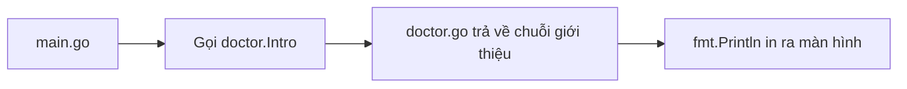

# 📦 Biến và Dot Notation — Tự tay tạo package đầu tiên cùng Eliza

> Nguồn: `006-Variables-and-Dot-Notation.txt` · [Udemy](https://ua.udemy.com/course/go-programming-language-crash-course/learn/lecture/26161716)

Lần này mình muốn giới thiệu hai khái niệm quan trọng nhưng không hề khó: **biến (variables)** và cách để chương trình dùng **package do chính chúng ta viết**. Hai thứ này sẽ theo các bạn suốt khóa học, nên mình sẽ đi chậm và kỹ một chút.

*Có thấy lỗi đỏ xuất hiện trong lúc gõ cũng đừng hoảng — mình sẽ giải thích ngay bên dưới.*

---

### 📦 Biến — nơi lưu trữ mọi thứ

Trong code hiện tại, dòng 6 đang là chữ viết cứng (hard-coded). Mình sẽ thay nó bằng một **biến** — hiểu đơn giản là một chỗ để lưu trữ mọi thứ, giống như một chiếc hộp có dán nhãn.

Go cho phép tạo biến theo **hai cách**. Cách thứ nhất dùng từ khóa `var`:

```go
var whatToSay string
whatToSay = "hello world again"
```

Ở đây `whatToSay` là tên biến, còn `string` là **kiểu dữ liệu** — chuỗi ký tự, chứa chữ cái, chữ số, bất cứ gì các bạn gõ được.

Cách thứ hai là viết tắt, dùng **toán tử gán** `:=`:

```go
whatToSay := "hello world again"
```

Cách viết tắt này nói với Go: "Tạo cho tôi biến `whatToSay`, lưu giá trị này vào đó, và tự suy ra kiểu dữ liệu từ giá trị bên phải dấu gán nhé." Vì giá trị là chuỗi nên `whatToSay` là `string`. Một bước duy nhất — và đây là cách chúng ta sẽ dùng liên tục.

| Tiêu chí | `var` | `:=` |
|---|---|---|
| Cú pháp | `var whatToSay string` rồi `whatToSay = ...` | `whatToSay := ...` |
| Kiểu dữ liệu | Phải ghi rõ | Go tự suy ra từ giá trị |
| Số bước | Hai bước | Một bước |
| Ghi chú | Tường minh, dài hơn | Ngắn gọn, dùng thường xuyên |

Muốn "tắt" tạm một dòng code, các bạn dùng **hai dấu chéo** `//`. Mọi thứ đứng sau hai dấu chéo sẽ bị Go bỏ qua, nhưng chỉ trong cùng dòng đó thôi.

---

### 🧹 Go cực kỳ khó tính chuyện biến chưa dùng

Ngay sau khi tạo biến `whatToSay`, trên màn hình xuất hiện **hai lỗi**. Lỗi thứ nhất: hàm `sayHelloWorld` đang chờ một parameter kiểu `string`, nhưng chưa được truyền gì cả — mình sẽ sửa sau một chút.

Còn lỗi thứ hai thì thú vị hơn: mình vừa tạo biến, đâu có gì sai? Nhưng Go **cực kỳ khó tính** — nó không cho phép tồn tại biến không được sử dụng trong chương trình. Chỉ cần một biến "nằm không" là chương trình **không thể biên dịch**.

Cách sửa rất đơn giản: gán giá trị cho biến rồi dùng nó. *Đây là lỗi các bạn sẽ gặp lại nhiều lần, và điều đó hoàn toàn bình thường.*

---

### 🤖 Eliza — chương trình "đối đáp" huyền thoại từ thập niên 1960

Để có một package riêng mà thực hành, chúng ta sẽ viết phiên bản đơn giản hóa của **Eliza** — chương trình rất nổi tiếng ra đời từ **thập niên 1960**.

Eliza do ông **Joseph Weizenbaum** viết tại **MIT Artificial Intelligence Laboratory**. Mục đích của ông là chứng minh rằng **không thể** để máy tính lừa được con người tin nó là người thật. Điều thú vị là ông đã **thất bại**: rất nhiều người trò chuyện với Eliza và thật sự tin rằng mình đang nói chuyện với một người.

*Nếu các bạn thuộc "một thế hệ nhất định", có lẽ các bạn đã từng gặp Eliza thời trẻ.*

---

### 🏗️ Chuẩn bị dự án — go mod init và file doctor.go

Trước khi tạo package mới, chương trình cần một thay đổi nhỏ. Mở terminal mới và gõ `go mod init myapp`.

Tên `myapp` không quan trọng, nhưng dùng đúng sẽ không gây lỗi, nên mình khuyên các bạn cứ để vậy. Lệnh này tạo ra file **`go.mod`** ở khung bên trái. Mở ra, các bạn sẽ thấy nó ghi module tên `myapp` và dùng **Go version 1.16**. File này rất ít khi phải quản lý bằng tay.

Tiếp theo, trong phần **course resources** của bài học, các bạn tải file **`doctor.go`** về máy. Đây chỉ là một file văn bản, mở bằng **Notepad** trên Windows hay **TextEdit** trên macOS đều được. Lý do mình để sẵn file cho tải về là vì đoạn code này **rất dài** — không ai muốn gõ tay cả, chúng ta sẽ sao chép và dán.

Các bước:

1. Tải file `doctor.go` về máy.
2. Trong VS Code, tạo một folder mới tên **doctor**.
3. Bên trong folder đó, tạo file `doctor.go` và dán toàn bộ nội dung vừa tải vào.
4. Lưu lại.

---

### 🔗 Gọi package riêng với dot notation

Giờ quay lại `main.go`. Mình xóa hàm `sayHelloWorld` và muốn gọi hàm có tên `intro` trong file `doctor.go`. Hàm `intro` **không nhận parameter nào** nhưng **trả về** một giá trị kiểu `string`.

```go
var whatToSay string
whatToSay = doctor.Intro()
fmt.Println(whatToSay)
```

Cách gọi này gọi là **dot notation** (ký hiệu dấu chấm): tên package, dấu chấm, rồi tên hàm — `doctor.Intro()`.

Có một chuyện nhỏ: đôi khi VS Code **không nhận ra ngay** là chúng ta có package tên `doctor`. Lúc đó, mình chỉ cần đặt cặp ngoặc tròn bao quanh phần import và thêm `myapp/doctor`. Sau khi VS Code đã biết package, các bạn sẽ không gặp phiền phức này nữa.



Chạy `go run main.go` nào. Kết quả:

> I am Eliza, talk to the program by typing in plain English using normal upper and lower case letters and punctuation. Enter quit when done. Hello, how are you feeling today?

Mới chỉ là in lời chào thôi, nhưng các bạn đã thấy được chương trình hoàn thiện sẽ làm gì: chúng ta đặt câu hỏi, Eliza trả lời, và gõ **quit** để thoát. Bài sau mình sẽ bắt đầu làm cho nó "sống".

---

### ✅ Tự kiểm tra nhanh

**1. Hai cách tạo biến trong Go là gì?**
<details>
<summary><b>Xem đáp án</b></summary>

**Đáp án:** Dùng từ khóa `var` kèm kiểu dữ liệu, hoặc dùng cú pháp viết tắt `:=`.
Giải thích: `var whatToSay string` rồi gán giá trị, hoặc `whatToSay := "..."` để Go tự suy ra kiểu.
Tham chiếu: Mục "Biến — nơi lưu trữ mọi thứ".

</details>

**2. Vì sao Go báo lỗi ngay khi bạn vừa tạo một biến?**
<details>
<summary><b>Xem đáp án</b></summary>

**Đáp án:** Vì Go không cho phép tồn tại biến không được sử dụng.
Giải thích: Biến phải được gán giá trị và dùng, nếu không chương trình không biên dịch được.
Tham chiếu: Mục "Go cực kỳ khó tính chuyện biến chưa dùng".

</details>

**3. Eliza do ai viết, ở đâu và nhằm mục đích gì?**
<details>
<summary><b>Xem đáp án</b></summary>

**Đáp án:** Joseph Weizenbaum viết tại MIT Artificial Intelligence Laboratory vào thập niên 1960, nhằm chứng minh máy tính không thể lừa người — nhưng ông đã thất bại.
Giải thích: Nhiều người trò chuyện với Eliza và tin thật rằng họ đang nói chuyện với người thật.
Tham chiếu: Mục "Eliza — chương trình đối đáp huyền thoại".

</details>

**4. Lệnh `go mod init myapp` tạo ra file gì và chứa nội dung gì?**
<details>
<summary><b>Xem đáp án</b></summary>

**Đáp án:** Tạo file `go.mod`, ghi module tên `myapp` và dùng Go version 1.16.
Giải thích: Đây là file quản lý module, rất ít khi phải sửa bằng tay.
Tham chiếu: Mục "Chuẩn bị dự án".

</details>

**5. `doctor.Intro()` được gọi theo cách nào và có ý nghĩa gì?**
<details>
<summary><b>Xem đáp án</b></summary>

**Đáp án:** Dot notation — gọi hàm `Intro` nằm trong package `doctor`.
Giải thích: Tên package, dấu chấm, tên hàm; hàm này không nhận parameter và trả về `string`.
Tham chiếu: Mục "Gọi package riêng với dot notation".

</details>

---

Các bạn vừa tạo được package riêng và biết cách gọi nó từ `main.go`. Bài tiếp theo, chúng ta sẽ làm Eliza **biết lắng nghe**, biết trả lời và biết thoát khi gõ **quit** — với vòng lặp `for`, `if` và cả một mẹo xử lý ký tự xuống dòng. Hẹn gặp lại! 🚀

## Nguồn tham khảo

- [Using Go Modules](https://go.dev/blog/using-go-modules)
- [Go Modules Reference](https://go.dev/ref/mod)
