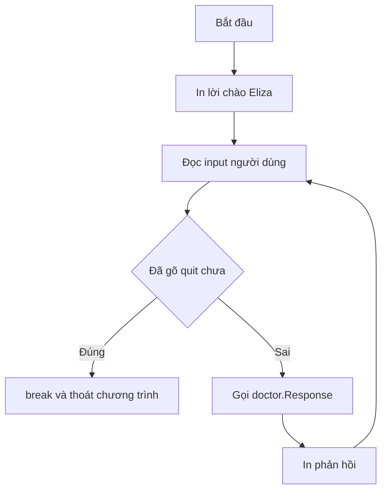

# 🔁 Chạy Eliza — Vòng lặp for, nhập liệu và câu lệnh if đầu tiên

> Nguồn: `007-Running-Eliza.txt` · [Udemy](https://ua.udemy.com/course/go-programming-language-crash-course/learn/lecture/26161724)

Bài trước chương trình mới chỉ in lời chào rồi thoát. Lần này chúng ta sẽ cho Eliza **biết lắng nghe**: đọc thứ người dùng gõ, lặp lại liên tục, trả lời bằng hàm `Response`, và thoát khi gõ **quit**. Nghe thì nhiều, nhưng mình sẽ đi từng bước nhỏ một.

*Cứ gõ theo mình, sai cũng không sao. Mình cũng phải sửa đi sửa lại mấy lần mới chạy được đấy.*

---

### 🔍 Xem lại main.go trước khi nâng cấp

Mình mở file `main.go` và đi qua từng phần cho các bạn nắm chắc:

* **Dòng 1**: package declaration — như mọi file Go, phải nằm ở **dòng đầu tiên**; package của chúng ta tên `main`.
* **Dòng 3 đến 6**: import statement, cho go compiler biết sẽ dùng những package nào trước khi biên dịch — ở đây là `fmt` (standard library, để in ra màn hình) và package tự viết `doctor` (trong folder `doctor`, chỉ có file `doctor.go`).
* **Dòng 8 đến 14**: hàm `main` — mọi chương trình Go đều phải có package `main` và hàm `main`; bên trong chỉ ba dòng: khai báo biến `whatToSay` kiểu `string`, gán giá trị trả về của `doctor.Intro()`, rồi in ra màn hình. Hết việc thì chương trình tự thoát.

---

### 🧹 Đơn giản hóa code — ít code hơn, ít lỗi hơn

Trước khi thêm tính năng, mình gọn lại một chút: xóa hẳn dòng khai báo biến và đổi dấu `=` thành toán tử viết tắt `:=`. Kết quả là hàm `main` giảm đi **một phần ba số dòng**.

Nghe nhỏ nhặt, nhưng đây là thói quen tốt: **ít code hơn nghĩa là ít thứ phải bảo trì hơn, ít cơ hội phát sinh lỗi hơn**. Code cũng sạch sẽ, dễ đọc hơn.

---

### ⌨️ Đọc dữ liệu người dùng với bufio và os.Stdin

Go khiến việc đọc bàn phím trở nên dễ bất ngờ. Ngay dòng đầu trong hàm `main`, mình tạo biến `reader` bằng cú pháp viết tắt, gọi tới một package có sẵn trong standard library với cái tên hơi lạ: **`bufio`**. *Tên lạ thì kệ nó, các bạn cứ theo mình.*

Sau khi gõ `bufio.` và dấu chấm, VS Code sẽ gợi ý. Các bạn chọn **`NewReader`** — nhớ là `NewReader`, **không phải** `NewReadWriter` nhé.

```go
reader := bufio.NewReader(os.Stdin)
```

Hàm `NewReader` cần một argument cho biết **đọc từ đâu**. Chúng ta lấy từ package built-in tên **`os`** (operating system), cụ thể là `os.Stdin` — viết tắt của **standard in**. VS Code sẽ tự import package này giúp các bạn.

Ngay lúc này VS Code báo lỗi, vì biến `reader` đã khai báo mà chưa dùng — Go không cho phép điều đó. Mình sẽ dùng nó ngay bây giờ:

```go
userInput, _ := reader.ReadString('\n')
```

Dòng này làm mấy việc cùng lúc:

* Gọi hàm `ReadString` — gắn với biến `reader` bằng dot notation — để đọc những gì người dùng gõ cho tới khi gặp `\n`, rồi lưu vào biến `userInput`.
* `'\n'` nằm trong **ngoặc đơn, không phải ngoặc kép** — đây là một **rune**, kiểu dữ liệu tìm một ký tự đơn; `\n` nghĩa là "khi người dùng bấm Enter".
* Dấu **`_`** (underscore) là **blank identifier** — cứ tạm gác lại, mình sẽ nói kỹ sau.

Chạy thử `go run main.go`: chương trình in lời chào, không thoát ra ngay mà **chờ các bạn gõ**. Gõ gì đó rồi Enter, nó in lại đúng thứ vừa gõ rồi thoát.

---

### 🔁 Vòng lặp for — Go chỉ có một loại loop

Chúng ta cần lặp lại việc đọc và in này nhiều lần. Trong Go **chỉ có một loại vòng lặp duy nhất: `for`**. Các ngôn ngữ khác có `while`, `do-while`... nhưng những người tạo ra Go cho rằng chỉ cần một loại là đủ — và họ đúng.

Phiên bản đơn giản nhất chỉ gồm chữ `for` và cặp ngoặc nhọn:

```go
for {
    userInput, _ := reader.ReadString('\n')
    fmt.Println(userInput)
}
```

Mọi thứ nằm giữa hai ngoặc nhọn sẽ **chạy mãi mãi** cho tới khi chương trình bị dừng. Chạy thử: Eliza chào một lần, sau đó các bạn gõ gì cũng được "echo" trả lại, lặp vô tận. Thoát bằng **Ctrl+C**.

Giờ thay vì echo, mình muốn Eliza **trả lời thật**. Trong file `doctor.go` có hàm `Response`, nhận một argument kiểu `string` (thứ người dùng gõ) và trả về một `string` khác (câu trả lời). Gọi nó thế này:

```go
fmt.Println(doctor.Response(userInput))
```

Chạy lại thử:

* Gõ *I feel sad* → Eliza đáp: *Good, tell me more about these feelings.*
* Gõ *I am always sad* → *Did you come to me because you were always sad?*

Các bạn thấy đấy, nó bắt đầu giống một cuộc trò chuyện rồi.

Trong `doctor.go`, các bạn có thể thấy một dòng bắt đầu bằng **hai dấu chéo** — đó là **comment**, hoàn toàn bị compiler bỏ qua, chỉ để ghi chú cho chính bạn hoặc cho người sau này đọc code của bạn.

---

### 🚪 Bẫy chữ quit — if, break và ký tự xuống dòng ngầm

Chương trình vẫn chạy vô tận, nên cần một cách thoát êm ái. Trước hết, mình muốn màn hình rõ ràng hơn bằng một dấu nhắc, in bằng `Print` (không xuống dòng):

`fmt.Print("--> ")`

Và giờ là cấu trúc quyết định đầu tiên — **if statement**. Nếu người dùng gõ `quit`, ta thoát khỏi vòng lặp; ngược lại thì in câu trả lời:

```go
if userInput == "quit" {
    break
} else {
    fmt.Println(doctor.Response(userInput))
}
```

Hai chi tiết quan trọng:

1. Phép **so sánh bằng** là **hai dấu bằng** `==`, không phải một dấu `=`. Một dấu `=` là gán giá trị, hai dấu `==` mới là so sánh.
2. `break` là cách thoát khỏi vòng lặp trong Go. Gặp `break`, chương trình nhảy ra ngoài vòng lặp; không còn việc gì nữa thì kết thúc.

Nhưng khoan — chạy thử thì gõ `quit` **không thoát được**. Lý do: `userInput` không phải đúng bốn ký tự `q-u-i-t`, mà còn **ký tự xuống dòng** dính vào cuối, nên phép so sánh không bao giờ đúng.

Cách sửa là xóa ký tự đó đi, và phải làm **hai lần** vì mỗi hệ điều hành có kiểu xuống dòng khác nhau. Mình dùng package `strings` (có sẵn trong standard library) với hàm `Replace`:

```go
userInput = strings.Replace(userInput, "\r\n", "", -1)
userInput = strings.Replace(userInput, "\n", "", -1)

if userInput == "quit" {
    break
} else {
    fmt.Println(doctor.Response(userInput))
}
```

Hàm `Replace` cần bốn argument: chuỗi cần xử lý, chuỗi cần tìm, chuỗi thay thế (ở đây là chuỗi rỗng, tức xóa đi), và số lần thay thế. Mình truyền `-1`, nghĩa là "thay ở mọi nơi tìm thấy".

* **Windows** dùng `\r\n` — dấu **carriage return** cộng **line feed**.
* **Linux, macOS, FreeBSD**... chỉ dùng `\n`.

Sau khi thêm hai dòng đó ngay sau lệnh đọc `userInput`, gõ `quit` hoạt động hoàn hảo: Eliza chào tạm biệt rồi chương trình kết thúc.

Cuối cùng, mình dọn code thêm một chút: trong nhánh `else`, thay vì tạo biến `response` rồi mới in, mình đặt thẳng lời gọi hàm vào lệnh in — chính là đoạn `fmt.Println(doctor.Response(userInput))` ở trên. Lại một lần nữa: ít dòng hơn, ít thứ phải bảo trì hơn, ít lỗi hơn.



---

### ✅ Tự kiểm tra nhanh

**1. Trong Go có bao nhiêu loại vòng lặp?**
<details>
<summary><b>Xem đáp án</b></summary>

**Đáp án:** Chỉ một loại duy nhất — vòng lặp `for`.
Giải thích: Các ngôn ngữ khác có `while`, `do-while`, nhưng Go chỉ cần `for` là đủ.
Tham chiếu: Mục "Vòng lặp for — Go chỉ có một loại loop".

</details>

**2. `bufio.NewReader(os.Stdin)` dùng để làm gì?**
<details>
<summary><b>Xem đáp án</b></summary>

**Đáp án:** Tạo biến `reader` để đọc dữ liệu người dùng nhập từ bàn phím (standard input).
Giải thích: `bufio` là package đọc có đệm, còn `os.Stdin` chỉ ra nguồn dữ liệu là đầu vào chuẩn.
Tham chiếu: Mục "Đọc dữ liệu người dùng với bufio và os.Stdin".

</details>

**3. Vì sao `'\n'` nằm trong ngoặc đơn mà không phải ngoặc kép?**
<details>
<summary><b>Xem đáp án</b></summary>

**Đáp án:** Vì đây là một **rune** — kiểu dữ liệu tìm một ký tự đơn; `\n` là ký tự người dùng bấm Enter.
Giải thích: `ReadString` đọc cho tới khi gặp ký tự này thì dừng.
Tham chiếu: Mục "Đọc dữ liệu người dùng với bufio và os.Stdin".

</details>

**4. Vì sao gõ `quit` lúc đầu không thoát được chương trình?**
<details>
<summary><b>Xem đáp án</b></summary>

**Đáp án:** Vì chuỗi `userInput` còn dính ký tự xuống dòng ở cuối, không còn đúng bốn ký tự `quit`.
Giải thích: Windows dùng `\r\n`, Linux/macOS/FreeBSD dùng `\n`; phải xóa cả hai trường hợp bằng `strings.Replace`.
Tham chiếu: Mục "Bẫy chữ quit".

</details>

**5. Từ khóa `break` làm gì?**
<details>
<summary><b>Xem đáp án</b></summary>

**Đáp án:** Thoát khỏi vòng lặp.
Giải thích: Khi gặp `break`, chương trình nhảy ra ngoài vòng lặp; nếu không còn việc gì thì kết thúc.
Tham chiếu: Mục "Bẫy chữ quit".

</details>

---

Vậy là Eliza đã biết lắng nghe, biết trả lời và biết dừng đúng lúc. Bài tiếp theo, mình sẽ mở nắp `doctor.go` để xem bên trong nó làm gì — biến `slice`, `map`, số ngẫu nhiên và biểu thức chính quy đang phối hợp với nhau như thế nào. Hẹn gặp lại! 🚀

## Nguồn tham khảo

- [Package bufio](https://pkg.go.dev/bufio)
- [Package strings](https://pkg.go.dev/strings)
- [Package os](https://pkg.go.dev/os)
