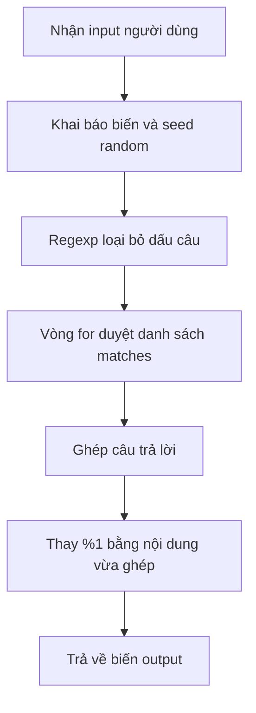

# 🧠 Giải phẫu doctor.go — Chuyện gì xảy ra bên trong Eliza?

> Nguồn: `008-Introduction-to-Go.txt` · [Udemy](https://ua.udemy.com/course/go-programming-language-crash-course/learn/lecture/26161728)

Eliza đã chạy và biết trả lời rồi. Lần này mình muốn mở nắp "hộp đen" ra: phần lớn công việc thực sự nằm trong **`doctor.go`**, nơi có hàm `response` mà `main.go` gọi tới. Mình sẽ không giải thích hết mọi thứ trong một bài — ước chừng phải 30 đến 40 tiếng mới đủ — nhưng sẽ đưa các bạn một tấm bản đồ để đi tiếp.

*Nếu thấy choáng, hãy nghe mình: người làm code nhiều năm cũng bối rối suốt. Cứ thoải mái.*

---

### 🏗️ Bức tranh tổng thể — main.go và doctor.go

Toàn bộ phần "đối đáp" chỉ cần vài dòng trong `main.go` — từ **dòng 11 đến dòng 32**. Chính vài dòng đó, điểm khởi đầu của chương trình, tạo ra **ảo giác** rằng chúng ta đang nói chuyện với một cỗ máy có ý thức.

Tất nhiên đó là ảo giác — và Eliza thì **rất dễ bị "lừa"**, chắc các bạn đã nhận ra.

Nhưng phần lớn công việc nặng nhọc lại nằm ở `doctor.go`, nơi hàm `response` được gọi. Xuyên suốt khóa học, mình hứa sẽ đi qua **toàn bộ** chức năng trong file này, cùng nhiều thứ khác nữa.

---

### 📦 Package, import và hai kiểu comment

Mở `doctor.go` ra, dòng đầu tiên — như mọi file Go — là khai báo package, ở đây là `doctor`. Các bạn có thể để ý: khi thêm file vào dự án, mình đặt nó trong folder tên `doctor`. Đó là **quy ước**: tên folder của package thường trùng với tên package.

Nói thật, chẳng có yêu cầu bắt buộc nào phải tách `doctor` thành package riêng — hoàn toàn có thể để nó trong package `main`. Mình chọn tách ra để các bạn thấy **package hoạt động như thế nào**.

Tiếp theo là phần import. Hầu hết file Go đều import các package: từ **standard library** (trường hợp ở đây — tất cả đều là thư viện chuẩn), từ package tự viết, hoặc từ package của người khác mà chúng ta mang về dùng.

Sau đó là một **comment nhiều dòng**. Go có hỗ trợ cú pháp `/* ... */` để comment trên nhiều dòng, nhưng nói thật là **rất ít khi gặp** trong code Go, và bản thân mình cũng hầu như không dùng. Đa số chúng ta sẽ thấy hai dấu chéo `//` quen thuộc.

---

### 🗂️ Slice, map và slice của slice — kho dữ liệu của Eliza

Dưới phần comment là nơi chứa "dữ liệu sống" của Eliza:

* **`matches`** — một biến kiểu **slice**, nhìn vào khai báo có hai dấu ngoặc vuông `[]` đứng trước. Đây là **slice of strings**: một danh sách chứa nhiều chuỗi.
* **`reflections`** — không phải string mà là một kiểu hoàn toàn mới: **map**. Map là cách nhanh để lưu **keys và values** (khóa và giá trị). Ví dụ mình có thể hỏi map `reflections`: "có key `was` không? nếu có thì value tương ứng là gì?" — trong trường hợp này `was` được chuyển thành `were`. `am` cũng được ánh xạ sang một dạng khác, các bạn sẽ thấy vì sao nó được ghép như vậy. Map sẽ được dùng rất nhiều trong khóa học.
* **`responses`** — lại là slice, nhưng lần này là **slice of slices**: mỗi phần tử bên trong nó lại là một slice gồm nhiều chuỗi. Những danh sách này dùng để tạo câu trả lời.

Và các bạn sẽ thấy ký hiệu **`%1`** xuất hiện khắp nơi trong file — nghe lạ đúng không? Mình sẽ giải thích ngay sau đây.

| Tiêu chí | Slice | Map |
|---|---|---|
| Khai báo | `[]string` | `map[string]string` |
| Lưu trữ | Danh sách nhiều phần tử | Cặp key - value |
| Truy xuất | Theo vị trí trong danh sách | Theo key |
| Ví dụ trong doctor.go | `matches`, `responses` | `reflections` |

---

### ✍️ Hàm intro — chuỗi nhiều dòng với backtick

Hàm đầu tiên trong package `doctor` là `intro` — hàm chúng ta đã dùng. Nó chỉ trả về một `string`, nhưng có điều đặc biệt: chuỗi đó **không dùng ngoặc kép**, mà dùng một ký tự gọi là **backtick** — nằm ở góc trên bên trái bàn phím, ngay dưới phím **Escape**.

Chuỗi nằm giữa cặp backtick có thể **trải dài nhiều dòng**. Rất tiện khi viết những đoạn văn bản dài mà các bạn không muốn dòng code chạy dài tít sang phải màn hình.

Còn đây là một **quy ước quan trọng** khi viết comment cho hàm: **từ đầu tiên của comment phải trùng tên hàm**. Ví dụ, hàm tên `response` thì comment mở đầu bằng chữ `response`, rồi mới tới phần mô tả. Comment bị compiler bỏ qua, nhưng nếu các bạn công bố package lên kho package công khai của Go, **comment sẽ được dùng để tạo tài liệu tự động**. Vậy nên hãy tập viết comment đúng chuẩn từ sớm.

---

### ⚙️ Hàm response — random, regexp và vòng for xây câu trả lời

Hàm `response` nhận input người dùng (đã được `main.go` xóa ký tự xuống dòng) và làm những việc nặng nhọc nhất:

1. **Khai báo hai biến trên cùng một dòng**, ngăn cách bằng dấu phẩy — hoàn toàn có thể viết thành hai dòng, nhưng một dòng gọn hơn.
2. **Sinh một số ngẫu nhiên** và **seed bộ sinh số ngẫu nhiên** có sẵn trong Go. Vì sao cần? Vì slice ở dòng 116 có tới **10 câu trả lời khác nhau**; nếu lúc nào cũng trả về đúng một câu thì nói chuyện với Eliza sẽ cực kỳ nhàm chán.
3. **Làm sạch input** bằng **regular expression** (biểu thức chính quy) — package built-in tên `regexp`. Mẫu ở đây nói rằng: mọi thứ **không phải** chữ thường `a`-`z`, **không phải** chữ hoa `A`-`Z`, và **không phải** chữ số `0`-`9` thì bị loại bỏ. Cú pháp hơi rối mắt, các bạn cứ tạm bỏ qua. Hàm `ReplaceAllString` được dùng để thay tất cả những ký tự đó bằng dấu cách — thế là hết dấu câu trong câu người dùng.
4. **Vòng lặp for** — phiên bản khác với vòng `for` ở `main.go`. Ở đây vòng lặp **bắt đầu đếm từ 0**: biến `i` mang giá trị 0, đây là kiểu **int** (integer, số nguyên). Điều kiện là `i` nhỏ hơn `len(matches)` — hàm `len` có sẵn trong Go trả về số phần tử của slice `matches`. Mỗi vòng, `i++` — viết tắt của `i = i + 1`. Cứ thế, vòng lặp đi qua toàn bộ danh sách `matches`, và logic bên trong xây dựng câu trả lời.
5. **Thay thế `%1`** — cuối cùng, ngay trước khi trả về biến `output`, đoạn code tìm `%1` và thay bằng chuỗi vừa được ghép trong vòng lặp.

---

### ✅ Tự kiểm tra nhanh

**1. Phần lớn công việc "nặng" của Eliza nằm ở file nào?**

<b>Xem đáp án</b>

**Đáp án:** `doctor.go`.
Giải thích: `main.go` chỉ gọi hàm `response`; toàn bộ logic xử lý nằm trong package `doctor`.
Tham chiếu: Mục "Bức tranh tổng thể".

**2. `reflections` là kiểu dữ liệu gì và dùng để làm gì?**

<b>Xem đáp án</b>

**Đáp án:** Là một map — lưu cặp key/value, ví dụ chuyển `was` thành `were`.
Giải thích: Map cho phép tra cứu nhanh giá trị theo key, dùng để "phản chiếu" câu nói người dùng.
Tham chiếu: Mục "Slice, map và slice của slice".

**3. Vì sao hàm response cần sinh số ngẫu nhiên?**

<b>Xem đáp án</b>

**Đáp án:** Vì slice câu trả lời có tới 10 lựa chọn; cần chọn ngẫu nhiên để Eliza không lặp mãi một câu.
Giải thích: Code còn seed bộ sinh số ngẫu nhiên có sẵn trong Go trước khi dùng.
Tham chiếu: Mục "Hàm response".

**4. Package nào được dùng để loại bỏ dấu câu khỏi input?**

<b>Xem đáp án</b>

**Đáp án:** `regexp` (regular expression), dùng hàm `ReplaceAllString`.
Giải thích: Mẫu loại bỏ mọi ký tự không phải chữ cái a-z, A-Z hoặc chữ số 0-9, thay bằng dấu cách.
Tham chiếu: Mục "Hàm response".

**5. `i++` nghĩa là gì?**

<b>Xem đáp án</b>

**Đáp án:** Tăng `i` thêm 1 — viết tắt của `i = i + 1`.
Giải thích: Vòng `for` trong `doctor.go` bắt đầu từ 0 và duyệt qua toàn bộ slice `matches`.
Tham chiếu: Mục "Hàm response".

---

Bài này đúng là khá nặng — chắc chắn các bạn chưa hiểu hết mọi thứ trong `doctor.go`, và điều đó **hoàn toàn ổn**. Mình sẽ không ném tất cả vào mặt các bạn một lúc, vì như thế chẳng giúp ích gì; chúng ta sẽ đi từng bước nhỏ, lần lượt. Các bạn hãy **lưu dự án lại và ghi nhớ nó nằm ở đâu**, vì chúng ta sẽ còn quay lại đoạn code này sau. Hẹn gặp lại ở bài tiếp theo! 🚀

## Nguồn tham khảo

- [Package regexp](https://pkg.go.dev/regexp)
- [Go maps in action](https://go.dev/blog/maps)
