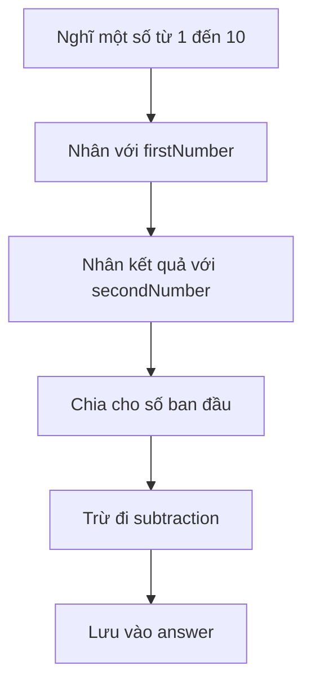

# 🎮 Guess the Number: Trò chơi đoán số đầu tiên của bạn

> Nguồn: `012-Guess-the-Number-Game.txt` · [Udemy](https://ua.udemy.com/course/go-programming-language-crash-course/learn/lecture/26161760)

Tiếp nối bài trước, chúng ta quay lại project `variables` để dựng trò chơi **Guess the Number**. Chúng ta sẽ cùng chờ phím Enter, in hướng dẫn ra màn hình và dùng hằng số (constant) để code gọn gàng hơn — mọi thứ đều nằm trong tầm tay các bạn.

### 🧹 Đồng bộ cách khai báo biến

Việc đầu tiên mình làm là **thống nhất (consistency)** cách khai báo biến trong chương trình — tất cả đều theo một kiểu để code sạch và dễ đọc hơn:

```go
var firstNumber = 2
var secondNumber = 5
var subtraction = 7
```

Mình xóa các dòng và comment dư thừa, gom lại cho gọn. Sau bước dọn dẹp này, chương trình đã sẵn sàng cho phần logic.

---

### 📝 Phác thảo trò chơi bằng comment

Mình viết vài comment để phác thảo những việc cần làm:

1. Hiển thị lời chào và hướng dẫn ra console.
2. Dẫn người chơi đi qua các bước của trò chơi (đây là lúc dùng các biến phía trên).
3. Cuối cùng, thông báo đáp án.

Vì cần chỗ lưu đáp án, mình khai báo thêm biến `answer` kiểu `int` nhưng **không gán giá trị**. Khi khai báo kiểu này, biến sẽ nhận **giá trị mặc định (zero value)**: với `string` là chuỗi rỗng, còn với `int` là số **0**.

---

### ⌨️ In hướng dẫn và chờ phím Enter

Phần in ấn thì chúng ta đã biết dùng package `fmt` rồi:

* `fmt.Println` để in tiêu đề "Guess the Number Game".
* In thêm một dòng toàn dấu gạch ngang để tiêu đề trông như được gạch chân.
* In một dòng trống bằng `fmt.Println` với chuỗi rỗng.

Còn việc chờ phím Enter cần một "người đọc" — đúng như chúng ta từng làm trong Eliza:

```go
reader := bufio.NewReader(os.Stdin)

reader.ReadString('\n')
```

`bufio.NewReader` nhận tham số `os.Stdin`; còn `ReadString` cần một ký tự đặt trong dấu nháy đơn. Sau khi viết xong, mình tạm comment các biến chưa dùng để chạy thử bằng `go run main.go`. *Các bạn cứ chạy thử, lỗi biên dịch là chuyện thường ở giai đoạn này.*

---

### 🧩 Gom phần lặp lại vào `const prompt`

Mình nhận ra câu "and press enter when ready" bị lặp ở nhiều chỗ, thật không hiệu quả chút nào. Giải pháp là dùng một **constant (hằng số)** — khai báo ngoài hàm `main` bằng từ khóa `const`, nên nó dùng được ở bất kỳ hàm nào trong chương trình.

Điểm khác biệt giữa hằng và biến:

* Hằng số **không bao giờ thay đổi** — đúng như tên gọi của nó.
* Hằng số **không bắt buộc phải được dùng** — không dùng cũng không dính lỗi biên dịch như biến.

Từ đây, các bước của trò chơi lần lượt được in ra, mỗi bước chờ người chơi bấm Enter:



Hết mỗi dòng hướng dẫn, mình dán lại lệnh chờ Enter `reader.ReadString` đã viết. Chạy thử với số 6: nhân 2 thành 12, nhân 5 thành 60, chia lại số ban đầu thành 10, rồi trừ 7 còn 3 — và trò chơi dừng ở đó vì biến `answer` chưa được dùng. Mình tạm comment nó lại để chương trình chạy trơn tru.

---

Chúng ta đã có gần đủ một trò chơi hoàn chỉnh: biết chờ người dùng bấm Enter, biết in phản hồi, và biết dùng biến lẫn hằng số để tổ chức code. Bài sau chúng ta sẽ tính nốt đáp án và khám phá "mánh" toán học đằng sau trò chơi này. 🚀

## Nguồn tham khảo

- [Go Packages — bufio](https://pkg.go.dev/bufio)
- [Udemy — Guess the Number Game](https://ua.udemy.com/course/go-programming-language-crash-course/learn/lecture/26161760)
