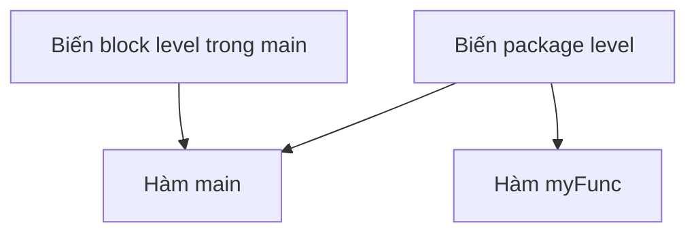

# 🔭 Scope trong Go: Biến của bạn "sống" ở đâu và ai được chạm vào nó?

> Nguồn: `016-Scope.txt` · [Udemy](https://ua.udemy.com/course/go-programming-language-crash-course/learn/lecture/26161780)

Chúng ta đã học khá nhiều về biến, giờ là lúc sang một khái niệm quan trọng không kém: **scope (phạm vi)**. Scope nói về việc trong chương trình, bạn được truy cập vào một biến đã khai báo ở đâu, và lúc đó giá trị của nó là gì. Khái niệm này không khó, nhưng cực kỳ quan trọng — nên các bạn chịu khó theo sát nhé.

Mình đã đóng project Guess the Number và mở một cửa sổ Visual Studio Code mới. Các bạn hãy mở theo: tạo folder `scope`, thêm file `main.go` — nhớ là **file Go phải kết thúc bằng `.go`** nếu không mọi thứ sẽ không chạy.

### 🧱 Biến block level — chỉ sống trong hàm

Trong hàm `main`, mình khai báo một biến tên `one` kiểu `string` mang giá trị chữ "one". Rồi mình tạo thêm hàm `myFunc`, bên trong cũng khai báo một biến tên `one` nhưng mang **số 1**:

```go
func main() {
	var one string = "one"
	fmt.Println(one)
	myFunc()
}

func myFunc() {
	var one int = 1
	fmt.Println(one)
}
```

Điều thú vị: có **hai biến cùng tên `one`** trong chương trình. Khi chạy `go run main.go`, cả hai giá trị khác nhau đều được in ra bình thường. Lý do: đây là các **block level variable (biến cấp khối)** — chúng chỉ tồn tại bên trong hàm nơi chúng được khai báo.

Nếu xóa khai báo trong `main` và vẫn in nó ra, Visual Studio Code sẽ báo lỗi kiểu **`undeclared name: one`**. Có hai cách sửa: truyền `one` vào như một **tham số (parameter)** của hàm, hoặc chuyển khai báo ra ngoài hàm — cách thứ hai dẫn chúng ta tới phần tiếp theo.

---

### 📦 Biến package level — sống khắp package

Khi mình di chuyển khai báo biến ra **ngoài tất cả các hàm**, đặt ngay ở cấp package, mọi lỗi biến mất. Chạy lại chương trình, cả hai lần in đều cho ra **cùng một giá trị**.

Đây là **package level variable (biến cấp package)** — có mặt ở mọi nơi trong package mà nó được khai báo.



---

### ⚠️ Variable shadowing — thứ bạn đừng bao giờ làm

Giờ là một "tai nạn" mình cố tình tạo ra để các bạn thấy: bên trong `main`, mình khai báo một biến mới cũng tên `one`, **trùng tên với biến package level**. Khi chạy chương trình:

* Lần in đầu tiên (từ `main`) ra giá trị của biến **block level** — nó đã "che khuất" biến package level.
* Lần in thứ hai (từ `myFunc`) lấy giá trị của biến **package level**.

Hiện tượng này gọi là **variable shadowing (che khuất biến)**, và mình khuyên thật lòng: **đừng bao giờ làm vậy**. Trong một chương trình phức tạp, nó khiến bạn không biết biến đang được nhắc tới là biến nào. Hãy đặt tên khác nhau.

Nhân đây, một quy ước đặt tên: khi tên biến có hai từ trở lên, mình luôn dùng **camelCase** — bắt đầu chữ thường, và viết hoa chữ đầu của mỗi từ tiếp theo. Quy ước này có ở hầu hết ngôn ngữ lập trình.

---

### 🌐 Package, export và chữ cái đầu tiên

Tới phần thú vị nhất: biến ở package này có thể được package khác dùng không? Mình bắt đầu bằng thói quen tốt mỗi khi tạo project Go mới — chạy `go mod init myApp`, và file `go.mod` xuất hiện trong Explorer.

Sau đó, mình tạo folder `packageOne` ngay cạnh `go.mod` và `main.go`, trong đó tạo file `package.go`:

```go
package packageOne

var privateVar = "I am private"
var PublicVar = "I am public or exported"
```

Hai biến chỉ khác nhau **một chữ cái đầu**: `privateVar` viết thường, `PublicVar` viết hoa. Ở `main.go`, mình viết `newString := packageOne.PublicVar` và phải **tự tay import** `myApp/packageOne` — một chút phiền toái của Visual Studio Code, ít nhất là với mình.

Kết quả: `PublicVar` truy cập được, còn khi gõ `packageOne.` thì autocomplete **chỉ hiện mỗi `PublicVar`**, không hề thấy `privateVar`. Lý do nằm ở chữ cái đầu:

* Tên bắt đầu bằng **chữ HOA** → **exported (xuất ra ngoài)**: package khác import là dùng được.
* Tên bắt đầu bằng **chữ thường** → chỉ dùng được **bên trong package** chứa nó.

Quy tắc y hệt áp dụng cho **hàm**: `func Exported()` gọi được từ package khác qua `packageOne.Exported()`, còn `func NotExported()` thì không.

| Loại | Khai báo ở đâu | Truy cập từ đâu |
|---|---|---|
| Block level | Trong hàm | Chỉ trong hàm đó |
| Package level | Ngoài hàm, cấp package | Mọi hàm trong package |
| Exported | Tên bắt đầu CHỮ HOA | Trong package và cả ngoài package |
| Unexported | Tên bắt đầu chữ thường | Chỉ trong package chứa nó |

---

### ✅ Tự kiểm tra nhanh

**1. Biến block level có thể được truy cập từ đâu?**
<details>
<summary><b>Xem đáp án</b></summary>

**Đáp án:** Chỉ bên trong hàm nơi nó được khai báo.
Giải thích: Hai hàm khác nhau có thể có hai biến cùng tên `one` mà không hề đụng nhau.
Tham chiếu: Mục Biến block level.
</details>

**2. Muốn một biến dùng được ở mọi hàm trong package thì khai báo thế nào?**
<details>
<summary><b>Xem đáp án</b></summary>

**Đáp án:** Khai báo ở cấp package — ngoài tất cả các hàm.
Giải thích: Biến package level có mặt ở mọi nơi trong package chứa nó.
Tham chiếu: Mục Biến package level.
</details>

**3. Variable shadowing là gì?**
<details>
<summary><b>Xem đáp án</b></summary>

**Đáp án:** Là khai báo biến trùng tên, khiến biến block level "che khuất" biến package level.
Giải thích: Trong `main`, tên `one` trỏ tới biến block level; trong hàm khác, nó trỏ tới biến package level — rất dễ nhầm lẫn, nên tránh.
Tham chiếu: Mục Variable shadowing.
</details>

**4. Điều gì quyết định một biến hay hàm là exported?**
<details>
<summary><b>Xem đáp án</b></summary>

**Đáp án:** Chữ cái đầu tiên viết HOA.
Giải thích: `PublicVar` và `Exported` dùng được từ package khác; `privateVar` và `NotExported` thì không.
Tham chiếu: Mục Package, export và chữ cái đầu tiên.
</details>

**5. Vì sao `privateVar` không xuất hiện khi gõ `packageOne.` trong `main.go`?**
<details>
<summary><b>Xem đáp án</b></summary>

**Đáp án:** Vì nó bắt đầu bằng chữ thường nên không được export khỏi `packageOne`.
Giải thích: Chỉ những tên bắt đầu bằng chữ HOA mới truy cập được từ package đã import nó.
Tham chiếu: Mục Package, export và chữ cái đầu tiên.
</details>

---

Scope là chủ đề mình sẽ còn nhắc nhiều trong khóa học, nhưng chừng này là đủ để chúng ta bắt đầu. Đi tiếp thôi! 🚀

## Nguồn tham khảo

- [The Go Programming Language Specification — Declarations and scope](https://go.dev/ref/spec)
- [Udemy — Scope](https://ua.udemy.com/course/go-programming-language-crash-course/learn/lecture/26161780)
