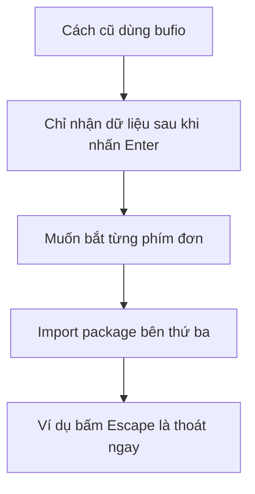

# ⌨️ Mở màn chương Console Input and Output — Từ phím Enter đến từng phím bấm

> Nguồn: `020-Introduction.txt` · [Udemy](https://ua.udemy.com/course/go-programming-language-crash-course/learn/lecture/26161868)

Chào các bạn, hôm nay mình mở màn một chương mới: **đọc và ghi dữ liệu với console** (bàn điều khiển — cửa sổ giao tiếp dạng dòng lệnh). Lần này chúng ta sẽ dành hẳn một chương để đào sâu việc nhận dữ liệu người dùng nhập vào và in dữ liệu ra, thay vì chỉ lướt qua như những bài trước.

Mình đang ngồi xem lại file `main.go` của dự án **Eliza** — dự án các bạn đã gặp từ đầu khóa. Code cũ vẫn chạy tốt, nhưng nó có một giới hạn thú vị mà mình muốn cùng các bạn "gỡ" trong chương này.

---

### 🎯 Chương này chúng ta sẽ học gì?

Đến giờ, chúng ta đã đọc và ghi console bằng `bufio` với `bufio.NewReader` — một package có sẵn trong **thư viện chuẩn (standard library)** của Go. Chương trình Eliza vẫn hoạt động trơn tru: chạy `go run main.go`, nó in hướng dẫn và nhắc chúng ta gõ `quit` khi xong việc.

Trong chương này, mục tiêu là làm những việc đó **mượt tay và chuyên nghiệp hơn**:

* Lắng nghe bàn phím theo cách mới, linh hoạt hơn cách cũ.
* Thao tác chuỗi gọn gàng hơn khi in thông tin ra màn hình.
* Làm quen với những kỹ thuật mình sẽ dùng đi dùng lại ở các dự án sau.

---

### ⌨️ Giới hạn "phải nhấn Enter" của cách đọc hiện tại

Đây là điều mình muốn các bạn để tâm: với `bufio.NewReader` và biến `reader` hiện có, chương trình **chỉ nghe được những gì được gõ trước khi phím Enter được nhấn**. Nói cách khác, người dùng buộc phải gõ chữ `quit` rồi Enter thì chương trình mới biết.

Vậy nếu mình chỉ muốn người dùng **bấm phím Escape** để thoát thì sao? Với cách hiện tại, điều đó là không thể.

Vì thế chúng ta sẽ học cách **lắng nghe từng phím bấm đơn lẻ (single key press)** — bấm phím nào là biết ngay, không cần Enter. Nghe có vẻ nhỏ nhặt, nhưng đây là kỹ năng cực kỳ hữu dụng khi viết game console hay công cụ dòng lệnh.

---

### 🧩 Hai món mới đang chờ các bạn

Chương này có hai "món" mà mình tin sẽ mở ra nhiều thứ thú vị:

1. **Package bên thứ ba đầu tiên** — lần đầu tiên trong khóa, mình hướng dẫn các bạn import một package không thuộc thư viện chuẩn. *Đừng lo, đây là việc bạn sẽ làm suốt khi lập trình Go, nên càng quen sớm càng tốt.*
2. **Thao tác chuỗi "xịn" hơn với package `fmt`** — package này có sẵn nhiều chức năng chúng ta chưa từng ngó tới, giúp việc in ấn và định dạng chuỗi gọn gàng hơn hẳn.

Qua vài bài tới, mình tin các bạn sẽ **thành thạo hơn hẳn** khoản đọc ghi console — nền tảng cho mọi chương trình tương tác.

---

Hết phần mở màn rồi. Bài tiếp theo chúng ta bắt tay ngay vào việc dựng project mới, khởi tạo Go module bằng `go mod init`, và import package bên thứ ba đầu tiên nhé. Hẹn gặp lại các bạn! 🚀
