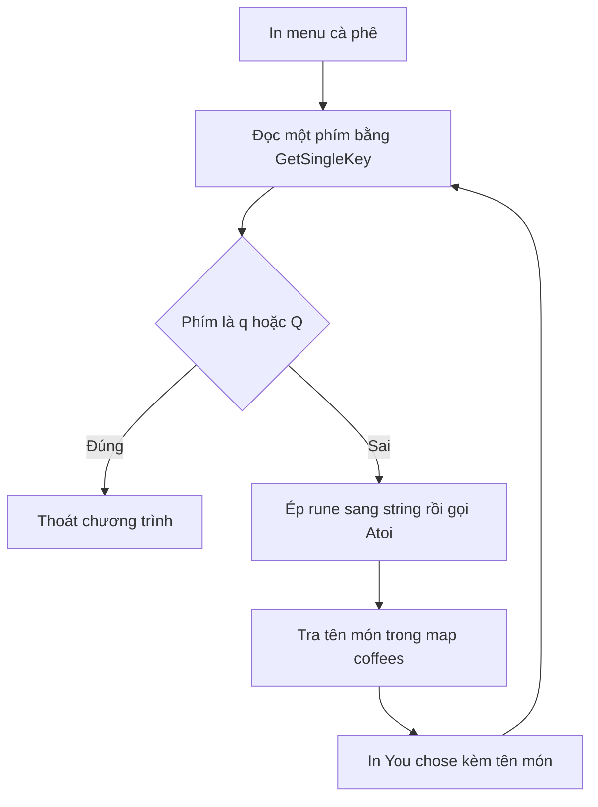

# ☕ Menu cà phê một phím bấm — rune, strconv, map và fmt.Sprintf

> Nguồn: `022-Console-Input-Part-2.txt` · [Udemy](https://ua.udemy.com/course/go-programming-language-crash-course/learn/lecture/26161890)

Chào các bạn! Chương trình của chúng ta đang dừng ở mức: nghe phím bấm, in thông tin về phím đó, gặp Escape thì thoát. Hôm nay mình sẽ nâng cấp nó thành một **menu chọn món bằng một phím bấm** — và trên đường đi, chúng ta gặp hai người bạn mới: kiểu `rune` và kiểu dữ liệu `map`.

Đây là một bài khá đặc biệt vì mình sẽ chỉ cho các bạn thấy tại sao bấm phím `1` mà chương trình lại in ra số `49` — nghe lạ đúng không? Cùng tìm hiểu nhé.

---

### 📋 Dựng menu chọn món bằng một phím

Mình sửa phần chữ được in ra thành một menu nhỏ:

* Dòng tiêu đề `MENU`, gạch dưới cho đẹp mắt.
* Các lựa chọn: **1 — Cappuccino**, **2 — Latte**, **3 — Americano**, **4 — Mocha**, **5 — Macchiato**, **6 — Espresso**.
* Và lần này dùng phím `q` để thoát chương trình (thay vì Escape).

Phần lắng nghe phím giữ nguyên tinh thần cũ, chỉ bỏ đoạn in thông tin về phím. Nhìn kỹ hàm `GetSingleKey`, nó trả về ba thứ:

* một `rune` — **rune là một ký tự đơn**, mức thấp hơn kiểu `string`;
* một giá trị kiểu `keyboard.Key` — **custom type** của package keyboard mà khóa học sẽ bàn kỹ sau;
* và `error` như thường lệ.

Chú ý: vì `char` là `rune` còn `keyboard.KeyEsc` thuộc type khác nên **không so sánh trực tiếp được**. Ta kiểm tra ký tự `'q'`, kèm cả `'Q'` phòng khi người dùng gõ chữ hoa. Ký tự để trong **nháy đơn** vì đây là rune, không phải chuỗi.

---

### 🔤 Từ rune 49 đến con số 1

Chạy thử `go run main.go` và bấm phím `1`, màn hình in ra:

* Bấm `1` → `You chose 49`.
* Bấm `2` → `You chose 50`.

Không hữu ích lắm nhỉ! `49` và `50` chính là mã ký tự của `1` và `2`, còn mình cần con số thật để tra cứu. Cách chuyển rất đơn giản — dùng `strconv.Atoi` (**alphanumeric to integer**) trong package `strconv`:

```go
i, _ := strconv.Atoi(string(char))
```

`Atoi` yêu cầu một `string`, nên trước hết phải ép `char` (rune) sang string bằng `string(char)`, còn error tạm thời bỏ qua bằng dấu `_`.

Trong lúc thử, mình cũng dùng `fmt.Sprintf("You chose %q", char)` để in ký tự — placeholder `%q` dành cho rune, in ra kèm cặp nháy đơn. Muốn in số nguyên thì đổi sang `%d`. *Mình cũng chẳng hiểu vì sao họ chọn chữ `d`, nhưng đó là quy ước của họ.* Bấm `2` → `You chose 2`, chuẩn không cần chỉnh!

---

### 🗺️ `map` — cuốn từ điển tra cứu siêu nhanh

Giờ tới **data structure mới**: `map`. Đây là cấu trúc lưu dữ liệu theo cặp **index → value**, và tra cứu thì cực nhanh. Khác với `int` hay `string` khai báo bằng `var`, map được tạo bằng `make`, và cả index lẫn value đều phải khai báo kiểu rõ ràng:

```go
coffees := make(map[int]string)
coffees[1] = "cappuccino"
coffees[2] = "latte"
coffees[3] = "americano"
coffees[4] = "mocha"
coffees[5] = "macchiato"
coffees[6] = "espresso"
```

Các con số 1–6 khớp đúng với menu bên dưới. Khi in, thay vì in `char`, ta tra thẳng `coffees[i]` và dùng placeholder `%s` cho string. Chạy thử: bấm `2` → `You chose latte`; bấm `3` → `You chose americano`. Tuyệt vời.



---

### ✨ `fmt.Sprintf` và hai mẹo viết gọn

Còn một chuyện nhỏ: khi bấm `q`, chương trình vẫn in `You chose` trước khi thoát — hơi thừa. Mình sửa bằng cách **chuyển đoạn kiểm tra `q` lên trước** phần in thông tin. Chạy lại: bấm `1`, `2`, `6` đều đúng, bấm `q` thoát êm ru.

Mẹo thứ hai còn gọn hơn nữa. Trước đó mình viết dạng hai bước:

* `t := fmt.Sprintf("You chose %s", coffees[i])`
* `fmt.Println(t)`

Vì `fmt.Sprintf` trả về một string, còn `fmt.Println` nhận string làm tham số, nên ta **đưa thẳng lời gọi hàm vào trong nhau** — bỏ luôn biến tạm `t`:

```go
fmt.Println(fmt.Sprintf("You chose %s", coffees[i]))
```

Một dòng thay cho hai, gọn gàng hơn hẳn.

---

### ✅ Tự kiểm tra nhanh

**1. `GetSingleKey` trả về những giá trị nào?**
<details>
<summary><b>Xem đáp án</b></summary>

**Đáp án:** Một `rune`, một giá trị kiểu `keyboard.Key`, và một `error`.
Giải thích: Ta quan tâm tới rune (ký tự) và error; `keyboard.Key` là custom type sẽ học sau.
Tham chiếu: Mục "Dựng menu chọn món bằng một phím".

</details>

**2. Vì sao bấm phím `1` mà chương trình in ra `49`?**
<details>
<summary><b>Xem đáp án</b></summary>

**Đáp án:** Vì `char` là rune, in ra mã ký tự — `1` có mã là 49.
Giải thích: Muốn có số thật để tra cứu, phải chuyển bằng `strconv.Atoi`.
Tham chiếu: Mục "Từ rune 49 đến con số 1".

</details>

**3. Vì sao phải ép `char` sang string trước khi gọi `strconv.Atoi`?**
<details>
<summary><b>Xem đáp án</b></summary>

**Đáp án:** Vì `Atoi` yêu cầu tham số kiểu `string`.
Giải thích: `char` là rune, nên cần `string(char)` để chuyển đổi trước.
Tham chiếu: Mục "Từ rune 49 đến con số 1".

</details>

**4. `map` được tạo và dùng như thế nào?**
<details>
<summary><b>Xem đáp án</b></summary>

**Đáp án:** Tạo bằng `make(map[int]string)`, gán giá trị theo cặp index–value, tra cứu bằng `coffees[i]`.
Giải thích: Map lưu dữ liệu theo key–value và tra cứu rất nhanh.
Tham chiếu: Mục "map — cuốn từ điển tra cứu siêu nhanh".

</details>

**5. Vì sao phải kiểm tra phím `q` trước khi in thông tin?**
<details>
<summary><b>Xem đáp án</b></summary>

**Đáp án:** Để tránh in dòng `You chose ...` thừa khi người dùng chọn thoát.
Giải thích: Quy trình mới: nghe phím → kiểm tra thoát → nếu chưa thoát mới in.
Tham chiếu: Mục "fmt.Sprintf và hai mẹo viết gọn".

</details>

---

Thế là menu cà phê đã chạy ngon lành. Trong bài tiếp theo, chúng ta sẽ đem kỹ thuật lắng nghe phím đơn này vào một game phức tạp hơn — phiên bản hiện đại của **Hamurabi**, trò chơi console cổ điển từng rất nổi tiếng và là "tổ tiên" của SimCity. Hẹn gặp lại các bạn! 🚀

## Nguồn tham khảo

- [strconv — pkg.go.dev](https://pkg.go.dev/strconv)
- [fmt — pkg.go.dev](https://pkg.go.dev/fmt)
