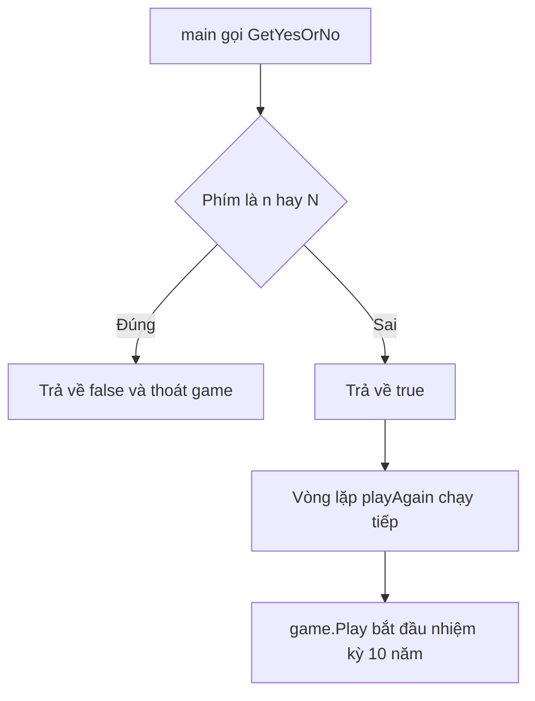

# ⛏️ Hammer Bitcoin — đưa lắng nghe phím bấm vào game thật

> Nguồn: `023-Listening-for-keypresses-in-Hammer-Bitcoin-game.txt` · [Udemy](https://ua.udemy.com/course/go-programming-language-crash-course/learn/lecture/26161896)

Chào các bạn! Hôm nay chúng ta lấy kỹ thuật lắng nghe phím bấm đã học, đem áp dụng vào một chương trình "đời thực" hơn hẳn: một phiên bản của trò chơi console cổ **Hamurabi**. Thay vì chỉ nghe phím rồi in ra thông tin vô thưởng vô phạt, lần này mỗi phím bấm sẽ điều khiển cả một trò chơi.

Các bạn cứ thong thả — mình sẽ dẫn từng bước từ lúc dựng project đến khi thấy màn hình chào của game. Phần logic chi tiết mình để dành cho bài sau, hôm nay ưu tiên cho các bạn "chạm" được vào game đã.

---

### 🎮 Từ Hamurabi đến Hammer Bitcoin

Game gốc tên là **Hamurabi** — *thú thật mình cũng không chắc phát âm trò này thế nào, mình chưa bao giờ chắc cả.* Đây là trò chơi ra đời từ rất nhiều năm trước, lấy tên từ một nhân vật lịch sử có thật: Hamurabi, vị vua kiêm nhà lập pháp được kính trọng và nổi tiếng.

Game chơi theo lượt: bạn mua bán đất, trồng và thu hoạch mùa màng, cố gắng làm quốc gia hưng thịnh. Phiên bản của chúng ta được khoác áo thế kỷ 21: **bạn không còn là vua một nước, mà là CEO của một công ty đang đào bitcoin** và tìm cách làm công ty sinh lời.

---

### 📂 Dựng project và lấy code từ course resources

Mình mở Visual Studio Code, tạo folder mới tên `hammer-bitcoin` rồi mở lên. Cấu trúc project:

* Ở gốc project: file `main.go`.
* Bên cạnh: folder `game`, và trong đó là file `bitcoin-miner.go`.

Trong **course resources** của bài này có sẵn hai file để tải về: `main.go` và `bitcoin-miner.go`. Các bạn tải về, rồi copy toàn bộ nội dung của từng file vào đúng vị trí mình vừa tạo.

Tiếp theo là phần thủ tục quen thuộc:

1. Khởi tạo module: `go mod init myapp` — *nhớ thói quen này mỗi khi bắt đầu project mới.* Bắt buộc đặt đúng tên `myapp` vì file `main.go` import đường dẫn `myapp/game`.
2. Cài hai dependency:
   * `go get -u github.com/eiannone/keyboard` — package lắng nghe phím bấm chúng ta đã gặp ở bài trước.
   * `go get -u github.com/fatih/color` — để có màu sắc đẹp mắt hơn trong console.

---

### 🔄 Chạy thử khi `game.Play()` còn bị comment

*Khoan chạy game đã nhé.* Mình muốn các bạn xem riêng cơ chế lắng nghe phím, nên việc đầu tiên là mở `main.go` và **comment dòng 12** — dòng gọi `game.Play()`.

Trong `main.go` chỉ có hai import: `fmt` và `myapp/game` (chính là file `bitcoin-miner.go`, khai báo `package game` ở đầu file). Comment xong, mở terminal và chạy `go run main.go`:

* Chương trình hỏi: *"Would you like to play again, yes or no?"*
* Gõ `yes` → nó hỏi lại y hệt, lặp mãi không thôi.
* Bấm `n` → thoát ngay lập tức.

Vậy là cơ chế đã chạy đúng. Giờ xem nó được viết thế nào.

---

### 🧠 Mổ xẻ hàm `GetYesOrNo`

Trong `main`, biến `playAgain` được gán bằng giá trị mà `game.GetYesOrNo(...)` trả về — hàm này nhận **một đối số duy nhất** là câu hỏi dạng string: *"Would you like to play again yes or no?"*.

Mẹo đi nhanh tới định nghĩa hàm trong Visual Studio Code:

* **Trên Mac:** giữ phím `Cmd` (nằm cạnh spacebar) rồi click vào tên hàm.
* **Trên Windows:** giữ phím `Ctrl` rồi click.

Hàm `GetYesOrNo` — đầu hàm có comment *"get yes or no allows the player to try again or quit"* — làm y hệt menu cà phê chúng ta viết ở bài trước:

* Gọi `keyboard.Open()`, kiểm tra lỗi; nếu lỗi thì chương trình "chết" và in lỗi ra console.
* Dùng `defer` để đóng keyboard khi hàm kết thúc. *Nếu quên đóng, chương trình vẫn chạy được một thời gian, nhưng sẽ rò rỉ bộ nhớ (memory leak) hoặc rò rỉ tài nguyên (resource leak), và rồi chuyện xấu sẽ xảy ra.* Mở thứ gì thì phải nhớ đóng thứ đó.
* Vào vòng lặp vô hạn, in câu hỏi (tham số `q` truyền từ `main` vào), rồi đọc phím:

```go
char, _, err := keyboard.GetSingleKey()
if err != nil {
    log.Fatal(err)
}
if char == 'n' || char == 'N' {
    return false
}
return true
```

Cách hoạt động rất đơn giản: bấm `n` hoặc `N` → trả về `false` (không chơi nữa); mọi phím khác → trả về `true` (mặc định là muốn chơi tiếp).

Ở `main`, vòng lặp `for playAgain { ... }` là cách viết ngắn gọn — tương đương với `for playAgain == true`. Khi `playAgain` thành `false`, chương trình thoát.



---

### ⛏️ Vào game: nhiệm kỳ 10 năm của CEO

Giờ xóa comment dòng `game.Play()` và xem hàm `Play` làm gì:

* Đầu tiên, **seed bộ sinh số ngẫu nhiên** bằng thời gian hiện tại ở định dạng **Unix nano** — nhờ đó mỗi lần chạy chương trình, số ngẫu nhiên sẽ khác nhau.
* Gọi `PrintIntroductoryParagraph` — một hàm **non-exported** chỉ dùng được bên trong package `game` — để in đoạn giới thiệu.
* Đặt biến `stillInOffice` bằng `true`, rồi vào vòng lặp với hai điều kiện: `stillInOffice && year <= 10` (năm bắt đầu từ 1). Nghĩa là game chỉ tiếp diễn **khi bạn còn tại vị và chưa quá 10 năm**.

Màn hình chào game in ra rất nhiều thông tin quan trọng:

* Chúc mừng bạn là **CEO mới của Make Me Rich, Inc.**, được bầu cho nhiệm kỳ 10 năm.
* Nhiệm vụ: chi tiêu cho nhân viên, chỉ đạo việc đào bitcoin, mua bán máy tính khi cần; coi chừng **hacker** và **sụp thị trường**.
* Tiền tệ là **bitcoin**. Vài quy tắc sống còn:
  1. Mỗi nhân viên cần ít nhất **20 bitcoin đổi thành tiền mặt mỗi năm** để sống.
  2. Mỗi nhân viên chỉ quản lý tối đa **10 máy tính**.
  3. Cần **2 bitcoin tiền điện** để đào bitcoin trên một máy tính.
  4. Giá máy tính **biến động mỗi năm**.
* Lãnh đạo khéo léo → cuối nhiệm kỳ được tán thưởng; làm ăn kém → bị sa thải.

Sau đó chương trình in tình trạng công ty hiện tại của bạn. Các bạn cứ đọc kỹ hướng dẫn và chơi thử một chút — bài sau chúng ta sẽ mổ xẻ logic game chi tiết hơn.

---

### ✅ Tự kiểm tra nhanh

**1. Game gốc Hamurabi xoay quanh việc gì?**
<details>
<summary><b>Xem đáp án</b></summary>

**Đáp án:** Mua bán đất, trồng và thu hoạch mùa màng qua từng lượt để làm quốc gia hưng thịnh.
Giải thích: Bản Hammer Bitcoin giữ tinh thần đó nhưng đổi thành đào bitcoin và làm công ty sinh lời.
Tham chiếu: Mục "Từ Hamurabi đến Hammer Bitcoin".

</details>

**2. Hai dependency cần cài cho Hammer Bitcoin là gì?**
<details>
<summary><b>Xem đáp án</b></summary>

**Đáp án:** `github.com/eiannone/keyboard` và `github.com/fatih/color`.
Giải thích: Keyboard để lắng nghe phím bấm, color để có màu sắc trong console.
Tham chiếu: Mục "Dựng project và lấy code".

</details>

**3. Vì sao lúc đầu phải comment dòng `game.Play()`?**
<details>
<summary><b>Xem đáp án</b></summary>

**Đáp án:** Để xem riêng cơ chế lắng nghe phím bấm hoạt động trước khi vào game.
Giải thích: Nhờ vậy ta thấy rõ vòng lặp hỏi "yes or no" mà chưa bị logic game làm rối.
Tham chiếu: Mục "Chạy thử khi game.Play còn bị comment".

</details>

**4. Không đóng keyboard sau khi dùng thì hậu quả là gì?**
<details>
<summary><b>Xem đáp án</b></summary>

**Đáp án:** Chương trình có thể chạy một thời gian nhưng bị rò rỉ bộ nhớ hoặc tài nguyên.
Giải thích: Vì vậy mình dùng `defer` + hàm ẩn danh để đóng keyboard khi hàm kết thúc.
Tham chiếu: Mục "Mổ xẻ hàm GetYesOrNo".

</details>

**5. Vòng lặp `for playAgain { ... }` tương đương với gì?**
<details>
<summary><b>Xem đáp án</b></summary>

**Đáp án:** `for playAgain == true { ... }`.
Giải thích: Khi người dùng bấm n, `playAgain` thành `false` và vòng lặp kết thúc.
Tham chiếu: Mục "Mổ xẻ hàm GetYesOrNo".

</details>

---

Game đã chạy, màn hình chào đã hiện. Bài tiếp theo chúng ta sẽ đi sâu vào logic các vòng chơi của Hammer Bitcoin. Còn trước mắt, hãy tập làm CEO một lát đã nhé — chúc các bạn chơi vui! 🚀

## Nguồn tham khảo

- [eiannone/keyboard — GitHub](https://github.com/eiannone/keyboard)
- [fatih/color — GitHub](https://github.com/fatih/color)
- [time — pkg.go.dev](https://pkg.go.dev/time)
