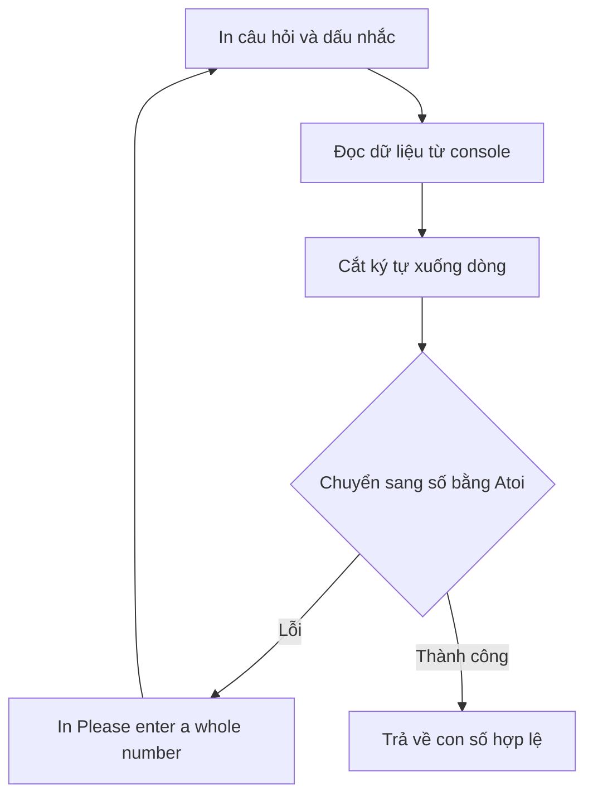

# 🧵 String Interpolation — nghệ thuật chèn giá trị vào chuỗi

> Nguồn: `024-String-Interpolation.txt` · [Udemy](https://ua.udemy.com/course/go-programming-language-crash-course/learn/lecture/26161906)

Chào các bạn! Hôm nay chúng ta sẽ học một cách **in thông tin ra console "xịn" hơn hẳn** cách mình vẫn làm bấy lâu nay. Trên đường đi, chúng ta cũng sẽ refactor code cho gọn gàng: tách hàm, xử lý nhập sai, và quan trọng nhất là làm quen với **string interpolation (nội suy chuỗi)** — kỹ thuật bạn sẽ thấy ở khắp mọi chương trình Go.

Mình sẽ làm từ từ từng bước, và kể cả khi bạn thấy hơi rối ở đoạn refactor, *cứ bình tĩnh — gõ theo là sẽ hiểu, sai cũng không sao*.

---

### 🛠️ Dựng project và hỏi tên người dùng

Mình tạo một project mới tên `string-interpolation`. Mở terminal, `go mod init myapp` — dù bài này **chưa dùng đến module**, đây vẫn là thói quen tốt cần giữ mỗi khi khởi động project Go.

Trong `main.go`, mình viết phần hỏi tên người dùng theo cách quen thuộc:

1. Tạo biến `reader` bằng `bufio.NewReader(os.Stdin)`.
2. In câu hỏi bằng `fmt.Println("What is your name?")`.
3. In dấu nhắc bằng `fmt.Print` — **không phải `Println`** — để dấu nhắc nằm cùng dòng người dùng gõ.
4. Đọc dữ liệu bằng `reader.ReadString('\n')`.
5. Cắt ký tự xuống dòng bằng `strings.Replace`: một lần cho `\r\n` (Windows), một lần cho `\n` (Mac/Linux) — đều với tham số `-1` để thay ở mọi nơi.

Chạy thử `go run main.go`, gõ `Trevor` → màn hình in `Your name is Trevor`. Chạy tốt. Nhưng nếu muốn hỏi thêm câu thứ hai thì phải lặp lại gần hết đoạn code trên — quá nhiều trùng lặp, không ổn chút nào.

---

### 🧹 Refactor: tách hàm `prompt` và `readString`

Mình bắt tay vào dọn dẹp:

* Tạo hàm `prompt()` không tham số, không trả về gì, chỉ in dấu nhắc ra màn hình.
* Tạo hàm `readString(s string) string` — nhận vào câu hỏi, in câu hỏi, gọi `prompt()`, đọc dữ liệu, cắt ký tự xuống dòng, rồi `return` chuỗi nhập được.
* Đưa biến `reader` lên **cấp package**: `var reader *bufio.Reader`, gán `bufio.NewReader(os.Stdin)`. Khi rê chuột lên `bufio.NewReader`, VS Code cho mình biết nó trả về **con trỏ tới `bufio.Reader`** — đó là lý do dùng kiểu `*bufio.Reader`. Ở cấp package, biến này dùng được trong mọi hàm.

```go
var reader *bufio.Reader

func readString(s string) string {
    fmt.Println(s)
    prompt()

    userInput, _ := reader.ReadString('\n')
    userInput = strings.Replace(userInput, "\r\n", "", -1)
    userInput = strings.Replace(userInput, "\n", "", -1)
    return userInput
}
```

Trong `main`, mọi thứ gọn lại còn một dòng: `username := readString("What is your name?")`, rồi in kết quả. Chạy lại — vẫn hoạt động y hệt, nhưng code sạch hơn nhiều.

---

### 🔢 `readInt` và vòng lặp "nhập đến khi đúng"

Giờ hỏi tuổi. Tuổi nên là một con số, nên mình viết thêm hàm `readInt(s string) int`:

* In câu hỏi, gọi `prompt()`, đọc dữ liệu như trên.
* Chuyển chuỗi người dùng nhập thành số bằng `strconv.Atoi` (**alpha to integer**).
* Nếu có lỗi, in `Please enter a whole number`; sau đó trả về `num`.

Trong `main`: `age := readInt("How old are you?")`, rồi in câu `Your name is ..., and you are ..., years old.`

Nhưng có vấn đề: nếu người dùng nhập vào thứ không phải số, chương trình in `Please enter a whole number` — rồi vẫn in tiếp `you are zero years old`. Rõ ràng không ổn chút nào.

Cách sửa đơn giản nhất: **bọc phần thân `readInt` trong vòng lặp vô hạn**, và chuyển `return num` vào nhánh `else` — chỉ khi nhập đúng mới được rời vòng lặp:

```go
num, err := strconv.Atoi(userInput)
if err != nil {
    fmt.Println("Please enter a whole number")
} else {
    return num
}
```

Chạy lại: gõ `x` → `Please enter a whole number` và hỏi lại tuổi; gõ `33` → mọi thứ đúng như mong đợi.

---

### 🚫 Chặn cả tên rỗng trong `readString`

Chuyện tương tự xảy ra với tên: nếu người dùng bấm Enter luôn, ta nhận về một **chuỗi rỗng** — cũng không ổn. Mình sửa y hệt: bọc thân `readString` trong vòng lặp vô hạn, kiểm tra:

* Nếu `userInput == ""` → in `Please enter a value` và lặp lại.
* Ngược lại → `return userInput`.

Chạy thử: bấm Enter suông → `Please enter a value` → hỏi lại câu hỏi. Nhập tên đàng hoàng → in ra đẹp đẽ.



---

### ✨ String interpolation: `Sprintf`, `Printf` và vì sao nên quên phép `+`

Giờ mới tới phần chính của bài. Giả sử mình muốn câu in ra có dấu chấm ngay sau tên: `Your name is Trevor. You are 33 years old.` Nếu cứ chèn biến vào giữa các tham số của `fmt.Println`, kết quả dính **dấu cách thừa**: `Your name is Trevor . You are...`. Không chấp nhận được.

**Cách "dễ" — nhưng không phải cách đúng:** nối chuỗi bằng dấu `+`. Dấu `+` này là **toán tử nối chuỗi (concatenation)** chứ không phải phép cộng — nối chuỗi thì không thể làm toán được. Nó chạy được, nhưng:

* Chậm hơn và tốn nhiều bộ nhớ hơn cách chuẩn.
* Không thể nối `string` với `int` — Go báo lỗi ngay lập tức.

**Cách đúng — string interpolation:** dùng `fmt.Sprintf` với các **placeholder (chỗ giữ chỗ)**:

* `%s` dành cho string, `%d` dành cho số nguyên.
* Hàm trả về một `string` mới, giá trị đã được thay vào đúng vị trí.
* VS Code còn gợi ý thêm: dùng thẳng `fmt.Printf` thay cho `Println(Sprintf(...))` — *nhưng nhớ thêm `\n` vì `Printf` không tự xuống dòng.*

```go
fmt.Printf("Your name is %s. You are %d years old.\n", username, age)
```

Vì sao phải dùng cách này thay vì dấu `+`? Câu trả lời rất đơn giản: **hiệu quả hơn, ít bộ nhớ hơn, nhanh hơn nhiều.** Trong chương trình nhỏ như của chúng ta thì chưa quan trọng, nhưng khi bạn bắt tay vào những hệ thống phức tạp, tiêu tốn nhiều tài nguyên, bạn luôn muốn làm mọi thứ hiệu quả nhất có thể. Trong Go, bạn sẽ **hiếm khi** thấy dấu `+` được dùng để nối chuỗi — gần như luôn là `fmt.Sprintf` hoặc `fmt.Printf`.

Ngoài `%s` và `%d`, còn rất nhiều placeholder khác cho các kiểu dữ liệu khác nhau. Mình có đính kèm một **cheat sheet** trong course resources của bài này để các bạn tra cứu và thử nghiệm thỏa thích.

Và một lời thú nhận chân thành: mình **rất hay quên dòng xử lý `\r`** khi đọc input console — tức quên xử lý trường hợp người dùng đang dùng Windows. Mình cứ phải quay lại sửa sau, suốt nhiều năm rồi vẫn chưa sửa được thói quen ấy. *Nên nếu ở đâu đó trong khóa mình lỡ quên, mà bạn dùng Windows, chỉ cần nhớ thêm `\r` trước `\n` là ổn nhé.*

---

### ✅ Tự kiểm tra nhanh

**1. Vì sao phải thay thế cả `\r\n` lẫn `\n` khi đọc input?**
<details>
<summary><b>Xem đáp án</b></summary>

**Đáp án:** Vì Windows kết thúc dòng bằng `\r\n`, còn Mac/Linux dùng `\n`.
Giải thích: Bỏ qua `\r` sẽ khiến ký tự thừa dính lại ở cuối input.
Tham chiếu: Mục "Dựng project và hỏi tên người dùng".

</details>

**2. Biến `reader` đặt ở cấp package có kiểu gì?**
<details>
<summary><b>Xem đáp án</b></summary>

**Đáp án:** `*bufio.Reader` — con trỏ tới `bufio.Reader`.
Giải thích: VS Code chỉ ra điều này khi rê chuột lên `bufio.NewReader`.
Tham chiếu: Mục "Refactor: tách hàm prompt và readString".

</details>

**3. Vì sao phải bọc `readInt` trong vòng lặp vô hạn?**
<details>
<summary><b>Xem đáp án</b></summary>

**Đáp án:** Để chỉ rời hàm khi người dùng nhập vào một con số hợp lệ.
Giải thích: Nếu không, chương trình in thông báo lỗi rồi vẫn in tiếp "you are zero years old".
Tham chiếu: Mục "readInt và vòng lặp nhập đến khi đúng".

</details>

**4. `%s` và `%d` đại diện cho kiểu dữ liệu nào?**
<details>
<summary><b>Xem đáp án</b></summary>

**Đáp án:** `%s` cho string, `%d` cho số nguyên.
Giải thích: Các placeholder khác có đầy đủ trong cheat sheet của course resources.
Tham chiếu: Mục "String interpolation".

</details>

**5. Vì sao nên dùng `Sprintf`/`Printf` thay vì nối chuỗi bằng `+`?**
<details>
<summary><b>Xem đáp án</b></summary>

**Đáp án:** Vì hiệu quả hơn, ít bộ nhớ hơn và nhanh hơn; `+` còn không nối được string với int.
Giải thích: Với chương trình nhỏ thì chưa khác biệt, nhưng hệ thống lớn cần tối ưu.
Tham chiếu: Mục "String interpolation".

</details>

---

Vậy là chúng ta đã biết cách in thông tin "đúng chuẩn Go", và có trong tay một cheat sheet placeholder cực kỳ hữu dụng. Bài tiếp theo, mình sẽ cùng các bạn **tự tạo kiểu dữ liệu cho riêng mình** với `struct`, rồi dùng nó để hỏi thêm một câu hỏi thú vị về con số yêu thích — kèm màn trình diễn in số thực cho thật đẹp. Hẹn gặp lại! 🚀

## Nguồn tham khảo

- [fmt — pkg.go.dev](https://pkg.go.dev/fmt)
- [strconv — pkg.go.dev](https://pkg.go.dev/strconv)
- [strings — pkg.go.dev](https://pkg.go.dev/strings)
- [bufio — pkg.go.dev](https://pkg.go.dev/bufio)
