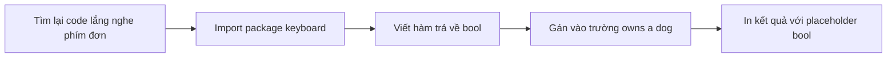

# 🏆 Thử thách — câu hỏi "Do you want a dog" bằng một phím bấm

> Nguồn: `026-Challenge.txt` · [Udemy](https://ua.udemy.com/course/go-programming-language-crash-course/learn/lecture/26161914)

Chào các bạn, lại tới giờ cho một thử thách mới! Đến đây, chúng ta đã nắm trong tay hai cách nhập liệu: gõ chữ rồi nhấn Enter, và bấm một phím đơn. Việc của các bạn lần này là **tự tay ghép chúng lại** trong chương trình thực tế.

*Đừng lo nếu chưa làm được ngay.* Thử thách là để luyện tay, và bài sau mình sẽ giải từng bước. Các bạn cứ thử trước đã nhé.

---

### 🎯 Đề bài của các bạn

Hãy sửa chương trình hiện tại để tận dụng giá trị ở **dòng 17** — trường `owns a dog` (có nuôi chó hay không) trong struct `user` mà chúng ta thêm hồi bài trước. Cụ thể:

1. Hỏi người dùng câu: **"Do you want a dog?"**
2. Chỉ cho họ bấm phím `y` hoặc `n` để trả lời yes/no (một phím bấm duy nhất, không cần Enter).
3. Lưu giá trị phù hợp vào struct `user` — trường này sẽ là `true` hoặc `false`.
4. In thông tin đó ra màn hình kết quả cuối cùng.

---

### 🎬 Sản phẩm hoàn chỉnh trông thế nào?

Mình đã làm xong phần này nên cho các bạn xem trước kết quả:

* Chương trình hỏi tên của mình, rồi tuổi, rồi *what is my favorite number* — mình thử `7.7`.
* Tiếp theo là câu hỏi về chú chó — mình chỉ bấm phím `y`.
* Màn hình cuối in ra: **Hello, Trevor. You are 33 years old, and your favorite number is 7.70, owns a dog, true.**

Để ý hai chi tiết nhỏ: số `7.7` được in thành `7.70` (đúng chuẩn placeholder số thực chúng ta vừa học), và câu trả lời `y` biến thành giá trị `true` trong câu kết quả.

---

### 🧭 Các bước gợi ý để hoàn thành

Nếu hơi bí, đây là "bản đồ" các bước mình gợi ý:

1. **Xem lại các project trước** — cụ thể là cách chúng ta lắng nghe phím bấm đơn trong game **hammer bitcoin**.
2. **Import package phù hợp** vào code của bạn (chính là package `keyboard` mà chúng ta đã dùng).
3. **Viết một hàm mới trả về kiểu đúng** — *khả năng cao là kiểu `bool` đấy*.
4. **Lưu giá trị** vào struct `user`, tại trường `owns a dog` — giá trị sẽ là `true` hoặc `false`.
5. **In thông tin cuối cùng** — bạn sẽ cần tra lại **cheat sheet** để tìm placeholder đúng cho kiểu `bool`.

*Có thể bạn sẽ phải quay lại xem code cũ hoặc xem lại vài phần bài giảng trước, nhưng mình tin các bạn làm được mà không quá vất vả.*

---

Nhớ nhé: thử thách không phải để "đúng ngay từ lần đầu", mà để bạn tự tay lắp ghép những mảnh kiến thức đã học. *Sai cũng chẳng sao cả.* Hãy thử sức đi, rồi đón xem bài sau — mình sẽ trình bày cách mình giải quyết từng bước một! 🚀
